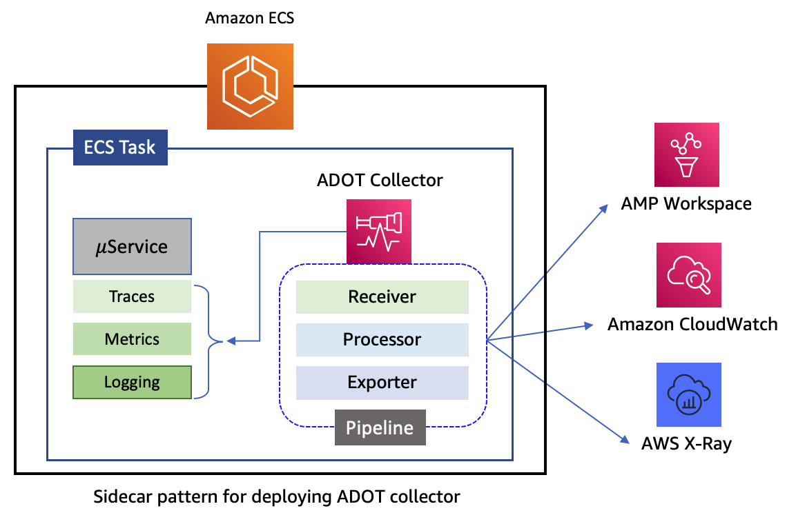
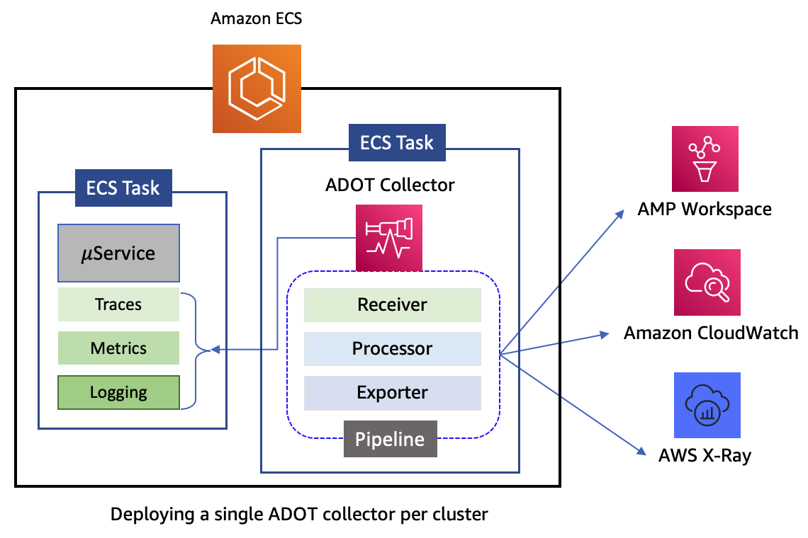

# Collecting service metrics in an ECS cluster using AWS Distro for OpenTelemetry 
[AWS Distro for OpenTelemetry](https://aws-otel.github.io/docs/introduction) (ADOT) is a secure, AWS-supported distribution of the [OpenTelemetry](https://opentelemetry.io/) project. Using ADOT, you can collect telemetry data from multiple sources and send correlated metrics, traces and logs to multiple monitoring solutions. ADOT may be deployed on Amazon ECS cluster in two difference patterns. 

## Deployment patterns for ADOT Collector 
1. In the sidecar pattern, the ADOT collector runs inside each task in the cluster and it processes telemetry data collected from application containers only within that task. This deployment pattern is required only when you need the collector to read task metadata from Amazon ECS [Task Metadata Endpoint](https://docs.aws.amazon.com/AmazonECS/latest/developerguide/task-metadata-endpoint.html), and generate resource usage metrics (such as CPU, memory, network, and disk) from them. 


2. In the central collector pattern, a single instance of ADOT collector is deployed on the cluster and it processes telemetry data from all the tasks running on the cluster. This is the most commonly used deployment pattern. The collector is deployed using either REPLICA or DAEMON service scheduler strategy.


The ADOT collector architecture has the concept of a pipeline. A single collector can contain more than one pipeline. Each pipeline is dedicated to processing one of the three types of telemetry data, namely, metrics, traces and logs. You can configure multiple pipelines for each type of telemetry data. This versatile architecture thus allows a single collector to perform the role of multiple observability agents that would otherwise have to be deployed on the cluster. It significantly reduces the deployment footprint of obsevrability agents on the cluster. The primary components of a collector that make up a pipeline are grouped into three categories, namely, Receiver, Processor, and Exporter. There are secondary components called Extensions which provide capabilities that can be added to the collector, but which are not part of pipelines. 

!!! info
    Refer to the OpenTelemetry [documentaton](https://opentelemetry.io/docs/collector/configuration/#basics) for a detailed explanation of Receivers, Processors, Exporters and Extensions.

## Deploying ADOT Collector with default configurations
The ADOT collector can be deployed using a task definition as shown below, using the sidecar pattern. The container image used for the collector includes a default pipeline configuration specified in the *command* section of the container defintion. This [default configuration](https://github.com/aws-observability/aws-otel-collector/blob/main/config/ecs/ecs-default-config.yaml) will collect application metrics and traces from other containers running within the same task as the ADOT collector and send them to Amazon CloudWatch and AWS X-Ray. Specifically, the collector uses an [OTLP Receiver](https://github.com/open-telemetry/opentelemetry-collector/tree/main/receiver/otlpreceiver) to receive metrics sent by applications that have been instrumented with OpenTelemetry SDKs as well as a [StatsD Receiver](https://github.com/open-telemetry/opentelemetry-collector-contrib/tree/main/receiver/statsdreceiver) to collect StatsD metrics. Additionally, it uses an [AWS X-ray Receiver](https://github.com/open-telemetry/opentelemetry-collector-contrib/tree/main/receiver/awsxrayreceiver) to collect traces from applications that have been instrumented with AWS X-Ray SDK.

!!! info
    Refer to the [documentation](https://docs.aws.amazon.com/AmazonCloudWatch/latest/monitoring/deploy-container-insights-ECS-adot.html) for details about setting up the IAM task role and task execution role that the ADOT collector will use when deployed on an Amazon ECS cluster.

```javascript
{
    "family":"AdotTask",
    "taskRoleArn":"arn:aws:iam::123456789012:role/ECS-ADOT-Task-Role",
    "executionRoleArn":"arn:aws:iam::123456789012:role/ECS-Task-Execution-Role",
    "networkMode":"awsvpc",
    "containerDefinitions":[
       {
          "name":"aws-otel-collector",
          "image":"public.ecr.aws/aws-observability/aws-otel-collector:latest",
          "cpu":512,
          "memory":1024,
          "command": [
            "--config=/etc/ecs/ecs-default-config.yaml"
          ],          
          "portMappings":[
             {
                "containerPort":2000,
                "protocol":"udp"
             }
          ],             
          "essential":true
       }
    ],
    "requiresCompatibilities":[
       "EC2"
    ],
    "cpu":"1024",
    "memory":"2048"
 }
```
## Deploying ADOT Collector with Prometheus metrics collection
To deploy the ADOT with the central collector pattern, with a pipeline that is different from the default configuration bundled in the container image, the task definition shown below can be used. Here, the configuration of the collector pipeline is loaded from a parameter named *otel-collector-config* in AWS SSM Parameter Store. The collector is launched using REPLICA service scheduler strategy. 

```javascript
{
    "family":"AdotTask",
    "taskRoleArn":"arn:aws:iam::123456789012:role/ECS-ADOT-Task-Role",
    "executionRoleArn":"arn:aws:iam::123456789012:role/ECS-Task-Execution-Role",
    "networkMode":"awsvpc",
    "containerDefinitions":[
       {
          "name":"aws-otel-collector",
          "image":"public.ecr.aws/aws-observability/aws-otel-collector:latest",
          "cpu":512,
          "memory":1024,
          "secrets":[
             {
                "name":"AOT_CONFIG_CONTENT",
                "valueFrom":"arn:aws:ssm:us-east-1:123456789012:parameter/otel-collector-config"
             }
          ],          
          "portMappings":[
             {
                "containerPort":2000,
                "protocol":"udp"
             }
          ],             
          "essential":true
       }
    ],
    "requiresCompatibilities":[
       "EC2"
    ],
    "cpu":"1024",
    "memory":"2048"
 }
```

!!! important
    The SSM Parameter Store parameter name must be exposed to the collector using an environment variable named AOT_CONFIG_CONTENT.

The configuration shown below enables the ADOT collector to collect Prometheus metrics from services in the cluster using a [Prometheus Receiver](https://github.com/open-telemetry/opentelemetry-collector-contrib/tree/main/receiver/prometheusreceiver). The receiver is meant to minimally be a drop-in replacement for Prometheus server. To collect metrics with this receiver, you need a mechanism for discovering the set of target services to be scraped. The receiver supports both static and dynamic discovery of scraping targets using one of the dozens of supported [service-discovery mechanisms](https://prometheus.io/docs/prometheus/latest/configuration/configuration/#scrape_config). 

As Amazon ECS does not have any built-in service discovery mechanism, the collector relies on Prometheus' support for file-based discovery of targets. To setup the Prometheus receiver for file-based discovery of targets, the collector makes use of the [Amazon ECS Observer](https://github.com/open-telemetry/opentelemetry-collector-contrib/blob/main/extension/observer/ecsobserver/README.md) extension. The extension uses ECS/EC2 API to discover Prometheus scrape targets from all running tasks and filter them based on service names, task definitions and container labels listed under the *ecs_observer* section in the configuration. All discovered targets are written into the file specified by the *result_file* field, which resides on the file system mounted to ADOT collector container. Subequently, the Prometheus receiver scrapes metrics from these targets. 

### Sending metrics data to Amazon Managed Prometheus workspace
The metrics collected by the Prometheus Receiver can be sent to an Amazon Managed Prometheus workspace using a [Prometheus Remote Write Exporter](https://github.com/open-telemetry/opentelemetry-collector-contrib/tree/main/exporter/prometheusremotewriteexporter) in the collector pipeline, as shown in the *exporters* section of the configuration below. The exporter is configured with the remote write URL of the Amazon Managed Prometheus workspace and it sends the metrics data using HTTP POST requests. It makes use of the built-in AWS Signature Version 4 authenticator to sign the requests sent to the workspace. 

```yaml
extensions:
  health_check:
  sigv4auth:
    region: us-east-1
  ecs_observer:
    refresh_interval: 60s 
    cluster_name: 'ecs-ec2-cluster'
    cluster_region: us-east-1
    result_file: '/etc/ecs_sd_targets.yaml' 
    services:
      - name_pattern: '^WebAppService$'
    task_definitions:
      - job_name: "webapp-tasks"
        arn_pattern: '.*:task-definition/WebAppTask:[0-9]+'
        metrics_path: '/metrics'
        metrics_ports:
          - 3000

receivers:
  awsxray:
  prometheus:
    config:
      scrape_configs:
        - job_name: ecs_services
          file_sd_configs:
            - files:
                - '/etc/ecs_sd_targets.yaml'
              refresh_interval: 30s
          relabel_configs: 
            - source_labels: [ __meta_ecs_cluster_name ] 
              action: replace
              target_label: cluster
            - source_labels: [ __meta_ecs_service_name ] 
              action: replace
              target_label: service
            - source_labels: [ __meta_ecs_task_definition_family ] 
              action: replace
              target_label: taskdefinition       
            - source_labels: [ __meta_ecs_task_container_name ] 
              action: replace
              target_label: container                        

processors:
    filter/include:
      metrics:
        include:
          match_type: regexp
          metric_names:
            - ^http_requests_total$  

exporters:
  awsxray:
  prometheusremotewrite:
    endpoint: https://aps-workspaces.us-east-1.amazonaws.com/workspaces/WORKSPACE_ID/api/v1/remote_write
    auth:
      authenticator: sigv4auth
    resource_to_telemetry_conversion:
      enabled: true

service:
  extensions:
    - ecs_observer
    - health_check
    - sigv4auth
  pipelines:
    metrics:
      receivers: [prometheus]
      exporters: [prometheusremotewrite]       
    traces:
      receivers: [awsxray]
      exporters: [awsxray]       
```    

### Sending metrics data to Amazon CloudWatch
Alternatively, the metrics data can be sent to Amazon CloudWatch by using the [Amazon CloudWatch EMF Exporter](https://github.com/open-telemetry/opentelemetry-collector-contrib/tree/main/exporter/awsemfexporter) in the collector pipeline, as shown in the *exporters* section of the configuration below. The exporter sends metrics data as performance log events. The *metric_declaration* field in the exporter is used to specify the array of logs with embedded metric format to be generated. The configurtion below will generate log events only for a metric named *http_requests_total*. Using this data, CloudWatch will create the metric *http_requests_total* under the CloudWatch namespace *ECS/ContainerInsights/Prometheus* with the dimensions *ClusterName*, *ServiceName* and *TaskDefinitionFamily*.


```yaml
extensions:
  health_check:
  sigv4auth:
    region: us-east-1
  ecs_observer:
    refresh_interval: 60s 
    cluster_name: 'ecs-ec2-cluster'
    cluster_region: us-east-1
    result_file: '/etc/ecs_sd_targets.yaml' 
    services:
      - name_pattern: '^WebAppService$'
    task_definitions:
      - job_name: "webapp-tasks"
        arn_pattern: '.*:task-definition/WebAppTask:[0-9]+'
        metrics_path: '/metrics'
        metrics_ports:
          - 3000

receivers:
  awsxray:
  prometheus:
    config:
      global:
        scrape_interval: 15s
        scrape_timeout: 10s
      scrape_configs:
        - job_name: ecs_services
          file_sd_configs::
            - files:
                - '/etc/ecs_sd_targets.yaml'
          relabel_configs: 
            - source_labels: [ __meta_ecs_cluster_name ] 
              action: replace
              target_label: ClusterName
            - source_labels: [ __meta_ecs_service_name ] 
              action: replace
              target_label: ServiceName
            - source_labels: [ __meta_ecs_task_definition_family ] 
              action: replace
              target_label: TaskDefinitionFamily       
            - source_labels: [ __meta_ecs_task_container_name ] 
              action: replace
              target_label: container          

processors:
    filter/include:
      metrics:
        include:
          match_type: regexp
          metric_names:
            - ^http_requests_total$  

exporters:
  awsxray:
  awsemf:
    namespace: ECS/ContainerInsights/Prometheus
    log_group_name: '/aws/ecs/containerinsights/{ClusterName}/prometheus'
    dimension_rollup_option: NoDimensionRollup
    metric_declarations:
      - dimensions: [[ClusterName, ServiceName, TaskDefinitionFamily]]
        metric_name_selectors:
          - http_requests_total

service:
  extensions:
    - ecs_observer
    - health_check
    - sigv4auth
  pipelines:
    metrics:
      receivers: [prometheus]
      processors: [filter/include]
      exporters: [awsemf]       
    traces:
      receivers: [awsxray]
      exporters: [awsxray]       
```