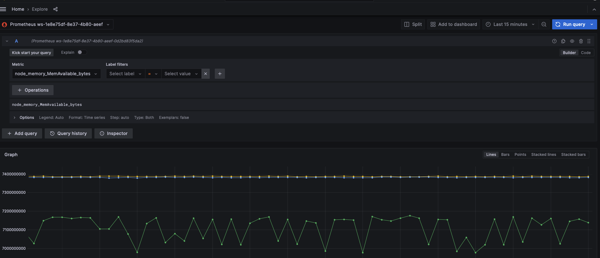

# EKS Observability : Migrating from Self Managed to Managed Observability Services
In the ever-evolving world of modern software development, observability has become a critical aspect of ensuring the reliability, performance, and scalability of applications. While self-managed tools like Prometheus and Datadog have been invaluable in providing insights into the health and behavior of systems, the increasing complexity and scale of modern architectures often demand more robust and scalable solutions.Enter managed observability services, such as Amazon Managed Prometheus and Amazon Managed Grafana. These fully managed offerings from AWS aim to simplify the management and operation of observability tools, freeing up valuable time and resources for organizations to focus on their core business objectives.

In this guide, we will explore the journey of migrating from self-managed observability tools to Amazon's managed services.

# Why Managed Observability Services ?
By leveraging managed services, organizations can benefit from:

1. Scalability and Elasticity: Amazon's managed services are designed to scale seamlessly, allowing you to accommodate fluctuating workloads and handle spikes in data ingestion without compromising performance.

2. Reduced Operational Overhead: With managed services, AWS takes care of the heavy lifting – patching, upgrading, and maintaining the underlying infrastructure, freeing up your team to concentrate on higher-value tasks.

3. Enhanced Security and Compliance: AWS's managed services adhere to stringent security and compliance standards, providing peace of mind and helping organizations meet regulatory requirements.

4. Seamless Integration: Amazon's managed observability services seamlessly integrate with other AWS services and third-party tools, enabling a cohesive and unified monitoring experience across your entire infrastructure.

# Uninstall Self Managed Prometheus
If you have deployed Prometheus using a deployment manifest, you can delete all the resources by running the following command:
```
kubectl delete -f <path/to/prometheus-deployment-manifest.yaml>
```
If you have used Helm to install Prometheus, you can uninstall it with the following command:
```
helm uninstall <prometheus-release-name>
```
If you have created any ConfigMaps or Secrets for Prometheus configuration, you can delete them as well:
```
kubectl delete configmap <prometheus-config-map-name>
kubectl delete secret <prometheus-secret-name>
```

# Uninstall DataDog
Use the following command to delete the DataDog Secret
```
kubectl delete secret <datadog-agent-secret-name> -n <namespace>
```
Use the following commands to uninstall DataDog agent and operator
```
helm uninstall datadog-agent
helm delete datadog-operator
```

# Setup Amazon Managed Service for Prometheus
A workspace in [Amazon Managed Service for Prometheus](https://aws.amazon.com/prometheus/) (AMP) is a logical and isolated Prometheus server dedicated to Prometheus resources such as metrics. A workspace supports fine-grained access control for authorizing its management such as update, list, describe, delete, and the ingestion and querying of metrics.

Please open a new terminal window and setup the required environment variables and use the below command to create an Amazon Managed Service for Prometheus workspace.

```
export EKS_CLUSTER_NAME=<name-of-eks-cluster>
export EKS_CLUSTER_REGION=<aws-region-of-eks-cluster>
export AMP_WORKSPACE_NAME=eks-amp-workspace
```

```
aws amp create-workspace \
  --alias $AMP_WORKSPACE_NAME \
  --region $EKS_CLUSTER_REGION
```

The Amazon Managed Service for Prometheus  workspace should be created in just a few seconds. 

As a best practice, create a [VPC endpoint](https://docs.aws.amazon.com/vpc/latest/privatelink/create-interface-endpoint.html) for Amazon Managed Service for Prometheus in VPC running your Amazon EKS cluster. Please visit [Using Amazon Managed Service for Prometheus with interface VPC endpoints](https://docs.aws.amazon.com/prometheus/latest/userguide/AMP-and-interface-VPC.html) for more information.

# Setting up the AWS Distro for OpenTelemetry (ADOT) Collector to Ingest Metrics

One of the easiest ways to collect Prometheus metrics from Amazon EKS workloads is by using the [AWS Distro for OpenTelemetry (ADOT) collector](https://aws-otel.github.io/docs/getting-started/collector). Customers can deploy the ADOT Collector in a variety of deployment models and easily manage configuration using the ADOT Operator. The [ADOT Operator is also available as an EKS Add-On](https://docs.aws.amazon.com/eks/latest/userguide/opentelemetry.html) for easier deployment and management. Read our [launch blog](https://aws.amazon.com/blogs/containers/metrics-and-traces-collection-using-amazon-eks-add-ons-for-aws-distro-for-opentelemetry/) to learn about this feature.

If you dont have `eksctl` installed already please install it by follwowing the instructions found [here](https://eksctl.io/installation/).

Lets create a IAM Service account using `eksctl` which will used to remote write prometheus metrics to AMP workspace.

```
export EKS_CLUSTER_NAME=<name-of-eks-cluster>
  eksctl create iamserviceaccount \
  --name amp-iamproxy-ingest-role \
  --region $EKS_CLUSTER_REGION \
  --namespace prometheus \
  --cluster $EKS_CLUSTER_NAME\
  --attach-policy-arn arn:aws:iam::aws:policy/AmazonPrometheusRemoteWriteAccess \
  --approve \
  --override-existing-serviceaccounts
```

ADOT requires cert-manager, if your EKS cluster does not have cert manager already installed then install cert manager using the following command

```
kubectl apply -f https://github.com/cert-manager/cert-manager/releases/download/v1.15.3/cert-manager.yaml
```

Next, we will grant permissions to Amazon EKS add-ons to install ADOT and then we will installing the ADOT Add-on :

```
kubectl apply -f https://amazon-eks.s3.amazonaws.com/docs/addons-otel-permissions.yaml
aws eks create-addon \
  --addon-name adot \
  --region $EKS_CLUSTER_REGION \
  --cluster-name $EKS_CLUSTER_NAME
```

Now, wait for 30 seconds and execute the following command. You should see "ACTIVE" as result indicating that the add-on is installed successfully.

```
aws eks describe-addon \
  --addon-name adot \
  --region $EKS_CLUSTER_REGION \
    --cluster-name $EKS_CLUSTER_NAME  | jq .addon.status
```

Next, we will Install the OTel Collector Custom Resource Definition(CRD) and then we will configure the ADOT collector to push metrics to Amazon Managed Service for Prometheus endpoint.

```
export AMP_WORKSPACE_ID=$(aws amp list-workspaces \
  --alias $AMP_WORKSPACE_NAME \
  --region $EKS_CLUSTER_REGION \
  --query 'workspaces[0].[workspaceId]' \
  --output text)
export AMP_ENDPOINT_URL=$(aws amp describe-workspace \
  --region $EKS_CLUSTER_REGION --workspace-id $AMP_WORKSPACE_ID | jq .workspace.prometheusEndpoint -r)
export AMP_REMOTE_WRITE_URL=${AMP_ENDPOINT_URL}api/v1/remote_write
curl -O https://raw.githubusercontent.com/aws-samples/one-observability-demo/main/PetAdoptions/cdk/pet_stack/resources/otel-collector-prometheus.yaml
sed -i -e s/AWS_REGION/$EKS_CLUSTER_REGION/g otel-collector-prometheus.yaml
sed -i -e s^AMP_WORKSPACE_URL^$AMP_REMOTE_WRITE_URL^g otel-collector-prometheus.yaml
kubectl apply -f ./otel-collector-prometheus.yaml
```

Now, lets verify that the ADOT collector is running and you should see a result like the one below showing that the collector has been successfully installed and being ready.

```
kubectl get all -n prometheus
```
```
NAME                                           READY   STATUS    RESTARTS   AGEpod/observability-collector-5774bbc68d-7nj54   1/1     Running   0          59s

NAME                                         TYPE        CLUSTER-IP     EXTERNAL-IP   PORT(S)    AGE
service/observability-collector-monitoring   ClusterIP   10.100.114.1   <none>        8888/TCP   59s

NAME                                      READY   UP-TO-DATE   AVAILABLE   AGE
deployment.apps/observability-collector   1/1     1            1           59s

NAME                                                 DESIRED   CURRENT   READY   AGE
replicaset.apps/observability-collector-5774bbc68d   1         1         1       59s
```

If you don't have prometheus node exporter already available in the EKS cluster then use the following commands to install prometheus node exporter. This is required to verify that ADOT collector is able to scrape metrics and pushing it to AMP.

```
helm repo add prometheus-community https://prometheus-community.github.io/helm-charts
helm repo update
helm install prometheus-node-exporter prometheus-community/prometheus-node-exporter --version 4.37.0
```

Now you have successfully deployed the ADOT Collector to collect metrics from the EKS cluster and send it to the Amazon Managed Service for Prometheus workspace you created. To test whether Amazon Managed Service for Prometheus received the metrics, use awscurl. This tool enables you to send HTTP requests through the command line with AWS Sigv4 authentication, so you must have AWS credentials set up locally with the correct permissions to query from Amazon Managed Service for Prometheus. For instructions on installing awscurl, see [awscurl](https://github.com/okigan/awscurl).

```
awscurl --service="aps" \
 --region="$EKS_CLUSTER_REGION" "https://aps-workspaces.$EKS_CLUSTER_REGION.amazonaws.com/workspaces/$AMP_WORKSPACE_ID/api/v1/query?query=node_cpu_seconds_total"
```

 Your results should look similar to shown below:

```
{
    "status": "success",
    "data": {
        "resultType": "vector",
        "result": [
            {
                "metric": {
                    "__name__": "node_cpu_seconds_total",
                    "app_kubernetes_io_component":"metrics",
                    "app_kubernetes_io_instance":"prometheus-node-exporter",
                    ....................................
                    ....................................
                    "version": "v1"
                },
                "value": [
                    1725391168,
                    "20.37"
                ]
            }
        ]
    }
}
```

# Setup Amazon Managed Grafana
Amazon Managed Grafana is a fully managed service that simplifies the deployment and operation of Grafana, an open-source data visualization and monitoring solution. With Amazon Managed Grafana, you can quickly set up and scale your Grafana environment, enabling you to monitor and analyze your application and infrastructure metrics from various data sources. Please follow the instructions found [here](https://aws-observability.github.io/terraform-aws-observability-accelerator/helpers/managed-grafana/) to create a Amazon managed Grafana workspace. After you create the grafana workspace to set up Authentication and Authorization, follow the instructions in the [Amazon Managed Grafana User Guide](https://docs.aws.amazon.com/grafana/latest/userguide/AMG-manage-users-and-groups-AMG.html) for enabling AWS IAM Identity Center.

After completing authentication and authorization setup, connect to grafana workspace using the workspace URL found in the Amazon managed grafana console. From the left menu select Apps->AWS Data Sources and click on the Data sources tab. From the service dropdown select `Amazon Managed Service for Prometheus` and select the region that you used to create the AMP workspace. You will see the AMP workspace listed after selecting the region, select the AMP workspace and click on `Add data source` button. 


To verify the newly created datasource is working lets try to explore the metrics available in the datasource. To explore the metrics, from the left menu select `Explore` and select newly created datasource and from the metrics drop down select `node_memory_MemAvailable_bytes` metric and click on `Run Query` button. You should see something similiar to the image below



By selection Dashboards from the left menu, You can also import a dashboard from grafana.com using a URL or the dashboards ID. For example you can use the dashboard ID `10182` to import a dahsboard that helps you to monitor kubernetes nodes. When you import the dashboard and use the AMP datasource you should see the something similiar to the following


# Conclusion
In this guide we have understood on how to migrate from self managed observability services to managed services like Amazon Managed Prometheus and Amazon Managed Grafana. By migrating from self-managed observability tools to fully-managed services like Amazon Managed Prometheus and Amazon Managed Grafana, you can significantly reduce operational overhead and complexity. With Amazon's managed services, you benefit from a secure, highly available, and fully scalable monitoring solution without the burden of provisioning, operating, and maintaining the underlying infrastructure. By embracing Amazon's managed observability solutions, you can focus your efforts on core business objectives, accelerate innovation, and deliver high-quality applications and services to your customers with greater confidence and efficiency.