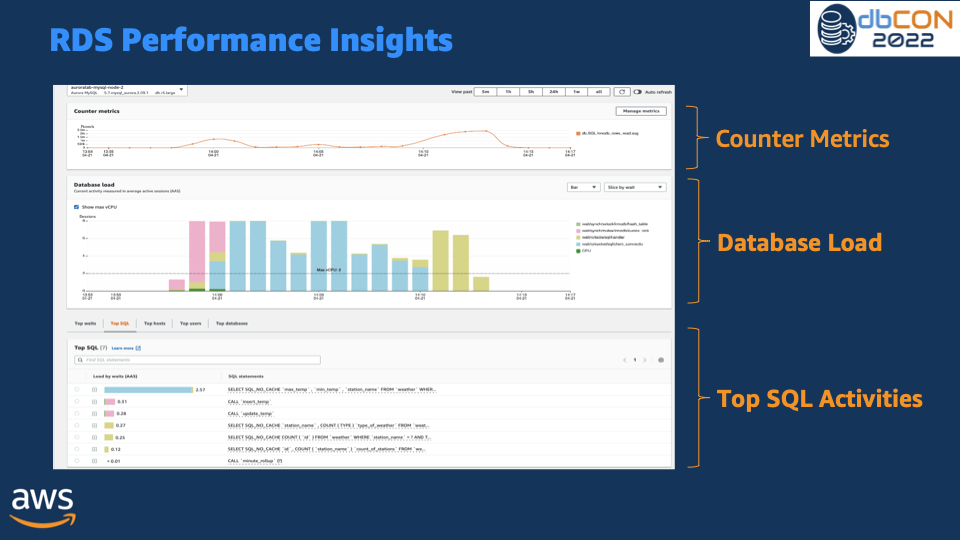

# Monitor Amazon RDS and Aurora databases

Monitoring is a critical part of maintaining the reliability, availability, and performance of Amazon RDS and Aurora database clusters. AWS provides several tools for monitoring health of your Amazon RDS and Aurora databases resources, detect issues before they become critical and optimize performance for consistent user experiance.  This guide provides the observability best practices to ensure your databases are running smoothly. 

## Performance guidelines

As a best practice, you want to start with establishing a baseline performance for your workloads. When you set up a DB instance and run it with a typical workload, capture the average, maximum, and minimum values of all performance metrics. Do so at a number of different intervals (for example, one hour, 24 hours, one week, two weeks). This can give you an idea of what is normal. It helps to get comparisons for both peak and off-peak hours of operation. You can then use this information to identify when performance is dropping below standard levels.
 
## Monitoring Options

### Amazon CloudWatch metrics

CloudWatch Metrics is a critical tool for monitoring and managing your RDS and Aurora databases. It provides valuable insights into database performance and helps you identify and resolve issues quickly. Amazon RDS/Aurora sends metrics to CloudWatch for each active database instance at 1 minute granularity. Monitoring is enabled by default and metrics are available for 15 days. Amazon RDS publishes instance-level metrics metrics to Amazon CloudWatch in the **AWS/RDS** namespace.

Using CloudWatch Metrics, you can identify trends or patterns in your database performance, and use this information to optimize your configurations and improve your application's performance. Here are few of the key metrics which you want to monitor :

* **CPU Utilization** - Percentage of computer processing capacity used.
* **DB Connections** - The number of client sessions that are connected to the DB instance. Consider constraining database connections if you see high numbers of user connections in conjunction with decreases in instance performance and response time. The best number of user connections for your DB instance will vary based on your instance class and the complexity of the operations being performed. To determine the number of database connections, associate your DB instance with a parameter group.
* **Freeable Memory** - How much RAM is available on the DB instance, in megabytes. The red line in the Monitoring tab metrics is marked at 75% for CPU, Memory and Storage Metrics. If instance memory consumption frequently crosses that line, then this indicates that you should check your workload or upgrade your instance.
* **Network throughput** - The rate of network traffic to and from the DB instance in bytes per second.
* **Read/Write Latency** - The average time for a read or write operation in milliseconds.
* **Read/Write IOPS** - The average number of disk read or write operations per second.
* **Free Storage Space** - How much disk space is not currently being used by the DB instance, in megabytes. Investigate disk space consumption if space used is consistently at or above 85 percent of the total disk space. See if it is possible to delete data from the instance or archive data to a different system to free up space.


For troubleshooting performance related issues, first step is to tune the most used and expensive queries. Tune them to see if doing so lowers the pressure on system resources. For more information, see [Tuning queries](https://docs.aws.amazon.com/AmazonRDS/latest/UserGuide/CHAP_BestPractices.html#CHAP_BestPractices.TuningQueries).

If your queries are tuned and the issue still persists, consider upgrading your Amazon RDS DB instance classes. You might upgrade it to an instance with more resources (CPU, RAM, disk space, network bandwidth, I/O capacity).

Then, you can set up alarms to alert when these metrics reach critical thresholds, and take action to resolve any issues as quickly as possible. 

For more information on CloudWatch metrics, refer [Amazon CloudWatch metrics for Amazon RDS]( https://docs.aws.amazon.com/AmazonRDS/latest/UserGuide/rds-metrics.html) and [Viewing DB instance metrics in the CloudWatch console and AWS CLI](https://docs.aws.amazon.com/AmazonRDS/latest/UserGuide/metrics_dimensions.html).

#### CloudWatch Log Insights

You can use CloudWatch Logs to capture log data from your RDS and Aurora instances and analyze it for insights into your application's behavior and performance.

Refer [Monitoring Amazon RDS log file](https://docs.aws.amazon.com/AmazonRDS/latest/UserGuide/USER_LogAccess.html) for more information on monitoring RDS and Aurora logs with CloudWatch.

#### CloudWatch Alarms

To identify when performance is degraded for your database clusters, you should monitor and alert on key performance metrics on a regular basis. Using Amazon CloudWatch alarms, you can watch a single metric over a time period that you specify. If the metric exceeds a given threshold, a notification is sent to an Amazon SNS topic or AWS Auto Scaling policy. CloudWatch alarms do not invoke actions simply because they are in a particular state. Rather the state must have changed and been maintained for a specified number of periods. Alarms invoke actions only when alarm change state occurs. Being in alarm state is not enough.

To set a CloudWatch alarm

* Sign in to the AWS Management Console and open the Amazon RDS console at https://console.aws.amazon.com/rds/.
* In the navigation pane, choose Databases, and then choose a DB instance.
* Choose Logs & events.

In the CloudWatch alarms section, choose Create alarm.


* For Send notifications, choose Yes, and for Send notifications to, choose New email or SMS topic.
* For Topic name, enter a name for the notification, and for With these recipients, enter a comma-separated list of email addresses and phone numbers.
* For Metric, choose the alarm statistic and metric to set.
* For Threshold, specify whether the metric must be greater than, less than, or equal to the threshold, and specify the threshold value.
* For Evaluation period, choose the evaluation period for the alarm. For consecutive period(s) of, choose the period during which the threshold must have been reached in order to trigger the alarm.
* For Name of alarm, enter a name for the alarm.
* Choose Create Alarm.

The alarm appears in the CloudWatch alarms section.

Take a look at this [example](https://docs.aws.amazon.com/AmazonRDS/latest/UserGuide/multi-az-db-cluster-cloudwatch-alarm.html) to create an Amaon CloudWatch alarm for Multi-AZ DB cluster replica lag. 

#### Database Audit Logs

Database Audit Logs provide a detailed record of all actions taken on your RDS and Aurora databases, enabling you to monitor for unauthorized access, data changes, and other potentially harmful activities. Here are some best practices for using Database Audit Logs:

* Enable Database Audit Logs for all of your RDS and Aurora instances, and configure them to capture all relevant data.
* Use a centralized log management solution, such as Amazon CloudWatch Logs or Amazon Kinesis Data Streams, to collect and analyze your Database Audit Logs.
* Monitor your Database Audit Logs regularly for suspicious activity, and take action to investigate and resolve any issues as quickly

#### Database Slow Query and Error Logs

Slow query logs help you find slow-performing queries in the database so you can investigate the reasons behind the slowness and tune the queries if needed. Error logs help you to find the query errors, which further helps you find the changes in the application due to those errors. 

You can monitor the slow query log and error log by creating a CloudWatch dashboard using Amazon CloudWatch Logs Insights (which enables you to interactively search and analyze your log data in Amazon CloudWatch Logs). 

## Performance Insights and operating-system metrics

####  Enhanced Monitoring

Enhanced Monitoring enables you to get fine-grain metrics in real time for the operating system (OS) that your DB instance runs on. 

RDS delivers the metrics from Enhanced Monitoring into your Amazon CloudWatch Logs account. By default, these metrics are stored for 30 days and stored in **RDSOSMetrics** Log group in Amazon CloudWatch. You have the option to choose a granularity between 1s to 60s. You can create custom metrics filters in CloudWatch from CloudWatch Logs and display the graphs on the CloudWatch dashboard.


Enhanced monitoring also include the OS level process list. Currently, Enhanced Monitoring is available for the following database engines:
*MariaDB
*Microsoft SQL Server
*MySQL
*Oracle
*PostgreSQL

**Different between CloudWatch and Enhanced Monitoring?**
CloudWatch gathers metrics about CPU utilization from the hypervisor for a DB instance. In contrast, Enhanced Monitoring gathers its metrics from an agent on the DB instance. A hypervisor creates and runs virtual machines (VMs). Using a hypervisor, an instance can support multiple guest VMs by virtually sharing memory and CPU. You might find differences between the CloudWatch and Enhanced Monitoring measurements, because the hypervisor layer performs a small amount of work. The differences can be greater if your DB instances use smaller instance classes. In this scenario, more virtual machines (VMs) are probably managed by the hypervisor layer on a single physical instance.


To learn about all the metrics available with Enhanced Monitoring, please refer [OS metrics in Enhanced Monitoring](https://docs.aws.amazon.com/AmazonRDS/latest/UserGuide/USER_Monitoring-Available-OS-Metrics.html)


#### Performance Insights 

Amazon RDS Performance Insights is a database performance tuning and monitoring feature that helps you quickly assess the load on your database, and determine when and where to take action. With the Performance Insights dashboard, you can visualize the database load on your db cluster and filter the load by waits, SQL statements, hosts, or users. It allows you to pin point on the root cause rather than chasing symptoms. Performance Insights uses lightweight data collection methods that do not impact the performance of your applications and makes it easy to see which SQL statements are causing the load and why.

Performance Insights provides seven days of free performance history retention and you can extend that up to 2 years with a fees. You can enable Performance Insights from RDS management console or AWS CLI. Performance Insights also exposes a publicly available API to enable customers and third parties to integrate Performance Insights with their own custom tooling.

!!! Note
	Currently, RDS Performance Insights is available only for Aurora (PostgreSQL- and MySQL-compatible editions), Amazon RDS for PostgreSQL, MySQL, MariaDB, SQL Server and Oracle.

**DBLoad** is the key metric which represents the average number of database active sessions. In Performance Insights, this data is queried as **db.load.avg** metric.



For more information on using Performance Insights with Aurora, refer: [Monitoring DB load with Performance Insights on Amazon Aurora](https://docs.aws.amazon.com/AmazonRDS/latest/AuroraUserGuide/USER_PerfInsights.html). 


## Open-source Observability Tools

#### Amazon Managed Grafana
Amazon Managed Grafana is a fully managed service that makes it easy to visualize and analyze data from RDS and Aurora databases. 

The **AWS/RDS namespace** in Amazon CloudWatch includes the key metrics that apply to database entities running on Amazon RDS and Amazon Aurora.To visualize and track the health and potential performance issues of our RDS/Aurora databases in Amazon Managed Grafana, we can leverage CloudWatch data source. 


As of now, only basic RDS Performance Insights metrics are available in CloudWatch which is not sufficient to analyze database performance and identify bottlenecks in your database. To visualize RDS Performance Insight metrics in Amazon Managed Grafana and have a single pane of glass visibility, customers can use a custom lambda function to collect all the RDS Performance insights metrics and publish them in a custom CloudWatch metrics namespace. Once you have these metrics available in Amazon CloudWatch, you can visualize them in Amazon Managed Grafana.

To deploy the custom lambda function to gather RDS Performance Insights metrics, clone the following GitHub repository and run the install.sh script.

```
$ git clone https://github.com/aws-observability/observability-best-practices.git
$ cd sandbox/monitor-aurora-with-grafana

$ chmod +x install.sh
$ ./install.sh
```

Above script uses AWS CloudFormation to deploy a custom lambda function and an IAM role. Lambda function auto triggers every 10 mins to invoke RDS Performance Insights API and publish custom metrics to /AuroraMonitoringGrafana/PerformanceInsights custom namespace in Amazon CloudWatch.


For detailed step-by-step information on custom lambda function deployment and grafana dashboards, refer [Performance Insights in Amazon Managed Grafana](https://aws.amazon.com/blogs/mt/monitoring-amazon-rds-and-amazon-aurora-using-amazon-managed-grafana/).

By quickly identifying unintended changes in your database and notifying using alerts, you can take actions to minimize disruptions. Amazon Managed Grafana supports multiple notification channels such as SNS, Slack, PagerDuty etc. to which you can send alerts notifications. [Grafana Alerting](https://docs.aws.amazon.com/grafana/latest/userguide/alerts-overview.html) will show you more information on how to set up alerts in Amazon Managed Grafana.

<!-- blank line -->
<figure class="video_container">
  <iframe width="560" height="315" src="https://www.youtube.com/embed/Uj9UJ1mXwEA" title="YouTube video player" frameborder="0" allow="accelerometer; autoplay; clipboard-write; encrypted-media; gyroscope; picture-in-picture; web-share" allowfullscreen></iframe>
</figure>
<!-- blank line -->

## AIOps - Machine learning based performance bottlenecks detection

#### DevOps Guru for RDS

With DevOps Guru for RDS, you can monitor your databases for performance bottlenecks and operational issues. It uses Performance Insights metrics, analyzes them using Machine Learning (ML) to provide database-specific analyses of performance issues, and recommends corrective actions. DevOps Guru for RDS can identify and analyze various performance-related database issues, such as over-utilization of host resources, database bottlenecks, or misbehavior of SQL queries, among others. When an issue or anomalous behavior is detected, Amazon DevOps Guru for RDS displays the finding on the DevOps Guru console and sends notifications using Amazon EventBridge or Amazon Simple Notification Service (SNS), allowing DevOps or SRE teams to take real-time action on performance and operational issues before they become customer-impacting outages.

Amazon DevOps Guru for RDS establishes a baseline for the database metrics. Baselining involves analyzing the database performance metrics over a period of time to establish a normal behavior. Amazon DevOps Guru for RDS then uses ML to detect anomalies against the established baseline. If your workload pattern changes, then Amazon DevOps Guru for RDS establishes a new baseline that it uses to detect anomalies against the new normal. 

!!! Note
	For new database instances, Amazon DevOps Guru for RDS takes up to 2 days to establish an initial baseline, because it requires an analysis of the database usage patterns and establishing what is considered a normal behavior.


For more information on how to get started, please visit [Amazon DevOps Guru for RDS to Detect, Diagnose, and Resolve Amazon Aurora-Related Issues using ML](https://aws.amazon.com/blogs/aws/new-amazon-devops-guru-for-rds-to-detect-diagnose-and-resolve-amazon-aurora-related-issues-using-ml/)

<!-- blank line -->
<figure class="video_container">
  <iframe width="560" height="315" src="https://www.youtube.com/embed/N3NNYgzYUDA" title="YouTube video player" frameborder="0" allow="accelerometer; autoplay; clipboard-write; encrypted-media; gyroscope; picture-in-picture; web-share" allowfullscreen></iframe>
</figure>
<!-- blank line -->

## Security Observability

####  AWS CloudTrail Logs

CloudTrail provides a record of actions taken by a user, role, or an AWS service in Amazon RDS. CloudTrail captures all API calls for Amazon RDS as events, including calls from the console and from code calls to Amazon RDS API operations. Using the information collected by CloudTrail, you can determine the request that was made to Amazon RDS, the IP address from which the request was made, who made the request, when it was made, and additional details. For more information, see Monitoring Amazon RDS API calls in AWS CloudTrail.

For more information, refer [Monitoring Amazon RDS API calls in AWS CloudTrail](https://docs.aws.amazon.com/AmazonRDS/latest/UserGuide/logging-using-cloudtrail.html).
## MySQL Specific Options

* General Logs
* Slow query logs
* Processlist
* InnoDB Monitor
* Global Status
* Performance Schema
* Sys Schema
* Information_schema.Innodb_metrics

## PostgreSQL Specific Options
* Publish your database logs (Postgresql.log and Upgrade.log) to Amazon CloudWatch.
* Enable Query Logs. Query information will be included in the Postgresql.log file.
   - log_min_duration_statements
   - log_statement

   Query information will be included in the Postgresql.log file.

## References for more information

[Blog - Monitor RDS and Aurora databases with Amazon Managed Grafana](https://aws.amazon.com/blogs/mt/monitoring-amazon-rds-and-amazon-aurora-using-amazon-managed-grafana/)

[Video - Monitor RDS and Aurora databases with Amazon Managed Grafana](https://www.youtube.com/watch?v=Uj9UJ1mXwEA)

[Blog - Monitor RDS and Aurora databases with Amazon CloudWatch](https://aws.amazon.com/blogs/database/creating-an-amazon-cloudwatch-dashboard-to-monitor-amazon-rds-and-amazon-aurora-mysql/)

[Blog - Build proactive database monitoring for Amazon RDS with Amazon CloudWatch Logs, AWS Lambda, and Amazon SNS](https://aws.amazon.com/blogs/database/build-proactive-database-monitoring-for-amazon-rds-with-amazon-cloudwatch-logs-aws-lambda-and-amazon-sns/)

[Official Doc - Amazon Aurora Monitoring Guide](https://docs.aws.amazon.com/AmazonRDS/latest/AuroraUserGuide/MonitoringOverview.html)

[Hands-on Workshop - Observe and Identify SQL Perfomrance Issues in Amazon Aurora](https://awsauroralabsmy.com/provisioned/perf-observability/)


