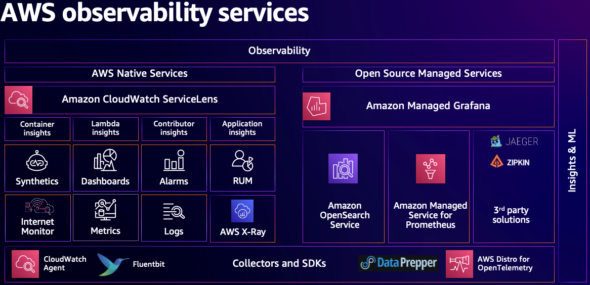

# AWS Observability Maturity Model

## Introduction

At its core, observability is the ability to understand and gain insights into the internal state of a system by analyzing its external outputs. This concept has evolved from traditional monitoring approaches that focus on predefined metrics or events, to a more holistic approach that encompasses the collection, analysis, and visualization of data generated by various components in an environment. A system cannot be controlled or optimized unless it is observed. An effective observability strategy allows teams to quickly identify and resolve issues, optimize resource usage, and gain insights into the overall health of their systems. Observability gives the ability to efficiently detect, investigate and remediate issues that can and should improve overall operational availability and the health of the workloads.

The difference between Monitoring and Observability is that Monitoring tells whether a system is working or not, while Observability tells why the system isn’t working. Monitoring is usually a reactive measure whereas the goal of Observability is to be able to improve your Key Performance Indicators (KPIs) in a proactive manner. Continuous Monitoring & Observability increases agility, improves customer experience and reduces risk in the cloud environment.

## Observability maturity model

The observability maturity model serves as an essential framework for organizations looking to optimize their workload observability and management processes. This model provides a comprehensive roadmap for businesses to assess their current capabilities, identify areas for improvement, and strategically invest in the right tools and processes to achieve optimal observability. In the era of cloud computing, microservices, ephemeral and distributed systems, observability has become a critical factor in ensuring the reliability and performance of digital services. By providing a structured approach to improving observability, this model allows organizations to gain a more profound understanding and control over their systems, paving way for a more resilient, efficient, and high-performing business.

## Stages of Observability Maturity Model

As organizations expand their workloads, the observability maturity model is expected to mature as well. However, the path to the observability maturity doesn’t always grow along with the workload. The intention is to help customers achieve the required maturity level as they expand and grow their organizational capabilities.

1.  The first stage in the observability maturity model typically involves establishing a baseline understanding of the organization's current state. This entails assessing existing monitoring tools and processes, as well as identifying gaps in visibility or functionality. At this stage, organizations can take stock of their current capabilities and set realistic goals for improvement starting even at the early stages of engineering cycle.

2.  In the next stage, organizations move towards a more sophisticated approach by adopting advanced observability strategies and services. This may include implementing proactive alerting, distributed tracing to gain insights into the interactions between disparate systems, by which organizations can begin to reap the benefits of increased visibility, reduce cognitive load and more efficient troubleshooting.

3.  As businesses progress through the third stage of the observability maturity model, they can leverage additional capabilities such as automated remediation, artificial intelligence and machine learning technologies to automate anomaly detection and root cause analysis. These advanced features enable organizations to not only detect issues but also take corrective actions before they impact end-users or disrupt business operations. By integrating observability tools with other critical systems such as incident management platforms, organizations can streamline their incident response processes and minimize the time it takes to resolve issues.

4.  The final stage of the observability maturity model involves leveraging the wealth of data generated by monitoring and observability tools to drive continuous improvement. This can involve using advanced analytics to identify patterns and trends in workload performance, as well as feeding this information back into engineering and operations processes to optimize resource allocation, architecture, and deployment strategies.

### Stage1: Foundational monitoring - Collecting Telemetry Data

Adopted as the bare minimum and worked in siloes, basic monitoring has an undefined strategy of what is required to monitor the totality of the systems or workloads in an organization. Most of the time, different teams like application owners, Network Operations Center (NOC) or CloudOps or DevOps teams use different tools for their monitoring needs, hence this approach is of little value in terms of debugging across or for optimization of the environment.

Typically, customers at this stage have disparate solutions for monitoring their workloads. Different teams, most of the time they gather same data in different ways since there is no or limited partnership with others. The teams tend to optimize what they need by working with the data they obtain. Also, teams cannot use each other’s data since the data obtained from another team could be in a dissimilar format. Creating a plan to identify critical workloads, aiming for a unified solution for observability, defining metrics and logs are key aspects in this level. Designing your workload to capture the essential [telemetry](https://docs.aws.amazon.com/wellarchitected/latest/operational-excellence-pillar/implement-observability.html) it provides is necessary to understand its internal state and the [workload health](https://docs.aws.amazon.com/wellarchitected/latest/operational-excellence-pillar/utilizing-workload-observability.html).

To build a foundation towards improving the maturity level, instrumenting workloads through collection of metrics, logs, traces and gaining meaningful insights using the right monitoring and observability tools help customers control and optimize the environment. Instrumentation refers to measuring, tracking and capturing key data from environments that can be used to observe the behavior and performance of workloads. Examples include application metrics such as errors, successful or non-successful transactions, and infrastructure metrics such as the utilization of CPU and disk resources.

### Stage 2: Intermediate Monitoring - Telemetry Analysis and Insights

In this stage, customers see their organizations becoming clearer in terms of collecting signals from various environments like on-premise and cloud. They have devised mechanisms to collect metrics, logs and traces from workloads as these form the foundational structure of observability, created visualizations, alerting strategies and also have the ability to prioritize issues based on well-defined criteria. Instead of being reactive and guessing, customers have a workflow that invokes required actions and relevant teams are able to analyze and troubleshoot based on captured information and historical knowledge. Customers in this level work towards accomplishing practices for observability of their environments that could be traditional or modern, highly scalable, distributed, agile and microservices architecture.

Although monitoring seems to be working well in most cases, organizations tend to spend more time debugging issues and as a result the overall Mean Time-To-Resolution (MTTR) is not consistent or meaningfully improved over a period of time. Also, there is higher than expected cognitive time and effort to debug issues hence longer incident response. There tends to be a data overload situation that overwhelms operations as well. We find most enterprises being caught in this stage without realizing where they could go next. Specific actions that can be taken to move the organization to the next level are: 1) Review your systems’ architecture designs at regular intervals and deploy policies and practices to reduce the impact and downtime leading to fewer alerts. 2) Prevent alert fatigue by defining actionable [KPIs](https://aws-observability.github.io/observability-best-practices/guides/operational/business/key-performance-indicators/), add valuable context to the alert findings, categorizing by severity/urgency, sending to different tools and teams to help engineers resolve the issues faster.

Analyze these alerts on a regular basis and automate remediation for common repeated alerts. Share and communicate the alert findings with relevant teams to provide feedback on operational and process improvement.

Develop a plan to gradually build a knowledge graph that helps you correlate different entities and understand the dependencies between different parts of a system. It enables customers visualize the impact of changes to a system, helping to predict and mitigate potential issues.

### Stage 3: Advanced Observability - Correlation and Anomaly Detection

In this stage organizations are able to clearly understand the root cause of issues without having to spend a lot of time troubleshooting. When an issue arises, alerts provide enough contextual information to relevant teams like Network Operations Center (NOC) or CloudOps or DevOps teams. The monitoring team are able to look at an alert and immediately determine the root cause of the issue through correlation of signals like metrics, logs as well as traces. Traces are data collected from your application about requests that can be used with tools to view, filter, and gain insights to identify issues and opportunities for optimization. Traced requests of your application provides detailed information not only about the request and response, but also about calls that your application makes to downstream AWS resources, microservices, databases, and web APIs. They can look at a trace, find the corresponding log events as traces are captured and also look at metrics from the infrastructure and applications obtaining a 360° view of the situation, they are in.

Appropriate teams can take remedial actions at once by providing a fix that solves the issue. In this scenario, the MTTR is very small, the Service Level Objectives (SLO) are green, and the burn rate through the error budget is tolerable. Typically, customers in this level have accomplished practices for observability of their modern, agile, highly scalable and microservices environments.

There are many organizations that have achieved this level of sophistication and maturity in their observability environments. This stage already gives organizations the ability to support complex infrastructure, operate their systems with high availability, provide higher Service Level Availability (SLA) for their applications and achieve business innovation by providing reliable infrastructure. Customers also use anomaly detectors to monitor anomalies & outliers which do not match usual patterns and have near real time alerting mechanisms.

However, teams in such organizations always want to go beyond the art of the possible. Teams would like to understand repeated issues, create a knowledge base that they can make use of to model against scenarios in order to predict issues that might arise in the future. That is when customers move to the next stage of the maturity model, in which they get insights into the unknown. In order to get there, new tools are needed and also new skills and techniques in storing and making use of the data needs to be identified. One can make use of Artificial intelligence for IT operations (AIOps) to create systems that automatically correlate signals, identify root cause, create resolution plans based on models trained using data collected in the past.

### Stage 4: Proactive Observability - Automatic and Proactive Root Cause Identification

Here Observability data is not only used “after” an issue occurs, rather makes use of the data in real-time “before” an issue occurs. Using well-trained models, issue identifications are made proactively and the resolutions are accomplished easier and simpler. By analyzing collected signals, the monitoring system is able to provide insights into the issue automatically and also lay out resolution option(s) to resolve the issue.

Observability software vendors are continuously expanding their capabilities into this space and this has only accelerated with Generative AI becoming popular, so that organizations aspiring to achieve such maturity level can accomplish with ease. Once this stage matures and takes shape, customers see a situation where the observability services are able to automatically create dynamic dashboards. The dashboards can only contain information that is relevant to the issue on hand. This will save time and cost in querying and visualizing data that don’t really matter. With Generative AI (GenAI) and compute to perform Machine Learning being democratized by the day, we may see proactive monitoring capabilities becoming more common in future than it is now.

An overview of the observability portfolio providing a holistic picture, with various AWS native and open-source solutions for data Collection, data processing, data insight & analysis which the customers can make use of by choosing appropriate solutions for their end-to-end observability needs.

## AWS Well-Architected and Cloud Adoption Framework for Observability

Organizations can leverage [AWS Well-Architected](https://aws.amazon.com/architecture/well-architected/) and [Cloud Adoption Framework](https://docs.aws.amazon.com/whitepapers/latest/aws-caf-operations-perspective/observability.html) to enhance their observability capabilities and effectively monitor and troubleshoot their cloud environment.

AWS Well-Architected and Cloud Adoption Framework for observability provides a structured approach for designing, deploying, and operating workloads, ensuring best practices are followed. This leads to improved availability, system performance, scalability and reliability. These frameworks also provide organizations with a standardized set of practices and prescriptive guidance, making it easier to collaborate, share knowledge and implement consistent solutions across the organization.

To effectively leverage, organizations need to understand the key components called the pillars ([operational excellence](https://docs.aws.amazon.com/wellarchitected/latest/framework/operational-excellence.html), security, [reliability](https://docs.aws.amazon.com/wellarchitected/latest/framework/reliability.html), [performance efficiency](https://docs.aws.amazon.com/wellarchitected/latest/framework/performance-efficiency.html), cost optimization and sustainability) of AWS Well-Architected framework, which provide a holistic approach for designing and operating cloud environment. On the other hand, the Cloud Adoption Framework provides a structured approach to cloud adoption, focusing on areas such as business, people, governance, and platform. By aligning these components with observability requirements, organizations can build robust and scalable workloads.

Implementing AWS Well-Architected and Cloud Adoption Frameworks for observability involves a few steps. Firstly, organizations need to assess their current state and identify areas for improvement. This can be done by conducting an Observability Maturity Model assessment, which evaluates the workloads against these frameworks. Based on the review findings, organizations can prioritize and plan their observability initiatives. This includes defining monitoring and logging requirements, selecting appropriate AWS services, and implementing the necessary infrastructure and tools. Lastly, organizations need to continuously monitor and optimize their observability solutions to ensure ongoing effectiveness.

Also, customers can utilize [AWS Well-Architected Tool](https://aws.amazon.com/well-architected-tool/) which is a service in AWS to document and measure their workload using the best practices of AWS Well-Architected Framework. This tool provides a consistent process for measuring their workloads through the pillars of AWS Well-Architected Framework, assisting with documenting the decisions that they make, providing recommendations for improving their workloads, and guiding them in making their workloads more reliable, secure, efficient, and cost-effective.

## Assessment

Observability Maturity Model assessment can be used to gauge your current state of observability and identify areas for improvement. An assessment of each stage involves evaluating existing monitoring and management practices across different teams, identifying gaps and areas for improvement, and determining the overall readiness for the next stage is imperative. A maturity assessment begins with business process outline, workload inventory & tools discovery, identifying current challenges and understanding organization priorities and objectives.

The assessment helps identify the targeted metrics and KPIs that lays the foundation for further development and optimization of the existing layout. The assessment of your Observability Maturity Model plays a crucial role in ensuring that your business is prepared to handle the complex, dynamic nature of modern systems. It aids in identifying blind spots and areas of weakness that could potentially lead to system failures or performance issues.

Moreover, regular assessments ensure that your business remains agile and adaptable. It allows you to keep pace with evolving technologies and methodologies, thereby ensuring that your systems are always at the peak of efficiency and reliability.

## Building the observability strategy

Once the organization has identified their observability stage, they should start to build the strategy to optimize the current processes & tools and also start to work towards the maturity. Organizations want to ensure that their customers have a great customer experience, so they start with those customer requirements and work backwards from there. Then work with your stakeholders because they understand those requirements really well. With the aim for an observability strategy, organizations must first define their observability goals as they should be aligned with the overall business objectives and should clearly articulate what the organization aims to achieve through the strategy, providing a roadmap for building and implementing the observability plan.

Next, organizations need to identify key metrics (KPIs) that will provide insights into system performance. These could range from latency and error rates to resource utilization and transaction volumes. It is important to note that the choice of metrics will largely depend on the nature of the business and its specific needs.

Once the key metrics have been identified, organizations can then decide on the tools and technologies required for data collection. The choice of tool should be based on its alignment with the organization's goals, its ease of integration with existing systems, optimize cost, achieve scalability, meet customer needs and improve the overall customer experience.

Finally, organizations should also encourage a culture that values observability. This involves training team members on the importance of observability, encouraging them to proactively monitor system performance, and fostering a culture of continuous learning and improvement. This strategy creates virtuous cycle of continuous process of collection, action and improvement for the best possible customer experience.

In summary, to build an observability strategy the three main aspects need to be considered: 1) what needs be collected 2) what are all the systems and workloads that need to be observed and 3/ how to react when there are issues and what mechanisms should be in place to remediate them.

## Conclusion

The observability maturity model serves as a roadmap for organizations to assess their current state and seeking ways to improve their ability to understand, analyze, and respond to the behavior of workloads and infrastructure. By following a structured approach to assess current capabilities, adopt advanced monitoring techniques, and leverage data-driven insights, businesses can achieve a higher level of observability and make more informed decisions about their workloads and infrastructure. This model outlines the key capabilities and practices that organizations need to develop in order to progress through different levels of maturity, ultimately reaching to a state where they can fully leverage the benefits of proactive observability.

## Helpful Resources

- [AWS Observability Best Practices](https://aws-observability.github.io/observability-best-practices/)
- [What is observability and Why does it matter?](https://aws.amazon.com/blogs/mt/what-is-observability-and-why-does-it-matter-part-1/)
- [How to develop an Observability strategy?](https://aws.amazon.com/blogs/mt/how-to-develop-an-observability-strategy/)
- [Guidance for Deep Application Observability on AWS](https://aws.amazon.com/solutions/guidance/deep-application-observability-on-aws/)
- [How Discovery increased operational efficiency with AWS observability](https://www.youtube.com/watch?v=zm30JNYmxlY) - AWS re:Invent 2022
- [Developing an observability strategy](https://www.youtube.com/watch?v=Ub3ATriFapQ) - AWS re:Invent 2022
- [Explore Cloud Native Observability with AWS](https://www.youtube.com/watch?v=UW7aT25Mbng) - AWS Virtual Workshop
- [Increase availability with AWS observability solutions](https://www.youtube.com/watch?v=_d_9xCfVBTM) - AWS re:Invent 2020
- [Observability best practices at Amazon](https://www.youtube.com/watch?v=zZPzXEBW4P8) - AWS re:Invent 2022
- [Observability: Best practices for modern applications](https://www.youtube.com/watch?v=YiegAlC_yyc) - AWS re:Invent 2022
- [Observability the open-source way](https://www.youtube.com/watch?v=2IJPpdp9xU0) - AWS re:Invent 2022
- [Elevate your Observability Strategy with AIOps](https://www.youtube.com/watch?v=L4b_eDSAwfE)
- [Let’s Architect! Monitoring production systems at scale](https://aws.amazon.com/blogs/architecture/lets-architect-monitoring-production-systems-at-scale/)
- [Full-stack observability and application monitoring with AWS](https://www.youtube.com/watch?v=or7uFFyHIX0) - AWS Summit SF 2022
