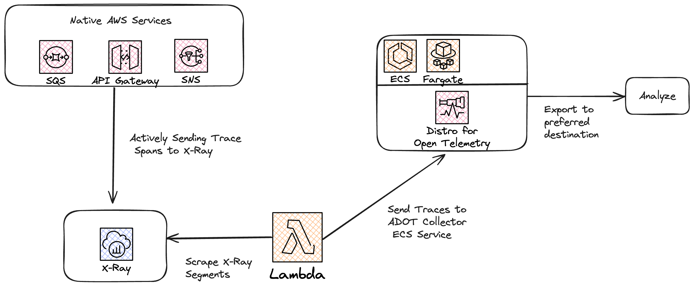

# Xray to OpenTelemetry Sample Architecture

This is an example CDK architecture that deploys the following:

- Lambda function that scrapes AWS X-Ray on an interval (default is every 1 minute) for all traces from the last minute. Trace documents are then exported to otel collector via UDP where they can be further processed.
- Central [ADOT](https://aws-otel.github.io/docs/introduction) (Amazon distro for OpenTelemetry) collector service running on ECS Fargate within a VPC.

## Why is this necessary?

Many native AWS services export traces [directly to X-Ray](https://docs.aws.amazon.com/xray/latest/devguide/xray-services.html). Some common examples of these are API Gateway, SNS, and SQS. If someone has instrumented the rest of their environment using [OpenTelemetry](https://opentelemetry.io/docs/). They may want these traces from AWS Native services to enter their otel pipeline so they can analyze the traces in the tool of their choosing rather than X-Ray. Currently X-Ray does not have any type of native export functionality, so it is required to scrape the traces regularly, and then send to an otel collector where they can be sent or processed using any of the tooling otel makes available.

## Prerequisites

- Installed [golang](https://go.dev/) version > 1.11 for building the lambda function.
- Locally running [Docker](https://www.docker.com/) to build the ADOT container for fargate deployment.

## Architecture



## Getting Started
```
git clone https://github.com/aws-observability/observability-best-practices.git
cd docs/en/guides/operational/adot-at-scale/xrayscrape
cdk deploy
```

## Useful commands

* `npm run build`   compile typescript to js
* `npm run watch`   watch for changes and compile
* `npm run test`    perform the jest unit tests
* `cdk deploy`      deploy this stack to your default AWS account/region
* `cdk diff`        compare deployed stack with current state
* `cdk synth`       emits the synthesized CloudFormation template

## Customization

### OTEL Collector Config

The OTEL config can be found at `/image/config.yaml`. This config can be updated to utilize any combination of [receivers, processors, and exporters](https://github.com/aws-observability/aws-otel-collector) that you like. The only required component is the X-Ray receiver which will listen on UDP port 2000 for traces scraped by the lambda function. By default we just simply log the traces with the logging exporter, but in a real deployment this would be changed to export to the trace-analysis backend of choice. If you would rather build your own OTEL collector image or use the upstream contrib image, you can edit `/image/Dockerfile` to the image of your choosing.

### Scrape Configuration

By default we trigger the lambda to run every 1 minute and each time it runs we query the last 1 minute of traces. This ensures that no traces are missed for export.

The scrape window can be edited in the go function `/go-lambda/main.go`:

```
const (
	// Scrape window duration
	scrapeWindow = 1 * time.Minute

	// Message header for UDP
	header = `{"format": "json", "version": 1}`
)
```

The lambda trigger rate can be edited in `/lib/xrayscrape-stack.ts`:

```
new Rule(this, 'ScheduleRule', {
  schedule: Schedule.rate(cdk.Duration.minutes(1)),
  targets: [new targets.LambdaFunction(goFunction)],
});
```

## Cleanup

Destory all resources using `cdk destroy`
