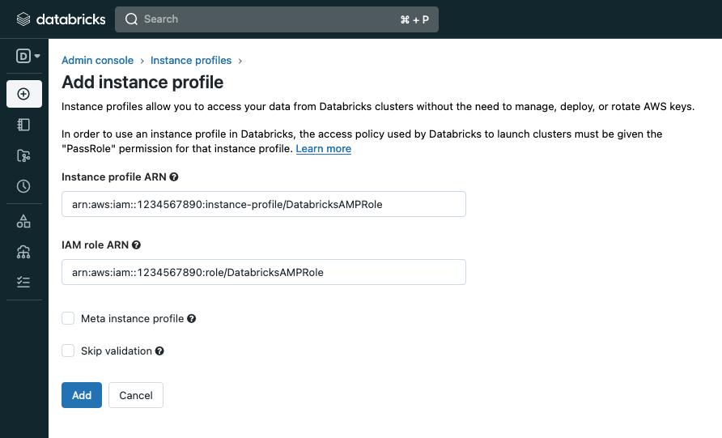
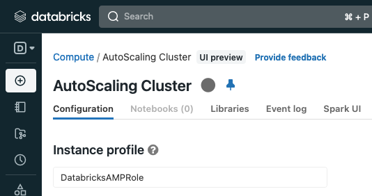

# Databricks Monitoring and Observability Best Practices in AWS

Databricks is a platform for managing data analytics and AI/ML workloads. This guide aim at supporting customers running [Databricks on AWS](https://aws.amazon.com/solutions/partners/databricks/) with monitoring these workloads using AWS Native services for observability or OpenSource Managed Services.

## Why monitor Databricks

Operation teams managing Databricks clusters benefit from having an integrated, customized dashboard to track workload status, errors, performance bottlenecks; alerting on unwanted behaviour, such as total resource usage over time, or percentual amount of errors; and centralized logging, for root cause analysis, as well as extracting additional customized metrics.

## What to monitor

Databricks run Apache Spark in its cluster instances, which has native features to expose metrics. These metrics will give information regarding drivers, workers, and the workloads being executed in the cluster.

The instances running Spark will have additional useful information about storage, CPU, memory, and networking. It´s important to understand what external factors could be affecting the performance of a Databricks cluster. In the case of clusters with numerous instances, understanding bottlenecks and general health is important as well.

## How to monitor

To install collectors and it's dependencies, Databricks init scripts will be needed. These are scripts that are runned in each instance of a Databricks cluster at boot time.

Databricks cluster permissions will also need permission to send metrics and logs using instance profiles.

Finally, it's a best practice to configure metrics namespace in Databricks cluster Spark configuration, replacing `testApp` with a proper reference to the cluster.


*Figure 1: example of metrics namespace Spark configuration*

## AWS Native

Check out the following recipe:
- [How to Monitor Databricks with Amazon CloudWatch](https://aws.amazon.com/blogs/mt/how-to-monitor-databricks-with-amazon-cloudwatch/)

## Open Source Software

Before start configuring Databricks, Amazon Managed Services for Prometheus (AMP) workspace and Amazon Managed Grafana (AMG) workspace should be provisioned, with the AMP datasource configured in AMG

- [Create AMP workspace](https://docs.aws.amazon.com/prometheus/latest/userguide/AMP-onboard-create-workspace.html)
- [Create AMG workspace](https://docs.aws.amazon.com/grafana/latest/userguide/AMG-create-workspace.html)
- [Configure AMP datasource](https://docs.aws.amazon.com/grafana/latest/userguide/prometheus-data-source.html)


Create an S3 bucket to store the init script that will install ADOT Collector and it's dependencies.

Create an IAM Role granting permission for Databricks cluster instances to remote write metrics into AMP, and read access to the init script's S3 bucket. For AMP permissions, you can attach the AmazonPrometheusRemoteWriteAccess managed policy. Configure this role's instance profile first in Databricks workspace, then into the Databricks cluster.

- [Create IAM role](https://repost.aws/knowledge-center/ec2-instance-access-s3-bucket)
- [Attach a managed policy to an IAM role](https://docs.aws.amazon.com/IAM/latest/UserGuide/access_policies_manage-attach-detach.html#add-policies-console)


*Figure 2: example of Instance Profile configuration in Databricks workspace*


*Figure 3: example of Instance Profile configuration in Databricks cluster*

Finally, grant Databricks the right to assume the IAM Role you just created. You need to attach a policy similar to the one below to the IAM Role used to deploy the workspace. Mind that this is a different IAM Role from the one created for Databricks instances; it was either created at the time the workspace was created, or already existed prior to that.

```json
{
  "Version": "2012-10-17",
  "Statement": [
    {
      "Effect": "Allow",
      "Action": "iam:PassRole",
      "Resource": "arn:aws:iam::<AWS_ACCOUNT_ID>:role/DatabricksAMPRole"
    }
  ]
}
```

Create a configuration for ADOT and upload it to the S3 bucket. Here follows an example:

```yaml
receivers:
  prometheus:
    config:
      global:

      scrape_configs:
      
      - job_name: databricks_prometheus
        metrics_path: /metrics/prometheus/
        sample_limit: 10000
        static_configs:
        - targets:
          - ${env:SPARK_LOCAL_IP:40000}

      - job_name: databricks_node
        sample_limit: 10000
        static_configs:
        - targets:
          - ${env:SPARK_LOCAL_IP:9100}

extensions:
  sigv4auth:
    service: "aps"
    region: "${env:AMP_REGION}"

exporters:
  prometheusremotewrite:
    endpoint: "${env:AMP_REMOTE_WRITE_ENDPOINT}"
    auth:
      authenticator: sigv4auth

service:
  pipelines:
    metrics:
      receivers: [prometheus]
      exporters: [prometheusremotewrite]

  extensions: [sigv4auth]

```

Create an init script to install ADOT and it's dependencies, and add some additional configurations to Spark monitoring. Upload the script to the S3 bucket, and configure this init script into the Databricks cluster. Here follows an example:

```bash
#!/bin/bash
set -e

cat << EOF > /databricks/spark/conf/metrics.properties
*.sink.prometheusServlet.class=org.apache.spark.metrics.sink.PrometheusServlet
*.sink.prometheusServlet.path=/metrics/prometheus
master.sink.prometheusServlet.path=/metrics/master/prometheus
applications.sink.prometheusServlet.path=/metrics/applications/prometheus
EOF

cp /databricks/spark/conf/metrics.properties \
  /databricks/spark/dbconf/log4j/master-worker/metrics.properties
sudo pip3 install awscli
aws s3 cp s3://$ADOT_INIT_SCRIPT_BUCKET/$ADOT_CONFIG adot_config.yaml
wget https://aws-otel-collector.s3.amazonaws.com/ubuntu/amd64/v0.25.0/aws-otel-collector.deb
sudo dpkg -i aws-otel-collector.deb
wget https://github.com/prometheus/node_exporter/releases/download/v1.5.0/node_exporter-1.5.0.linux-amd64.tar.gz
tar zxvf node_exporter-1.5.0.linux-amd64.tar.gz
nohup ./node_exporter-1.5.0.linux-amd64/node_exporter &
disown -h
export SPARK_LOCAL_IP=`/sbin/ip -o -4 addr list eth0 | awk '{print $4}' | cut -d/ -f1`
sudo /opt/aws/aws-otel-collector/bin/aws-otel-collector-ctl -c adot_config.yaml -a start
```

Enable native Spark support for Prometheus. Note that it is available only from Spark 3.0. To do that, you need to add the following configuration to Spark via Databricks cluster Advanced Configurations:

```
spark.ui.prometheus.enabled true
```

Add the following environment variables into Databricks cluster configuration, as it will be needed for AWS Distro for OpenTelemetry (ADOT) Collector later:

```bash
AMP_REMOTE_WRITE_ENDPOINT="<AMP_ENDPOINT>/api/v1/remote_write"
AMP_REGION="<AMP_REGION>"
ADOT_INIT_SCRIPT_BUCKET="<S3_BUCKET>"
ADOT_CONFIG="adot_config.yaml"
```

If the cluster is running, it will be restarted. The next time it runs, it will send Spark and instance metrics to AMP.
