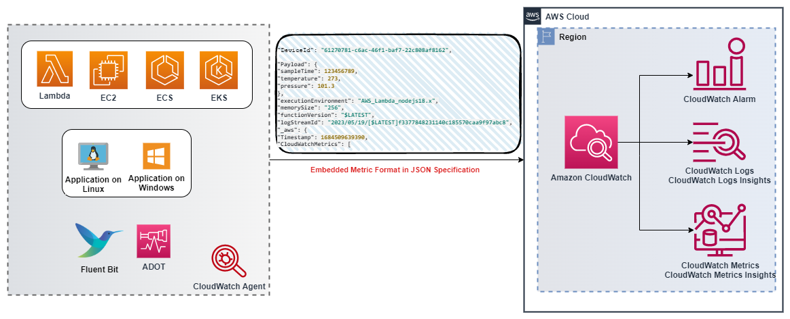

# CloudWatch Embedded Metric Format

## Introduction

CloudWatch Embedded Metric Format (EMF) enables customers to ingest complex high-cardinality application data to Amazon CloudWatch in the form of logs and generate actionable metrics. With Embedded Metric Format customers do not have to rely on complex architecture or need to use any third party tools to gain insights into their environments. Although this feature can be used in all environments, it’s particularly useful in workloads that have ephemeral resources like AWS Lambda functions or containers in Amazon Elastic Container Service (Amazon ECS), Amazon Elastic Kubernetes Service (Amazon EKS), or Kubernetes on EC2. Embedded Metric Format lets customers easily create custom metrics without having to instrument or maintain separate code, while gaining powerful analytical capabilities on log data.

## How Embedded Metric Format (EMF) logs work

Compute environments like Amazon EC2, On-premise Servers, containers in Amazon Elastic Container Service (Amazon ECS), Amazon Elastic Kubernetes Service (Amazon EKS), or Kubernetes on EC2 can generate & send Embedded Metric Format (EMF) logs through the CloudWatch Agent to Amazon CloudWatch

AWS Lambda allows customers to easily generate custom metrics without requiring any custom code, making blocking network calls or relying on any third party software to generate and ingest Embedded Metric Format (EMF) logs to Amazon CloudWatch.

Customers can embed custom metrics alongside detailed log event data asynchronously without requiring to provide special header declaration while publishing structured logs aligning the [EMF specification](https://docs.aws.amazon.com/AmazonCloudWatch/latest/monitoring/CloudWatch_Embedded_Metric_Format_Specification.html). CloudWatch automatically extracts the custom metrics so that customers can visualize & set alarm for real-time incident detection. The detailed log events and high-cardinality context associated with the extracted metrics can be queried using CloudWatch Logs Insights to provide deep insights into the root causes of operational events.

The Amazon CloudWatch output plugin for [Fluent Bit](https://docs.fluentbit.io/manual/pipeline/outputs/cloudwatch) allows customers to ingest metrics & logs data into the Amazon CloudWatch service that includes support for [Embedded Metric Format](https://github.com/aws/aws-for-fluent-bit) (EMF).



## When to use Embedded Metric Format (EMF) logs

Traditionally, monitoring has been structured into three categories. The first category is the classic health check of an application. The second category is 'metrics', through which customers instrument their application using models like counters, timers, and gauges. The third category is 'logs', that are invaluable for the overall observability of the application. Logs provide customers continuous information about how their application is behaving. Now, customers have a way to significantly improve the way they can observe their application, without having to make sacrifices in data granularity or richness by unifying and simplifying all the instrumentation of their application while gaining incredible analytical capabilities through Embedded Metric Format (EMF) logs.

[Embedded Metric Format (EMF) logs](https://aws.amazon.com/blogs/mt/enhancing-workload-observability-using-amazon-cloudwatch-embedded-metric-format/) is ideal for environments which generate high cardinality application data, that can be part of the EMF logs without having to increase metric dimensions. This still allows customers to slice and dice the application data by querying EMF logs through CloudWatch Logs Insights and CloudWatch Metrics Insights without needing to put every attribute as a metric dimension.

Customers aggregating [telemetry data from millions of Telco or IoT devices](https://aws.amazon.com/blogs/mt/how-bt-uses-amazon-cloudwatch-to-monitor-millions-of-devices/) require insights into their devices performance and ability to quickly deep dive into unique telemetry that the devices report. They also need to troubleshoot problems easier & faster without requiring to dig through humongous data to provide a quality service. By using Embedded Metric Format (EMF) logs customers can accomplish large scale observability by combining metrics and logs into single entity and improve troubleshooting with cost efficiency and better performance.

## Generating Embedded Metric Format (EMF) logs

The following methods can be used to generate Embedded metric format logs

1. Generate and send the EMF logs through an agent (like [CloudWatch](https://docs.aws.amazon.com/AmazonCloudWatch/latest/monitoring/CloudWatch_Embedded_Metric_Format_Generation_CloudWatch_Agent.html) or Fluent-Bit or Firelens) using open-sourced client libraries.

   - Open-sourced client libraries are available in the following languages which can be used to create EMF logs
     - [Node.Js](https://github.com/awslabs/aws-embedded-metrics-node)
     - [Python](https://github.com/awslabs/aws-embedded-metrics-python)
     - [Java](https://github.com/awslabs/aws-embedded-metrics-java)
     - [C#](https://github.com/awslabs/aws-embedded-metrics-dotnet)
   - EMF logs can be generated using AWS Distro for OpenTelemetry (ADOT). ADOT is a secure, production-ready, AWS-supported distribution of the OpenTelemetry project part of the Cloud Native Computing Foundation (CNCF). OpenTelemetry is an open-source initiative that provides APIs, libraries, and agents to collect distributed traces, logs and metrics for application monitoring & removes boundaries and restrictions between vendor-specific formats. There are two components required for this, an OpenTelemetry compliant data source and [ADOT Collector](https://github.com/open-telemetry/opentelemetry-collector-contrib/tree/main/exporter/awsemfexporter) enabled for use with [CloudWatch EMF](https://aws-otel.github.io/docs/getting-started/cloudwatch-metrics#cloudwatch-emf-exporter-awsemf) logs.

2. Manually constructed logs conforming to [defined specification in JSON format](https://docs.aws.amazon.com/AmazonCloudWatch/latest/monitoring/CloudWatch_Embedded_Metric_Format_Specification.html), can be sent through [CloudWatch agent](https://docs.aws.amazon.com/AmazonCloudWatch/latest/monitoring/CloudWatch_Embedded_Metric_Format_Generation_CloudWatch_Agent.html) or [PutLogEvents API](https://docs.aws.amazon.com/AmazonCloudWatch/latest/monitoring/CloudWatch_Embedded_Metric_Format_Generation_PutLogEvents.html) to CloudWatch.

## Viewing Embedded Metric Format logs in CloudWatch console

After generating the Embedded Metric Format (EMF) logs that extract metrics customers can [view them in CloudWatch console](https://docs.aws.amazon.com/AmazonCloudWatch/latest/monitoring/CloudWatch_Embedded_Metric_Format_View.html) under Metrics. Embedded metrics have the dimensions that are specified while generating the logs. Embedded metrics generated using client libraries have ServiceType, ServiceName, LogGroup as default dimensions.

- **ServiceName**: The name of the service is overridden, however for services where the name cannot be inferred (e.g. Java process running on EC2) a default value of Unknown is used if not explicitly set.
- **ServiceType**: The type of the service is overridden, however for services where the type cannot be inferred (e.g. Java process running on EC2) a default value of Unknown is used if not explicitly set.
- **LogGroupName**: Customers can optionally configure the destination log group that metrics should be delivered to, for agent-based platforms. This value is passed from the library to the agent in the Embedded Metric payload. If a LogGroup is not provided, the default value will be derived from the service name: -metrics
- **LogStreamName**: Customers can optionally configure the destination log stream that metrics should be delivered to, for agent-based platforms. This value will be passed from the library to the agent in the Embedded Metric payload. If a LogStreamName is not provided, the default value will be derived by the agent (this will likely be the hostname).
- **NameSpace**: Overrides the CloudWatch namespace. If not set, a default value of aws-embedded-metrics is used.

A sample EMF logs looks like below in the CloudWatch Console logs

```json
2023-05-19T15:20:39.391Z 238196b6-c8da-4341-a4b7-0c322e0ef5bb INFO
{
    "LogGroup": "emfTestFunction",
    "ServiceName": "emfTestFunction",
    "ServiceType": "AWS::Lambda::Function",
    "Service": "Aggregator",
    "AccountId": "XXXXXXXXXXXX",
    "RequestId": "422b1569-16f6-4a03-b8f0-fe3fd9b100f8",
    "DeviceId": "61270781-c6ac-46f1-baf7-22c808af8162",
    "Payload": {
        "sampleTime": 123456789,
        "temperature": 273,
        "pressure": 101.3
    },
    "executionEnvironment": "AWS_Lambda_nodejs18.x",
    "memorySize": "256",
    "functionVersion": "$LATEST",
    "logStreamId": "2023/05/19/[$LATEST]f3377848231140c185570caa9f97abc8",
    "_aws": {
        "Timestamp": 1684509639390,
        "CloudWatchMetrics": [
            {
                "Dimensions": [
                    [
                        "LogGroup",
                        "ServiceName",
                        "ServiceType",
                        "Service"
                    ]
                ],
                "Metrics": [
                    {
                        "Name": "ProcessingLatency",
                        "Unit": "Milliseconds"
                    }
                ],
                "Namespace": "aws-embedded-metrics"
            }
        ]
    },
    "ProcessingLatency": 100
}
```

For the same EMF log, the extracted metrics looks like below, which can be queried in **CloudWatch Metrics**.


Customers can query the detailed log events associated with the extracted metrics using **CloudWatch Logs Insights** to get deep insights into the root causes of operational events. One of the benefits of extracting metrics from EMF logs is that the customers can filter logs by the unique metric (metric name plus unique dimension set) and metric values, to get context on the events that contributed to the aggregated metric value.

For the same EMF logs discussed above, an example query having ProcessingLatency as a metric and Service as a dimension to get an impacted request id or device id is shown below as sample query in CloudWatch Logs Insights.

```json
filter ProcessingLatency < 200 and Service = "Aggregator"
| fields @requestId, @ingestionTime, @DeviceId
```


## Alarms on metrics created with EMF logs

Creating [alarms on metrics generated by EMF](https://docs.aws.amazon.com/AmazonCloudWatch/latest/monitoring/CloudWatch_Embedded_Metric_Format_Alarms.html) follows the same pattern as creating alarms on any other metrics. The key thing to note here is, EMF metric generation depends on log publishing flow, because the CloudWatch Logs process the EMF logs & transform the metrics. So it’s important to publish logs in a timely manner so that the metric datapoints are created within the period of time in which alarms are evaluated.

For the same EMF logs discussed above, an example alarm is created and shown below using the ProcessingLatency metric as a datapoint with a threshold.


## Latest features of EMF Logs

Customers can send EMF logs to CloudWatch Logs using [PutLogEvents API](https://docs.aws.amazon.com/AmazonCloudWatch/latest/monitoring/CloudWatch_Embedded_Metric_Format_Generation_PutLogEvents.html) and may optionally include the HTTP header `x-amzn-logs-format: json/emf` to instruct CloudWatch Logs that the metrics should be extracted, it is no longer necessary.

Amazon CloudWatch supports [high resolution metric extraction](https://aws.amazon.com/about-aws/whats-new/2023/02/amazon-cloudwatch-high-resolution-metric-extraction-structured-logs/) with up to 1 second granularity from structured logs using Embedded Metric Format (EMF). Customers can provide an optional [StorageResolution](https://docs.aws.amazon.com/AmazonCloudWatch/latest/monitoring/cloudwatch_concepts.html#Resolution_definition) parameter within EMF specification logs with a value of 1 or 60 (default) to indicate the desired resolution (in seconds) of the metric. Customers can publish both standard resolution (60 seconds) and high resolution (1 second) metrics via EMF, enabling granular visibility into their applications’ health and performance.

Amazon CloudWatch provides [enhanced visibility into errors](https://aws.amazon.com/about-aws/whats-new/2023/01/amazon-cloudwatch-enhanced-error-visibility-embedded-metric-format-emf/) in Embedded Metric Format (EMF) with two error metrics ([EMFValidationErrors & EMFParsingErrors](https://docs.aws.amazon.com/AmazonCloudWatch/latest/logs/CloudWatch-Logs-Monitoring-CloudWatch-Metrics.html)). This enhanced visibility helps customers quickly identify and remediate errors when leveraging EMF, thereby simplifying the instrumentation process .

With the increased complexity of managing modern applications, customers need more flexibility when defining and analyzing custom metrics. Hence the maximum number of metric dimensions has been increased from 10 to 30. Customers can create custom metrics using [EMF logs with up to 30 dimensions](https://aws.amazon.com/about-aws/whats-new/2022/08/amazon-cloudwatch-metrics-increases-throughput/).

## Additional References:

- One Observability Workshop on [Embedded Metric Format with an AWS Lambda function](https://catalog.workshops.aws/observability/en-US/aws-native/metrics/emf/clientlibrary) sample using NodeJS Library.
- Serverless Observability Workshop on [Async metrics using Embedded Metrics Format](https://serverless-observability.workshop.aws/en/030_cloudwatch/async_metrics_emf.html) (EMF)
- [Java code sample using PutLogEvents API](https://catalog.workshops.aws/observability/en-US/aws-native/metrics/emf/putlogevents) to send EMF logs to CloudWatch Logs
- Blog article: [Lowering costs and focusing on our customers with Amazon CloudWatch embedded custom metrics](https://aws.amazon.com/blogs/mt/lowering-costs-and-focusing-on-our-customers-with-amazon-cloudwatch-embedded-custom-metrics/)
