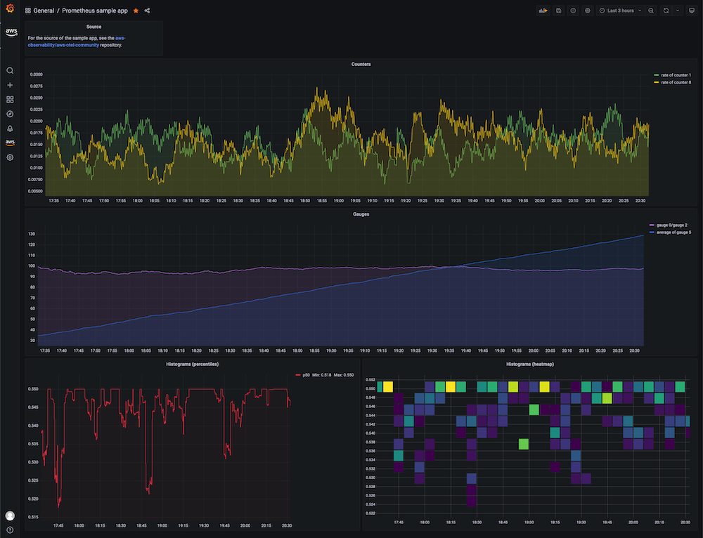

# Using AWS Distro for OpenTelemetry in EKS on Fargate with Amazon Managed Service for Prometheus

In this recipe we show you how to instrument a [sample Go application](https://github.com/aws-observability/aws-otel-community/tree/master/sample-apps/prometheus) and
use [AWS Distro for OpenTelemetry (ADOT)](https://aws.amazon.com/otel) to ingest metrics into
[Amazon Managed Service for Prometheus](https://aws.amazon.com/prometheus/) .
Then we're using [Amazon Managed Grafana](https://aws.amazon.com/grafana/) to visualize the metrics.

We will be setting up an [Amazon Elastic Kubernetes Service (EKS)](https://aws.amazon.com/eks/)
on [AWS Fargate](https://aws.amazon.com/fargate/) cluster and use an
[Amazon Elastic Container Registry (ECR)](https://aws.amazon.com/ecr/) repository
to demonstrate a complete scenario.

!!! note
    This guide will take approximately 1 hour to complete.

## Infrastructure
In the following section we will be setting up the infrastructure for this recipe. 

### Architecture

The ADOT pipeline enables us to use the 
[ADOT Collector](https://github.com/aws-observability/aws-otel-collector) to 
scrape a Prometheus-instrumented application, and ingest the scraped metrics to
Amazon Managed Service for Prometheus. 


The ADOT Collector includes two components specific to Prometheus: 

* the Prometheus Receiver, and 
* the AWS Prometheus Remote Write Exporter.

!!! info 
    For more information on Prometheus Remote Write Exporter check out:
    [Getting Started with Prometheus Remote Write Exporter for AMP](https://aws-otel.github.io/docs/getting-started/prometheus-remote-write-exporter).


### Prerequisites

* The AWS CLI is [installed](https://docs.aws.amazon.com/cli/latest/userguide/cli-chap-install.html) and [configured](https://docs.aws.amazon.com/cli/latest/userguide/cli-chap-configure.html) in your environment.
* You need to install the [eksctl](https://docs.aws.amazon.com/eks/latest/userguide/eksctl.html) command in your environment.
* You need to install [kubectl](https://docs.aws.amazon.com/eks/latest/userguide/install-kubectl.html) in your environment. 
* You have [Docker](https://docs.docker.com/get-docker/) installed into your environment.

### Create EKS on Fargate cluster

Our demo application is a Kubernetes app that we will run in an EKS on Fargate
cluster. So, first create an EKS cluster using the
provided [cluster-config.yaml](./fargate-eks-metrics-go-adot-ampamg/cluster-config.yaml)
template file by changing `<YOUR_REGION>` to one of the
[supported regions for AMP](https://docs.aws.amazon.com/prometheus/latest/userguide/what-is-Amazon-Managed-Service-Prometheus.html#AMP-supported-Regions).

Make sure to set `<YOUR_REGION>` in your shell session, for example, in Bash:

```
export AWS_DEFAULT_REGION=<YOUR_REGION>
```

Create your cluster using the following command:

```
eksctl create cluster -f cluster-config.yaml
```

### Create ECR repository

In order to deploy our application to EKS we need a container repository. 
You can use the following command to create a new ECR repository in your account.
Make sure to set `<YOUR_REGION>` as well.

```
aws ecr create-repository \
    --repository-name prometheus-sample-app \
    --image-scanning-configuration scanOnPush=true \
    --region <YOUR_REGION>
```

### Set up AMP

First, create an Amazon Managed Service for Prometheus workspace using the AWS CLI with:

```
aws amp create-workspace --alias prometheus-sample-app
```

Verify the workspace is created using:

```
aws amp list-workspaces
```

!!! info
    For more details check out the [AMP Getting started](https://docs.aws.amazon.com/prometheus/latest/userguide/AMP-getting-started.html) guide.


### Set up ADOT Collector

Download [adot-collector-fargate.yaml](./fargate-eks-metrics-go-adot-ampamg/adot-collector-fargate.yaml) 
and edit this YAML doc with the parameters described in the next steps.

In this example, the ADOT Collector configuration uses an annotation `(scrape=true)` 
to tell which target endpoints to scrape. This allows the ADOT Collector to distinguish 
the sample app endpoint from `kube-system` endpoints in your cluster.
You can remove this from the re-label configurations if you want to scrape a different sample app. 

Use the following steps to edit the downloaded file for your environment:

1\. Replace `<YOUR_REGION>` with your current region. 

2\. Replace `<YOUR_ENDPOINT>` with the remote write URL of your workspace.

Get your AMP remote write URL endpoint by executing the following queries. 

First, get the workspace ID like so:

```
YOUR_WORKSPACE_ID=$(aws amp list-workspaces \
                    --alias prometheus-sample-app \
                    --query 'workspaces[0].workspaceId' --output text)
```

Now get the remote write URL endpoint URL for your workspace using:

```
YOUR_ENDPOINT=$(aws amp describe-workspace \
                --workspace-id $YOUR_WORKSPACE_ID  \
                --query 'workspace.prometheusEndpoint' --output text)api/v1/remote_write
```

!!! warning
    Make sure that `YOUR_ENDPOINT` is in fact the remote write URL, that is, 
    the URL should end in `/api/v1/remote_write`.

After creating deployment file we can now apply this to our cluster by using the following command: 

```
kubectl apply -f adot-collector-fargate.yaml
```

!!! info
    For more information check out the [AWS Distro for OpenTelemetry (ADOT) 
    Collector Setup](https://aws-otel.github.io/docs/getting-started/prometheus-remote-write-exporter/eks#aws-distro-for-opentelemetry-adot-collector-setup).

### Set up AMG

Set up a new AMG workspace using the 
[Amazon Managed Grafana – Getting Started](https://aws.amazon.com/blogs/mt/amazon-managed-grafana-getting-started/) guide.

Make sure to add "Amazon Managed Service for Prometheus" as a datasource during creation.


## Application

In this recipe we will be using a
[sample application](https://github.com/aws-observability/aws-otel-community/tree/master/sample-apps/prometheus) 
from the AWS Observability repository.

This Prometheus sample app generates all four Prometheus metric types 
(counter, gauge, histogram, summary) and exposes them at the `/metrics` endpoint.

### Build container image

To build the container image, first clone the Git repository and change
into the directory as follows:

```
git clone https://github.com/aws-observability/aws-otel-community.git && \
cd ./aws-otel-community/sample-apps/prometheus
```

First, set the region (if not already done above) and account ID to what is applicable in your case. 
Replace `<YOUR_REGION>` with your current region. For
example, in the Bash shell this would look as follows:

```
export AWS_DEFAULT_REGION=<YOUR_REGION>
export ACCOUNTID=`aws sts get-caller-identity --query Account --output text`
```

Next, build the container image:

```
docker build . -t "$ACCOUNTID.dkr.ecr.$AWS_DEFAULT_REGION.amazonaws.com/prometheus-sample-app:latest"
```

!!! note
    If `go mod` fails in your environment due to a proxy.golang.or i/o timeout,
    you are able to bypass the go mod proxy by editing the Dockerfile.

    Change the following line in the Docker file:
    ```
    RUN GO111MODULE=on go mod download
    ```
    to:
    ```
    RUN GOPROXY=direct GO111MODULE=on go mod download
    ```

Now you can push the container image to the ECR repo you created earlier on.

For that, first log in to the default ECR registry:

```
aws ecr get-login-password --region $AWS_DEFAULT_REGION | \
    docker login --username AWS --password-stdin \
    "$ACCOUNTID.dkr.ecr.$AWS_DEFAULT_REGION.amazonaws.com"
```

And finally, push the container image to the ECR repository you created, above:

```
docker push "$ACCOUNTID.dkr.ecr.$AWS_DEFAULT_REGION.amazonaws.com/prometheus-sample-app:latest"
```

### Deploy sample app

Edit [prometheus-sample-app.yaml](./fargate-eks-metrics-go-adot-ampamg/prometheus-sample-app.yaml)
to contain your ECR image path. That is, replace `ACCOUNTID` and `AWS_DEFAULT_REGION` in the
file with your own values:

``` 
    # change the following to your container image:
    image: "ACCOUNTID.dkr.ecr.AWS_DEFAULT_REGION.amazonaws.com/prometheus-sample-app:latest"
```

Now you can deploy the sample app to your cluster using:

```
kubectl apply -f prometheus-sample-app.yaml
```

## End-to-end

Now that you have the infrastructure and the application in place, we will
test out the setup, sending metrics from the Go app running in EKS to AMP and
visualize it in AMG.

### Verify your pipeline is working 

To verify if the ADOT collector is scraping the pod of the sample app and
ingests the metrics into AMP, we look at the collector logs.

Enter the following command to follow the ADOT collector logs:

```
kubectl -n adot-col logs adot-collector -f
```

One example output in the logs of the scraped metrics from the sample app 
should look like the following:

```
...
Resource labels:
     -> service.name: STRING(kubernetes-service-endpoints)
     -> host.name: STRING(192.168.16.238)
     -> port: STRING(8080)
     -> scheme: STRING(http)
InstrumentationLibraryMetrics #0
Metric #0
Descriptor:
     -> Name: test_gauge0
     -> Description: This is my gauge
     -> Unit: 
     -> DataType: DoubleGauge
DoubleDataPoints #0
StartTime: 0
Timestamp: 1606511460471000000
Value: 0.000000
...
```

!!! tip
    To verify if AMP received the metrics, you can use [awscurl](https://github.com/okigan/awscurl).
    This tool enables you to send HTTP requests from the command line with AWS Sigv4 authentication,
    so you must have AWS credentials set up locally with the correct permissions to query from AMP.
    In the following command replace `$AMP_ENDPOINT` with the endpoint for your AMP workspace:

    ```
    $ awscurl --service="aps" \ 
            --region="$AWS_DEFAULT_REGION" "https://$AMP_ENDPOINT/api/v1/query?query=adot_test_gauge0"
    {"status":"success","data":{"resultType":"vector","result":[{"metric":{"__name__":"adot_test_gauge0"},"value":[1606512592.493,"16.87214000011479"]}]}}
    ```

### Create a Grafana dashboard

You can import an example dashboard, available via
[prometheus-sample-app-dashboard.json](./fargate-eks-metrics-go-adot-ampamg/prometheus-sample-app-dashboard.json),
for the sample app that looks as follows:



Further, use the following guides to create your own dashboard in Amazon Managed Grafana:

* [User Guide: Dashboards](https://docs.aws.amazon.com/grafana/latest/userguide/dashboard-overview.html)
* [Best practices for creating dashboards](https://grafana.com/docs/grafana/latest/best-practices/best-practices-for-creating-dashboards/)

That's it, congratulations you've learned how to use ADOT in EKS on Fargate to 
ingest metrics.

## Cleanup

First remove the Kubernetes resources and destroy the EKS cluster:

```
kubectl delete all --all && \
eksctl delete cluster --name amp-eks-fargate
```

Remove the Amazon Managed Service for Prometheus workspace:

```
aws amp delete-workspace --workspace-id \
    `aws amp list-workspaces --alias prometheus-sample-app --query 'workspaces[0].workspaceId' --output text`
```

Remove the  IAM role:

```
aws delete-role --role-name adot-collector-role
```

Finally, remove the Amazon Managed Grafana  workspace by removing it via the AWS console. 
