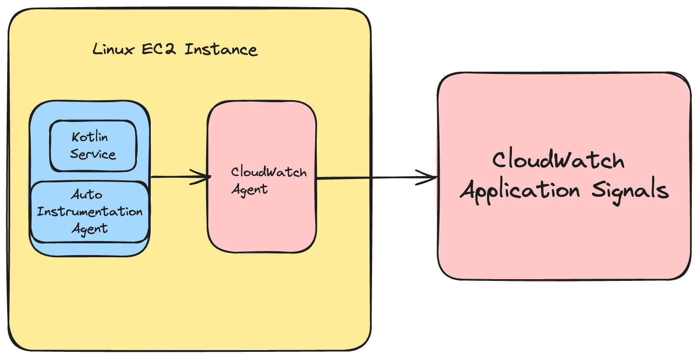
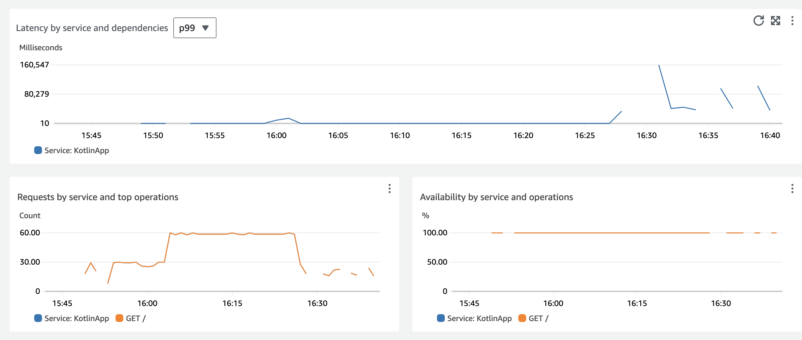

# Application Signals for Kotlin Services

## Introduction

Monitoring the performance and health of Kotlin web applications can be challenging due to the complex interactions between different components. [Kotlin](https://kotlinlang.org/) web services are usually built into Java Archive (jar) files, which can be deployed on any platform running Java. These applications often operate within distributed environments, involving multiple interconnected components such as databases, external APIs, and caching layers. This complexity can significantly escalate your Mean Time to Resolution (MTTR).

In this guide, we will demonstrate how to auto-instrument Kotlin web services that are running on a Linux EC2 server. Enabling [CloudWatch Application Signals](https://docs.aws.amazon.com/AmazonCloudWatch/latest/monitoring/CloudWatch-Application-Monitoring-Sections.html) allows for collection of telemetry from the application using [AWS Distro for OpenTelemetry](https://aws-otel.github.io/docs/introduction) (ADOT) Java Auto-Instrumentation Agent to collect metrics and traces from your applications without making any code changes. You can leverage key metrics such as call volume, availability, latency, faults, and errors to quickly see and triage current operational health of your application services and verify whether they are meeting the long term performance and business goals.

## Prerequisites

- A linux EC2 instance with the proper [IAM permissions](https://docs.aws.amazon.com/AmazonCloudWatch/latest/monitoring/Application_Signals_Permissions.html) to interact with CloudWatch Application Signals. This guide leverages [Amazon Linux](https://aws.amazon.com/linux/amazon-linux-2023/) instance for this, so if you are using something else your commands may be slightly different.
- The ability to [SSH](https://docs.aws.amazon.com/AWSEC2/latest/UserGuide/connect-linux-inst-ssh.html) into the instance.

## Solution Overview

At a high level, the steps we will perform are the following.

- Enable CloudWatch Application Signals.
- Deploy a [ktor web service](https://ktor.io/) in a fat jar.
- Install the CloudWatch agent configured to receive Application Signals from the web service.
- Download the [ADOT](https://aws-otel.github.io/docs/getting-started/java-sdk/auto-instr#introduction) Auto Instrumentation Agent.
- Run our kotlin service jar alongside the java agent to auto-instrument the service.
- Run some tests to generate telemetry.

### Architecture Diagram



### Enable CloudWatch Application Signals

Follow the instructions in Step 1: [Enable Application Signals](https://docs.aws.amazon.com/AmazonCloudWatch/latest/monitoring/CloudWatch-Application-Signals-Enable-EC2.html#CloudWatch-Application-Signals-EC2-Grant) in your account.

### Deploy a Ktor Web Service
[Ktor](https://ktor.io/) is a popular kotlin framework for creating web services. It allows you to quickly get started with asynchronous server-side applications.

Create a working directory
```
mkdir kotlin-signals && cd kotlin-signals
```

Clone the Ktor examples repo
```
git clone https://github.com/ktorio/ktor-samples.git && cd ktor-samples/structured-logging
```

Build the application
```
./gradlew build && cd build/libs
```

Test that the application runs
```
java -jar structured-logging-all.jar
```

Assuming the service built and ran correctly, we can now stop it with `ctrl + c`

### Configure the CloudWatch Agent
Amazon Linux instances have the CloudWatch agent installed by default. If your instance does not, you will need to [install](https://docs.aws.amazon.com/AmazonCloudWatch/latest/monitoring/install-CloudWatch-Agent-on-EC2-Instance.html) it.

Once installed, we can now create the configuration file.
```
sudo nano /opt/aws/amazon-cloudwatch-agent/bin/app-signals-config.json
```

Copy and Paste the following configuration into the file
```
{
    "traces": {
        "traces_collected": {
            "app_signals": {}
        }
    },
    "logs": {
        "metrics_collected": {
            "app_signals": {}
        }
    }
}
```

Save the file and then start the CloudWatch agent with the config we just created
```
sudo /opt/aws/amazon-cloudwatch-agent/bin/amazon-cloudwatch-agent-ctl -a fetch-config -m ec2 -s -c file:/opt/aws/amazon-cloudwatch-agent/bin/app-signals-config.json
```

### Download the ADOT Auto Instrumenation Agent

Navigate to the directory that contains your jar file, we will put the agent here to make it easier for this demonstration. In a real scenario this would likely be in it's own folder.

```
cd kotlin-signals/ktor-samples/structured-logging/build/libs
```

Download the Auto Instrumentation Agent
```
wget https://github.com/aws-observability/aws-otel-java-instrumentation/releases/latest/download/aws-opentelemetry-agent.jar
```

### Run your Ktor Service with the ADOT agent
```
OTEL_RESOURCE_ATTRIBUTES=service.name=KotlinApp,service.namespace=MyKotlinService,aws.hostedin.environment=EC2 \
OTEL_AWS_APPLICATION_SIGNALS_ENABLED=true \
OTEL_AWS_APPLICATION_SIGNALS_EXPORTER_ENDPOINT=http://localhost:4316/v1/metrics \
OTEL_EXPORTER_OTLP_PROTOCOL=http/protobuf \
OTEL_EXPORTER_OTLP_TRACES_ENDPOINT=http://localhost:4316/v1/traces \
OTEL_METRICS_EXPORTER=none \
OTEL_LOGS_EXPORT=none \
java -javaagent:aws-opentelemetry-agent.jar -jar structured-logging-all.jar
```

### Generate Traffic to the Service to Create Telemetry
```
for i in {1..1800}; do curl http://localhost:8080 && sleep 2; done
```

## Review Your Telemetry

You should now be able to see the Kotlin Service show up in the 'Services' section of CloudWatch


You can also see our service in the 'Service Map'


The instrumentation provides valuable metrics such as Latency:



### Next Steps

From here your next steps would be to further explore the [Application Signals Experience](https://docs.aws.amazon.com/AmazonCloudWatch/latest/monitoring/CloudWatch-Application-Monitoring-Sections.html) including creating [SLOs](https://docs.aws.amazon.com/AmazonCloudWatch/latest/monitoring/CloudWatch-ServiceLevelObjectives.html) for your service. Another good next step would be to create more kotlin microservices in Ktor so you can start to put together a more complex backend. Distributed, complex environments are where you see the most benefit in a tool like Application Signals.

### Cleanup

Terminate your EC2 instance and delete the `/aws/appsignals/generic` log group.
