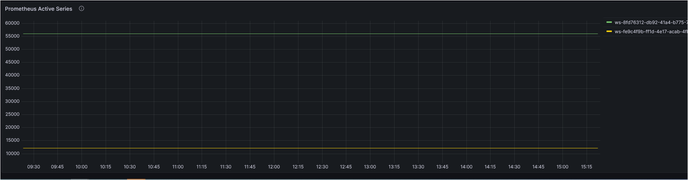

# リアルタイムコストモニタリング

Amazon Managed Service for Prometheus は、サーバーレスの Prometheus 互換のコンテナメトリックモニタリングサービスで、大規模なコンテナ環境をより安全にモニタリングするのに役立ちます。Amazon Managed Service for Prometheus の課金モデルは、取り込まれたメトリックサンプル、処理されたクエリサンプル、保存されたメトリクスに基づいています。最新の料金詳細は[こちら][pricing] をご覧ください。

マネージドサービスとして、Amazon Managed Service for Prometheus は、ワークロードのスケールアップとスケールダウンに合わせて、運用メトリクスの取り込み、保存、クエリを自動的に拡張します。お客様の中には、`メトリックサンプルの取り込みレート` とそのコストをリアルタイムで追跡する方法を求める方がいらっしゃいます。ここで、その実現方法を探っていきましょう。

### ソリューション
Amazon Managed Service for Prometheus は、[販売メトリクス][vendedmetrics]を Amazon CloudWatch に送信します。 これらのメトリクスを使用することで、Amazon Managed Service for Prometheus ワークスペースの可視性を高めるのに役立ちます。 販売メトリクスは、CloudWatch の `AWS/Usage` および `AWS/Prometheus` 名前空間で見つけることができ、これらの[メトリクス][AMPMetrics]は CloudWatch で追加料金なしで利用できます。 これらのメトリクスをさらに探索および可視化するために、CloudWatch ダッシュボードをいつでも作成できます。

今日は、Amazon Managed Grafana のデータソースとして Amazon CloudWatch を使用し、Grafana でダッシュボードを構築して、それらのメトリクスを可視化します。 アーキテクチャ図は、次のことを示しています。

- Amazon Managed Service for Prometheus が販売メトリクスを Amazon CloudWatch にパブリッシュ

- Amazon CloudWatch を Amazon Managed Grafana のデータソースとして使用  

- Amazon Managed Grafana で作成されたダッシュボードにユーザーがアクセス

### Amazon Managed Grafana ダッシュボード

Amazon Managed Grafana で作成されたダッシュボードを使用すると、以下の項目を視覚化できます。

1. ワークスペースごとの Prometheus インジェストレート

2. ワークスペースごとの Prometheus インジェストレートとリアルタイムコスト  
   リアルタイムコストの追跡には、公式の [AWS 料金表][pricing] に記載されている `First 2 billion samples` の `Metrics Ingested Tier` の料金を基にした `数式` を使用します。
   数式演算は数値と時系列を入力として受け取り、異なる数値や時系列に変換します。ビジネス要件に合わせたカスタマイズの詳細は、[このドキュメント][mathexpression]を参照してください。

3. ワークスペースごとの Prometheus アクティブシリーズ  

Grafana のダッシュボードは JSON オブジェクトで表され、ダッシュボードのメタデータが保存されます。ダッシュボードのメタデータには、ダッシュボードのプロパティ、パネルのメタデータ、テンプレート変数、パネルのクエリなどが含まれます。

上記のダッシュボードの **JSON テンプレート** は、<mark>[こちら](AmazonPrometheusMetrics.json)からアクセスできます。<mark>

このダッシュボードを使用することで、ワークスペースごとのインジェストレートを特定し、メトリクスインジェストレートに基づいてワークスペースごとのリアルタイムコストを監視できるようになります。 要件に合わせて他の Grafana [ダッシュボードパネル][panels] を使用して視覚化を構築できます。

[pricing]: https://aws.amazon.com/prometheus/pricing/
[AMPMetrics]: https://docs.aws.amazon.com/prometheus/latest/userguide/AMP-CW-usage-metrics.html 
[vendedmetrics]: https://aws.amazon.com/blogs/mt/introducing-vended-metrics-for-amazon-managed-service-for-prometheus/
[mathexpression]: https://grafana.com/docs/grafana/latest/panels-visualizations/query-transform-data/expression-queries/#math
[panels]: https://docs.aws.amazon.com/grafana/latest/userguide/Grafana-panels.html
</mark></mark>
