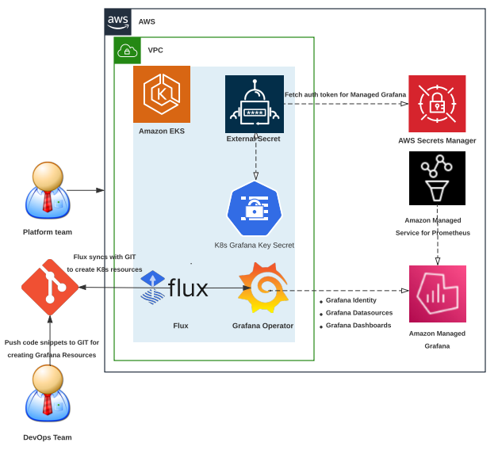

# Amazon Managed Grafana での GitOps と Grafana Operator の使用

## このガイドの使い方

このオブザーバビリティのベストプラクティスガイドは、Amazon Managed Grafana での Grafana リソースと Grafana ダッシュボードのライフサイクルを Kubernetes ネイティブな方法で作成および管理するために、Amazon EKS クラスター上の Kubernetes オペレータとして [grafana-operator](https://github.com/grafana-operator/grafana-operator#:~:text=The%20grafana%2Doperator%20is%20a,an%20easy%20and%20scalable%20way.) を使用したい開発者やアーキテクトを対象としています。

## はじめに

お客様は、オープンソースの分析およびモニタリングソリューションのためのオブザーバビリティプラットフォームとして Grafana を使用しています。Amazon EKS でワークロードを実行しているお客様が、ワークロード重力に焦点を当て、Cloud リソースなどの外部リソースのデプロイとライフサイクル管理を Kubernetes ネイティブのコントローラーに依存しようとしていることがわかります。 お客様が [AWS Controllers for Kubernetes (ACK)](https://aws-controllers-k8s.github.io/community/docs/community/overview/) をインストールして、AWS サービスを作成、デプロイ、管理していることがわかりました。 これらの日々、多くのお客様が Prometheus と Grafana の実装をマネージドサービスにオフロードすることを選択しています。AWS の場合、これらのサービスは、ワークロードのモニタリングに使用される [Amazon Managed Service for Prometheus](https://docs.aws.amazon.com/prometheus/?icmpid=docs_homepage_mgmtgov) と [Amazon Managed Grafana](https://docs.aws.amazon.com/grafana/?icmpid=docs_homepage_mgmtgov) です。

Grafana を使用する際にお客様が直面する一般的な課題の 1 つは、Kubernetes クラスタから Amazon Managed Grafana などの外部 Grafana インスタンスでの Grafana リソースと Grafana ダッシュボードの作成とライフサイクル管理です。 お客様は、Git ベースのワークフローを使用したシステム全体のインフラストラクチャとアプリケーションのデプロイメントを完全に自動化および管理する方法を見つけることに課題を感じています。これには、Amazon Managed Grafana での Grafana リソースの作成も含まれます。 このオブザーバビリティのベストプラクティスガイドでは、次のトピックに焦点を当てます。

* Grafana Operator の紹介 - Kubernetes クラスタから外部 Grafana インスタンスを管理するための Kubernetes Operator
* GitOps の紹介 - Git ベースのワークフローを使用してインフラストラクチャを作成および管理するための自動メカニズム
* Amazon EKS での Grafana Operator を使用した Amazon Managed Grafana の管理
* Amazon EKS での Flux を使用した GitOps による Amazon Managed Grafana の管理

## Grafana Operator の概要

[grafana-operator](https://github.com/grafana-operator/grafana-operator#:~:text=The%20grafana%2Doperator%20is%20a,an%20easy%20and%20scalable%20way.) は、Kubernetes 内の Grafana インスタンスを管理するのに役立つ Kubernetes Operator です。Grafana Operator を使用すると、ダッシュボード、データソースなどの Grafana リソースを、複数のインスタンス間で宣言的かつ容易でスケーラブルな方法で管理および作成できます。Grafana Operator は現在、Amazon Managed Grafana のような外部環境でホストされているダッシュボード、データソースなどのリソースの管理をサポートしています。これにより、[Flux](https://fluxcd.io/) などの CNCF プロジェクトを使用した GitOps メカニズムを利用して、Amazon EKS クラスタから Amazon Managed Grafana のリソースのライフサイクルを作成および管理できるようになります。

## GitOps の概要

### GitOps と Flux とは

GitOps は、デプロイ設定の真実の情報源として Git を利用するソフトウェア開発および運用の方法論です。これは、アプリケーションまたはインフラストラクチャの目的の状態を Git リポジトリに保持し、Git ベースのワークフローを使用して変更を管理およびデプロイすることを含みます。GitOps は、システム全体を Git リポジトリで宣言的に記述するアプリケーションおよびインフラストラクチャのデプロイを管理する方法です。これは、バージョン管理、イミュータブルなアーティファクト、自動化のベストプラクティスを活用して、複数の Kubernetes クラスタの状態を管理するための運用モデルです。

Flux は、Kubernetes 上のアプリケーションのデプロイを自動化する GitOps ツールです。これは、Git リポジトリの状態を継続的に監視し、クラスタに変更を適用することによって機能します。Flux は、GitHub、GitLab、Bitbucket などのさまざまな Git プロバイダと統合されています。リポジトリに変更が加えられると、Flux がそれらを自動的に検出し、クラスタをそれに応じて更新します。

### Flux を使用する利点

* **自動デプロイ**: Flux はデプロイプロセスを自動化し、手動のエラーを減らし、開発者が他のタスクに集中できるようにします。
* **Git ベースのワークフロー**: Flux は Git を真実の情報源として利用し、変更の追跡と巻き戻しを容易にします。
* **宣言的な構成**: Flux は目的のクラスタ状態を定義するために [Kubernetes](https://dzone.com/articles/kubernetes-full-stack-example-with-kong-ingress-co) マニフェストを使用し、管理と変更の追跡を容易にします。

### Flux の採用における課題

* **カスタマイズの制限**: Flux は限られたカスタマイズのみをサポートしており、すべてのユースケースに適しているわけではありません。
* **学習曲線の急峻さ**: Flux は新規ユーザーにとって学習曲線が急峻であり、Kubernetes と Git に対する深い理解が必要です。

## Amazon Managed Grafana のリソースを管理するために Amazon EKS で Grafana Operator を使用する

前のセクションで説明したように、Grafana Operator を使用すると、Kubernetes ネイティブの方法で Amazon Managed Grafana のリソースのライフサイクルを作成および管理するために Kubernetes クラスタを使用できます。 以下のアーキテクチャ図は、Grafana Operator を使用して AMG とのアイデンティティの設定、Amazon Managed Service for Prometheus のデータソースとしての追加、および Amazon EKS クラスタからのダッシュボードの Kubernetes ネイティブな方法での Amazon Managed Grafana への作成を示しています。

Amazon Managed Grafana を管理するために Kubernetes クラスタでオープンソースの Grafana Operator を使用する方法の詳細なデモンストレーションは、[Kubernetes クラスタでオープンソースの Grafana Operator を使用して Amazon Managed Grafana を管理する](https://aws.amazon.com/blogs/mt/using-open-source-grafana-operator-on-your-kubernetes-cluster-to-manage-amazon-managed-grafana/) の投稿を参照してください。

## Flux を使用した Amazon EKS での GitOps による Amazon Managed Grafana のリソース管理

上記で説明したように、Flux は Kubernetes 上のアプリケーションのデプロイを自動化します。 
Flux は GitHub などの Git リポジトリを継続的に監視し、リポジトリに変更が加えられると自動的に検出してクラスタを適切に更新します。 
以下のアーキテクチャ図は、Kubernetes クラスタから Grafana Operator を使用し、Flux を使用した GitOps メカニズムで、データソースとして Amazon Managed Service for Prometheus を追加し、Kubernetes ネイティブの方法で Amazon Managed Grafana 上にダッシュボードを作成する方法をデモンストレーションしています。

One Observability ワークショップのモジュール [GitOps with Amazon Managed Grafana](https://catalog.workshops.aws/observability/ja/aws-managed-oss/gitops-with-amg) を参照してください。このモジュールでは、EKS クラスター上に以下のような必要な「Day 2」運用ツールをセットアップします。

* [External Secrets Operator](https://github.com/external-secrets/external-secrets/tree/main/deploy/charts/external-secrets) は正常にインストールされ、AWS シークレットマネージャから Amazon Managed Grafana のシークレットを読み取ります
* [Prometheus Node Exporter](https://github.com/prometheus/node_exporter) はメモリ、ディスク、CPU 利用率などのさまざまなマシンリソースを測定します
* [Grafana Operator](https://github.com/grafana-operator/grafana-operator) は、Kubernetes ネイティブな方法で Kubernetes クラスタを使用して、Amazon Managed Grafana のリソースのライフサイクルを作成および管理します
* [Flux](https://fluxcd.io/) は、GitOps メカニズムを使用して Kubernetes 上のアプリケーションのデプロイを自動化します

## まとめ

オブザーバビリティのベストプラクティスガイドのこのセクションでは、Amazon Managed Grafana での Grafana Operator と GitOps の利用について学びました。GitOps と Grafana Operator の概要から始まり、Amazon EKS 上の Grafana Operator を使用して Amazon Managed Grafana のリソースを管理し、Amazon EKS クラスタ上の Flux を使用して GitOps で Amazon Managed Grafana のリソースを管理し、AMG で ID を設定し、Kubernetes ネイティブの方法で Amazon Managed Grafana に AWS データソースを追加する方法に焦点を当てました。
