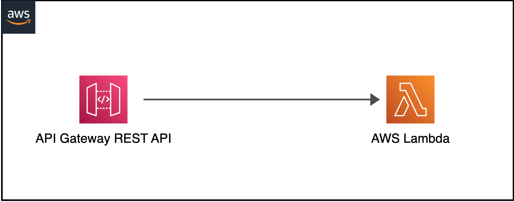

# Lambda ベースのサーバーレスアプリケーションのためのオブザーバビリティ

分散システムやサーバーレスコンピューティングの世界では、アプリケーションの信頼性とパフォーマンスを確保するためにオブザーバビリティを実現することが鍵となります。これは従来のモニタリングを超えたものです。Amazon CloudWatchやAWS X-RayなどのAWSのオブザーバビリティツールを活用することで、サーバーレスアプリケーションの洞察、トラブルシューティング、パフォーマンスの最適化が可能になります。このガイドでは、Lambdaベースのサーバーレスアプリケーションのオブザーバビリティを実装するための基本的な概念、ツール、ベストプラクティスを学びます。

インフラストラクチャやアプリケーションのオブザーバビリティを実装する前の最初のステップは、重要な目的を決定することです。それは、向上したユーザーエクスペリエンス、開発者生産性の向上、サービスレベル目標(SLO)の達成、ビジネス収益の増加、またはアプリケーションの種類に応じたその他の特定の目的である可能性があります。したがって、これらの重要な目的を明確に定義し、それらをどのように測定するかを確立する必要があります。そこから後退して、オブザーバビリティ戦略を設計してください。「[Monitor what matters](/observability-best-practices/ja/guides/#monitor-what-matters)」を参照して、詳細を学んでください。

## オブザーバビリティの柱

オブザーバビリティには、次の 3 つの主要な柱があります。

* ログ: アプリケーションやシステム内で発生した障害、エラー、状態変化などの個々のイベントをタイムスタンプとともに記録したもの
* メトリクス: さまざまな時間間隔で測定された数値データ(時系列データ)。SLI(リクエストレート、エラーレート、持続時間、CPU 使用率など)
* トレース: 複数のアプリケーションやシステム(通常はマイクロサービス)にまたがる、単一ユーザーの操作記録


AWS は、ネイティブとオープンソースの両方のツールを提供して、ログの記録、メトリクスのモニタリング、トレースの取得を容易にし、AWS Lambda アプリケーションの実行可能なインサイトを取得できるようにしています。

## **ログ**

このオブザーバビリティのベストプラクティスガイドのセクションでは、次のトピックを深掘りします。

* 構造化されていないログと構造化されたログ
* CloudWatch Logs Insights
* ログの相関 ID
* Lambda Powertools を使用したコードサンプル
* CloudWatch ダッシュボードを使用したログの視覚化
* CloudWatch Logs の保持期間


ログは、アプリケーション内で発生した個々のイベントです。これらには、障害、エラー、実行パスなどのイベントが含まれます。ログは、構造化されていない形式、半構造化形式、構造化形式で記録できます。

### **構造化されていないログと構造化されたログの違い**

開発者はしばしば、アプリケーション内で `print` や `console.log` ステートメントを使用したシンプルなログメッセージから始めます。これらはプログラムによる解析や大規模な分析が難しく、特に多数のロググループにまたがって多数のログメッセージを生成しうる AWS Lambda ベースのアプリケーションでは解析が困難です。その結果、これらのログを CloudWatch で統合することが困難になり、分析が難しくなります。ログ内の関連情報を見つけるには、テキストマッチや正規表現が必要になります。構造化されていないロギングの例は次のとおりです。

```
[2023-07-19T19:59:07Z]  INFO  Request started
[2023-07-19T19:59:07Z]  INFO  AccessDenied: Could not access resource
[2023-07-19T19:59:08Z]  INFO  Request finished
```

ご覧のとおり、ログメッセージに一貫した構造がないため、有用なインサイトを取得することが困難です。また、コンテキスト情報を追加することも難しくなります。

一方、構造化ロギングは、ログをデータとしてではなくテキストとして扱うことを可能にする JSON などの一貫したフォーマットで情報を記録する方法です。これにより、クエリやフィルタリングが簡単になります。開発者は、ログをプログラムで効率的に保存、取得、分析する機能を得ます。また、デバッグも容易になります。構造化ロギングは、ログレベルを介して、さまざまな環境間でのログの詳細度を変更するよりシンプルな方法を提供します。**ログレベルに注意を払ってください。** ログを多く取りすぎるとコストが増加し、アプリケーションのスループットが低下します。ログに記録する前に個人を特定できる情報を編集してください。構造化ロギングの例は次のとおりです。

```
{
   "correlationId": "9ac54d82-75e0-4f0d-ae3c-e84ca400b3bd",
   "requestId": "58d9c96e-ae9f-43db-a353-c48e7a70bfa8",
   "level": "INFO",
   "message": "AccessDenied",
   "function-name": "demo-observability-function",
   "cold-start": true
}
```


トランザクションに関する運用情報、異なるコンポーネント間の相関 ID、アプリケーションからのビジネスアウトカムを発行するために、**CloudWatch ログへの構造化された集中ログを推奨します。**

### **CloudWatch Logs Insights**
JSON 形式のログにあるフィールドを自動的に検出できる CloudWatch Logs Insights を使用します。
さらに、JSON ログはカスタムメタデータをログに記録して拡張でき、これを使用してログを検索、フィルタリング、集計できます。

### **ログの相関ID**

たとえば、API Gateway からの HTTP リクエストの場合、相関 ID は `requestContext.requestId` パスに設定されます。これは、Lambda Powertools を使用して簡単に抽出し、下流の Lambda 関数でログに記録できます。分散システムは、リクエストを処理するために複数のサービスとコンポーネントが協調して動作することがよくあります。したがって、相関 ID のログ記録と、それを下流システムに渡すことが、エンドツーエンドのトレースとデバッグに不可欠です。相関 ID とは、リクエストの最初に割り当てられる一意の識別子です。リクエストがさまざまなサービスを通過するにつれて、相関 ID がログに含まれるため、リクエストの経路全体をトレースできます。相関 ID を AWS Lambda ログに手動で挿入するか、[AWS Lambda Powertools](https://docs.powertools.aws.dev/lambda/python/latest/core/logger/#setting-a-correlation-id) のようなツールを使用して、API Gateway から相関 ID を取得し、アプリケーションログとともに簡単に記録できます。たとえば、HTTP リクエストの相関 ID は、API Gateway で開始され、Lambda 関数などのバックエンドサービスに渡されるリクエスト ID になります。

### **Lambda Powertools を使用したコードサンプル**

ベストプラクティスとして、リクエストライフサイクルのできるだけ早い段階で相関IDを生成することをおすすめします。サーバレスアプリケーションのエントリーポイント、たとえば API Gateway やアプリケーションロードバランサーなどで生成することが理想的です。UUIDやリクエストID、分散システム全体でリクエストを追跡できるその他のユニークな属性を使用してください。相関IDをカスタムヘッダー、本文、メタデータのいずれかの部分として、各リクエストとともに渡してください。相関IDがダウンストリームサービスのすべてのログエントリとトレースに含まれていることを確認してください。

相関IDをLambda関数のログの一部として手動でキャプチャして含めるか、[AWS Lambda Powertools](https://docs.powertools.aws.dev/lambda/python/latest/core/logger/#setting-a-correlation-id) などのツールを使用できます。Lambda Powertoolsを使用すると、サポートされているアップストリームサービスの事前定義されたリクエスト [パスマッピング](https://github.com/aws-powertools/powertools-lambda-python/blob/08a0a7b68d2844d36c33ab8156640f4ea9632d0c/aws_lambda_powertools/logging/correlation_paths.py) から簡単に相関IDを取得し、アプリケーションログとともに自動的に追加できます。また、障害が発生した場合に失敗の根本原因を特定し、元のリクエストに結び付けることができるよう、エラーメッセージにも相関IDが追加されていることを確認してください。

以下のサーバレスアーキテクチャに対して、相関IDを使用した構造化ログとCloudWatchでの表示方法をデモするコードサンプルを見ていきましょう。



```
// Initializing Logger
Logger log = LogManager.getLogger();

// Uses @Logger annotation from Lambda Powertools, which takes optional parameter correlationIdPath to extract correlation Id from the API Gateway header and inserts correlation_id to the Lambda function logs in a structured format.
@Logging(correlationIdPath = "/headers/path-to-correlation-id")
public APIGatewayProxyResponseEvent handleRequest(final APIGatewayProxyRequestEvent input, final Context context) {
  ...
  // The log statement below will also have additional correlation_id
  log.info("Success")
  ...
}
```

この例では、JavaベースのLambda関数がLambda Powertoolsライブラリを使用して、APIゲートウェイリクエストからの `correlation_id` をログに記録しています。

コードサンプルのCloudWatchログのサンプル:

```
{
   "level": "INFO",
   "message": "Success",
   "function-name": "demo-observability-function",
   "cold-start": true,
   "lambda_request_id": "52fdfc07-2182-154f-163f-5f0f9a621d72",
   "correlation_id": "<correlation_id_value>"
}_
```

</correlation_id_value>

### **CloudWatch ダッシュボードを使用したログの視覚化**

ログデータを構造化 JSON 形式で記録すると、[CloudWatch Logs Insights](https://docs.aws.amazon.com/AmazonCloudWatch/latest/logs/AnalyzingLogData.html) が自動的に JSON 出力内の値を検出し、メッセージをフィールドとして解析します。CloudWatch Logs Insights は、複数のログストリームを検索およびフィルタリングするための目的構築型の [SQL ライクなクエリ](https://serverlessland.com/snippets?type=CloudWatch+Logs+Insights) 言語を提供します。glob および正規表現パターンマッチングを使用して、複数のロググループに対してクエリを実行できます。さらに、カスタムクエリを記述して保存し、再実行するたびに再作成する必要がないようにすることもできます。


CloudWatch Logs Insights では、1 つ以上の集計関数を使用したクエリから、折れ線グラフ、棒グラフ、積み上げ面グラフなどの視覚化を生成できます。その後、これらの視覚化を簡単に CloudWatch ダッシュボードに追加できます。以下のサンプルダッシュボードは、Lambda 関数の実行時間のパーセンタイルレポートを示しています。このようなダッシュボードにより、アプリケーションのパフォーマンスを改善する必要がある部分をすばやく把握できます。平均待ち時間を見ることは有用ですが、**「平均待ち時間ではなく p99 を最適化することを目指すべきです」**。


ログを CloudWatch 以外の場所に送信するには、Lambda 拡張機能を使用した [Lambda Telemetry API](https://docs.aws.amazon.com/lambda/latest/dg/telemetry-api.html) を使用できます。 いくつかの[パートナーソリューション](https://docs.aws.amazon.com/lambda/latest/dg/extensions-api-partners.html) は、Lambda Telemetry API を使用する Lambda レイヤーを提供し、システムとの統合を容易にしています。

CloudWatch Logs Insights を最大限に活用するには、構造化ロギングの形式でログにインジェストする必要があるデータについて考えることが大切です。これにより、アプリケーションの正常性をより適切に監視できます。

### **CloudWatch Logs の保持期間**

デフォルトでは、Lambda 関数内の stdout に書き込まれたすべてのメッセージが Amazon CloudWatch のログストリームに保存されます。Lambda 関数の実行ロールには、CloudWatch ログストリームの作成と、ストリームへのログイベントの書き込みの許可が必要です。CloudWatch は取り込まれたデータ量と使用されたストレージによって課金されることに注意することが重要です。したがって、ログ量を減らすことで、関連コストを最小限に抑えるのに役立ちます。**`デフォルトでは、CloudWatch ログは無期限に保持され、期限切れになりません。ログストレージコストを削減するために、ログの保持ポリシーを設定することをお勧めします`**、そしてそれをすべてのロググループに適用します。環境ごとに異なる保持ポリシーが必要な場合もあるでしょう。ログの保持は AWS コンソールで手動で設定できますが、一貫性とベストプラクティスを確保するために、Infrastructure as Code (IaC) のデプロイの一部として設定する必要があります。以下は、Lambda 関数のログ保持を設定する方法を示すサンプルの CloudFormation テンプレートです:

```
Resources:
  Function:
    Type: AWS::Serverless::Function
    Properties:
      CodeUri: .
      Runtime: python3.8
      Handler: main.handler
      Tracing: Active

  # Explicit log group that refers to the Lambda function
  LogGroup:
    Type: AWS::Logs::LogGroup
    Properties:
      LogGroupName: !Sub "/aws/lambda/${Function}"
      # Explicit retention time
      RetentionInDays: 7
```

この例では、Lambda 関数と対応するロググループを作成しました。**`RetentionInDays`** プロパティは **7 日に設定されて**おり、このロググループのログは 7 日間保持され、その後自動的に削除されることを意味します。これにより、ログストレージコストを制御できます。

## **メトリクス**

このオブザーバビリティのベストプラクティスガイドのセクションでは、次のトピックを深掘りします:

* ボックスから出荷されるメトリクスのモニタリングとアラート
* カスタムメトリクスの公開
* 埋め込みメトリクスを使用してログからメトリクスを自動生成する
* システムレベルのメトリクスをモニタリングするために CloudWatch Lambda Insights を使用する
* CloudWatch アラームの作成

### **標準で提供されるメトリクスの監視とアラートの設定**

メトリクスとは、さまざまな時間間隔(時系列データ)で測定された数値データやサービスレベルインジケーター(リクエストレート、エラーレート、持続時間、CPU など)のことです。AWS サービスは、アプリケーションの運用状態を監視するのに役立つ、多数の標準のメトリクスを提供しています。アプリケーションに適用可能な主要メトリクスを確立し、それらを使用してアプリケーションのパフォーマンスを監視してください。主要メトリクスの例として、関数のエラー、キューの深さ、状態マシンの失敗した実行、API の応答時間などがあります。

標準で提供されるメトリクスの課題の 1 つは、CloudWatch ダッシュボードでそれらを分析する方法が分からないことです。たとえば、同時実行数を見る場合、最大値、平均値、パーセンタイルのどれを見ればよいのでしょうか。また、監視するための適切な統計情報は、メトリクスごとに異なります。

ベストプラクティスとして、Lambda 関数の `ConcurrentExecutions` メトリクスでは、アカウントとリージョンの制限に近づいているか、該当する場合は Lambda の予約済み同時実行数の制限に近づいているかを確認するために、`Count` 統計を見てください。関数がイベントを処理するのにかかる時間を示す `Duration` メトリクスの場合は、`Average` または `Max` の統計を見てください。API のレイテンシを測定する場合は、API Gateway の `Latency` メトリクスの `Percentile` 統計を見てください。P50、P90、P99 は、平均値によるレイテンシの監視よりもるかに優れた方法です。

監視するメトリクスが分かったら、これらの主要メトリクスにアラートを設定し、アプリケーションのコンポーネントが不健全なときに通知を受け取れるようにしてください。例として、

* AWS Lambda の場合、Duration、Errors、Throttling、ConcurrentExecutions にアラートを設定します。ストリームベースの呼び出しの場合は IteratorAge に、非同期呼び出しの場合は DeadLetterErrors にアラートを設定します。
* Amazon API Gateway の場合、IntegrationLatency、Latency、5XXError、4XXError にアラートを設定します。
* Amazon SQS の場合、ApproximateAgeOfOldestMessage、ApproximateNumberOfMessageVisible にアラートを設定します。 
* AWS Step Functions の場合、ExecutionThrottled、ExecutionsFailed、ExecutionsTimedOut にアラートを設定します。

### **カスタムメトリクスの公開**

アプリケーションのビジネスおよび顧客の成果に基づいて、重要業績評価指標(KPI)を特定します。KPI を評価して、アプリケーションの成功と運用上の健全性を判断します。重要なメトリクスは、アプリケーションの種類によって異なりますが、訪問サイト、注文数、購入フライト、ページロード時間、ユニーク訪問者などが例として挙げられます。

AWS CloudWatch にカスタムメトリクスを公開する 1 つの方法は、CloudWatch メトリクス SDK の `putMetricData` API を呼び出すことです。ただし、`putMetricData` API 呼び出しは同期的です。これにより、Lambda 関数の実行時間が長くなり、アプリケーション内の他の API 呼び出しを潜在的にブロックし、パフォーマンスのボトルネックにつながる可能性があります。また、Lambda 関数の実行時間が長くなるほどコストが高くなります。さらに、CloudWatch に送信されるカスタムメトリクスの数と、行われる API 呼び出し(つまり PutMetricData API 呼び出し)の数の両方に対して課金されます。

**カスタムメトリクスを公開するためのもっと効率的でコスト効果の高い方法は、** [CloudWatch Embedded Metrics Format](https://docs.aws.amazon.com/AmazonCloudWatch/latest/monitoring/CloudWatch_Embedded_Metric_Format.html) (EMF) を使用することです。CloudWatch Embedded Metrics 形式を使用すると、**`非同期的に`** CloudWatch ログに書き込まれたログとしてカスタムメトリクスを生成できるため、アプリケーションのパフォーマンスが向上し、コストを下げることができます。EMF を使用すると、詳細なログイベントデータとともにカスタムメトリクスを埋め込むことができます。CloudWatch はこれらのカスタムメトリクスを自動的に抽出するため、プリセットのメトリクスと同様に可視化やアラームの設定ができます。埋め込みメトリクス形式でログを送信すると、[CloudWatch Logs Insights](https://docs.aws.amazon.com/AmazonCloudWatch/latest/logs/AnalyzingLogData.html) を使用してクエリでき、メトリクスのコストではなくクエリのコストのみが発生します。

これを実現するには、[EMF 仕様](https://docs.aws.amazon.com/AmazonCloudWatch/latest/monitoring/CloudWatch_Embedded_Metric_Format_Specification.html)を使用してログを生成し、`PutLogEvents` API を使用して CloudWatch に送信します。プロセスを簡素化するために、**EMF 形式のメトリクスの作成をサポートする 2 つのクライアントライブラリが**あります。

* ローレベルのクライアントライブラリ ([aws-embedded-metrics](https://docs.aws.amazon.com/AmazonCloudWatch/latest/monitoring/CloudWatch_Embedded_Metric_Format_Libraries.html))  
* Lambda Powertools [Metrics](https://docs.powertools.aws.dev/lambda/java/core/metrics/)

### **[CloudWatch Lambda Insights](https://docs.aws.amazon.com/AmazonCloudWatch/latest/monitoring/Lambda-Insights.html) を使用してシステムレベルのメトリクスをモニタリングする**

CloudWatch Lambda Insights は、CPU 時間、メモリ使用量、ディスク利用率、ネットワークパフォーマンスなどのシステムレベルのメトリクスを提供します。Lambda Insights は、**`コールドスタート`** や Lambda ワーカーのシャットダウンなどの診断情報も収集、集約、要約します。Lambda Insights は、Lambda レイヤーとしてパッケージ化された CloudWatch Lambda 拡張機能を利用しています。有効にすると、システムレベルのメトリクスを収集し、その Lambda 関数の呼び出しごとに埋め込みメトリクス形式の単一のパフォーマンスログイベントを CloudWatch Logs に発行します。

!!! note
    CloudWatch Lambda Insights はデフォルトでは有効化されておらず、Lambda 関数ごとに有効化する必要があります。
    AWS コンソールまたは Infrastructure as Code (IaC) を介して有効化できます。以下は、AWS サーバーレスアプリケーションモデル (SAM) を使用して有効化する例です。Lambda 関数に `LambdaInsightsExtension` 拡張レイヤーを追加し、ログストリームの作成と `PutLogEvents` API の呼び出しを許可してログを書き込めるようにする IAM マネージドポリシー `CloudWatchLambdaInsightsExecutionRolePolicy` も追加します。

```
// Add LambdaInsightsExtension Layer to your function resource
Resources:
  MyFunction:
    Type: AWS::Serverless::Function
    Properties:
      Layers:
        - !Sub "arn:aws:lambda:${AWS::Region}:580247275435:layer:LambdaInsightsExtension:14"
        
// Add IAM policy to enable Lambda function to write logs to CloudWatch
Resources:
  MyFunction:
    Type: AWS::Serverless::Function
    Properties:
      Policies:
        - `CloudWatchLambdaInsightsExecutionRolePolicy`
```

その後、CloudWatch コンソールを使用して、Lambda Insights の下にあるこれらのシステムレベルのパフォーマンスメトリクスを表示できます。


### **CloudWatch アラームの作成**
メトリクスが異常値を示したときに CloudWatch アラームを作成し、必要なアクションを実行することは、オブザーバビリティにとって極めて重要です。Amazon [CloudWatch アラーム](https://docs.aws.amazon.com/ja_jp/AmazonCloudWatch/latest/monitoring/AlarmThatSendsEmail.html) は、アプリケーションとインフラストラクチャのメトリクスが静的または動的に設定されたしきい値を超えたときに、アラートを送信したり、修復アクションを自動化するために使用されます。

メトリクスのアラームを設定するには、一連のアクションをトリガーするしきい値を選択します。固定のしきい値は、静的しきい値と呼ばれます。たとえば、Lambda 関数の `Throttles` メトリクスに対して、5 分間の期間内で 10% を超えた場合にアラームがアクティブになるよう設定できます。これは、Lambda 関数がアカウントとリージョンの最大同時実行数に達した可能性を示しています。

サーバレスアプリケーションでは、SNS(Simple Notification Service)を使用してアラートを送信するのが一般的です。これにより、ユーザーはメール、SMS、その他のチャネルを介してアラートを受信できます。さらに、Lambda 関数を SNS トピックにサブスクライブすることで、アラームが発生した原因となった問題を自動的に修正できます。

たとえば、SQS キューをポーリングして下流のサービスを呼び出す Lambda 関数 A があるとします。下流のサービスがダウンしていて応答がない場合、Lambda 関数は SQS からのポーリングを続け、下流のサービスを呼び出し続けて失敗します。これらのエラーを監視し、SNS を使用して適切なチームに通知する CloudWatch アラームを生成できますが、SNS サブスクリプションを介して別の Lambda 関数 B も呼び出すことができます。これにより、下流のサービスが再起動するまで、Lambda 関数 A の SQS キューからのポーリングを停止できます。

個々のメトリクスに対してアラームを設定することは良いことですが、アプリケーションの運用状況とパフォーマンスをよりよく理解するには、複数のメトリクスを監視する必要がある場合があります。そのようなシナリオでは、 [メトリクス数式](https://docs.aws.amazon.com/ja_jp/AmazonCloudWatch/latest/monitoring/using-metric-math.html) を使用して、複数のメトリクスに基づいてアラームを設定する必要があります。

たとえば、少数のエラーを許容する範囲内で AWS Lambda のエラーを監視したい場合は、パーセンテージの形式のエラーレート式を作成できます。つまり、ErrorRate = errors / invocation * 100 という式で、設定された評価期間内で ErrorRate が 20% を超えた場合にアラートを送信するアラームを作成します。

## **トレーシング**

このオブザーバビリティのベストプラクティスガイドのセクションでは、次のトピックを深掘りします。

* 分散トレーシングと AWS X-Ray の概要
* 適切なサンプリングルールの適用
* X-Ray SDK を使用した他のサービスとの対話のトレース
* X-Ray SDK を使用した統合サービスのトレーシングのコードサンプル

### 分散トレーシングと AWS X-Ray の概要

ほとんどのサーバーレスアプリケーションは、複数の AWS サービスを使用する複数のマイクロサービスで構成されています。 サーバーレスアーキテクチャの性質上、分散トレーシングが不可欠です。 効果的なパフォーマンスモニタリングとエラートラッキングのために、ソース呼び出し元からすべての下流のサービスを通して、アプリケーションフロー全体でトランザクションをトレースすることが重要です。 個々のサービスのログを使用してこれを実現することは可能ですが、AWS X-Ray のようなトレーシングツールを使用する方がより高速で効率的です。 詳細については、[AWS X-Ray を使用したアプリケーションの計装](https://docs.aws.amazon.com/xray/latest/devguide/xray-instrumenting-your-app.html) を参照してください。

AWS X-Ray を使用すると、関連するマイクロサービスを通過するにつれてリクエストをトレースできます。 X-Ray サービスマップを使用すると、さまざまな統合ポイントを理解し、アプリケーションのパフォーマンス低下を特定できます。 アプリケーションのどのコンポーネントがエラー、スロットリング、レイテンシの問題を引き起こしているかを、わずか数クリックですぐに隔離できます。 サービスグラフの下で、各マイクロサービスにかかる正確な期間を特定する個々のトレースも表示できます。


**`ベストプラクティスとして、ダウンストリーム呼び出しや監視が必要な特定の機能のためにコード内にカスタムサブセグメントを作成します`**。 たとえば、外部 HTTP API への呼び出しや SQL データベースクエリの監視のためのサブセグメントを作成できます。

たとえば、ダウンストリームサービスを呼び出す関数のカスタムサブセグメントを作成するには、`captureAsyncFunc` 関数(Node.js の場合)を使用します。

```
var AWSXRay = require('aws-xray-sdk');

app.use(AWSXRay.express.openSegment('MyApp'));

app.get('/', function (req, res) {
  var host = 'api.example.com';

  // start of the subsegment
  AWSXRay.captureAsyncFunc('send', function(subsegment) {
    sendRequest(host, function() {
      console.log('rendering!');
      res.render('index');

      // end of the subsegment
      subsegment.close();
    });
  });
});
```

この例では、アプリケーションは `sendRequest` 関数への呼び出し用に `send` という名前のカスタムサブセグメントを作成します。 `captureAsyncFunc` は非同期呼び出しが完了したコールバック関数内で閉じる必要があるサブセグメントを渡します。

### **適切なサンプリングルールを適用する**

デフォルトでは、AWS X-Ray SDK はすべてのリクエストをトレースするわけではありません。保守的なサンプリングルールを適用して、高コストを発生させることなく、リクエストの代表的なサンプルを提供します。ただし、デフォルトのサンプリングルールを[カスタマイズ](https://docs.aws.amazon.com/xray/latest/devguide/xray-console-sampling.html#xray-console-config)したり、サンプリングを完全に無効にして、特定の要件に基づいてすべてのリクエストのトレースを開始することができます。

AWS X-Ray は監査やコンプライアンスのツールとして使用することを意図していないことに注意することが重要です。**`アプリケーションのタイプごとに異なるサンプリングレートを考慮する必要があります`**。たとえば、バックグラウンドのポーリングやヘルスチェックなどの高ボリュームの読み取り専用の呼び出しは、潜在的な問題を特定するのに十分なデータを提供しながら、より低いレートでサンプリングできます。**`環境ごとに異なるサンプリングレートを設定することもできます`**。たとえば、開発環境では、エラーやパフォーマンスの問題を簡単にトラブルシューティングするために、すべてのリクエストをトレースしたい場合があります。一方、本番環境では、トレース数を少なくすることができます。**`広範囲なトレーシングはコストの増加につながる可能性があることにも留意する必要があります`**。サンプリングルールの詳細については、[_Configuring sampling rules in the X-Ray console_](https://docs.aws.amazon.com/xray/latest/devguide/xray-console-sampling.html) を参照してください。

### **X-Ray SDK を使用して他の AWS サービスとの対話をトレースする**

X-Ray トレーシングは、AWS Lambda や Amazon API Gateway などのサービスでは、クリック数回または IaC ツール上のコード数行で簡単に有効にできますが、他のサービスではコードにインスツルメンテーションを追加する必要があります。[X-Ray と統合されている AWS サービスの完全なリストはこちら](https://docs.aws.amazon.com/xray/latest/devguide/xray-services.html) をご覧ください。

DynamoDB など、X-Ray と統合されていないサービスへの呼び出しについてトレースをキャプチャするには、AWS SDK 呼び出しを AWS X-Ray SDK でラップすることで実現できます。たとえば、node.js を使用している場合は、以下のコード例に従って、すべての AWS SDK 呼び出しをキャプチャできます。

### **X-Ray SDK を使用した統合サービスのトレースのためのコードサンプル**

```
//... FROM (old code)
const AWS = require('aws-sdk');

//... TO (new code)
const AWSXRay = require('aws-xray-sdk-core');
const AWS = AWSXRay.captureAWS(require('aws-sdk'));
...
```

!!! note
    個々のクライアントを計装するには、AWS SDK クライアントを `AWSXRay.captureAWSClient` の呼び出しでラップします。`captureAWS` と `captureAWSClient` の両方を使用しないでください。これにより重複したトレースが発生します。

## **その他のリソース**

[CloudWatch Logs Insights](https://docs.aws.amazon.com/AmazonCloudWatch/latest/logs/AnalyzingLogData.html)

[CloudWatch Lambda Insights](https://docs.aws.amazon.com/AmazonCloudWatch/latest/monitoring/Lambda-Insights.html)

[Embedded Metrics Library](https://github.com/awslabs/aws-embedded-metrics-java)

## 要約

この AWS Lambda ベースのサーバーレスアプリケーションのためのオブザーバビリティのベストプラクティスガイドでは、Amazon CloudWatch や AWS X-Ray などのネイティブ AWS サービスを使用したログ、メトリクス、トレースなどの重要な側面について強調しました。AWS Lambda Powertools ライブラリを使用して、アプリケーションに簡単にオブザーバビリティのベストプラクティスを追加することをおすすめします。これらのベストプラクティスを採用することで、サーバーレスアプリケーションの貴重な洞察を解き明かし、エラー検出とパフォーマンス最適化をより迅速に行うことができます。

さらに深い潜水のために、AWS の [One Observability Workshop](https://catalog.workshops.aws/observability/ja-JP) の AWS ネイティブオブザーバビリティ モジュールを実践することを強くおすすめします。
