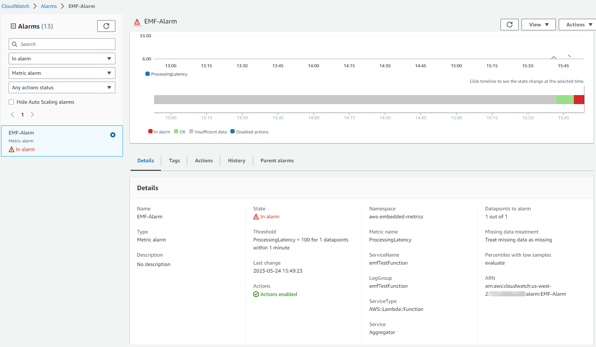

# CloudWatch Embedded Metric Format

## はじめに

CloudWatch Embedded Metric Format(EMF) を使用すると、ログの形式で複雑な高基数のアプリケーションデータを Amazon CloudWatch にインジェストし、実行可能なメトリクスを生成できます。Embedded Metric Format を使用すると、複雑なアーキテクチャに依存したり、サードパーティのツールを使用したりすることなく、環境の洞察を得ることができます。この機能はすべての環境で使用できますが、AWS Lambda 関数や Amazon Elastic Container Service(Amazon ECS)、Amazon Elastic Kubernetes Service(Amazon EKS)、Kubernetes on EC2 のコンテナなどの短期的なリソースを使用するワークロードで特に役立ちます。Embedded Metric Format を使用すると、インスツルメンテーションや個別のコードのメンテナンスを行うことなく、カスタムメトリクスを簡単に作成でき、ログデータから強力な分析機能を得ることができます。

## 埋め込みメトリックフォーマット(EMF)ログの仕組み

Amazon EC2、オンプレミスのサーバー、Amazon Elastic Container Service(Amazon ECS)のコンテナ、Amazon Elastic Kubernetes Service(Amazon EKS)、EC2 上の Kubernetes などのコンピュート環境は、CloudWatch エージェントを通じて埋め込みメトリックフォーマット(EMF)ログを生成し、Amazon CloudWatch に送信できます。

AWS Lambda では、カスタムコードの記述やブロッキングネットワーク呼び出し、サードパーティソフトウェアに依存することなく、簡単にカスタムメトリクスを生成できるため、構造化ログの公開時に特別なヘッダー宣言を提供する必要がなく、[EMF 仕様](https://docs.aws.amazon.com/ja_jp/AmazonCloudWatch/latest/monitoring/CloudWatch_Embedded_Metric_Format_Specification.html)に合わせて非同期的に詳細なログイベントデータとともにカスタムメトリクスを埋め込むことができます。CloudWatch は自動的にカスタムメトリクスを抽出するので、ユーザーはメトリクスの可視化やリアルタイムのインシデント検知のためのアラームを設定できます。抽出されたメトリクスに関連付けられている詳細なログイベントと高基数コンテキストは、CloudWatch Logs Insights を使用してクエリできるため、運用イベントの根本原因について深い洞察を得ることができます。 

Fluent Bit 向け [Amazon CloudWatch 出力プラグイン](https://docs.fluentbit.io/manual/pipeline/outputs/cloudwatch) を使用すると、[埋め込みメトリックフォーマット(EMF)](https://github.com/aws/aws-for-fluent-bit) に対応したメトリクスとログデータを Amazon CloudWatch サービスにインジェストできます。


## Embedded Metric Format(EMF)ログの使用時期

従来、モニタリングは3つのカテゴリに分類されていました。1つ目は、アプリケーションのクラシックなヘルスチェックです。2つ目は「メトリクス」で、カウンター、タイマー、ゲージなどのモデルを使用してアプリケーションに計装するものです。3つ目は、アプリケーションの全体的な可観測性に不可欠な「ログ」です。 ログにより、お客様はアプリケーションの動作について連続的な情報を得ることができます。 現在、お客様はデータの粒度や豊富さを犠牲にすることなく、アプリケーションの観測可能性を大幅に改善する方法があります。それは、すべての計装を統一および簡素化しながら、Embedded Metric Format(EMF)ログを通じて信じられない分析機能を得ることです。

[Embedded Metric Format(EMF)ログ](https://aws.amazon.com/blogs/mt/enhancing-workload-observability-using-amazon-cloudwatch-embedded-metric-format/)は、EMFログの一部として存在できる高基数アプリケーションデータを生成する環境に理想的です。これにより、メトリックの次元を増やさずに済みます。 これにより、お客様はCloudWatch Logs InsightsとCloudWatch Metrics Insightsを使用してEMFログをクエリすることで、すべての属性をメトリック次元として設定する必要なく、アプリケーションデータをスライスおよびダイスできます。

[数百万のTelcoまたはIoTデバイスからのテレメトリデータを集計](https://aws.amazon.com/blogs/mt/how-bt-uses-amazon-cloudwatch-to-monitor-millions-of-devices/)するお客様は、デバイスのパフォーマンスとデバイスが報告する一意のテレメトリに迅速に深掘りする機能の洞察が必要です。 また、膨大なデータを掘り下げることなく、問題をより簡単かつ迅速にトラブルシューティングする必要があります。 Embedded Metric Format(EMF)ログを使用することで、メトリクスとログを1つのエンティティに組み合わせることで大規模な可観測性を実現し、コスト効率とパフォーマンスの向上によりトラブルシューティングを改善できます。

## 埋め込みメトリックフォーマット(EMF)ログの生成

以下の方法で埋め込みメトリックフォーマットログを生成できます。

1. オープンソースのクライアントライブラリを使用して、エージェント([CloudWatch](https://docs.aws.amazon.com/AmazonCloudWatch/latest/monitoring/CloudWatch_Embedded_Metric_Format_Generation_CloudWatch_Agent.html) や Fluent-Bit、Firelensなど)を介してEMFログを生成および送信します。

   - EMFログを作成するために使用できる以下の言語でオープンソースのクライアントライブラリが利用可能です。
     - [Node.Js](https://github.com/awslabs/aws-embedded-metrics-node)
     - [Python](https://github.com/awslabs/aws-embedded-metrics-python)
     - [Java](https://github.com/awslabs/aws-embedded-metrics-java)
     - [C#](https://github.com/awslabs/aws-embedded-metrics-dotnet)
   - EMFログは、AWS Distro for OpenTelemetry (ADOT) を使用して生成できます。ADOT は、Cloud Native Computing Foundation (CNCF) の一部である OpenTelemetry プロジェクトの、セキュアで実稼働準備ができており、AWS がサポートするディストリビューションです。OpenTelemetry は、アプリケーションモニタリングのための分散トレース、ログ、メトリクスを収集する API、ライブラリ、エージェントを提供し、ベンダー固有のフォーマット間の境界と制限を取り除くオープンソースイニシアチブです。これには、OpenTelemetry 準拠のデータソースと、[CloudWatch EMF](https://aws-otel.github.io/docs/getting-started/cloudwatch-metrics#cloudwatch-emf-exporter-awsemf) ログで使用するために有効化された [ADOT Collector](https://github.com/open-telemetry/opentelemetry-collector-contrib/tree/main/exporter/awsemfexporter) の 2 つのコンポーネントが必要です。

2. [JSON 形式で定義された仕様](https://docs.aws.amazon.com/AmazonCloudWatch/latest/monitoring/CloudWatch_Embedded_Metric_Format_Specification.html)に準拠する手動で構築されたログを、[CloudWatch エージェント](https://docs.aws.amazon.com/AmazonCloudWatch/latest/monitoring/CloudWatch_Embedded_Metric_Format_Generation_CloudWatch_Agent.html) または [PutLogEvents API](https://docs.aws.amazon.com/AmazonCloudWatch/latest/monitoring/CloudWatch_Embedded_Metric_Format_Generation_PutLogEvents.html) を介して CloudWatch に送信できます。

## CloudWatch コンソールで Embedded Metric Format ログを表示する

メトリクスを抽出する Embedded Metric Format(EMF)ログを生成した後、お客様は [CloudWatch コンソールのメトリクス下](https://docs.aws.amazon.com/AmazonCloudWatch/latest/monitoring/CloudWatch_Embedded_Metric_Format_View.html) でそれらを表示できます。埋め込みメトリクスには、ログ生成時に指定されたディメンションがあります。クライアントライブラリを使用して生成された埋め込みメトリクスには、ServiceType、ServiceName、LogGroup がデフォルトのディメンションとしてあります。

- **ServiceName**: サービス名は上書きされますが、名前を推測できないサービス(EC2 で実行されている Java プロセスなど)の場合、明示的に設定されていない限り、Unknown のデフォルト値が使用されます。

- **ServiceType**: サービスタイプは上書きされますが、タイプを推測できないサービス(EC2で実行されているJavaプロセスなど)の場合、明示的に設定されていない限り、Unknownのデフォルト値が使用されます。

- **LogGroupName**: エージェントベースのプラットフォームの場合、お客様はオプションで、メトリクスを配信する宛先のロググループを構成できます。この値は、Embedded Metric ペイロード内のエージェントにライブラリから渡されます。LogGroupが指定されていない場合、デフォルト値はサービス名から導出されます: -metrics

- **LogStreamName**: エージェントベースのプラットフォームの場合、お客様はオプションで、メトリクスを配信する宛先のログストリームを構成できます。この値は、Embedded Metric ペイロード内のエージェントにライブラリから渡されます。LogStreamNameが指定されていない場合、デフォルト値はエージェントによって導出されます(これはおそらくホスト名になります)。

- **NameSpace**: CloudWatch 名前空間をオーバーライドします。設定されていない場合、デフォルト値の aws-embedded-metrics が使用されます。

CloudWatch コンソールのログ内のサンプル EMF ログは次のようになります。

```json
2023-05-19T15:20:39.391Z 238196b6-c8da-4341-a4b7-0c322e0ef5bb INFO
{
    "LogGroup": "emfTestFunction",
    "ServiceName": "emfTestFunction",
    "ServiceType": "AWS::Lambda::Function",
    "Service": "Aggregator",
    "AccountId": "XXXXXXXXXXXX",
    "RequestId": "422b1569-16f6-4a03-b8f0-fe3fd9b100f8",
    "DeviceId": "61270781-c6ac-46f1-baf7-22c808af8162",
    "Payload": {
        "sampleTime": 123456789,
        "temperature": 273,
        "pressure": 101.3
    },
    "executionEnvironment": "AWS_Lambda_nodejs18.x",
    "memorySize": "256",
    "functionVersion": "$LATEST",
    "logStreamId": "2023/05/19/[$LATEST]f3377848231140c185570caa9f97abc8",
    "_aws": {
        "Timestamp": 1684509639390,
        "CloudWatchMetrics": [
            {
                "Dimensions": [
                    [
                        "LogGroup",
                        "ServiceName",
                        "ServiceType",
                        "Service"
                    ]
                ],
                "Metrics": [
                    {
                        "Name": "ProcessingLatency",
                        "Unit": "Milliseconds"
                    }
                ],
                "Namespace": "aws-embedded-metrics"
            }
        ]
    },
    "ProcessingLatency": 100
}
```

同じ EMF ログについて、抽出されたメトリクスは以下のようになり、**CloudWatch メトリクス** でクエリできます。


お客様は、**CloudWatch Logs Insights** を使用して、抽出されたメトリクスに関連付けられている詳細なログイベントをクエリすることで、運用イベントの根本原因について深い洞察を得ることができます。EMF ログからメトリクスを抽出するメリットの 1 つは、お客様がログを一意のメトリクス(メトリクス名プラス一意のディメンションセット)とメトリクス値でフィルタリングできることです。これにより、集計されたメトリクス値に貢献したイベントのコンテキストが得られます。

上記で説明した同じ EMF ログについて、ProcessingLatency をメトリクス、Service をディメンションとするサンプルクエリを、影響を受けたリクエスト ID やデバイス ID を取得するための CloudWatch Logs Insights のサンプルクエリとして以下に示します。

```json
filter ProcessingLatency < 200 and Service = "Aggregator"
| fields @requestId, @ingestionTime, @DeviceId
```


## EMF ログで作成されたメトリクスのアラーム

[EMF で生成されたメトリクスのアラーム](https://docs.aws.amazon.com/ja_jp/AmazonCloudWatch/latest/monitoring/CloudWatch_Embedded_Metric_Format_Alarms.html) の作成は、他のメトリクスのアラーム作成と同じパターンに従います。ここで注意すべき重要な点は、EMF メトリクスの生成はログ公開フローに依存していることです。これは、CloudWatch Logs が EMF ログを処理し、メトリクスに変換するためです。したがって、アラームが評価される期間内にメトリックデータポイントが作成されるように、タイムリーにログを公開することが重要です。

上記の同じ EMF ログを使用して、ProcessingLatency メトリクスをデータポイントとし、しきい値を使用したアラームの例を以下に示します。



## EMF ログの最新機能

お客様は [PutLogEvents API](https://docs.aws.amazon.com/AmazonCloudWatch/latest/monitoring/CloudWatch_Embedded_Metric_Format_Generation_PutLogEvents.html) を使用して EMF ログを CloudWatch Logs に送信できます。オプションで HTTP ヘッダー `x-amzn-logs-format: json/emf` を含めることで、CloudWatch Logs にメトリクスを抽出する必要があることを指示できましたが、これはもう必要ありません。

Amazon CloudWatch は、Embedded Metric Format(EMF)を使用した構造化ログから、最大 1 秒の粒度で[高解像度メトリック抽出](https://aws.amazon.com/about-aws/whats-new/2023/02/amazon-cloudwatch-high-resolution-metric-extraction-structured-logs/)をサポートしています。 お客様は EMF 仕様ログ内にオプションの [StorageResolution](https://docs.aws.amazon.com/AmazonCloudWatch/latest/monitoring/cloudwatch_concepts.html#Resolution_definition) パラメータを指定し、値を 1 または 60(デフォルト) のいずれかに設定することで、メトリックの希望解像度(秒単位)を示すことができます。 お客様は EMF を介して標準解像度(60 秒)および高解像度(1 秒)の両方のメトリックを公開できるため、アプリケーションの正常性とパフォーマンスを詳細に可視化できます。

Amazon CloudWatch は、Embedded Metric Format(EMF) で 2 つのエラーメトリック ([EMFValidationErrors と EMFParsingErrors](https://docs.aws.amazon.com/AmazonCloudWatch/latest/logs/CloudWatch-Logs-Monitoring-CloudWatch-Metrics.html)) を使用して[エラーの可視性を強化](https://aws.amazon.com/about-aws/whats-new/2023/01/amazon-cloudwatch-enhanced-error-visibility-embedded-metric-format-emf/)しています。 この可視性の向上により、お客様は EMF を活用した際にエラーをすばやく特定および修正できるため、計装プロセスが簡素化されます。

近代的なアプリケーションの管理が複雑化するにつれ、お客様はカスタムメトリックの定義と分析についてより柔軟性が必要となっています。 そのため、メトリックディメンションの最大数が 10 から 30 に増加しました。 お客様は [最大 30 のディメンションを持つ EMF ログを使用して](https://aws.amazon.com/about-aws/whats-new/2022/08/amazon-cloudwatch-metrics-increases-throughput/) カスタムメトリックを作成できます。

## 参考資料

- NodeJS ライブラリを使用した AWS Lambda 関数での[Embedded Metric Format を用いたワークショップ](https://catalog.workshops.aws/observability/ja/aws-native/metrics/emf/clientlibrary)
- 非同期メトリクスを用いた[Embedded Metrics Format (EMF) を用いたサーバーレス可観測性ワークショップ](https://serverless-observability.workshop.aws/ja/030_cloudwatch/async_metrics_emf.html)
- PutLogEvents API を使用した[Java コードサンプル](https://catalog.workshops.aws/observability/ja/aws-native/metrics/emf/putlogevents) CloudWatch Logs へ EMF ログを送信
- ブログ記事: [Amazon CloudWatch 組み込みカスタムメトリクスを使用してコストを削減し、顧客に注力](https://aws.amazon.com/blogs/mt/lowering-costs-and-focusing-on-our-customers-with-amazon-cloudwatch-embedded-custom-metrics/)
