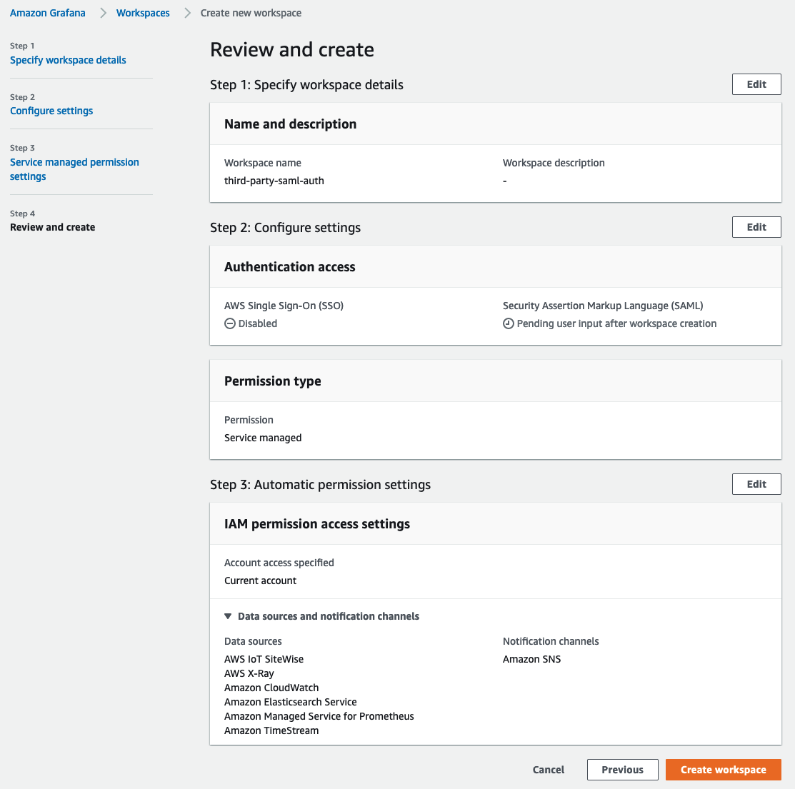

# SAML を使用した Amazon Managed Grafana での Google Workspace 認証の設定

このガイドでは、SAML v2.0 プロトコルを使用して、Google Workspace を Amazon Managed Grafana の ID プロバイダー (IdP) として設定する方法を説明します。

このガイドに従うには、[Amazon Managed Grafana ワークスペース][amg-ws] の作成に加えて、有料の [Google Workspace][google-workspaces] アカウントを作成する必要があります。

### Amazon Managed Grafana ワークスペースの作成

Amazon Managed Grafana コンソールにログインし、**Create workspace** をクリックします。次の画面で、以下のようにワークスペース名を指定します。その後 **Next** をクリックします:

**Configure settings** ページで、**Security Assertion Markup Language (SAML)** オプションを選択して、ユーザーがログインするための SAML ベースのアイデンティティプロバイダを設定できるようにします:

使用したいデータソースを選択し、**Next** をクリックします:

**Review and create** 画面の **Create workspace** ボタンをクリックします:

これにより、以下のように新しい Amazon Managed Grafana ワークスペースが作成されます:

### Google ワークスペースの設定

Google ワークスペースにスーパーアドミンのアクセス許可でログインし、**アプリ**セクションの**Web とモバイル アプリ**に移動します。そこで、**アプリの追加**をクリックし、**カスタム SAML アプリの追加**を選択します。次に示すように、アプリに名前を付けます。**続行** をクリックします。

次の画面で、**メタデータのダウンロード** ボタンをクリックして、SAML メタデータファイルをダウンロードします。**続行**をクリックします。

次の画面に、ACS URL、エンティティ ID、開始 URL フィールドが表示されます。
これらのフィールドの値は、Amazon Managed Grafana コンソールから取得できます。

**Name ID 形式**のドロップダウンから **EMAIL** を選択し、**Name ID** フィールドで **Basic Information > Primary email** を選択します。

**続行**をクリックします。

**属性マッピング** 画面で、以下のスクリーンショットに示すように、**Google ディレクトリ属性**と**アプリ属性**間のマッピングを行います。

Google 認証でログインするユーザーが **Amazon Managed Grafana** で **Admin** 権限を持つためには、**Department** フィールドの値を ***monitoring*** に設定します。これには任意のフィールドと値を選択できます。Google ワークスペース側で何を選択するかに関わらず、Amazon Managed Grafana の SAML 設定でそのマッピングを反映するようにしてください。

### Amazon Managed Grafana への SAML メタデータのアップロード

Amazon Managed Grafana コンソールで、**Upload or copy/paste** オプションをクリックし、前述の Google ワークスペースからダウンロードした SAML メタデータファイルを選択するために **Choose file** ボタンを選択します。

**Assertion mapping** セクションで、**Assertion attribute role** フィールドに **Department**、**Admin role values** フィールドに **monitoring** と入力します。
これにより、**Department** が **monitoring** としてログインしたユーザーは、Grafana で**管理者**権限を持ち、ダッシュボードやデータソースの作成などの管理者業務を実行できるようになります。

以下のスクリーンショットに示すように、**Additional settings - optional** セクションの値を設定します。**Save SAML configuration** をクリックします。

これで、Amazon Managed Grafana は Google ワークスペースを使用してユーザーを認証するように設定されました。

ユーザーがログインすると、次のように Google ログインページにリダイレクトされます。

資格情報を入力すると、以下のスクリーンショットのように Grafana にログインされます。

ご覧のとおり、ユーザーは Google ワークスペース認証を使用して Grafana に正常にログインできました。

[google-workspaces]: https://workspace.google.com/
[amg-ws]: https://docs.aws.amazon.com/grafana/latest/userguide/getting-started-with-AMG.html#AMG-getting-started-workspace
