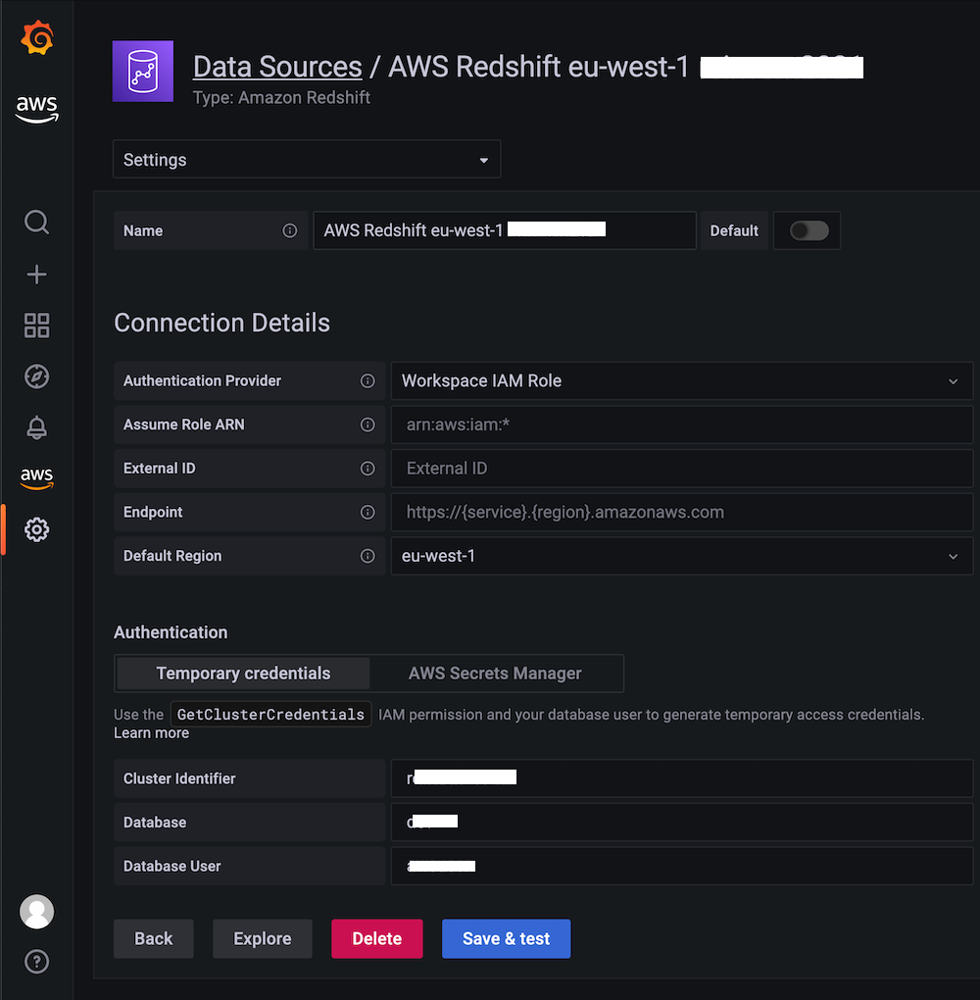

# Amazon Managed GrafanaでRedshiftを使用する

このレシピでは、[Amazon Managed Grafana][amg]で[Amazon Redshift][redshift] — 標準SQLを使用したペタバイトスケールのデータウェアハウスサービス — を使用する方法を示します。この統合は、[Grafana用Redshiftデータソース][redshift-ds]によって可能になります。これはオープンソースのプラグインで、DIY Grafanaインスタンスで使用できるだけでなく、Amazon Managed Grafanaにもプリインストールされています。 

!!! note
    このガイドの完了には約10分かかります。

## 前提条件

1. アカウントからAmazon Redshiftへの管理者アクセス権を持っていること
2. Amazon Redshiftクラスターに`GrafanaDataSource: true`タグを付ける
3. サービス管理ポリシーの恩恵を受けるために、以下のいずれかの方法でデータベース資格情報を作成する
    1. デフォルトのメカニズム、つまり一時資格情報オプションを使用してRedshiftデータベースに対して認証する場合は、`redshift_data_api_user`という名前のデータベースユーザーを作成する必要がある
    2. Secrets Managerの資格情報を使用する場合は、シークレットに`RedshiftQueryOwner: true`タグを付ける必要がある

!!! tip
    サービス管理ポリシーまたはカスタムポリシーの使用方法の詳細は、[Amazon Managed Grafanaドキュメントの例][svpolicies]を参照してください。

## インフラストラクチャ

Grafana インスタンスが必要なので、たとえば [Amazon Managed Grafana ワークスペース][amg-workspace] をセットアップするか、[Getting Started][amg-getting-started] ガイドを使用するか、既存のワークスペースを使用します。

!!! note
    AWS データソース構成を使用するには、最初に Amazon Managed Grafana コンソールに移動して、ワークスペースに Athena リソースを読み取るために必要な IAM ポリシーを付与するサービスマネージド IAM ロールを有効にします。

Athena データソースを設定するには、左側のツールバーを使用し、下の AWS アイコンを選択して「Redshift」を選択します。プラグインが Redshift データソースを検出して使用するデフォルトリージョンを選択し、使用したいアカウントを選択し、最後に「データソースの追加」を選択します。

あるいは、次の手順に従って Redshift データソースを手動で追加および構成できます。

1. 左側のツールバーの「設定」アイコンをクリックし、「データソースの追加」をクリックします。
2. 「Redshift」と入力します。  
3. [オプション] 認証プロバイダーを構成します(推奨: ワークスペース IAM ロール)。
4. 「クラスタ識別子」、「データベース」、「データベースユーザー」の値を入力します。  
5. 「保存してテスト」をクリックします。

次のような画面が表示されるはずです。

## 使い方

[Redshift Advance Monitoring][redshift-mon] の設定を使用します。
すべてがすぐに利用できる状態なので、この時点では他に設定する必要はありません。

Redshift プラグインに含まれている Redshift モニタリング ダッシュボードをインポートできます。
インポートすると、次のような画面が表示されます。

ここから、Amazon Managed Grafana で独自のダッシュボードを作成するために、次のガイドを使用できます。

* [ユーザーガイド: ダッシュボード](https://docs.aws.amazon.com/grafana/latest/userguide/dashboard-overview.html)
* [ダッシュボード作成のベストプラクティス](https://grafana.com/docs/grafana/latest/best-practices/best-practices-for-creating-dashboards/)

以上で完了です。Grafana から Redshift を使用する方法を学ぶことができました。おめでとうございます!

## クリーンアップ

使用していた Redshift データベースを削除し、コンソールから Amazon Managed Grafana ワークスペースを削除してください。

[redshift]: https://aws.amazon.com/redshift/
[amg]: https://aws.amazon.com/grafana/  
[svpolicies]: https://docs.aws.amazon.com/grafana/latest/userguide/security_iam_id-based-policy-examples.html
[redshift-ds]: https://grafana.com/grafana/plugins/grafana-redshift-datasource/
[aws-cli]: https://docs.aws.amazon.com/cli/latest/userguide/cli-chap-install.html
[aws-cli-conf]: https://docs.aws.amazon.com/cli/latest/userguide/cli-chap-configure.html
[amg-getting-started]: https://aws.amazon.com/blogs/mt/amazon-managed-grafana-getting-started/
[redshift-console]: https://console.aws.amazon.com/redshift/
[redshift-mon]: https://github.com/awslabs/amazon-redshift-monitoring
[amg-workspace]: https://console.aws.amazon.com/grafana/home#/workspaces
