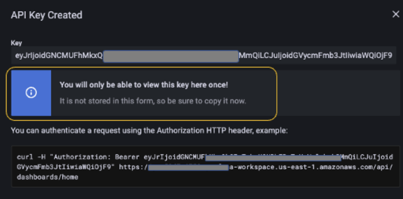
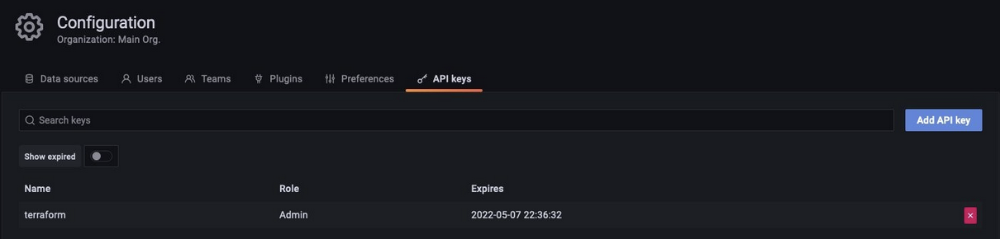
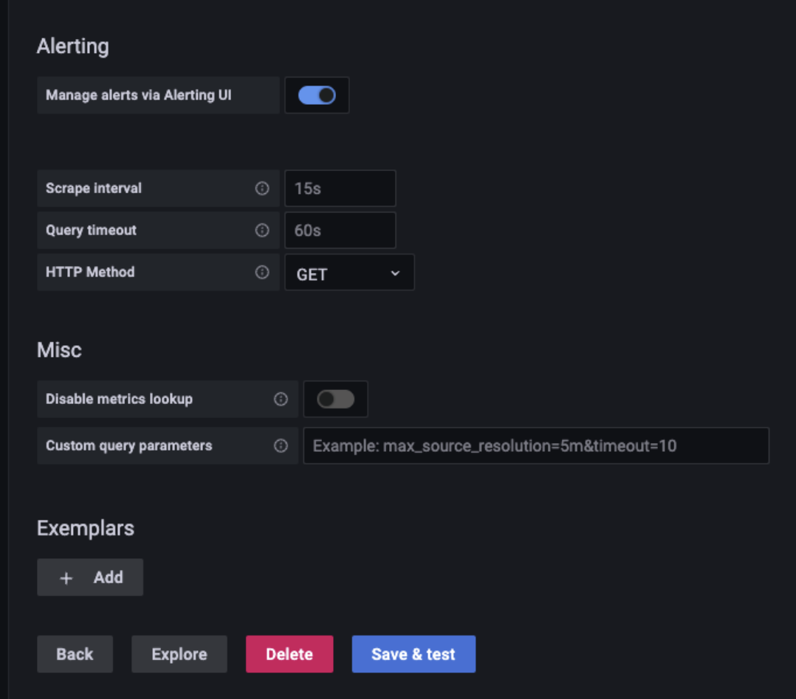

# Introducing Amazon EKS Observability Accelerator

Observability is critical for any application and understanding system behavior and performance. It takes time and effort to detect and remediate performance slowdowns or disruptions. Customers often spend much time writing configuration files and work quite to achieve end-to-end monitoring for applications. Infrastructure as Code (IaC) tools, such as AWS [CloudFormation](https://docs.aws.amazon.com/cloudformation/index.html), [Terraform](https://www.terraform.io/), and [Ansible](https://www.ansible.com/), reduce manual efforts by helping administrators and developers instantiate infrastructure using configuration files.

[Amazon Elastic Kubernetes Service (Amazon EKS)](https://docs.aws.amazon.com/eks/index.html) is a powerful and  extensible container orchestration technology that lets you deploy and manage containerized applications at scale. Building a tailored [Amazon EKS](https://docs.aws.amazon.com/eks/index.html) cluster amidst the wide range of tooling and design choices available and making sure that it meets your application’s specific needs can take a significant amount of time. This situation becomes even more cumbersome when you implement observability, which is critical for analyzing any application’s performance.

Customers have been asking us for examples demonstrating the integration of various open-source tools on Amazon EKS and the configuration of observability solutions incorporating best practices for specific application requirements. On May 17, 2022, AWS announced EKS Observability Accelerator, which is used to configure and deploy purpose-built observability solutions on Amazon EKS clusters for specific workloads using Terraform modules. Customers can use this solution to get started with [Amazon Managed Service for Prometheus](https://docs.aws.amazon.com/prometheus/), [AWS Distro for OpenTelemetry](https://aws.amazon.com/otel/?otel-blogs.sort-by=item.additionalFields.createdDate&otel-blogs.sort-order=desc), and [Amazon Managed Grafana](https://aws.amazon.com/grafana/) by running a single command and beginning to monitor applications.

We built the Terraform modules to enable observability on Amazon EKS clusters for the following workloads:

* Java/JMX
* NGINX
* Memcached
* HAProxy

AWS will continue to add examples for more workloads in the future.

In this post, you will walk through the steps for using [EKS Observability Accelerator](https://github.com/aws-ia/terraform-aws-eks-blueprints/tree/main/examples/observability) to build the Amazon EKS cluster and configure opinionated observability components to monitor specific workloads, which is a Java/JMX application.

## Prerequisites

Make sure you complete the prerequisites before proceeding with this solution

* [Install Terraform](https://learn.hashicorp.com/tutorials/terraform/install-cli)
* [Install Kubectl](https://docs.aws.amazon.com/eks/latest/userguide/install-kubectl.html)
* [Install docker](https://docs.aws.amazon.com/AmazonECS/latest/developerguide/create-container-image.html#:~:text=the%20Docker%20CLI.-,Installing%20Docker%20on%20Amazon%20Linux%202,-Create%20a%20Docker)
* [AWS Command Line Interface (AWS CLI) version 2](https://docs.aws.amazon.com/cli/latest/userguide/install-cliv2.html)
* [jq](https://stedolan.github.io/jq/download/)
* [An AWS Account](https://aws.amazon.com/)
* [Configure the credentials in AWS CLI](https://docs.aws.amazon.com/cli/latest/userguide/cli-configure-files.html#:~:text=refreshes%20the%20credentials.-,Set%20and%20view%20configuration%20settings,-There%20are%20several)
* [An existing Amazon Managed Grafana Workspace](https://aws.amazon.com/blogs/mt/amazon-managed-grafana-getting-started/)

## Deployment steps

Imagine that you’re a Kubernetes operator and in charge of provisioning the Kubernetes environment for your organization. The requirements you get from teams can be diverse and require spending a significant amount of time provisioning the Kubernetes environment and incorporating those configurations. The clock resets every time a new request comes, so re-inventing the wheel continues.

To simplify this and reduce the work hours, we came up with [EKS Blueprints](https://github.com/aws-ia/terraform-aws-eks-blueprints). EKS Blueprints is a collection of Terraform modules that aim to make it easier and faster for customers to adopt Amazon EKS and start deploying typical workloads. It’s open -source and can be used by anyone to configure and manage complete Amazon EKS clusters that are fully bootstrapped with the operational software needed to deploy and operate workloads.

The EKS Blueprints repository contains The Amazon EKS Observability Accelerator module. You’ll use it to configure observability for the Java/JMX application deployed on the Amazon EKS cluster.

### Step 1: Cloning the repository

First, you’ll clone the repository that contains the EKS blueprints:

```
git clone https://github.com/aws-ia/terraform-aws-eks-blueprints.git
```

### Step 2: Generate a Grafana API Key

Before we deploy the Terraform module, we’ll create a Grafana API key and configure the Terraform variable file to use the keys to deploy the dashboard. We’ll use an existing Amazon Managed Grafana workspace and must log in to the workspace URL to configure the API keys.

Follow these steps to create the key

* Use your SAML/SSO credential to log in to the Amazon Managed Grafana workspace.
* Hover to the left side control panel, and select the API keys tab under the gear icon.


* Click Add API key, fill in the Name field and select the Role as Admin.
* Fill in the Time to live field. It’s the API key life duration. For example, 1d to expire the key after one day. Supported units are: s,m,h,d,w,M,y


* Click Add
* Copy and keep the API key safe, we will use this Key in our next step





### Step 3: Configuring the environment

Next, you’ll configure the environment to deploy the Terraform module to provision the EKS cluster, AWS OTEL Operator, and Amazon Managed Service for Prometheus.

Deploying the Terraform module involves the below steps:

* **Plan**: Terraform plan creates an execution plan and previews the infrastructure changes.
* **Apply**: Terraform executes the plan’s action and modifies the environment.

Next, configure the environment either by creating the variables file or setting up the environment variables.

A “.tfvars” file is an alternative to using the “-var” flag or environment variables. The file defines the variable values used by the script.

For this blog post, we will create a new file named “dev.tfvars” under ~/terraform-aws-eks-blueprints/examples/observability/adot-amp-grafana-for-java

Make sure you edit the dev.tfvars file with corresponding Grafana workspace endpoint and Grafana API key. Also, if you want to customize the configuration, add the necessary variables to dev.tfvars file.

```
cd ~/terraform-aws-eks-blueprints/examples/observability/adot-amp-grafana-for-java
```

```
vi dev.tfvars
```

```
grafana_endpoint=”<Your Grafana workspace endpoint>"
grafana_api_key=”Your Grafana API Key>"
```

!!! note
API_KEY – is the key that you have created
Grafana_Endpoint – Grafana workspace URL. 

Make sure to include with “https://” otherwise, terraform module will fail.

### Step 4: Deploying the Terraform modules

The first step is to initialize the working directory using terraform init command, which initializes a working directory containing Terraform configuration files. This command runs after writing a new Terraform configuration or cloning an existing one from version control.

```
terraform init
```

This command performs  initialization steps to prepare the current working directory for use with Terraform. Once the initialization completes, you should receive the following notification.


Additionally, we can execute the terraform validate command to evaluate the configuration files in a directory. Validate runs checks that verify whether or not a configuration is syntactically valid and internally consistent, regardless of any provided variables or existing state.

```
terraform validate
```


The next step is to run the terraform plan command to create an execution plan, which lets you preview the Terraform infrastructure changes. By default, when terraform creates a plan it:

* Reads the current state of any already-existing remote objects to ensure that the Terraform state is up-to-date.
* It compares the current configuration to the initial state and reports any differences.
* Proposes a set of change actions that should, if applied, make the remote objects match the configuration.

The plan command alone will not carry out the proposed changes. So you can use this command to check whether the proposed changes match what you expected before applying the changes or share your changes with your team for broader review.

```
terraform plan -var-file=./dev.tfvars
```


Finally, you’ll run the `terraform apply` command to provision the resources, and it takes about 20 minutes to complete. This command deploys the following resources:

```
terraform apply -var-file=./dev.tfvars -auto-approve
```


1. Creates an Amazon EKS cluster named `aws001-preprod-dev-eks`
2. Creates an Amazon Managed Service for Prometheus workspace named `amp-ws-aws001-preprod-dev-eks`
3. Creates a Kubernetes namespace named `opentelemetry-operator-system, adot-collector-java`
4. Deploys the AWS ADOT collector into the namespace with the configuration to collect metrics for Java/JMX workloads
5. Builds a dashboard to visualize Java/JMX metrics in an existing Amazon Managed Grafana workspace specified in the earlier step and configures the Amazon Managed Service for Prometheus workspace as a data source

After provisioning the EKS cluster, you’ll add the Amazon EKS Cluster endpoint to the kubeconfig and verify if the resources provision successfully.

```
aws eks --region $AWS_REGION update-kubeconfig --name aws001-preprod-dev-eks
```

Verify the creation of Amazon Managed Service for Prometheus workspace and ADOT collector by running the following command:

```
aws amp list-workspaces | jq -r '.workspaces[] | select(.alias=="amp-ws-aws001-preprod-dev-eks").workspaceId'
```

Listing all the pods from the cluster

```
kubectl get pods -A
```


We should be able to verify the connection between Amazon Managed Grafana and Amazon Managed Prometheus by heading to the configuration page and looking at the default data source.


* Select the Data source named `amp`
* Scroll down and select `Save & test`



It should display a success message like below


### Step 5: Deploying sample Java/JMX application

You’ll deploy a sample Java/JMX application and start[nn1]  scraping the JMX metrics. The sample application generates JMX metrics, such as the JVM memory pool, JVM memory usage, and thread, and exports it in the Prometheus format. You’ll deploy a load generator and a bad load generator to get a wide range of metrics to visualize eventually.

The EKS Observability accelerator collects the metrics for the AWS OTEL operator deployment. ADOT exporter will ingest these metrics into the Amazon Managed Service for Prometheus workspace.

We’ll reuse an example from the AWS OpenTelemetry collector [repository](https://github.com/aws-observability/aws-otel-collector/blob/main/docs/developers/container-insights-eks-jmx.md):

```
# Switch to home directory

cd ~/

#Clone the git repository

git clone https://github.com/aws-observability/aws-otel-test-framework.git

#Setup environment variables
export AWS_ACCOUNT_ID=`aws sts get-caller-identity --query Account --output text`

#Login to registry
aws ecr get-login-password --region $AWS_REGION | docker login --username AWS --password-stdin $AWS_ACCOUNT_ID.dkr.ecr.$AWS_REGION.amazonaws.com

#Create ECR Repository
aws ecr create-repository --repository-name prometheus-sample-tomcat-jmx \
--image-scanning-configuration scanOnPush=true \
--region $AWS_REGION

#Build Docker image and push to ECR

cd ~/aws-otel-test-framework/sample-apps/jmx

docker build -t $AWS_ACCOUNT_ID.dkr.ecr.$AWS_REGION.amazonaws.com/prometheus-sample-tomcat-jmx:latest .

docker push $AWS_ACCOUNT_ID.dkr.ecr.$AWS_REGION.amazonaws.com/prometheus-sample-tomcat-jmx:latest

#Deploy the sample application

export SAMPLE_TRAFFIC_NAMESPACE=javajmx-sample

curl https://raw.githubusercontent.com/aws-observability/aws-otel-test-framework/terraform/sample-apps/jmx/examples/prometheus-metrics-sample.yaml > metrics-sample.yaml

sed -e "s/{{aws_account_id}}/$AWS_ACCOUNT_ID/g" metrics-sample.yaml -i
sed -e "s/{{region}}/$AWS_REGION/g" metrics-sample.yaml -i
sed -e "s/{{namespace}}/$SAMPLE_TRAFFIC_NAMESPACE/g" metrics-sample.yaml -i

kubectl apply -f metrics-sample.yaml

#Verify the application

kubectl get pods -n $SAMPLE_TRAFFIC_NAMESPACE
```


### Step 6: Visualize the JMX metrics on Amazon Managed Grafana

To visualize the JMX metrics collected by the AWS ADOT operator, log in to the Grafana workspace.

* Select Dashboards and choose Manage


* Select the Observability folder and choose the dashboard named EKS Accelerator – Observability – Java/JMX


The Terraform module added the Amazon Managed Service for Prometheus workspace as the default data source, and created a custom dashboard to visualize the metrics.


You can also deploy sample applications for NGINX, HAProxy, and Memcached.

## Clean up

Run the following command to tear down the resources provisioned by the Terraform module:

```
terraform destroy -var-file=./dev.tfvars -auto-approve
```

## Conclusion

Customers can now leverage EKS Observability Accelerator  to deploy the opinionated EKS clusters and configure observability for specific workloads without spending much time manually deploying the resources and configuring the agent to scrape the metrics. Furthermore, the solution provides the extensibility to connect the Amazon Managed Prometheus workspace with Amazon Managed Grafana and configure alerts and notifications.