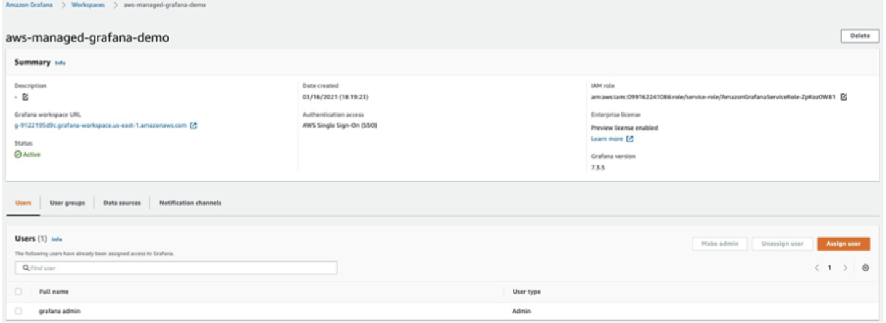

# App Mesh 環境を EKS 上に構成し、Amazon Managed Service for Prometheus で監視する

このレシピでは、[Amazon Elastic Kubernetes Service](https://aws.amazon.com/eks/) (EKS) クラスター内の [App Mesh](https://docs.aws.amazon.com/app-mesh/) Envoy メトリクスを [Amazon Managed Service for Prometheus](https://aws.amazon.com/prometheus/) (AMP) に取り込み、[Amazon Managed Grafana](https://aws.amazon.com/grafana/) (AMG) 上にカスタムダッシュボードを作成して、マイクロサービスの正常性とパフォーマンスを監視する方法を示します。

実装の一環として、AMP ワークスペースを作成し、Kubernetes 用 App Mesh コントローラーをインストールして、Envoy コンテナを Pod に挿入します。EKS クラスターに構成された [Grafana Agent](https://github.com/grafana/agent) を使用して Envoy メトリクスを収集し、AMP に書き込みます。最後に、AMG ワークスペースを作成し、データソースとして AMP を構成し、カスタムダッシュボードを作成します。  

!!! note
    このガイドの完了には約 45 分かかります。

## インフラストラクチャ
このレシピのインフラストラクチャを設定するセクションです。

### アーキテクチャ


Grafana エージェントは Envoy メトリクスをスクレイプし、AMP のリモートライトエンドポイントを介して AMP に取り込むように構成されています。

!!! info
    AMP 用の Prometheus リモートライトエクスポータの詳細については、
    [AMP 用 Prometheus リモートライトエクスポータの概要](https://aws-otel.github.io/docs/getting-started/prometheus-remote-write-exporter)をご覧ください。

### 前提条件

* AWS CLI が[インストール](https://docs.aws.amazon.com/ja_jp/cli/latest/userguide/cli-chap-install.html)され、[設定](https://docs.aws.amazon.com/ja_jp/cli/latest/userguide/cli-chap-configure.html)されています。
* [eksctl](https://docs.aws.amazon.com/ja_jp/eks/latest/userguide/eksctl.html) コマンドがインストールされています。 
* [kubectl](https://docs.aws.amazon.com/ja_jp/eks/latest/userguide/install-kubectl.html) がインストールされています。
* [Docker](https://www.docker.com/get-started/) がインストールされています。
* AMP ワークスペースが AWS アカウントに設定されています。
* [Helm](https://www.eksworkshop.com/beginner/060_helm/helm_intro/install/index.html) がインストールされています。
* [AWS SSO](https://docs.aws.amazon.com/ja_jp/singlesignon/latest/userguide/step1.html) が有効化されています。

### EKS クラスターのセットアップ

まず、サンプルアプリケーションを実行するために App Mesh が有効になった EKS クラスターを作成します。
`eksctl` CLI を使用して、[eks-cluster-config.yaml](./servicemesh-monitoring-ampamg/eks-cluster-config.yaml) を使ってクラスターをデプロイします。
このテンプレートは、EKS で新しいクラスターを作成します。

テンプレートファイルを編集し、AMP で利用できるリージョンのいずれかにリージョンを設定します:

* `us-east-1`
* `us-east-2`
* `us-west-2`
* `eu-central-1`
* `eu-west-1`

セッションでこのリージョンを上書きするようにしてください。たとえば、Bash シェルで次のように実行します:

```
export AWS_REGION=eu-west-1
```

次のコマンドを使用してクラスターを作成します:

```
eksctl create cluster -f eks-cluster-config.yaml
```
これにより、`AMP-EKS-CLUSTER` という名前の EKS クラスターと、App Mesh コントローラー for EKS が使用する `appmesh-controller` という名前のサービスアカウントが作成されます。

### App Mesh Controller のインストール

次に、以下のコマンドを実行して [App Mesh Controller](https://docs.aws.amazon.com/app-mesh/latest/userguide/getting-started-kubernetes.html) をインストールし、Custom Resource Definitions (CRDs) を設定します。

```
helm repo add eks https://aws.github.io/eks-charts
```

```
helm upgrade -i appmesh-controller eks/appmesh-controller \
     --namespace appmesh-system \
     --set region=${AWS_REGION} \
     --set serviceAccount.create=false \
     --set serviceAccount.name=appmesh-controller
```

### AMP の設定
AMP ワークスペースは、Envoy から収集された Prometheus メトリクスを取り込むために使用されます。
ワークスペースは、テナントに専用の論理 Cortex サーバーです。ワークスペースは、更新、リスト表示、
説明、削除などの管理を承認するための細かいアクセス制御をサポートし、メトリクスの取り込みとクエリを行います。

AWS CLI を使用してワークスペースを作成します:

```
aws amp create-workspace --alias AMP-APPMESH --region $AWS_REGION
```

必要な Helm リポジトリを追加します:

```
helm repo add prometheus-community https://prometheus-community.github.io/helm-charts && \
helm repo add kube-state-metrics https://kubernetes.github.io/kube-state-metrics 
```

AMP の詳細については、[AMP の概要](https://docs.aws.amazon.com/prometheus/latest/userguide/AMP-getting-started.html) ガイドをご覧ください。

### メトリクスのスクレイピングと取り込み

AMP は、Kubernetes クラスター内のコンテナ化されたワークロードから直接運用メトリクスをスクレイプしません。
このタスクを実行するには、Prometheus サーバーまたは 
[AWS Distro for OpenTelemetry Collector](https://github.com/aws-observability/aws-otel-collector)
のような OpenTelemetry エージェントをデプロイして管理する必要があります。
このレシピでは、Envoy メトリクスをスクレイプし、AMP と AMG を使用して分析するための Grafana エージェントの構成プロセスを紹介します。

#### Grafana エージェントの設定

Grafana エージェントは、完全な Prometheus サーバーを実行する軽量な代替手段です。
Prometheus エクスポーターの検出とスクレイピング、およびメトリクスの Prometheus 互換バックエンドへの送信に必要な部分を保持します。
Grafana エージェントには、AWS Identity and Access Management (IAM) 認証のための AWS Signature Version 4 (Sigv4) のネイティブサポートも含まれます。

ここから、Prometheus メトリクスを AMP に送信するための IAM ロールの設定手順を説明します。 
EKS クラスターに Grafana エージェントをインストールし、メトリクスを AMP に転送します。

#### アクセス許可の設定
Grafana Agent は、EKS クラスターで実行されているコンテナ化されたワークロードから運用メトリクスをスクレイピングし、それらを AMP に送信します。AMP に送信されるデータは、Sigv4 を使用して有効な AWS 資格情報で署名する必要があり、これによりマネージドサービスの各クライアントリクエストを認証および承認します。

Grafana Agent は、Kubernetes サービスアカウントの ID で実行するように EKS クラスターにデプロイできます。IAM ロールを使用したサービスアカウント (IRSA) では、IAM ロールを Kubernetes サービスアカウントに関連付けることができます。これにより、そのサービスアカウントを使用するすべての Pod に IAM アクセス許可を提供できます。

IRSA の設定を次のように準備します。

```
kubectl create namespace grafana-agent

export WORKSPACE=$(aws amp list-workspaces | jq -r '.workspaces[] | select(.alias=="AMP-APPMESH").workspaceId')
export ROLE_ARN=$(aws iam get-role --role-name EKS-GrafanaAgent-AMP-ServiceAccount-Role --query Role.Arn --output text)
export NAMESPACE="grafana-agent"
export REMOTE_WRITE_URL="https://aps-workspaces.$AWS_REGION.amazonaws.com/workspaces/$WORKSPACE/api/v1/remote_write"
```

[gca-permissions.sh](./servicemesh-monitoring-ampamg/gca-permissions.sh) シェルスクリプトを使用して、次の手順を自動化できます(プレースホルダー変数 `YOUR_EKS_CLUSTER_NAME` を EKS クラスターの名前に置き換えてください)。

* AMP ワークスペースにリモートライトするアクセス許可を持つ IAM ポリシーを使用して、`EKS-GrafanaAgent-AMP-ServiceAccount-Rol`e という名前の IAM ロールを作成します。
* `grafana-agent` 名前空間の下に `grafana-agent` という名前の Kubernetes サービスアカウントを作成し、それを IAM ロールに関連付けます。 
* IAM ロールと Amazon EKS クラスターでホストされている OIDC プロバイダー間の信頼関係を作成します。

`gca-permissions.sh` スクリプトを実行するには、`kubectl` と `eksctl` CLI ツールが必要です。これらは Amazon EKS クラスターにアクセスするように構成する必要があります。

次に、[grafana-agent.yaml](./servicemesh-monitoring-ampamg/grafana-agent.yaml) というマニフェストファイルを作成し、Envoy メトリクスを抽出するスクレイプ構成を記述し、Grafana Agent をデプロイします。

!!! 注意
    記事作成時点では、このソリューションはデーモンセットのサポートがない EKS on Fargate では機能しません。

この例では、`grafana-agent` という名前のデーモンセットと `grafana-agent-deployment` という名前のデプロイメントをデプロイします。`grafana-agent` デーモンセットはクラスター上の Pod からメトリクスを収集し、`grafana-agent-deployment` デプロイメントは、クラスター外に存在する EKS コントロールプレーンなどのサービスからメトリクスを収集します。

```
kubectl apply -f grafana-agent.yaml
```
`grafana-agent` がデプロイされると、メトリクスを収集して指定された AMP ワークスペースにインジェストします。次に、EKS クラスターにサンプルアプリケーションをデプロイして、メトリクスの分析を開始します。

## サンプルアプリケーション

アプリケーションをインストールし、Envoy コンテナを注入するために、Kubernetes 用の AppMesh コントローラーを使用します。

まず、例のリポジトリをクローンしてベースアプリケーションをインストールします。

```
git clone https://github.com/aws/aws-app-mesh-examples.git
```

次にリソースをクラスタに適用します。

```
kubectl apply -f aws-app-mesh-examples/examples/apps/djapp/1_base_application
```

ポッドのステータスを確認し、実行中であることを確認します。

```
$ kubectl -n prod get all

NAME                            READY   STATUS    RESTARTS   AGE
pod/dj-cb77484d7-gx9vk          1/1     Running   0          6m8s
pod/jazz-v1-6b6b6dd4fc-xxj9s    1/1     Running   0          6m8s
pod/metal-v1-584b9ccd88-kj7kf   1/1     Running   0          6m8s
```

次に App Mesh コントローラーをインストールし、デプロイメントをメッシュ化します。

```
kubectl apply -f aws-app-mesh-examples/examples/apps/djapp/2_meshed_application/
kubectl rollout restart deployment -n prod dj jazz-v1 metal-v1
```

これで、各 Pod で 2 つのコンテナが実行されていることがわかります。

```
$ kubectl -n prod get all
NAME                        READY   STATUS    RESTARTS   AGE
dj-7948b69dff-z6djf         2/2     Running   0          57s
jazz-v1-7cdc4fc4fc-wzc5d    2/2     Running   0          57s
metal-v1-7f499bb988-qtx7k   2/2     Running   0          57s
```

5 分間トラフィックを生成し、後で AMG で可視化します。

```
dj_pod=`kubectl get pod -n prod --no-headers -l app=dj -o jsonpath='{.items[*].metadata.name}'`

loop_counter=0
while [ $loop_counter -le 300 ] ; do \
kubectl exec -n prod -it $dj_pod  -c dj \
-- curl jazz.prod.svc.cluster.local:9080 ; echo ; loop_counter=$[$loop_counter+1] ; \
done
```

### AMG ワークスペースの作成

AMG ワークスペースを作成するには、[AMG の概要](https://aws.amazon.com/blogs/mt/amazon-managed-grafana-getting-started/) ブログ記事の手順に従ってください。
ダッシュボードへのユーザーアクセスを許可するには、AWS SSO を有効にする必要があります。ワークスペースの作成後、Grafana ワークスペースへのアクセスを個々のユーザーまたはユーザーグループに割り当てることができます。
デフォルトでは、ユーザーのユーザータイプは viewer です。ユーザーロールに基づいてユーザータイプを変更します。データソースとして AMP ワークスペースを追加し、ダッシュボードの作成を開始します。

この例では、ユーザー名は `grafana-admin` で、ユーザータイプは `Admin` です。
必要なデータソースを選択します。構成を確認し、`Create workspace` を選択します。



### AMG のデータソースとして AMP を設定する
AMG でデータソースとして AMP を設定するには、`Data sources` セクションで `Configure in Grafana` を選択します。これにより、ブラウザで Grafana ワークスペースが起動します。
ブラウザで Grafana ワークスペースの URL を手動で起動することもできます。


スクリーンショットからわかるように、ダウンストリームレイテンシ、接続、レスポンスコードなどの Envoy メトリクスを表示できます。
示されているフィルタを使用して、特定のアプリケーションの Envoy メトリクスをドリルダウンできます。

### AMG ダッシュボードの設定

データソースが設定されたら、Envoy メトリクスを分析するためにカスタムダッシュボードをインポートします。
ここでは事前に定義されたダッシュボードを使用するので、`Import` (下図参照) を選択し、
ID `11022` を入力します。これにより Envoy Global ダッシュボードがインポートされるので、
Envoy メトリクスの分析を開始できます。


### AMGでアラートを設定する

メトリクスが意図したしきい値を超えた場合に、Grafanaアラートを設定できます。
AMGを使用すると、ダッシュボードでアラートを評価する頻度と通知を送信する方法を設定できます。
アラートルールを作成する前に、通知チャネルを作成する必要があります。

この例では、通知チャネルとしてAmazon SNSを設定します。
デフォルトを使用している場合、つまり[サービス管理権限](https://docs.aws.amazon.com/ja_jp/grafana/latest/userguide/AMG-manage-permissions.html#AMG-service-managed-account)の場合、トピックに成功裏に通知を公開するには、SNSトピックに`grafana`接頭辞を付ける必要があります。

`grafana-notification`という名前のSNSトピックを作成するには、次のコマンドを使用します。

```
aws sns create-topic --name grafana-notification
```

メールアドレスを介してサブスクライブします。以下のコマンドで、リージョンとアカウントIDを指定することを確認してください。

```
aws sns subscribe \
    --topic-arn arn:aws:sns:<region>:<account-id>:grafana-notification \
	--protocol email \
	--notification-endpoint <email-id>
```

次に、Grafanaダッシュボードから新しい通知チャネルを追加します。 
grafana-notificationという名前の新しい通知チャネルを設定します。
タイプの場合、ドロップダウンからAWS SNSを使用します。
トピックの場合、作成したSNSトピックのARNを使用します。
認証プロバイダーとして、AWS SDK Defaultを選択します。 


1分間でダウンストリームレイテンシが5ミリ秒を超えるとアラートが設定されます。
ダッシュボードで、ドロップダウンからダウンストリームレイテンシを選択し、編集を選択します。
グラフパネルの[アラート]タブで、アラートルールを評価する頻度と、アラートが状態を変更して通知を開始する条件を設定します。

次の設定では、ダウンストリームレイテンシがしきい値を超えるとアラートが作成され、設定された grafana-alert-notification チャネルを介して SNS トピックに通知が送信されます。


</email-id></account-id></region>

## クリーンアップ

1. リソースとクラスタを削除します。
```
kubectl delete all --all
eksctl delete cluster --name AMP-EKS-CLUSTER
```
2. AMP ワークスペースを削除します。 
```
aws amp delete-workspace --workspace-id `aws amp list-workspaces --alias prometheus-sample-app --query 'workspaces[0].workspaceId' --output text`
```
3. amp-iamproxy-ingest-role IAM ロールを削除します。
```
aws delete-role --role-name amp-iamproxy-ingest-role
```
4. コンソールからワークスペースを削除することで、AMG ワークスペースを削除します。
