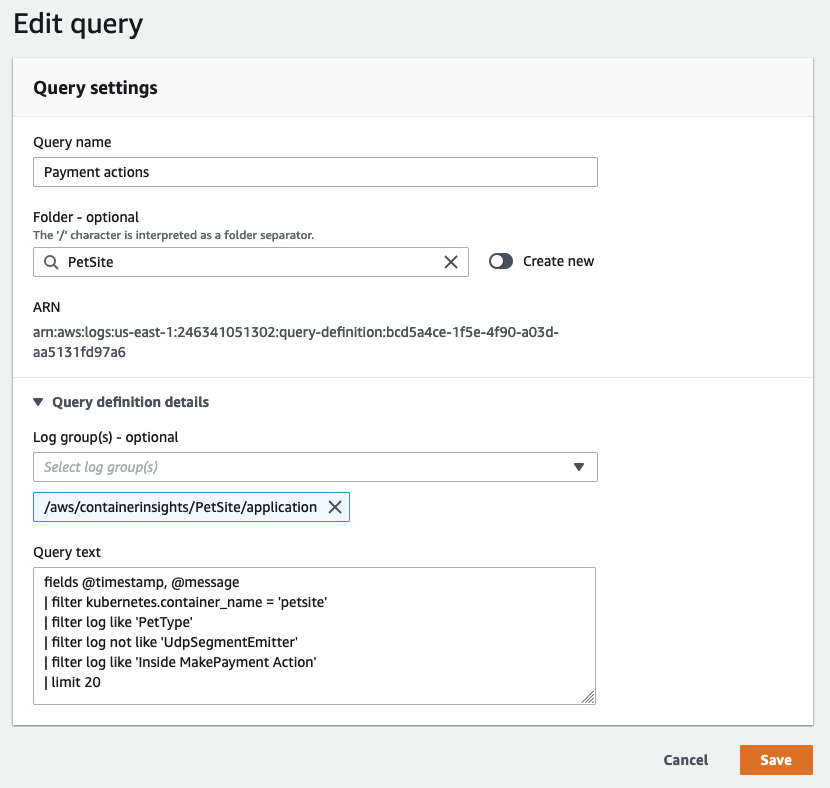

# ログ記録

ログツールの選択は、データ送信、フィルタリング、保持、キャプチャ、およびデータ生成アプリケーションとの統合に関する要件によって異なります。Amazon Web Services を使用してオブザーバビリティを実現する場合(オンプレミスや他のクラウド環境でホストしているかどうかに関係なく)、[CloudWatch エージェント](https://docs.aws.amazon.com/ja_jp/AmazonCloudWatch/latest/monitoring/Install-CloudWatch-Agent.html) や [Fluentd](https://www.fluentd.org/) などのツールを利用して、分析のためのログデータを出力できます。

ここでは、ログ記録のための CloudWatch エージェントの実装に関するベストプラクティスと、AWS コンソールまたは API 内の CloudWatch Logs の使用法について詳しく説明します。 

!!! info
	CloudWatch エージェントは、[メトリクスデータ](../../signals/metrics/) を CloudWatch に配信するためにも使用できます。実装の詳細については、[メトリクス](../../tools/metrics/)のページを参照してください。

## CloudWatch エージェントによるログの収集

### 転送

[クラウドファーストのアプローチ](../../faq#what-is-a-cloud-first-approach)をオブザーバビリティに取る場合、原則として、マシンにログインしてそのログを取得する必要がある場合は、アンチパターンが存在します。ワークロードは、ログ分析システムに対して、ほぼリアルタイムで自身のログデータを外部に送信する必要があります。送信と元のイベントの間のレイテンシは、ワークロードに障害が発生した場合の点時情報の潜在的な損失を表します。

アーキテクトとして、ログデータの許容可能な損失量を判断し、これに対応するように CloudWatch エージェントの [`force_flush_interval`](https://docs.aws.amazon.com/AmazonCloudWatch/latest/monitoring/CloudWatch-Agent-Configuration-File-Details.html#CloudWatch-Agent-Configuration-File-Logssection) を調整する必要があります。

`force_flush_interval` は、バッファサイズに達するまで定期的にデータプレーンにログデータを送信するようエージェントに指示します。バッファサイズに達した場合は、すべてのバッファされたログを直ちに送信します。

!!! tip
	エッジデバイスは、低レイテンシーの AWS 内ワークロードとは非常に異なる要件を持つ場合があり、`force_flush_interval` の設定を長くする必要があるかもしれません。例えば、低帯域幅のインターネット接続を持つ IoT デバイスは、15 分ごとにログをフラッシュする必要があるかもしれません。

!!! success
	コンテナ化されたワークロードやステートレスなワークロードは、ログのフラッシュ要件に特に敏感である可能性があります。いつでもスケールインできるステートレスな Kubernetes アプリケーションや EC2 フリートを考えてみましょう。これらのリソースが突然終了したときにログの損失が発生する可能性があります。将来的にはこれらのリソースからログを抽出する方法がなくなります。標準の `force_flush_interval` は通常、これらのシナリオに適していますが、必要に応じて低減できます。

### ロググループ

CloudWatch Logs では、アプリケーションに論理的に適用されるログのコレクションは、単一の[ロググループ](https://docs.aws.amazon.com/ja_jp/AmazonCloudWatch/latest/logs/CloudWatchLogsConcepts.html)に配信する必要があります。そのロググループ内で、ログストリームを作成するソースシステム間で*共通性*があることが望ましいです。

LAMP スタックを考えてみましょう。Apache、MySQL、PHP アプリケーション、ホスティング Linux オペレーティングシステムからのログは、それぞれ別個のロググループに属する必要があります。

このグループ化は重要であり、同じ保持期間、暗号化キー、メトリックフィルター、サブスクリプションフィルター、Contributor Insights ルールをグループで扱えるようになります。

!!! success
	ロググループ内のログストリーム数に制限はありません。1 つの CloudWatch Logs Insights クエリで、アプリケーションのすべてのログを検索できます。Kubernetes サービスの各 Pod またはフリート内の各 EC2 インスタンスに個別のログストリームを用意するのが一般的なパターンです。
	
!!! success
	ロググループのデフォルトの保持期間は*無制限*です。ベストプラクティスは、ロググループを作成するタイミングで保持期間を設定することです。

	保持期間は CloudWatch コンソールでいつでも設定できますが、ベストプラクティスは、インフラストラクチャ as コード(CloudFormation、Cloud Development Kit など)を使用してロググループの作成と同時に設定するか、CloudWatch エージェントの構成内の `retention_in_days` 設定を使用して設定することです。

	いずれのアプローチも、保持期間を事前に積極的に設定し、プロジェクトのデータ保持要件に合わせることができます。
	
!!! success 
	デフォルトでは、ロググループは暗号化されません。ベストプラクティスは、ロググループを作成するタイミングで暗号化キーを設定し、プレーンテキストデータの偶発的な漏洩を防ぐことです。これは、インフラストラクチャ as コード(CloudFormation、Cloud Development Kit など)を使用して実行できます。

	CloudWatch Logs のキーを管理するために AWS Key Management Service を使用するには、追加の構成とユーザーへのキーへのアクセス許可の付与が必要です。[^1]

### ログのフォーマット

CloudWatch Logs には、インジェスト時に JSON データをインデックス化し、そのインデックスを使ってアドホッククエリを実行する機能があります。
CloudWatch Logs にはどのようなログデータでも配信できますが、このデータの自動インデックス化は、適切に構造化されている場合にのみ実行されます。

構造化されていないログでも検索は可能ですが、正規表現を使用する必要があります。

!!! success
	CloudWatch Logs を使用する際のログフォーマットのベストプラクティスは次のとおりです。

	1. Log4j、`python-json-logger`、フレームワークのネイティブ JSON エミッタなどの構造化ログフォーマッタを使用する。
	2. ログ先に1つのイベントごとに1行のログを送信する。

	JSON ログの複数行を送信する場合、各行が1つのイベントとして解釈されることに注意する。

### `stdout` の処理

[ログ信号](../../signals/logs/#log-to-stdout)のページで説明したように、ベストプラクティスはログシステムを生成アプリケーションから分離することです。
ただし、`stdout` からファイルにデータを送信することは、多くのプラットフォームで一般的なパターンです。
Kubernetesや[Amazon Elastic Container Service](https://aws.amazon.com/ecs/)などのコンテナオーケストレーションシステムは、この`stdout`からログファイルへの配信を自動的に管理し、各ログをコレクタから収集できるようにします。
CloudWatch エージェントはこのファイルをリアルタイムで読み取り、ロググループにデータを転送します。

!!! success
	`stdout`への簡易アプリケーションログとエージェントによる収集というパターンをできるだけ利用してください。

### ログのフィルタリング

個人データの永続的な保存を防止したり、特定の[ログレベル](../../logs/#use-log-levels-appropriately)のデータのみをキャプチャしたりするなど、ログをフィルタリングする理由はたくさんあります。いずれにしても、発信元のシステムにできるだけ近いところでこのフィルタリングを実行することがベストプラクティスです。CloudWatch の場合、これは分析のために CloudWatch Logs にデータが配信される*前に*実行することを意味します。CloudWatch エージェントはこのフィルタリングを実行できます。

!!! success
	[`filters`](https://docs.aws.amazon.com/AmazonCloudWatch/latest/monitoring/CloudWatch-Agent-Configuration-File-Details.html#CloudWatch-Agent-Configuration-File-Logssection) 機能を使用して、必要なログレベルを`include`し、望ましくないパターン(クレジットカード番号、電話番号など)を`exclude`してください。
	
!!! tip
	ログに潜在的に漏れる可能性のある、特定の形式の既知のデータをフィルタリングすることは時間がかかり、エラーが発生しやすい場合があります。ただし、特定のタイプの望ましくないデータ(クレジットカード番号、社会保障番号など)を扱うワークロードの場合、これらのレコードのフィルタを持つことで、将来的に潜在的に有害なコンプライアンスの問題を防ぐことができます。たとえば、社会保障番号が含まれるすべてのレコードをドロップするには、次の構成で簡単に実現できます:

	```
	"filters": [
      {
        "type": "exclude",
        "expression": "\b(?!000|666|9\d{2})([0-8]\d{2}|7([0-6]\d))([-]?|\s{1})(?!00)\d\d\2(?!0000)\d{4}\b"
      }
    ]
    ```

### 複数行ログ

すべてのログ記録におけるベストプラクティスは、ディスクリートなログイベントごとに 1 行が出力される [構造化ログ記録](../../signals/logs/#structured-logging-is-key-to-success) を使用することです。
ただし、このオプションがないレガシーアプリケーションや ISV サポートアプリケーションが多数あります。
これらのワークロードの場合、CloudWatch Logs は、マルチライン対応プロトコルを使用して出力されない限り、各行を一意のイベントとして解釈します。
CloudWatch エージェントは、[`multi_line_start_pattern`](https://docs.aws.amazon.com/AmazonCloudWatch/latest/monitoring/CloudWatch-Agent-Configuration-File-Details.html#CloudWatch-Agent-Configuration-File-Logssection) ディレクティブを使用してこれを実行できます。

!!! success
	`multi_line_start_pattern` ディレクティブを使用して、マルチラインログを CloudWatch Logs に取り込む負担を軽減します。

## CloudWatch Logsでの検索

### クエリのスコープを絞ってコストを管理する

CloudWatch Logs にデータが配信されると、必要に応じて検索できるようになります。CloudWatch Logs はスキャンされたデータのギガバイト数に応じて課金されることに注意してください。クエリのスコープを制御することで、スキャンされるデータ量を減らし、コストを削減できます。

!!! success
	ログを検索するときは、日時の範囲が適切であることを確認してください。CloudWatch Logs では相対的または絶対的な時間範囲をスキャンに設定できます。*前日のエントリーのみを探している場合、今日のログのスキャンを含める必要はありません!*
	
!!! success
	1 つのクエリで複数のロググループを検索できますが、そうするとスキャンされるデータ量が増えます。ターゲットとする必要のあるロググループを特定したら、クエリのスコープをそれに合わせて絞り込んでください。
	
!!! tip
	CloudWatch コンソールから、各クエリが実際にスキャンしたデータ量を直接確認できます。このアプローチにより、効率的なクエリを作成できます。
	
	

### 他のユーザーとのクエリの共有

[CloudWatch Logs のクエリ構文](https://docs.aws.amazon.com/ja_jp/AmazonCloudWatch/latest/logs/CWL_QuerySyntax.html)は複雑ではありません(コマンドは7つしかありません)が、いくつかのクエリをゼロから書くのに時間がかかることがあります。同じ AWS アカウント内の他のユーザーとうまく書かれたクエリを共有することが、[AWS コンソール内から直接](https://docs.aws.amazon.com/ja_jp/AmazonCloudWatch/latest/logs/CWL_Insights-Saving-Queries.html) または [CloudFormation](https://docs.aws.amazon.com/ja_jp/AWSCloudFormation/latest/UserGuide/aws-resource-logs-querydefinition.html) を使用して実現できます。これにより、アプリケーションログを調査する必要がある場合の再作業量を減らすのに役立ちます。  

!!! success
	頻繁に繰り返し使用するクエリを CloudWatch Logs に保存することで、ユーザーに対して事前入力できるようになります。

	


[^1]: アクセス権限を持つ CloudWatch Logs ロググループの暗号化の実践的な例については、[How to search through your AWS Systems Manager Session Manager console logs – Part 1](https://aws.amazon.com/blogs/mt/how-to-search-through-your-aws-systems-manager-session-manager-console-logs-part-1/) を参照してください。
