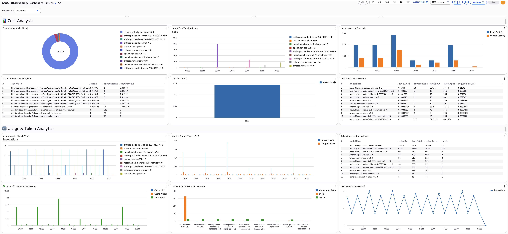

# Creating Custom Dashboards for GenAI Telemetry

## Why Custom Dashboards?

When you enable Bedrock Model Invocation Logging and deploy the ADOT auto-instrumentation agent, AWS gives you a head start with out-of-the-box dashboards. Bedrock automatically provides invocation count, latency, token counts, and throttle metrics. Application Signals auto-generates service maps and SLO views. That's a solid foundation — but it's not the whole picture.

The out-of-the-box dashboards answer "is my AI healthy right now?" They don't answer the questions your DevOps, FinOps, and security teams actually ask:

- Which caller is burning through 80% of our Bedrock budget?
- Why did the completion rate drop after the 3 PM deployment?
- Is cross-region inference actually helping, or adding latency?
- Which prompts would benefit most from caching?
- Who made that model call that returned PII, and what did they ask?
- Is my agent failing at the tool layer or the model layer?

Answering these requires custom queries that join log groups, compute cost from tokens, segment by IAM role, and drill into span trees. The raw telemetry is already flowing — the value comes from how you slice it.

### One Pipeline, Different Audiences

Your GenAI telemetry lands in three log groups: `bedrock-model-invocation-logging`, `aws/spans`, and `/aws/bedrock-agentcore/runtimes/<agent>`. The data doesn't change, but how you present it does. The same invocation data becomes:

- **A DevOps dashboard** showing completion rate, component latency, and agent error drill-down — focused on "is the system working?"
- **A FinOps dashboard** showing cost per model, top spenders, and caching opportunities — focused on "are we spending efficiently?"

This guide gives you the queries to build both. Pick the sections relevant to your audience. Each query notes its source log group, view type, query language, and what question it answers.

For an overview of the underlying data pipelines and when to enable each, see [GenAI Observability on AWS](../genai-observability-on-aws).

---

## DevOps Persona Dashboard

DevOps teams need to answer: *is my GenAI workload healthy, and where are the bottlenecks?* These queries focus on invocation health, agent workflow reliability, and performance bottlenecks.


### Model Invocation Health

#### 1. Stop Reason Breakdown by Model

- **Purpose:** Shows the distribution of ALL stop reasons across models. Every Bedrock invocation ends with a stop reason — `end_turn` (natural completion), `tool_use` (calling a tool), `max_tokens` (truncated), `stop_sequence` (hit a boundary), or an error. Example: you might discover that 15% of your summarization model's calls end with `max_tokens` — meaning users are getting cut-off responses — while your classification model is 100% `end_turn`.
- **Source:** `bedrock-model-invocation-logging`
- **View:** Bar chart
- **Query Language:** CloudWatch Logs Insights
- **Query:**

```sql
fields @timestamp, modelId, operation, requestId,
       output.outputBodyJson.stopReason as stop_reason
| filter schemaType = "ModelInvocationLog"
| filter ispresent(output.outputBodyJson.stopReason)
        or ispresent(output.outputBodyJson.error)
| stats count() as stop_reason_count by stop_reason, modelId
```

- **Alarm:** Any non-healthy stop reason (not `end_turn`, `tool_use`, or `stop_sequence`) exceeding 10% of a model's total invocations.

#### 2. Completion Rate vs Truncation (hourly)

- **Purpose:** Tracks the hourly ratio of successful completions (`end_turn` + `tool_use`) vs truncated responses (`max_tokens`). This is your SLA metric — target 95%+ completion rate. Example: if the completion rate drops from 97% to 88% between 3 PM and 4 PM, something changed — a new prompt template, a model update, or a configuration change is causing more truncation.
- **Source:** `bedrock-model-invocation-logging`
- **View:** Time series (stacked)
- **Query Language:** CloudWatch Logs Insights
- **Query:**

```sql
fields @timestamp, modelId,
       output.outputBodyJson.stopReason as stop_reason
| filter schemaType = "ModelInvocationLog"
| filter ispresent(output.outputBodyJson.stopReason)
| stats sum(stop_reason = "end_turn" or stop_reason = "tool_use") as ok,
        sum(stop_reason = "max_tokens") as truncated
  by bin(@timestamp, 1h) as hour
| sort hour desc
```

- **Alarm:** `ok / (ok + truncated)` below 95% for 2 consecutive hours.

#### 3. Token Efficiency — Find Wasted Tokens

- **Purpose:** Finds callers sending high input tokens (more than 2000) but receiving low output (under 200) — a sign of token waste. Example: a classification pipeline sending entire product catalogs (8000 tokens) to get a one-word label (3 tokens). The `caller_arn` column tells you exactly which service or role is responsible, so you can have a targeted conversation about restructuring their prompts.
- **Source:** `bedrock-model-invocation-logging`
- **View:** Table
- **Query Language:** CloudWatch Logs Insights
- **Query:**

```sql
fields @timestamp, modelId, operation,
       input.inputTokenCount as input_tokens,
       output.outputTokenCount as output_tokens,
       identity.arn as caller_arn
| filter schemaType = "ModelInvocationLog"
| filter input_tokens > 2000 and output_tokens < 200
| stats count() as inefficient_requests,
        avg(input_tokens) as avg_input_tokens,
        avg(output_tokens) as avg_output_tokens,
        sum(input_tokens) as total_wasted_tokens
  by modelId, operation, caller_arn
| sort total_wasted_tokens desc
```

- **Alarm:** Any caller with `total_wasted_tokens` above 100K in 24h.

#### 4. Cross-Region Inference Latency

- **Purpose:** Compares latency percentiles across inference regions for each model. If you've enabled cross-region inference, some requests route to distant regions with higher latency. Example: your summarization model's P95 is 12s in us-west-2 but 4s in us-east-1 — configuring your inference profile to prefer us-east-1 can reduce P95 by 40%.
- **Source:** `bedrock-model-invocation-logging`
- **View:** Table
- **Query Language:** CloudWatch Logs Insights
- **Query:**

```sql
fields @timestamp, modelId, region, inferenceRegion,
       output.outputBodyJson.metrics.latencyMs as latency
| filter schemaType = "ModelInvocationLog"
| filter ispresent(inferenceRegion)
| filter latency > 0
| stats count() as invocations,
        avg(latency) as avg_latency,
        pct(latency, 50) as p50_latency,
        pct(latency, 95) as p95_latency,
        pct(latency, 99) as p99_latency,
        stddev(latency) as latency_stddev
  by modelId, region, inferenceRegion
| sort modelId asc, avg_latency asc
```

- **Alarm:** Any model P95 above 10 seconds in a specific region.

#### 5. Prompt Caching Opportunities

- **Purpose:** Finds prompts that are called repeatedly but have zero or low cache hits — the biggest caching ROI opportunities. Example: a system prompt used 500 times with zero cache reads means you're paying full price every time — enabling caching could save 90% on those input tokens.
- **Source:** `bedrock-model-invocation-logging`
- **View:** Table
- **Query Language:** CloudWatch Logs Insights
- **Query:**

```sql
fields @timestamp,
       input.inputBodyJson.messages.0.content.0.text as promptText,
       input.inputTokenCount as inputTokens,
       input.cacheReadInputTokenCount as cacheReadTokens,
       input.cacheWriteInputTokenCount as cacheWriteTokens,
       modelId
| filter input.inputTokenCount > 0
| stats sum(input.inputTokenCount) as totalInputTokens,
        count(*) as invocationCount,
        avg(input.inputTokenCount) as avgInputTokens,
        sum(input.cacheReadInputTokenCount) as totalCacheReadTokens,
        sum(input.cacheWriteInputTokenCount) as totalCacheWriteTokens
  by promptText, modelId
| filter invocationCount > 1
| sort totalInputTokens desc
```

- **Alarm:** None (optimization review, run weekly).

### Agent Workflow Health

#### 6. Agent Traces vs Errors (hourly)

- **Purpose:** Hourly count of total agent traces alongside error spans — your agent-level reliability metric. Example: if total_traces is 500/hour but error_spans jumps from 5 to 80 at 3 PM, something broke in the agent workflow. This catches problems that model-level metrics miss — the model can succeed while the agent fails due to tool timeouts or guardrail rejections.
- **Source:** `aws/spans`
- **View:** Time series
- **Query Language:** CloudWatch Logs Insights
- **Query:**

```sql
fields attributes.session.id as sessionId, traceId,
       status.code as statusCode, durationNano/1000000 as durationMs
| filter ispresent(sessionId)
| stats count_distinct(traceId) as total_traces,
        sum(statusCode = "ERROR") as error_spans
  by bin(@timestamp, 1h) as hour
| sort hour desc
```

- **Alarm:** `error_spans / total_traces` above 10% for 15 minutes.

#### 7. Span Error Drill-Down

- **Purpose:** When you know there are agent errors, this tells you exactly WHICH component is failing — knowledge base retrieval, guardrail check, tool execution, or model invocation. Example: 70% of errors are in the KB retrieval span with HTTP 503 — your OpenSearch cluster is throttling under load, not a model problem.
- **Source:** `aws/spans`
- **View:** Table
- **Query Language:** CloudWatch Logs Insights
- **Query:**

```sql
fields name as spanName,
       resource.attributes.service.name as serviceName,
       status.code as statusCode,
       status.message as statusMessage,
       attributes.http.response.status_code as httpStatus,
       durationNano/1000000 as durationMs,
       traceId, spanId, parentSpanId
| filter resource.attributes.aws.service.type = "gen_ai_agent"
| filter status.code = "ERROR"
        or attributes.http.response.status_code >= 400
| stats count() as error_count,
        count_distinct(traceId) as affected_traces,
        avg(durationMs) as avg_error_duration_ms,
        earliest(statusMessage) as error_message
  by spanName, serviceName, httpStatus
| sort error_count desc
```

- **Alarm:** Any component with more than 10 errors in 15 minutes.

#### 8. Component Performance Breakdown (hourly)

- **Purpose:** Hourly performance per agent component with full percentile distributions (P50, P95, P99). Shows where agent time is spent and which component is the bottleneck. Example: the guardrail check averages 2.8s (P95: 4.1s) while the model call averages 1.2s (P95: 2.0s) — optimize the guardrail first, it has more impact than any model optimization.
- **Source:** `aws/spans`
- **View:** Table
- **Query Language:** CloudWatch Logs Insights
- **Query:**

```sql
fields name as spanName,
       resource.attributes.service.name as serviceName,
       durationNano/1000000 as durationMs,
       traceId
| filter resource.attributes.aws.service.type = "gen_ai_agent"
| filter ispresent(spanName)
| stats count() as invocations,
        avg(durationMs) as avg_duration_ms,
        pct(durationMs, 50) as p50_duration_ms,
        pct(durationMs, 95) as p95_duration_ms,
        pct(durationMs, 99) as p99_duration_ms,
        sum(durationMs) as total_time_ms
  by bin(1h), spanName, serviceName
| sort total_time_ms desc
```

- **Alarm:** Any component P95 above 5000ms.

---

## FinOps Persona Dashboard

FinOps teams need to answer: *where is our GenAI spend going, and how do we optimize it?* These queries compute cost from token usage, attribute spend to teams and roles, and surface optimization opportunities like prompt caching.



All FinOps queries use a cost calculation pattern based on per-token pricing. The `strcontains` multiplication pattern maps each model to its per-token rate. Update the pricing values when Bedrock pricing changes.

### Executive Summary

#### 9. Total Estimated Spend

- **Purpose:** Single-value widget showing total GenAI spend across all models for the selected time range. This is your headline KPI — the number the CFO cares about.
- **Source:** `bedrock-model-invocation-logging`
- **View:** Single value
- **Query Language:** CloudWatch Logs Insights
- **Query:**

```sql
fields coalesce(output.outputBodyJson.usage.inputTokens,
    output.outputBodyJson.usage.prompt_tokens,
    output.outputBodyJson.usage.input_tokens,
    input.inputTokenCount) as inputTokens,
  coalesce(output.outputBodyJson.usage.outputTokens,
    output.outputBodyJson.usage.completion_tokens,
    output.outputBodyJson.usage.output_tokens,
    output.outputTokenCount) as outputTokens
| fields (inputTokens *
    ((strcontains(modelId, "nova-micro") * 0.000000035) +
    (strcontains(modelId, "nova-lite") * 0.00000006) +
    (strcontains(modelId, "nova-pro") * 0.0000008) +
    (strcontains(modelId, "claude-sonnet-4-6") * 0.000003) +
    (strcontains(modelId, "claude-sonnet-4-5") * 0.000003) +
    (strcontains(modelId, "claude-haiku") * 0.000001) +
    (strcontains(modelId, "llama4-maverick") * 0.0000002) +
    (strcontains(modelId, "llama4-scout") * 0.00000015) +
    (strcontains(modelId, "command-r-plus") * 0.0000025) +
    (strcontains(modelId, "command-r-v") * 0.00000015) +
    (strcontains(modelId, "gpt-oss-120b") * 0.00000009) +
    (strcontains(modelId, "gpt-oss-20b") * 0.00000004))) +
  (outputTokens *
    ((strcontains(modelId, "nova-micro") * 0.00000014) +
    (strcontains(modelId, "nova-lite") * 0.00000024) +
    (strcontains(modelId, "nova-pro") * 0.0000032) +
    (strcontains(modelId, "claude-sonnet-4-6") * 0.000015) +
    (strcontains(modelId, "claude-sonnet-4-5") * 0.000015) +
    (strcontains(modelId, "claude-haiku") * 0.000005) +
    (strcontains(modelId, "llama4-maverick") * 0.0000002) +
    (strcontains(modelId, "llama4-scout") * 0.00000015) +
    (strcontains(modelId, "command-r-plus") * 0.00001) +
    (strcontains(modelId, "command-r-v") * 0.0000006) +
    (strcontains(modelId, "gpt-oss-120b") * 0.00000045) +
    (strcontains(modelId, "gpt-oss-20b") * 0.0000002))) as totalCostUSD
| stats sum(totalCostUSD) as TotalSpendUSD
```

- **Alarm:** Daily spend exceeds 150% of 7-day average.

### Cost Analysis

#### 10. Cost Distribution by Model

- **Purpose:** Pie chart showing which models account for your spend. Example: you discover Claude Sonnet 4.6 is 70% of your bill while Nova Lite is 5% — a prompt migration opportunity if some use cases could move to Nova.
- **Source:** `bedrock-model-invocation-logging`
- **View:** Pie
- **Query Language:** CloudWatch Logs Insights
- **Query (append to the cost calculation pattern from Query 9):**

```sql
| stats sum(totalCostUSD) as costUSD by modelName
| sort costUSD desc
```

- **Alarm:** None (informational).

#### 11. Top 10 Spenders by Role/User

- **Purpose:** Identifies which IAM roles or users are driving spend. Combined with invocation count and cost-per-call, you can see whether a team is spending more because of volume or because their calls are more expensive. Example: the `data-science-exploration` role has 100K invocations at $0.002 each while `prod-chatbot` has 10K at $0.05 each — very different optimization paths.
- **Source:** `bedrock-model-invocation-logging`
- **View:** Table
- **Query Language:** CloudWatch Logs Insights
- **Query:**

```sql
fields replace(`identity.arn`, "arn:aws:sts::ACCOUNT_ID:assumed-role/", "") as userRole
| fields coalesce(output.outputBodyJson.usage.inputTokens,
    output.outputBodyJson.usage.prompt_tokens,
    output.outputBodyJson.usage.input_tokens,
    input.inputTokenCount) as inputTokens,
  coalesce(output.outputBodyJson.usage.outputTokens,
    output.outputBodyJson.usage.completion_tokens,
    output.outputBodyJson.usage.output_tokens,
    output.outputTokenCount) as outputTokens
| fields (inputTokens *
    ((strcontains(modelId, "nova-micro") * 0.000000035) +
    (strcontains(modelId, "nova-lite") * 0.00000006) +
    (strcontains(modelId, "nova-pro") * 0.0000008) +
    (strcontains(modelId, "claude-sonnet-4-6") * 0.000003) +
    (strcontains(modelId, "claude-sonnet-4-5") * 0.000003) +
    (strcontains(modelId, "claude-haiku") * 0.000001))) +
  (outputTokens *
    ((strcontains(modelId, "nova-micro") * 0.00000014) +
    (strcontains(modelId, "nova-lite") * 0.00000024) +
    (strcontains(modelId, "nova-pro") * 0.0000032) +
    (strcontains(modelId, "claude-sonnet-4-6") * 0.000015) +
    (strcontains(modelId, "claude-sonnet-4-5") * 0.000015) +
    (strcontains(modelId, "claude-haiku") * 0.000005))) as totalCostUSD
| stats sum(totalCostUSD) as spend,
        count(*) as invocations,
        (sum(totalCostUSD) / count(*)) as costPerCall
  by userRole
| sort spend desc
| limit 10
```

- **Alarm:** Any role's daily spend exceeding 2x its 7-day average.

#### 12. Input vs Output Cost Split (hourly)

- **Purpose:** Shows whether you're spending more on input tokens (prompts) or output tokens (completions). If input cost dominates, optimize prompts and enable caching. If output cost dominates, reduce max_tokens or switch to a cheaper model.
- **Source:** `bedrock-model-invocation-logging`
- **View:** Bar (stacked)
- **Query Language:** CloudWatch Logs Insights
- **Query (append to the cost calculation pattern, splitting input/output):**

```sql
| stats sum(inputCostUSD) as InputCost, sum(outputCostUSD) as OutputCost
  by bin(1h) as hour
| sort hour asc
```

- **Alarm:** None (analysis widget).

### Token Consumption

#### 13. Invocation Count (15-min windows)

- **Purpose:** Traffic volume baseline in 15-minute windows. If invocations are normally 2-4 per window but suddenly spike to 10, something changed — a new feature launch, a load test, or a runaway retry loop. Compare with the hourly cost trend to see if cost spikes correlate with volume spikes or with model choice changes.
- **Source:** `bedrock-model-invocation-logging`
- **View:** Time series
- **Query Language:** CloudWatch Logs Insights
- **Query:**

```sql
stats count(*) as invocations by bin(15m) as period
| sort period asc
```

- **Alarm:** Invocations exceeding 3x the normal 15-minute average for 2 consecutive periods.

#### 14. Input vs Output Tokens

- **Purpose:** Shows input vs output token consumption in 5-minute windows. The ratio reveals your workload profile. Example: if input tokens are consistently 10x output tokens, you're sending large context (RAG, system prompts) for short responses — a prime candidate for prompt caching. If output tokens suddenly spike, a model update or prompt change may be generating longer responses.
- **Source:** `bedrock-model-invocation-logging`
- **View:** Bar (stacked)
- **Query Language:** CloudWatch Logs Insights
- **Query:**

```sql
fields
  coalesce(output.outputBodyJson.usage.inputTokens,
    output.outputBodyJson.usage.prompt_tokens,
    output.outputBodyJson.usage.input_tokens,
    input.inputTokenCount) as inputTokens,
  coalesce(output.outputBodyJson.usage.outputTokens,
    output.outputBodyJson.usage.completion_tokens,
    output.outputBodyJson.usage.output_tokens,
    output.outputTokenCount) as outputTokens
| stats sum(inputTokens) as totalInputTokens,
        sum(outputTokens) as totalOutputTokens
  by bin(5m) as period
| sort period asc
```

- **Alarm:** Input-to-output ratio exceeding 20:1 sustained for 1 hour — investigate prompt optimization.

#### 15. Total Token Count

- **Purpose:** Combined (input + output) token consumption in 5-minute windows. The simplest view of how much you're using. Example: if total tokens are climbing week over week without a corresponding increase in invocations, individual requests are getting larger (longer prompts or longer responses). Compare with invocation count to distinguish "more requests" from "bigger requests."
- **Source:** `bedrock-model-invocation-logging`
- **View:** Bar
- **Query Language:** CloudWatch Logs Insights
- **Query:**

```sql
fields
  coalesce(output.outputBodyJson.usage.inputTokens,
    output.outputBodyJson.usage.prompt_tokens,
    output.outputBodyJson.usage.input_tokens,
    input.inputTokenCount) as inputTokens,
  coalesce(output.outputBodyJson.usage.outputTokens,
    output.outputBodyJson.usage.completion_tokens,
    output.outputBodyJson.usage.output_tokens,
    output.outputTokenCount) as outputTokens
| stats sum(inputTokens) + sum(outputTokens) as totalTokens by bin(5m) as period
| sort period asc
```

- **Alarm:** Total tokens exceeding 200% of the 7-day average in any 5-minute window.

### Invocation Detail

#### 16. Per-Invocation Detail Table

- **Purpose:** Last 200 invocations with full detail — model name, temperature, maxTokens config, input/output/total tokens, cache read/write tokens, and estimated cost per call. This is your drill-down table for investigating specific calls. Example: you spot an invocation with 12,000 input tokens, 50 output tokens, zero cache reads, and $0.04 cost — that's a classification task sending an entire document.
- **Source:** `bedrock-model-invocation-logging`
- **View:** Table
- **Query Language:** CloudWatch Logs Insights
- **Query:**

```sql
fields @timestamp, modelId,
  replace(replace(replace(modelId,
    "arn:aws:bedrock:us-east-1:ACCOUNT_ID:inference-profile/us.", ""),
    "arn:aws:bedrock:us-east-1:ACCOUNT_ID:inference-profile/", ""),
    "arn:aws:bedrock:us-east-1:ACCOUNT_ID:", "") as modelName,
  coalesce(input.inputBodyJson.inferenceConfig.temperature,
    input.inputBodyJson.temperature) as temperature,
  coalesce(input.inputBodyJson.inferenceConfig.maxTokens,
    input.inputBodyJson.max_completion_tokens,
    input.inputBodyJson.max_tokens) as maxTokens,
  coalesce(output.outputBodyJson.usage.inputTokens,
    output.outputBodyJson.usage.prompt_tokens,
    output.outputBodyJson.usage.input_tokens,
    input.inputTokenCount) as inputTokens,
  coalesce(output.outputBodyJson.usage.outputTokens,
    output.outputBodyJson.usage.completion_tokens,
    output.outputBodyJson.usage.output_tokens,
    output.outputTokenCount) as outputTokens,
  coalesce(output.outputBodyJson.usage.totalTokens,
    output.outputBodyJson.usage.total_tokens,
    floor(inputTokens + outputTokens)) as totalTokens,
  coalesce(output.outputBodyJson.usage.cache_read_input_tokens,
    output.outputBodyJson.usage.cacheReadInputTokenCount) as cacheReadTokens,
  coalesce(output.outputBodyJson.usage.cache_creation_input_tokens,
    output.outputBodyJson.usage.cacheWriteInputTokenCount) as cacheWriteTokens
| display @timestamp, modelName, temperature, maxTokens,
          inputTokens, outputTokens, totalTokens,
          cacheReadTokens, cacheWriteTokens
| sort @timestamp desc
| limit 200
```

- **Alarm:** None (drill-down table — use for investigation).

#### 17. Top 10 Prompts with High Token Count

- **Purpose:** The 10 most token-heavy invocations with full request/response bodies, model name, token counts, and latency. These are your most expensive individual calls. Example: the top prompt uses 15,000 tokens with 8 seconds latency — reading the actual prompt text reveals it's stuffing an entire knowledge base into context instead of using retrieval. Requires "Log request and response body" enabled in Bedrock model invocation logging settings.
- **Source:** `bedrock-model-invocation-logging`
- **View:** Table
- **Query Language:** CloudWatch Logs Insights
- **Query:**

```sql
filter !isPresent(errorCode)
| fields jsonParse(@message) as json_message,
    replace(replace(replace(modelId,
      "arn:aws:bedrock:us-east-1:ACCOUNT_ID:inference-profile/us.", ""),
      "arn:aws:bedrock:us-east-1:ACCOUNT_ID:inference-profile/", ""),
      "arn:aws:bedrock:us-east-1:ACCOUNT_ID:", "") as modelName
| unnest json_message.input into inputMessage
| unnest json_message.output into outputMessage
| display requestId, timestamp, modelName, inputMessage, outputMessage,
    coalesce(input.inputTokenCount, 0) as inputTokenCount,
    coalesce(output.outputTokenCount, 0) as outputTokenCount,
    coalesce(input.inputTokenCount, 0) + coalesce(output.outputTokenCount, 0) as totalTokenCount,
    (output.outputBodyJson.metrics.latencyMs / 1000) as latency
| sort totalTokenCount desc
| limit 10
```

- **Alarm:** Any single invocation exceeding 20,000 total tokens — review prompt design.

---

## Model Pricing Reference

:::warning
These prices are a snapshot and **may be out of date**. AWS updates Bedrock pricing regularly and adds new models. Always verify current rates on the [AWS Bedrock pricing page](https://aws.amazon.com/bedrock/pricing/) and update the `strcontains` multipliers in your queries accordingly.
:::

Prices are per token (not per 1K or 1M tokens). To update: find your model in the [Bedrock pricing page](https://aws.amazon.com/bedrock/pricing/), convert the per-1M-token price to per-token (divide by 1,000,000), and replace the matching value in the `strcontains` block of each cost query.

| Model | Input ($/token) | Output ($/token) |
| --- | --- | --- |
| Nova Micro | 0.000000035 | 0.00000014 |
| Nova Lite | 0.00000006 | 0.00000024 |
| Nova Pro | 0.0000008 | 0.0000032 |
| Claude Sonnet 4.6 | 0.000003 | 0.000015 |
| Claude Sonnet 4.5 | 0.000003 | 0.000015 |
| Claude Sonnet 4 | 0.000003 | 0.000015 |
| Claude Haiku 4.5 | 0.000001 | 0.000005 |
| Llama 4 Maverick | 0.0000002 | 0.0000002 |
| Llama 4 Scout | 0.00000015 | 0.00000015 |
| Cohere Command R+ | 0.0000025 | 0.00001 |
| Cohere Command R | 0.00000015 | 0.0000006 |
| GPT OSS 120B | 0.00000009 | 0.00000045 |
| GPT OSS 20B | 0.00000004 | 0.0000002 |

---

## Alarm Recommendations

### DevOps Alarms

| Alarm | Condition | Severity |
| --- | --- | --- |
| Completion rate drop | `ok / (ok + truncated)` below 95% for 2 hours | Warning |
| Token waste | Caller above 100K wasted tokens in 24h | Warning |
| Cross-region latency | Model P95 above 10s in a region | Warning |
| Agent error rate | `error_spans / total_traces` above 10% for 15 min | Critical |
| Component errors | Component above 10 errors in 15 min | Critical |
| Component latency | Component P95 above 5000ms | Warning |

### FinOps Alarms

| Alarm | Condition | Severity |
| --- | --- | --- |
| Daily cost spike | Daily cost exceeds 150% of 7-day average | Warning |
| Hourly cost anomaly | Hourly cost exceeds 3x the hourly average | Warning |
| Cost concentration | Single model exceeds 60% of total spend | Warning |
| Token volume spike | Total tokens exceed 2x baseline in 1 hour | Warning |
| Error rate cost waste | Error rate above 5% (paying for failed calls) | Warning |
| Per-role budget | Any role's daily spend exceeding 2x its 7-day average | Warning |
| Token ratio imbalance | Input:output ratio exceeding 20:1 sustained for 1 hour | Warning |
| High-token invocation | Any single call exceeding 20,000 tokens | Warning |

---

## Additional Resources

- [GenAI Observability on AWS](../genai-observability-on-aws) — The companion guide: strategy, pipelines, enablement, dashboards
- [Model Invocations — CloudWatch](https://docs.aws.amazon.com/AmazonCloudWatch/latest/monitoring/model-invocations.html)
- [Getting Started with AgentCore Observability](https://docs.aws.amazon.com/AmazonCloudWatch/latest/monitoring/AgentCore-GettingStarted.html)
- [CloudWatch Logs Insights Query Syntax](https://docs.aws.amazon.com/AmazonCloudWatch/latest/logs/CWL_QuerySyntax.html)
- [OpenSearch SQL in CloudWatch Logs Insights](https://docs.aws.amazon.com/AmazonCloudWatch/latest/logs/CWL_AnalyzeLogData_SQL.html)
- [AWS Bedrock Pricing](https://aws.amazon.com/bedrock/pricing/)

---

**Contributors:** AWS Observability Team
**Last Updated:** 2026-04-21
