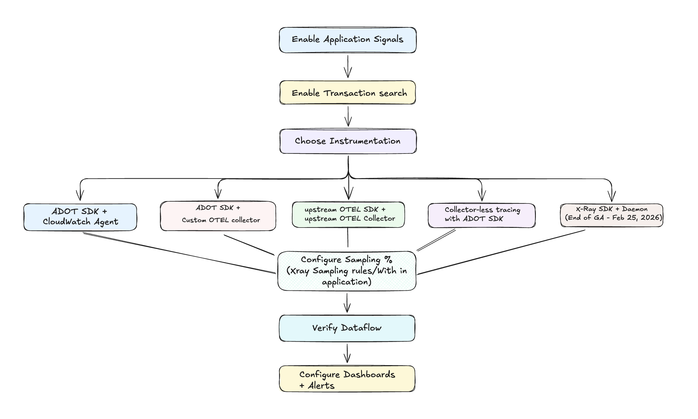

# Setting up Application Signals + Transaction Search

## High-Level Setup Process



## Step 1: Enable Application Signals in your account

Refer to [Enable Application Signals in your account](https://docs.aws.amazon.com/AmazonCloudWatch/latest/monitoring/CloudWatch-Application-Signals-Enable.html) documentation.

## Step 2: Enable Transaction Search

Refer to [Enable transaction search](https://docs.aws.amazon.com/AmazonCloudWatch/latest/monitoring/Enable-TransactionSearch.html) documentation.

## Step 3: Choose Your Instrumentation Strategy

Based on your requirements, select one of the instrumentation approaches:

### Decision Matrix

| Approach | Best For | Key Benefits |
|---|---|---|
| [**ADOT SDK + CloudWatch Agent**](instrumentation-setups#adot-sdk--cloudwatch-agent) | AWS-native environments, deep service integration | Tight AWS integration, Container Insights correlation, managed experience |
| [**ADOT SDK + Custom OTEL Collector**](instrumentation-setups#adot-sdk--custom-otel-collector) | Multi-destination telemetry with full Application Signals support | Client-side RED metrics, App Signals processor, multi-destination flexibility |
| [**Upstream OTEL SDK + OTEL Collector**](instrumentation-setups#upstream-opentelemetry-sdk--otel-collector) | Vendor-neutral strategy, non-ADOT languages, multi-cloud | Full vendor neutrality, any OTEL-supported language, no AWS SDK dependency |
| [**Direct OTLP Endpoint (Collector-less tracing)**](instrumentation-setups#collector-less-tracing-with-otlp-endpoints) | Resource-efficient applications, minimal infrastructure | Minimal overhead, simplified architecture, reduced infrastructure |
| [**X-Ray SDKs**](instrumentation-setups#existing-x-ray-sdk--x-ray-daemon-end-of-support-timeline) | Legacy X-Ray users, gradual migration | Existing investment protection, minimal change requirements. ⚠️ End of support Feb 2027 |

### Feature Comparison

| Feature | ADOT SDK + CW Agent | ADOT SDK + Custom OTEL Collector | Upstream OTEL SDK + OTEL Collector | Collector-less tracing with ADOT SDK | X-Ray SDKs |
|---|---|---|---|---|---|
| **AWS Support** | ✅ Yes | ⚠️ Only for data sent to AWS | ⚠️ Only for data sent to AWS | ✅ Yes | ✅ Yes (⚠️ End of support Feb 2027) |
| **Nonstandard language support** | ❌ No | ❌ No | ✅ Yes | ❌ No | ❌ No |
| **Container Insights integration** | ✅ Yes | ❌ No | ❌ No | ❌ No | ❌ No |
| **Out of the box logging with CloudWatch Logs** | ✅ Yes | ❌ No | ❌ No | ✅ Yes | ❌ No |
| **Out of the box runtime metrics** | ✅ Yes | ✅ Yes | ✅ Yes | ❌ No | ❌ No |
| **Always gets RED metrics on 100% of traffic** | ✅ Yes (client-side) | ✅ Yes (client-side) | ⚠️ Only with 100% sampling (server-side) | ⚠️ Only with 100% sampling (server-side) | ⚠️ Only with 100% sampling (server-side) |
| **Multi-destination telemetry** | ❌ No | ✅ Yes | ✅ Yes | ❌ No | ❌ No |

For detailed implementation of each approach, see [Instrumentation Setups](instrumentation-setups).

## Step 4: Understanding Sampling and Trace Indexing

Application Signals separates **request sampling** from **trace indexing**:
- **Request Sampling**: Determines which percentage of requests are sampled and sent to AWS
- **Selective Trace Indexing**: Percentage of spans stored in CloudWatch Logs that are sent to X-Ray backend for trace analytics

### Request Sampling

**1. Default Application Signals Sampling Configuration**

When you enable Application Signals, **X-Ray centralized sampling is enabled by default** with these settings:

| Setting | Default Value | Description |
|---|---|---|
| **Reservoir** | 1 request/second | Fixed number of requests sampled per second |
| **Fixed Rate** | 5% | Percentage of additional requests beyond reservoir |

The environment variables for the AWS Distro for OpenTelemetry (ADOT) SDK agent are set as follows:

| Environment Variable | Value | Description |
|---|---|---|
| **OTEL_TRACES_SAMPLER** | `xray` | Uses X-Ray sampling service |
| **OTEL_TRACES_SAMPLER_ARG** | `endpoint=http://cloudwatch-agent.amazon-cloudwatch:2000` | CloudWatch agent endpoint |

**2. Configuring 100% Sampling for visibility of all requests**

**Option 1: X-Ray Centralized Sampling (Recommended)**
- Configure X-Ray sampling rules for 100% sampling
- Refer to [Configure sampling rules](https://docs.aws.amazon.com/xray/latest/devguide/xray-console-sampling.html) documentation
- Benefits: Centralized control, dynamic updates, service-specific rules

**Option 2: Local sampling in the ADOT SDK**

For local control, disable X-Ray centralized sampling:

| Environment Variable | Value | Description |
|---|---|---|
| **OTEL_TRACES_SAMPLER** | `parentbased_traceidratio` | Local sampling |
| **OTEL_TRACES_SAMPLER_ARG** | `1.0` | 100% sampling rate |


**3. Alternative: X-Ray Adaptive Sampling (Cost-Optimized Approach)**

If you don't need 100% sampling but want better anomaly coverage, consider X-Ray adaptive sampling which automatically increases sampling during error spikes and latency outliers while maintaining cost-effective baseline rates:

Key Benefits:
- **Automatic anomaly detection**: Boosts sampling during HTTP 5xx errors or high latency
- **Cost control**: Maintains low baseline sampling (e.g., 5%) during normal operations
- **Configurable boost limits**: Set maximum sampling rates and cooldown periods
- **Critical trace capture**: Ensures anomaly spans are captured even when full traces aren't sampled
- **Centralized control**: Configure through X-Ray sampling rules without application code changes

Configuration Example:
```json
{
  "RuleName": "AdaptiveProductionRule",
  "Priority": 1,
  "ReservoirSize": 1,
  "FixedRate": 0.05,
  "ServiceName": "*",
  "ServiceType": "*",
  "Host": "*",
  "HTTPMethod": "*",
  "URLPath": "*",
  "SamplingRateBoost": {
    "MaxRate": 0.25,
    "CooldownWindowMinutes": 10
  }
}
```

Requirements:
- ADOT Java SDK (v2.11.5 or higher)
- Must run with CloudWatch Agent or OpenTelemetry Collector
- Compatible with Amazon EC2, ECS, EKS, and self-hosted Kubernetes

For detailed setup instructions, refer to [X-Ray Adaptive Sampling](https://docs.aws.amazon.com/xray/latest/devguide/xray-adaptive-sampling.html) documentation.

:::info
For more advanced sampling configurations, see [OTEL_TRACES_SAMPLER](https://opentelemetry.io/docs/concepts/sdk-configuration/general-sdk-configuration/#otel_traces_sampler) documentation.
:::

### Trace Indexing

**1. Default Indexing Rate:**
- 1% indexing is included at no additional charge
- Above 1% indexing incurs X-Ray pricing charges
- Refer to [CloudWatch Pricing](https://aws.amazon.com/cloudwatch/pricing/) documentation for current rates

**2. Custom Indexing Rates:**
```bash
# Higher indexing for applications requiring more X-Ray analytics (incurs charges)
aws cloudwatch put-transaction-search-configuration \
  --span-indexing-rate 0.10  # 10% indexing - X-Ray charges apply

# Lower indexing for cost optimization (still within free tier)
aws cloudwatch put-transaction-search-configuration \
  --span-indexing-rate 0.005  # 0.5% indexing - no additional charges
```
