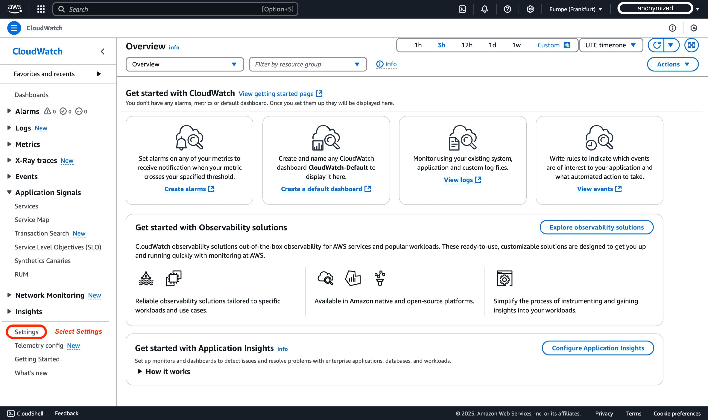
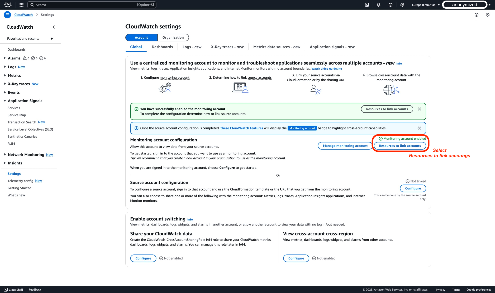
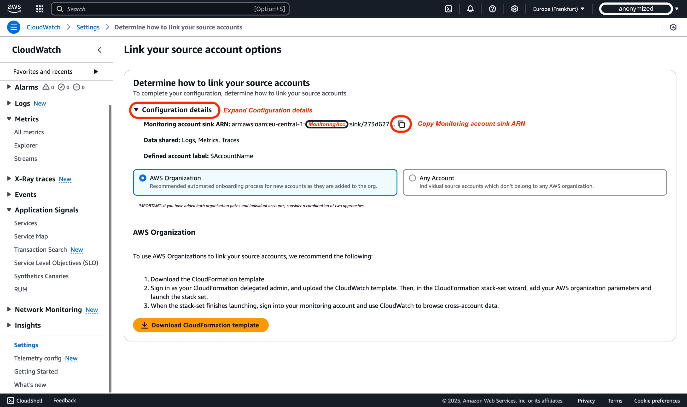
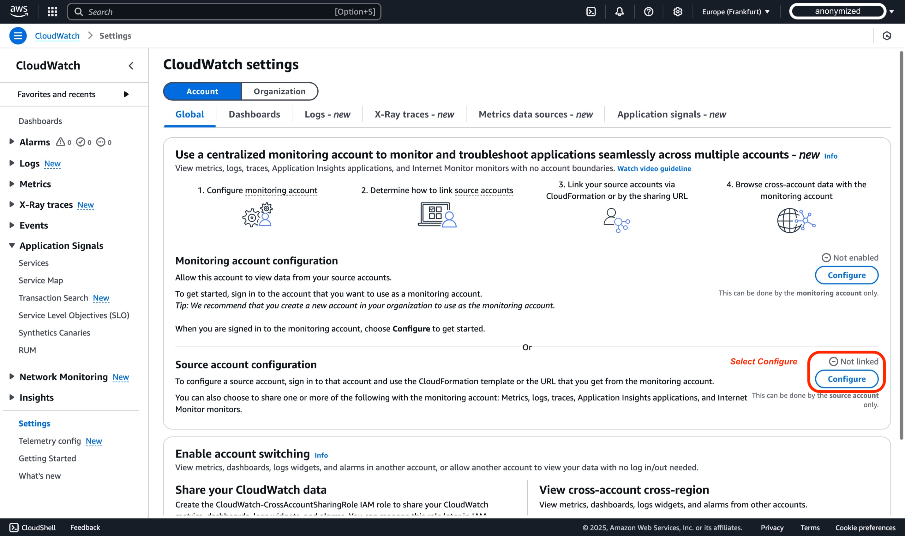
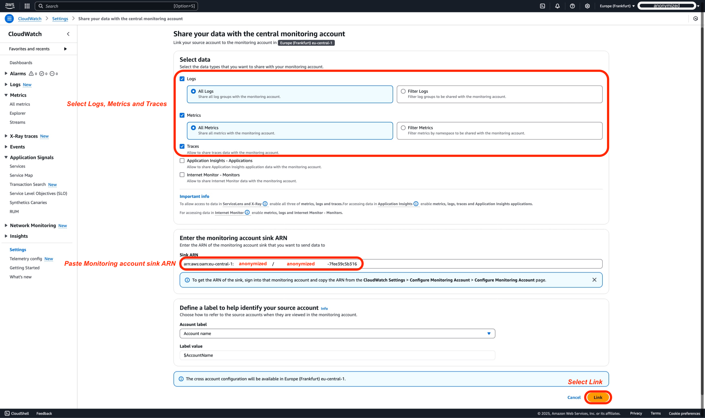
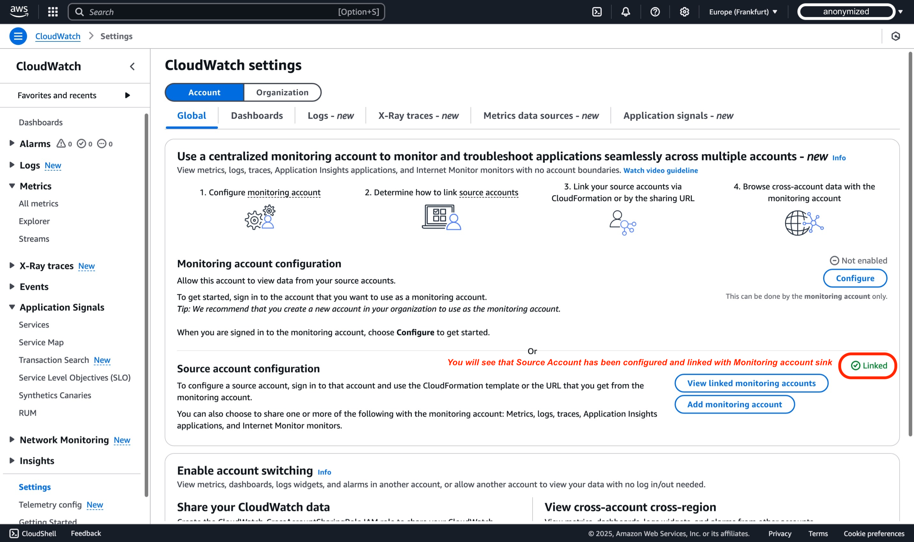
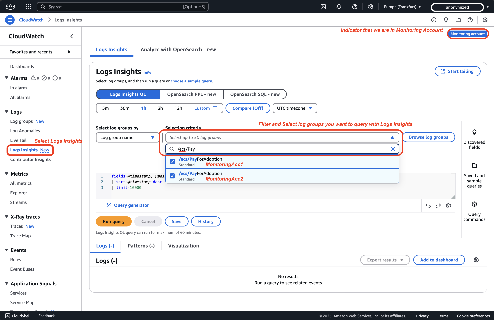
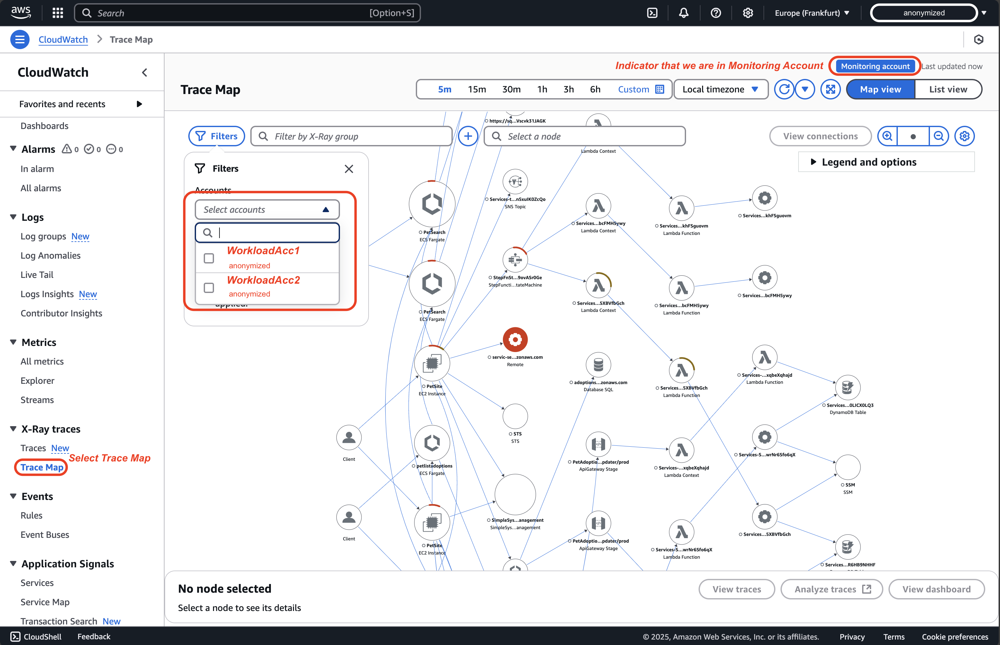
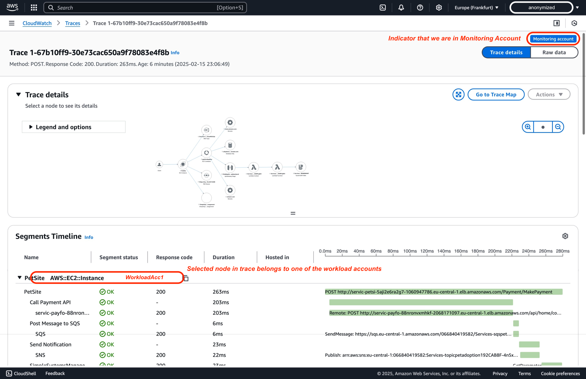

# CloudWatch Cross-Account Observability

Monitoring applications deployed across multiple AWS accounts within a single AWS Region can be challenging. [Amazon CloudWatch's cross-account observability](https://aws.amazon.com/blogs/aws/new-amazon-cloudwatch-cross-account-observability/)[^1] simplifies this process by enabling seamless monitoring and troubleshooting of applications spanning multiple accounts within a [**AWS Region**](https://docs.aws.amazon.com/AmazonCloudWatch/latest/monitoring/CloudWatch-Unified-Cross-Account.html)[^2]. This tutorial provides a step-by-step guide, complete with screenshots, on configuring cross-account observability between two AWS accounts. Additionally, it's worth noting that deployment can also be achieved through AWS Organizations for broader scalability.

## Terminology

For effective cross-account observability with Amazon CloudWatch, you must understand the following key terms:

| **Term** | **Description** |
|------|-------------|
| **Monitoring Account** | A central AWS account that can view and interact with observability data generated from multiple source accounts |
| **Source Account** | An individual AWS account that generates observability data for the resources that reside in it |
| **Sink** | A resource in a monitoring account that serves as an attachment point for source accounts to link and share their observability data. Each account can have one **Sink** per [AWS Region](https://docs.aws.amazon.com/AmazonCloudWatch/latest/monitoring/CloudWatch-Unified-Cross-Account.html)[^2] |
| **Observability Link** | A resource that represents the connection established between a source account and a monitoring account, facilitating the sharing of observability data. Links are managed by the source account. |

Understand these definitions to successfully configure and manage cross-account observability in Amazon CloudWatch.

## Step by Step Tutorial via AWS Console

### Prerequisites

1. To complete this tutorial, you need three AWS accounts: one Monitoring Account and two Source Accounts.

2. A user or role must have at least the permissions documented in the [AWS CloudWatch cross-account setup guide](https://docs.aws.amazon.com/AmazonCloudWatch/latest/monitoring/CloudWatch-Unified-Cross-Account-Setup.html#CloudWatch-Unified-Cross-Account-Setup-permissions)[^3] to create cross-account links between a monitoring account and source accounts.

<div style={{ textAlign: 'center' }}>

</div>

### Step 1: Set up a Monitoring Account

#### Monitoring Account

To set up a monitoring account, follow these steps:

1. Open the CloudWatch console at [https://console.aws.amazon.com/cloudwatch](https://console.aws.amazon.com/cloudwatch) and select the AWS region where you will configure the cross-account monitoring account, for the scope of this demo we will use Europe (Frankfurt) region (eu-central-1).


2. In the navigation pane, select **Settings**.  


3. For the scope of this demo, we will use the default Account Global settings, and then select **Configure** within the section of **Monitoring account configuration**.


4. After selecting the types of data to share with the monitoring account, paste the Source Account IDs into the "List source accounts" box. For this demo, IDs of WorkloadAcc1 and WorkloadAcc2 are used. Metrics, Logs, and Traces are selected. Only Metrics and Logs allow filtering; all others are always fully shared. Note that for ServiceLens and X-Ray, you must enable metrics, logs, and traces. For Application Insights, also enable Application Insights applications. For Internet Monitor, enable metrics, logs, and Internet Monitor – Monitors.


:::info
When configuring telemetry types in CloudWatch Cross-Account Observability, it's important to understand their dependencies. While Metrics, Logs and Traces can be configured independently, other CloudWatch functionalities have specific requirements. ServiceLens and X-Ray functionality requires all three: Metrics, Logs, and Traces. For more advanced monitoring, Application Insights needs Metrics, Logs, Traces, and Application Insights applications enabled. Similarly, Internet Monitor requires Metrics, Logs, and Internet Monitor - Monitors to be enabled. The following table details these dependencies:
:::
    | Telemetry Type | Description | Dependencies for CloudWatch Cross-Account Observability |
    |----------------|-------------|-----------------------------------------------------|
    | Metrics in Amazon CloudWatch | Share all metric namespaces or filter to a subset | None |
    | Log Groups in Amazon CloudWatch Logs | Share all log groups or filter to a subset | None |
    | ServiceLens and X-Ray | Share all traces (no filtering available) | Requires enabling Metrics, Logs, and Traces for ServiceLens and X-Ray |
    | Applications in Amazon CloudWatch Application Insights | Share all applications (no filtering available) | Requires enabling Metrics, Logs, Traces, and Application Insights applications |
    | Monitors in CloudWatch Internet Monitor | Share all monitors (no filtering available) | Requires enabling Metrics, Logs, and Internet Monitor - Monitors |

5. In the AWS Console of your Monitoring Account, you should see the following illustration, confirming that the Monitoring Account has been configured successfully.


:::tip
	After successfully configuring your monitoring account, you need to link your source accounts. There are two main methods for linking source accounts: using AWS Organizations and linking individual accounts. In Step 2, we will go through the process of configuring an individual account. However, before logging into the Source Account and making changes, we need to collect information from the just-configured Monitoring Account, such as the Monitoring account sink ARN.
:::

6. In the AWS Console where you stopped previously in Monitoring Account, select **Resources to link accounts**


7. In the AWS Console, expand the 'Configuration details' section, this is where you will find Monitoring account sink ARN that you need to copy and save somewhere, this information will be needed in Step 2 when you are linking source account.


#### Summary

In the previous steps, we configured the Monitoring account sink to be linked with Source Accounts, whether they are standalone or part of an organization. Essentially, the steps above created a Configuration policy in the Monitoring account sink that allows source accounts to integrate. A sample policy generated through AWS Console configuration can be found below:

```
{
    "Version": "2012-10-17",
    "Statement": [
        {
            "Effect": "Allow",
            "Principal": {
                "AWS": [
                    "${WorkloadAcc1}", // Workload Account
                    "${WorkloadAcc2}"  // Workload Account
                ]
            },
            "Action": [
                "oam:CreateLink",
                "oam:UpdateLink"
            ],
            "Resource": "*",
            "Condition": {
                "ForAllValues:StringEquals": {
                    "oam:ResourceTypes": [
                        "AWS::Logs::LogGroup",
                        "AWS::CloudWatch::Metric",
                        "AWS::XRay::Trace"
                    ]
                }
            }
        }
    ]
}
```

If you were to configure using AWS Organizations, you would end up with a Configuration Policy applied to the Monitoring account sink that doesn't require further modifications, as you would trust all AWS accounts within your AWS organization to create or update links based on the PrincipalOrgID condition. Such a sample policy can be found below:

```
{
    "Version": "2012-10-17",
    "Statement": [
        {
            "Effect": "Allow",
            "Principal": "*",
            "Action": ["oam:CreateLink", "oam:UpdateLink"],
            "Resource": "*",
            "Condition": {
                "ForAllValues:StringEquals": {
                    "oam:ResourceTypes": [
                        "AWS::Logs::LogGroup",
                        "AWS::CloudWatch::Metric",
                        "AWS::XRay::Trace",
                        "AWS::ApplicationInsights::Application",
                        "AWS::InternetMonitor::Monitor"
                    ]
                },
                "ForAnyValue:StringEquals": {
                    "aws:PrincipalOrgID": "${OrganizationId}" // AWS Organization as Condition
                }
            }
        }
    ]
}
```


### Step 2: Link the source accounts

#### Linking individual accounts

After configuring the monitoring account in Step 1, we'll now configure an individual AWS source account. This approach is particularly useful when working with accounts outside your organization or when you need to establish monitoring for specific standalone accounts. While AWS Organizations offers a scalable solution for managing multiple accounts, individual account setup provides more granular control and flexibility. 

Before proceeding with the source account configuration, ensure you have copied the Monitoring account sink ARN that we obtained in Step 1, as this will be required for establishing the connection.

To link individual source accounts, follow these steps:

1. Open the CloudWatch console at [https://console.aws.amazon.com/cloudwatch](https://console.aws.amazon.com/cloudwatch) and select the AWS region where you will configure the cross-account monitoring account, for the scope of this demo we will use Europe (Frankfurt) region (eu-central-1).
 

2. In the navigation pane, select **Settings**.  


3. For the scope of this demo, we will stay within default configuration of Account Global settings, and then select **Configure** within the section of **Source account configuration**.


4. In the AWS Console, We will select Logs, Metrics, and Traces as Data Types. By default, all will be shared; however, you can choose to be more granular by filtering Logs and Metrics that you want to share with the Monitoring account. Next step that needs to be done before linking is Entering the Monitoring account sink ARN that we copied from before, when we configured monitoring account.


5. The final step before finalizing the Source account configuration is to confirm that data from the Source Account will be shared with the Monitoring Account. You will confirm this action by typing 'Confirm' in the pop-up box.


6. In the AWS console, under the 'Source account configuration' section, you should see a green status indicating that the account is 'linked'.


:::tip
    Repeat the Step 2 for WorkloadAcc2, so Observability telementry from both Workload accounts will be shared with Monitoring account
:::

### Step 3: Validate configuration

:::tip
    Ensure you are logged into the Monitoring Account
:::

1. Open the CloudWatch console at [https://console.aws.amazon.com/cloudwatch](https://console.aws.amazon.com/cloudwatch) and select the AWS region where you have configured the cross-account monitoring in Step 1, for the scope of this demo we use Europe (Frankfurt) region (eu-central-1)
 

2. In the navigation pane, select **Settings**.  


3. Select **Manage monitoring account** within the section of **Monitoring account configuration**.
 

4. In the Linked source accounts pane, within Monitoring account configurations page, you will see two workload accounts linked as **Source accounts***.  


#### Alternative: AWS Organizations Integration

AWS CloudWatch cross-account observability enables centralized monitoring and troubleshooting of applications spanning multiple AWS accounts within a region. By integrating AWS Organizations, you can streamline the setup and automate configurations across all accounts. This approach efficiently handles monitoring across numerous accounts within your organization.

##### Prerequisites:

- AWS Organizations enabled, with member accounts properly included[^4].  
- Permissions to deploy AWS CloudFormation StackSets[^5] in child accounts, including IAM roles with adequate CloudFormation actions allowed to create links[^3].  
- A monitoring account with a configured [sink policy](#organization-sample-policy) that permits source accounts within your organization (or specific OUs) to create and update observability links[^6].

AWS CloudFormation StackSets automates the deployment of necessary service-linked roles and observability configurations in all member accounts. With auto-deployment enabled, newly created AWS accounts automatically inherit the required observability settings, reducing administrative overhead while maintaining uniform monitoring practices throughout your AWS environment.

For a step-by-step implementation guide, including IAM permissions, sample StackSet templates, and monitoring policies, refer to the official AWS documentation[^7].

## Video Tutorial

For a detailed walkthrough of cross-account observability setup, you can also watch the official AWS YouTube guide, “Enable Cross-Account Observability in Amazon CloudWatch | Amazon Web Services.” This tutorial visually demonstrates how to configure a centralized monitoring account, link multiple source accounts, and explore shared observability data within the CloudWatch console.

<!-- blank line -->
<figure class="video_container">
  <iframe width="560" height="315" src="https://www.youtube.com/embed/lUaDO9dqISc?si=mPewnqzWBqBZKmyg" title="YouTube video player" frameborder="0" allow="accelerometer; autoplay; clipboard-write; encrypted-media; gyroscope; picture-in-picture; web-share" referrerpolicy="strict-origin-when-cross-origin" allowfullscreen></iframe>
</figure>
<!-- blank line -->

## Querying Cross-Account Telemetry Data

:::tip
    Ensure you are logged into the Monitoring Account
:::

:::info
    We are reusing the Pet Adoption application from the [Observability One Workshop](https://catalog.workshops.aws/observability/en-US/architecture)[^8]. For this demo, it is deployed in both workload accounts to illustrate cross-account observability.
:::

### Metrics

To monitor metrics from multiple accounts in a centralized location:

1. In the CloudWatch console of your monitoring account, navigate to "All Metrics" in the left navigation pane, You can now view metrics from all linked source accounts.


2. You can use the Account Id filter `:aws.AccountId=` to filter specific account metrics, or you can dive by selecting Namespaces and dimensions. For the scope of this demo, let's follow the guide from [View Metrics in Observability One Workshop](https://catalog.workshops.aws/observability/en-US/aws-native/metrics/viewmetrics)[^8]. We will now choose the ContainerInsights namespace and select the ClusterName, Namespace, and PodName dimensions. Then, we will filter by the metric name pod_cpu_utilization. As you can see, you have metrics from both workload accounts that you can graph.


#### Alarms

[Amazon CloudWatch cross-account alarms](https://aws.amazon.com/about-aws/whats-new/2021/08/announcing-amazon-cloudwatch-cross-account-alarms/)[^9] let you monitor metrics across multiple AWS accounts from a central Monitoring Account. You can create metric alarms, which watch a single metric or the output of a math expression, and composite alarms, which evaluate the states of multiple alarms (including other composite alarms). For example, you might set an alarm to trigger when CPU utilization exceeds 80% across all production accounts. Once triggered, the alarm can take actions such as sending Amazon SNS notifications or invoking AWS Lambda functions, ensuring you receive timely alerts and can respond proactively. By centralizing alarm creation in the Monitoring Account, you streamline alerting and gain a unified operational view of your workloads.

Continuing from the previous step in [Metrics](#metrics), you can create an alarm for a specific metric by selecting "Graphed metrics" and then choosing "Create Alarm."


### Logs

You can query and analyze logs from multiple accounts in a single interface using Logs Insights, or you can live tail logs. Here's how to query logs using Logs Insights across accounts:

1. In the CloudWatch console, go to "Logs Insights" and Select log groups from different accounts using the log group selector


2. Next step is to write your CloudWatch Logs Insights query, for the scope of this demo we will take and slightly modify query from [One Observability Workshop](https://catalog.workshops.aws/observability/en-US/aws-native/logs/logsinsights/fields#step-4:-aggregate-on-our-chosen-fields)[^8], from section AWS native Observability subsection Logs insight, We want to see in last hours how many different pets were adopted and how much per Workload account.
    
    ```
    filter @message like /POST/ and @message like /completeadoption/
    | parse @message "* * * *:* *" as method, request, protocol, ip, port, status
    | parse request "*?petId=*&petType=*" as requestURL, id, type
    | parse @log "*:*" as accountId, logGroupName // Modified to parse accountId from @log information
    | stats count() by type,accountId // Modified to group by previously parsed accountId
    ```
    
    

Here's how to Live Tail logs across accounts:

1. In the CloudWatch console, go to **Live Tail** and in Filter pane, and then **Select log groups** from different accounts using the log group selector, and then select Start.


### Traces

1. In the CloudWatch console of your monitoring account, choose Trace map under X-Ray traces in the navigation pane. The trace map displays data from all linked source accounts. Use the filter for Accounts if needed.  


2. On the trace map, each node indicates which AWS account it belongs to. Choose View traces for deeper analysis of a specific span.  


3. Select a specific trace for more detailed insights into the individual segments.  


4. Dive deeper into the end-to-end trace spans to learn about the components in each traced path.  



## Conclusion

Configuring cross-account observability in Amazon CloudWatch provides a centralized view of your application performance and health across multiple AWS accounts. This simplifies monitoring, troubleshooting, and analysis of your applications, regardless of the accounts they reside in. By following the steps outlined in this tutorial, you can effectively set up a monitoring account, link your source accounts using either AWS Organizations or individual account linking, and verify your configuration. You can now leverage the CloudWatch console to monitor and troubleshoot applications that span multiple accounts 1.

To further enhance your cross-account monitoring capabilities, explore different CloudWatch features such as dashboards, alarms, and logs. These features provide deeper insights into your application performance and health, enabling you to proactively identify and address potential issues.

## Resources

[^1]: [AWS Blog - Amazon CloudWatch Cross-Account Observability](https://aws.amazon.com/blogs/aws/new-amazon-cloudwatch-cross-account-observability/)

[^2]: [CloudWatch cross-account observability](https://docs.aws.amazon.com/AmazonCloudWatch/latest/monitoring/CloudWatch-Unified-Cross-Account.html)

[^3]: [Permissions needed to create links](https://docs.aws.amazon.com/AmazonCloudWatch/latest/monitoring/CloudWatch-Unified-Cross-Account-Setup.html#CloudWatch-Unified-Cross-Account-Setup-permissions)

[^4]: [What is AWS Organizations?](https://docs.aws.amazon.com/organizations/latest/userguide/orgs_introduction.html)

[^5]: [AWS Cloudformation StackSets and AWS Organizations](https://docs.aws.amazon.com/organizations/latest/userguide/services-that-can-integrate-cloudformation.html)  

[^6]: [Set up a monitoring account](https://docs.aws.amazon.com/AmazonCloudWatch/latest/monitoring/CloudWatch-Unified-Cross-Account-Setup.html#Unified-Cross-Account-Setup-ConfigureMonitoringAccount)

[^7]: [Use an AWS CloudFormation template to set up all accounts in an organization or an organizational unit as source accounts](https://docs.aws.amazon.com/AmazonCloudWatch/latest/monitoring/CloudWatch-Unified-Cross-Account-Setup.html#Unified-Cross-Account-SetupSource-OrgTemplate)

[^8]: [One Observability Workshop](https://catalog.workshops.aws/observability/en-US/intro)

[^9]: [Amazon CloudWatch cross account alarms](https://aws.amazon.com/about-aws/whats-new/2021/08/announcing-amazon-cloudwatch-cross-account-alarms/)
