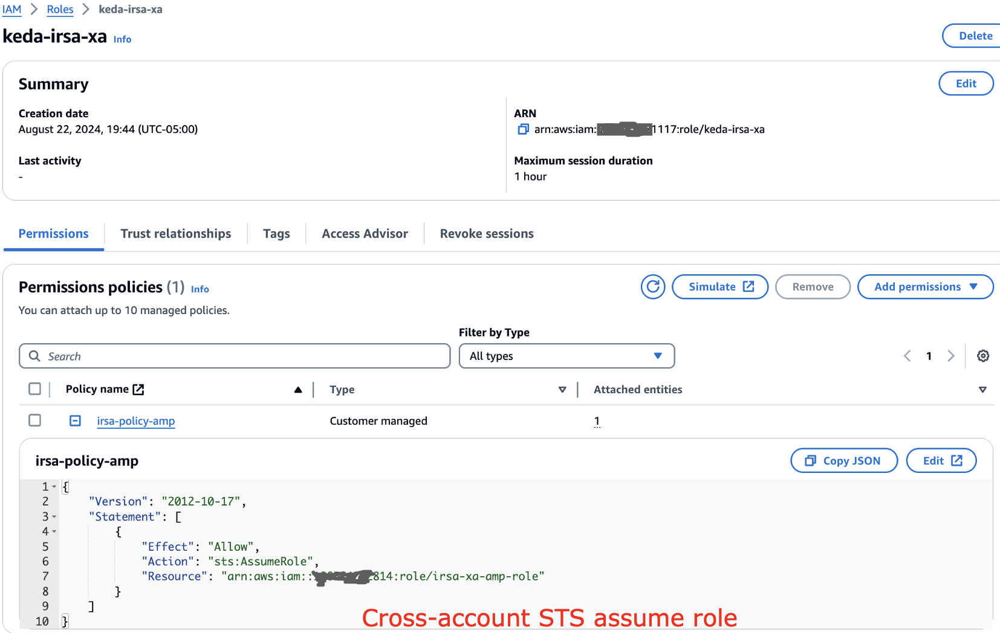
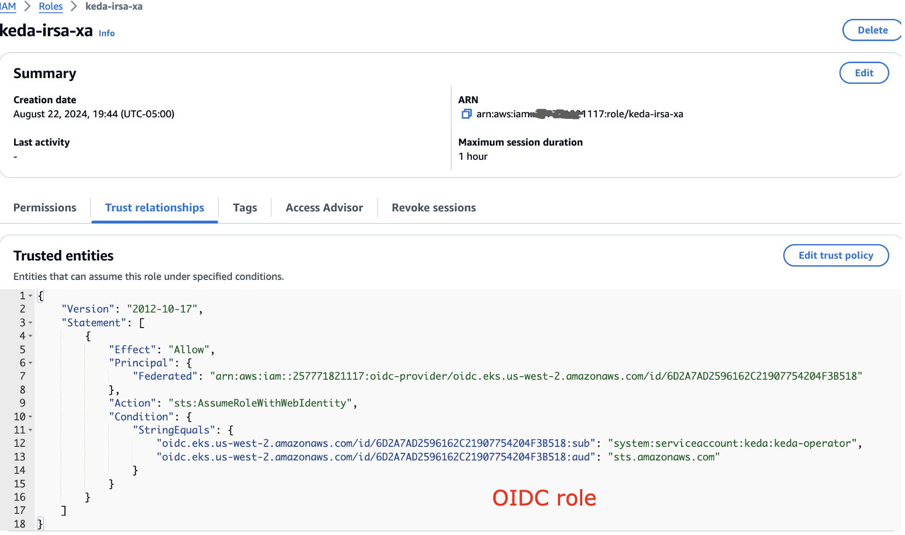
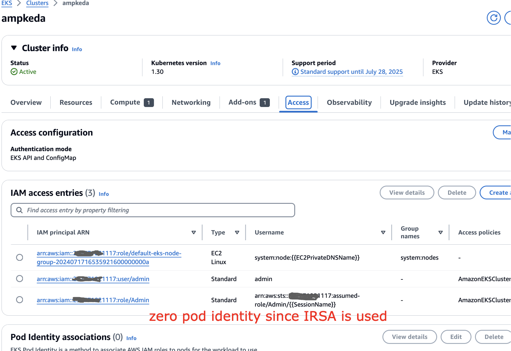
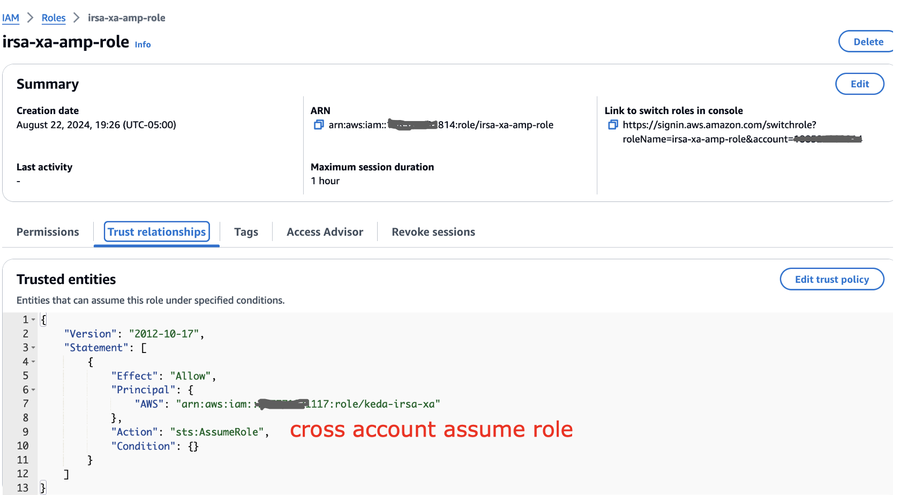
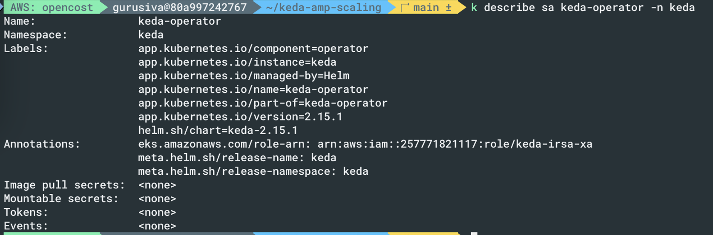
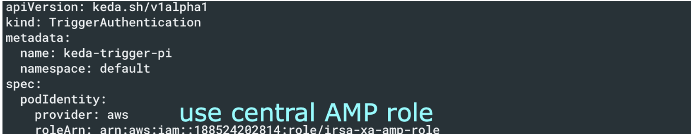
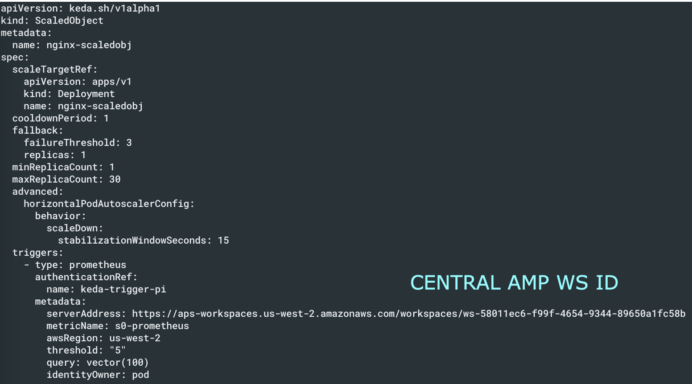
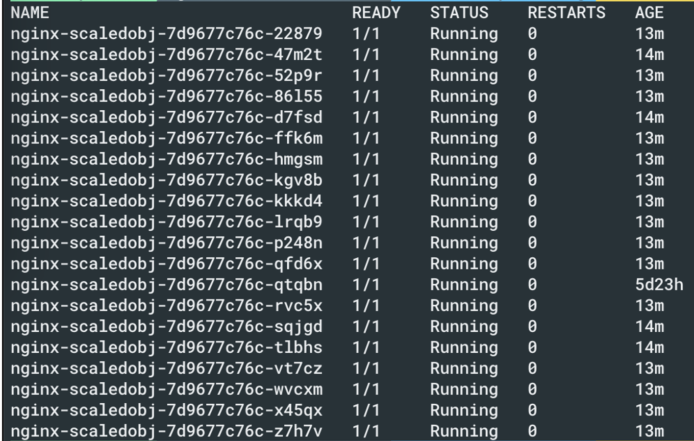

# Autoscaling applications using KEDA on AMP and EKS

# Current Landscape

Handling increased traffic on Amazon EKS applications is challenging, with manual scaling being inefficient and error-prone. Autoscaling offers a better solution for resource allocation. KEDA enables Kubernetes autoscaling based on various metrics and events, while Amazon Managed Service for Prometheus provides secure metric monitoring for EKS clusters. This solution combines KEDA with Amazon Managed Service for Prometheus, demonstrating autoscaling based on Requests Per Second (RPS) metrics. The approach delivers automated scaling tailored to workload demands, which users can apply to their own EKS workloads. Amazon Managed Grafana is used for monitoring and visualizing scaling patterns, allowing users to gain insights into autoscaling behaviors and correlate them with business events.

# Autoscaling application based on AMP metrics with KEDA 

This solution demonstrates AWS integration with open-source software to create an automated scaling pipeline. It combines Amazon EKS for managed Kubernetes, AWS Distro for Open Telemetry (ADOT) for metric collection, KEDA for event-driven autoscaling, Amazon Managed Service for Prometheus for metric storage, and Amazon Managed Grafana for visualization. The architecture involves deploying KEDA on EKS, configuring ADOT to scrape metrics, defining autoscaling rules with KEDA ScaledObject, and using Grafana dashboards to monitor scaling. The autoscaling process begins with user requests to the microservice, ADOT collecting metrics, and sending them to Prometheus. KEDA queries these metrics at regular intervals, determines scaling needs, and interacts with the Horizontal Pod Autoscaler (HPA) to adjust pod replicas. This setup enables metrics-driven autoscaling for Kubernetes microservices, providing a flexible, cloud-native architecture that can scale based on various utilization indicators.

# Cross account EKS application scaling with KEDA on AMP metrics
In this case, lets assume KEDA EKS is running on AWS Account ending with ID 117 and central AMP Account ID is ending with 814. In the KEDA EKS account, setup the cross account IAM role as below:

Also the trust relationship to be updated as below:

In the EKS cluster, you could see we dont use Pod identity since IRSA is being used here

Whilst the central AMP account we have the AMP access set up as below

The trust relationship has the access as well

And take a note of the workspace ID as below

## KEDA configuration
With the setup in place, lets ensure keda is running as below. For setup instructions refer to the blog link shared below

Ensure to use the central AMP role defined above in the configuration

In the KEDA scaler configuration, point to the central AMP account as below

And now you can see that the pods are scaled appropriately

## Blogs

[https://aws.amazon.com/blogs/mt/autoscaling-kubernetes-workloads-with-keda-using-amazon-managed-service-for-prometheus-metrics/](https://aws.amazon.com/blogs/mt/autoscaling-kubernetes-workloads-with-keda-using-amazon-managed-service-for-prometheus-metrics/)
