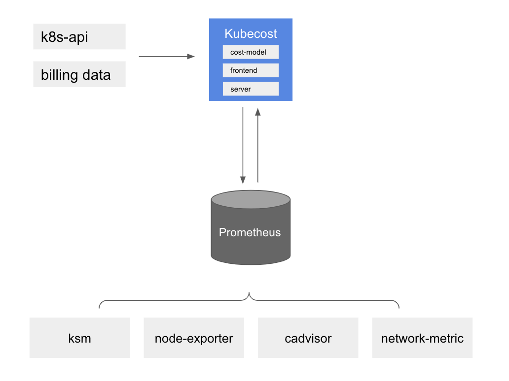
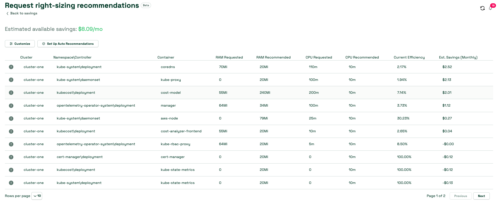

# Using Kubecost
Kubecost provides customers with visibility into spend and resource efficiency in Kubernetes environments. At a high level, Amazon EKS cost monitoring is deployed with Kubecost, which includes Prometheus, an open-source monitoring system and time series database. Kubecost reads metrics from Prometheus then performs cost allocation calculations and writes the metrics back to Prometheus. Finally, the Kubecost front end reads metrics from Prometheus and shows them on the Kubecost user interface (UI). The architecture is illustrated by the following diagram:



## Reasons to use Kubecost
As customers modernize their applications and deploy workloads using Amazon EKS, they gain efficiencies by consolidating the compute resources required to run their applications. However, this utilization efficiency comes at a tradeoff of increased difficulty measuring application costs. Today, you can use one of these methods to distribute costs by tenant:

* Hard multi-tenancy — Run separate EKS clusters in dedicated AWS accounts.
* Soft multi-tenancy — Run multiple node groups in a shared EKS cluster.
* Consumption based billing — Use resource consumption to calculate the cost incurred in a shared EKS cluster.

With Hard multi-tenancy, workloads get deployed in separate EKS clusters and you can identify the cost incurred for the cluster and its dependencies without having to run reports to determine each tenant’s spend.
With Soft multi-tenancy, you can use Kubernetes features like [Node Selectors](https://kubernetes.io/docs/concepts/scheduling-eviction/assign-pod-node/#nodeselector) and [Node Affinity](https://kubernetes.io/docs/concepts/scheduling-eviction/assign-pod-node/#affinity-and-anti-affinity) to instruct Kubernetes Scheduler to run a tenant’s workload on dedicated node groups. You can tag the EC2 instances in a node group with an identifier (like product name or team name) and use [tags](https://docs.aws.amazon.com/awsaccountbilling/latest/aboutv2/cost-alloc-tags.html) to distribute costs.
A downside of the above two approach is that you may end up with unused capacity and may not fully utilize the cost savings that come when you run a densely packed cluster. You still need ways to allocate cost of shared resources like Elastic Load Balancing, network transfer charges.

The most efficient way to track costs in multi-tenant Kubernetes clusters is to distribute incurred costs based on the amount of resources consumed by workloads. This pattern allows you to maximize the utilization of your EC2 instances because different workloads can share nodes, which allows you to increase the pod-density on your nodes. However, calculating costs by workload or namespaces is a challenging task. Understanding the cost-responsibility of a workload requires aggregating all the resources consumed or reserved during a time-frame, and evaluating the charges based on the cost of the resource and the duration of the usage. This is the exact challenge that Kubecost is dedicated to tackling.

:::tip
    Take a look at our [One Observability Workshop](https://catalog.workshops.aws/observability/en-US/aws-managed-oss/amp/ingest-kubecost-metrics) to get a hands-on experience on Kubecost.
:::

## Recommendations
### Cost Allocation
The Kubecost Cost Allocation dashboard allows you to quickly see allocated spend and optimization opportunity across all native Kubernetes concepts, e.g. namespace, k8s label, and service. It also allows for allocating cost to organizational concepts like team, product/project, department, or environment. You can modify Date range, filters to derive insights about specific workload and save the report. To optimize the Kubernetes cost, you should be paying attention to the efficiency and cluster idle costs.


### Efficiency

Pod resource efficiency is defined as the resource utilization versus the resource request over a given time window. It is cost-weighted and can be expressed as follows:
```
(((CPU Usage / CPU Requested) * CPU Cost) + ((RAM Usage / RAM Requested) * RAM Cost)) / (RAM Cost + CPU Cost)
```
where CPU Usage = rate(container_cpu_usage_seconds_total) over the time window RAM Usage = avg(container_memory_working_set_bytes) over the time window

As explicit RAM, CPU or GPU prices are not provided by AWS, the Kubecost model falls back to the ratio of base CPU, GPU and RAM price inputs supplied. The default values for these parameters are based on the marginal resource rates of the cloud provider, but they can be customized within Kubecost. These base resource (RAM/CPU/GPU) prices are normalized to ensure the sum of each component is equal to the total price of the node provisioned, based on billing rates from your provider

It is the responsibility of each service team to move towards maximum efficiency and fine tune the workloads to achieve the goal.

### Idle Cost
Cluster idle cost is defined as the difference between the cost of allocated resources and the cost of the hardware they run on. Allocation is defined as the max of usage and requests. It can also be expressed as follows:
```
idle_cost = sum(node_cost) - (cpu_allocation_cost + ram_allocation_cost + gpu_allocation_cost)
```
where allocation = max(request, usage)

So, idle costs can also be thought of as the cost of the space that the Kubernetes scheduler could schedule pods, without disrupting any existing workloads, but it is not currently. It can be distributed to the workloads or cluster or by nodes depending on how you want to configure.


### Network Cost

Kubecost uses best-effort to allocate network transfer costs to the workloads generating those costs. The accurate way of determining the network cost is by using the combination of  [AWS Cloud Integration](https://docs.kubecost.com/install-and-configure/install/cloud-integration/aws-cloud-integrations) and [Network costs daemonset](https://docs.kubecost.com/install-and-configure/advanced-configuration/network-costs-configuration). 

You would want to take into account your efficiency score and Idle cost to fine tune the workloads to ensure you utilize the cluster to its complete potential. This takes us to the next topic namely Cluster right-sizing.

### Right-Sizing Workloads

Kubecost provides right-sizing recommendations for your workloads based on Kubernetes-native metrics. The savings panel in the kubecost UI is a great place to start.




Kubecost can give you recommendations on:

* Right sizing container request by taking a look at both over-provisioned and under-provisioned container request
* Adjust the number and size of the cluster nodes to stop over-spending on unused capacity
* Scale down, delete / resize pods that don’t send or receive meaningful rate of traffic
* Identifying workloads ready for spot nodes
* Identifying volumes that are unused by any pods


Kubecost also has a pre-release feature that can automatically implement its recommendations for container resource requests if you have the Cluster Controller component enabled. Using automatic request right-sizing allows you to instantly optimize resource allocation across your entire cluster, without testing excessive YAML or complicated kubectl commands. You can easily eliminate resource over-allocation in your cluster, which paves the way for vast savings via cluster right-sizing and other optimizations.

### Integrating Kubecost with Amazon Managed Service for Prometheus

Kubecost leverages the open-source Prometheus project as a time series database and post-processes the data in Prometheus to perform cost allocation calculations. Depending on the cluster size and scale of the workload, it could be overwhelming for a Prometheus server to scrape and store the metrics. In such case, you can use the Amazon Managed Service for Prometheus, a managed Prometheus-compatible monitoring service to store the metrics reliably and enable you to easily monitor Kubernetes cost at scale.

You must setup [IAM roles for Kubecost service accounts](https://docs.aws.amazon.com/eks/latest/userguide/iam-roles-for-service-accounts.html). Using the OIDC provider for the cluster, you grant IAM permissions to your cluster’s service accounts. You must grant appropriate permissions to the kubecost-cost-analyzer and kubecost-prometheus-server service accounts. These will be used to send and retrieve metrics from the workspace. Run the following commands on the command line:

```
eksctl create iamserviceaccount \ 
--name kubecost-cost-analyzer \ 
--namespace kubecost \ 
--cluster <CLUSTER_NAME> \
--region <REGION> \ 
--attach-policy-arn arn:aws:iam::aws:policy/AmazonPrometheusQueryAccess \ 
--attach-policy-arn arn:aws:iam::aws:policy/AmazonPrometheusRemoteWriteAccess \ 
--override-existing-serviceaccounts \ 
--approve 

eksctl create iamserviceaccount \ 
--name kubecost-prometheus-server \ 
--namespace kubecost \ 
--cluster <CLUSTER_NAME> --region <REGION> \ 
--attach-policy-arn arn:aws:iam::aws:policy/AmazonPrometheusQueryAccess \ 
--attach-policy-arn arn:aws:iam::aws:policy/AmazonPrometheusRemoteWriteAccess \ 
--override-existing-serviceaccounts \ 
--approve

```
`CLUSTER_NAME` is the name of the Amazon EKS cluster where you want to install Kubecost and "REGION" is the region of the Amazon EKS cluster.

Once complete, you will have to upgrade the Kubecost helm chart as below :
```
helm upgrade -i kubecost \
oci://public.ecr.aws/kubecost/cost-analyzer --version <$VERSION> \
--namespace kubecost --create-namespace \
-f https://tinyurl.com/kubecost-amazon-eks \
-f https://tinyurl.com/kubecost-amp \
--set global.amp.prometheusServerEndpoint=${QUERYURL} \
--set global.amp.remoteWriteService=${REMOTEWRITEURL}
```
### Accessing Kubecost UI

Kubecost provides a web dashboard that you can access either through kubectl port-forward, an ingress, or a load balancer. The enterprise version of Kubecost also supports restricting access to the dashboard using [SSO/SAML](https://docs.kubecost.com/install-and-configure/advanced-configuration/user-management-oidc) and providing varying level of access. For example, restricting team’s view to only the products they are responsible for.

In AWS environment, consider using the [AWS Load Balancer Controller](https://docs.aws.amazon.com/eks/latest/userguide/aws-load-balancer-controller.html) to expose Kubecost and use [Amazon Cognito](https://aws.amazon.com/cognito/) for authentication, authorization, and user management. You can learn more on this [How to use Application Load Balancer and Amazon Cognito to authenticate users for your Kubernetes web apps](https://aws.amazon.com/blogs/containers/how-to-use-application-load-balancer-and-amazon-cognito-to-authenticate-users-for-your-kubernetes-web-apps/)


### Multi-cluster view

Your FinOps team would want to review the EKS cluster to share recommendations with business owners. When operating at large scale, it becomes challenging for the teams to log into each cluster to view the recommendations. Multi cluster allows you to have  a single-pane-of-glass view into all aggregated cluster costs globally.  There are three options that Kubecost supports for environments with multiple clusters: Kubecost Free, Kubecost Business, and Kubecost enterprise. In the free and business mode, the cloud-billing reconciliation will be performed at each cluster level. In the enterprise mode, the cloud billing reconciliation will be performed in a primary cluster that serves the kubecost UI and uses the shared bucket where the metrics are stored.
It is important to note that metrics retention is unlimited only when you use enterprise mode.

### References
* [Hands-On Kubecost experience on One Observability Workshop](https://catalog.workshops.aws/observability/en-US/aws-managed-oss/amp/ingest-kubecost-metrics)
* [Blog - Integrating Kubecost with Amazon Managed Service for Prometheus](https://aws.amazon.com/blogs/mt/integrating-kubecost-with-amazon-managed-service-for-prometheus/)
