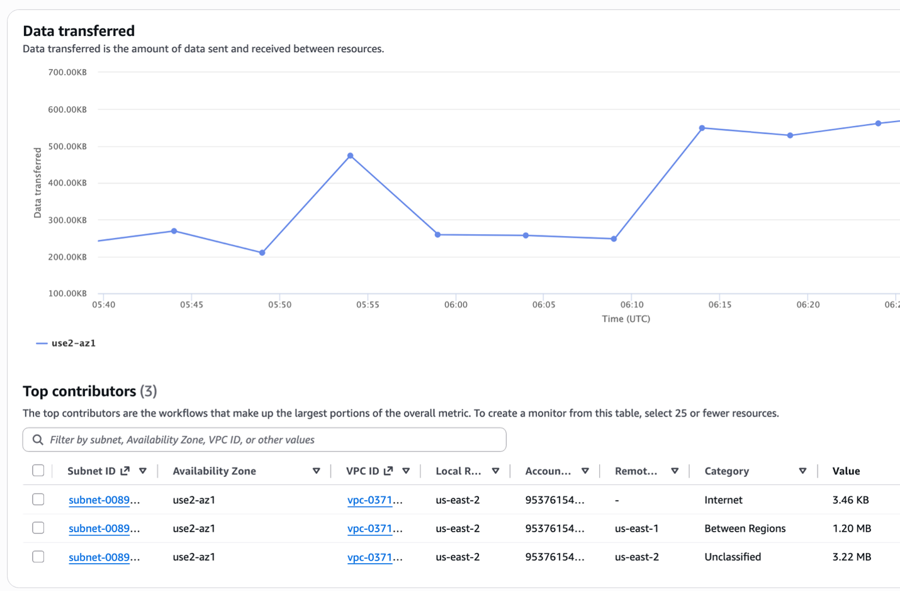
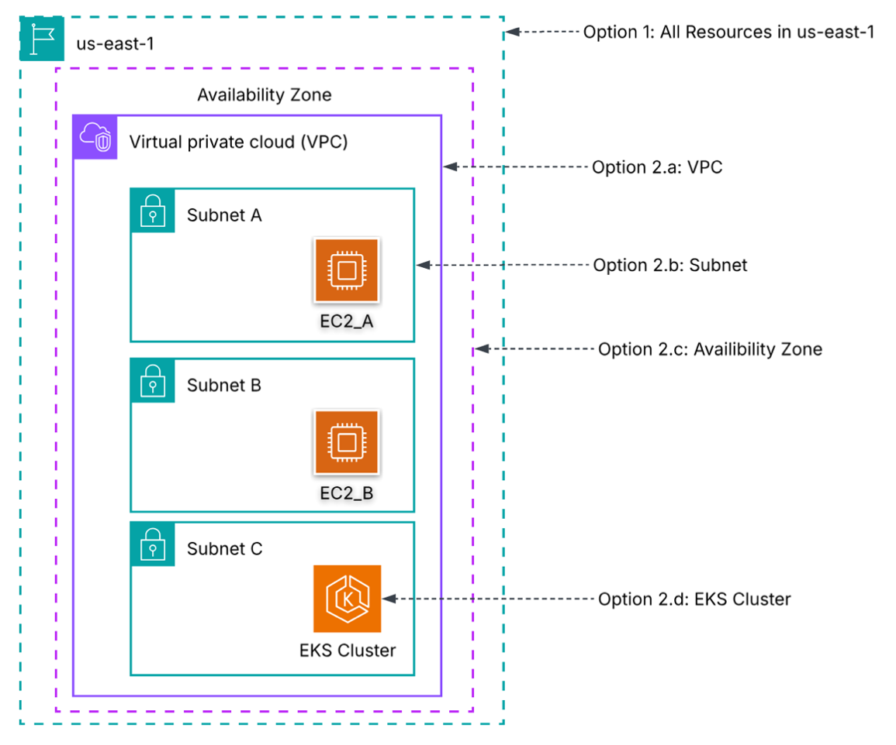
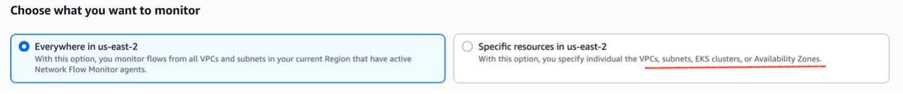
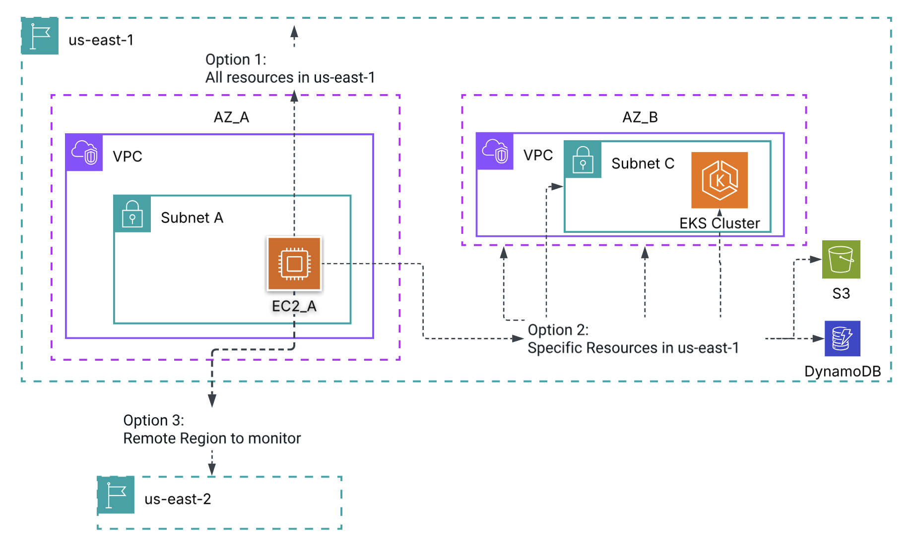
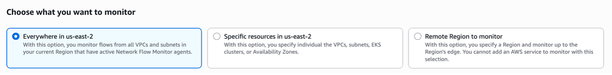

# What is Network Flow Monitor?

Network Flow Monitor is a feature of Amazon CloudWatch Network Monitoring that provides near real-time visibility into network performance between your AWS workloads. It uses lightweight agents installed on your compute resources (Amazon EC2 and Amazon EKS) to collect TCP performance metrics from actual workload traffic giving you insights into packet loss, latency, and retransmissions without injecting synthetic traffic.

Unlike active monitoring solutions that send probe packets, Network Flow Monitor performs ongoing passive monitoring by analyzing real user traffic between workloads. The agents don't have access to TCP payload data — they only receive the bpf_sock_ops structure from the Linux kernel, which provides IP addresses, TCP ports, counters, and round-trip times.

## How It Works

1. **Install Agents** on your EC2 or EKS instances: they silently collect TCP performance data from real traffic and send aggregated metrics to the backend every ~30 seconds.

2. **Review Workload Insights:** once agents are running (wait ~10 minutes for data), the console shows you which flows have the most traffic, highest latency, or most packet loss. This helps you identify problem areas.

3. **Create a Monitor:** pick the specific flows you care about (e.g., VPC-A to VPC-B). You'll get ongoing metrics, historical trends, and the Network Health Indicator (NHI) to tell you if AWS network is the problem.

We will look at each step in detail:

## 1: Agent Architecture & Installation

The Network Flow Monitor agent is a lightweight software application with two components:

- **eBPF Program:** Registered within the Linux kernel using extended Berkeley Packet Filter (eBPF). Receives events related to TCP connections raised by the kernel.
- **Aggregator:** Collects statistics from the eBPF portion and sends aggregated metrics to the Network Flow Monitor backend every ~30 seconds (25–35 seconds with jitter).

Agents use the Network Flow Monitor Publish API to send metrics to the backend server. You can also establish a private connection between your VPC and agents using AWS PrivateLink.

### Two Methods for Agent Installation

**Method 1: AWS Systems Manager (Recommended)**

**Method 2: YUM Command (Manual)**

## 2: Workload Insights

Before creating monitors, use Workload Insights to understand your traffic patterns:

- **Data Transferred:** Top contributors
- **Retransmission Timeouts:** Top contributors
- **Retransmissions:** Top contributors

Top contributors are network flows with the highest values for each metric type. Use this view to identify which flows deserve a dedicated monitor.

## 3: Monitor Setup

### 3.a: Local Resources

Which agents do you want this monitor to pay attention to?

Let me explain with an example:

**Scenario 1:** Local = "Everywhere in us-east-1"
→ Use data from agents in Subnet A + B + C (all of them)

**Scenario 2:** Local = "VPC"
→ Use data from agents in VPC

### 3.b: Remote Resources

Where is that traffic going? It's a filter on the destination.

The console gives the below options:

| Option | What it shows |
|--------|---------------|
| Everywhere | All destinations in the Region |
| Specific resources | Only the VPCs/subnets/services you pick |
| Remote Region | Traffic to another Region's edge only |

## What You See After Monitor Setup

### 1) Overview

| Metric | What It Shows |
|--------|---------------|
| Network Health Indicator (NHI) | Whether AWS infrastructure caused degradation (0=healthy, 1=degraded) |
| Data Transferred | Total bytes transferred for monitored flows |
| TCP Retransmissions | Number of retransmitted packets (indicates packet loss) |
| Retransmission Timeouts | Number of timeout events (indicates severe congestion) |
| Round-Trip Time (RTT) | Network latency between endpoints (in microseconds, can be sparse) |

### 2) Historical Explorer

The topology view displays all components in the network path with service icons and resource IDs during degradation, helping you pinpoint which network segment is causing issues.

### 3) Monitor Details

Detailed view of the specific flows and resources within your monitor configuration.

## Network Health Indicator (NHI)

NHI determines whether AWS infrastructure caused the degradation. This helps you decide: troubleshoot your workload, or escalate to AWS?

## Use Cases

- **Network Performance Baselining:** Establish baseline RTT and retransmission rates for your workloads. Understand what "normal" looks like so you can quickly detect degradation.
- **Latency Troubleshooting:** When applications experience high latency, use the NHI to determine whether the issue is in the AWS network or in your workloads — without opening a support case.
- **Cross-AZ and Cross-VPC Performance Monitoring:** Visualize performance between Availability Zones and VPCs to identify network bottlenecks and validate Transit Gateway or VPC Peering performance.
- **Application Performance Correlation:** Correlate network metrics (RTT, packet loss) with application performance issues to confirm or rule out network as the root cause.

## Pricing

| Dimension | Price |
|-----------|-------|
| Per monitored resource (one compute instance with the Network Flow Monitor agent deployed) | $0.0069 / resource / hour |
| Vended Logs | Flow monitoring vends metrics from CloudWatch: standard vended logs pricing applies |
| CloudWatch Metrics | Standard CloudWatch metrics pricing applies |

## Conclusion

| Classification | Example |
|---------------|---------|
| INTER_AZ | App server in AZ-1a talks to RDS in AZ-1b (same VPC) |
| INTRA_AZ | App server and cache in the same AZ/subnet |
| INTER_VPC | Production VPC to Shared Services VPC via TGW |
| AMAZON_S3 | Lambda/EC2 uploading logs or reading data from S3 |
| AMAZON_DYNAMODB | API backend doing read/write operations to DynamoDB |
| INTER_REGION | Database replication from us-east-1 to eu-west-1 |
| INTERNET | EC2 calling a third-party API through IGW |
| TRANSIT_GATEWAY | Traffic hitting TGW but destination can't be determined |

Network Flow Monitor fills a critical gap in AWS network observability by providing near real-time performance metrics from actual workload traffic. By leveraging lightweight eBPF-based agents and the Network Health Indicator.

## Resources

- [What is Network Flow Monitor?](https://docs.aws.amazon.com/AmazonCloudWatch/latest/monitoring/CloudWatch-NetworkFlowMonitor.html)
- [How It Works](https://docs.aws.amazon.com/AmazonCloudWatch/latest/monitoring/CloudWatch-NetworkFlowMonitor-inside-network-flow-monitor.html)
- [Components and Features](https://docs.aws.amazon.com/AmazonCloudWatch/latest/monitoring/CloudWatch-NetworkFlowMonitor-components.html)
- [Pricing](https://docs.aws.amazon.com/AmazonCloudWatch/latest/monitoring/CloudWatch-NetworkFlowMonitor.pricing.html)
- [Install Agents](https://docs.aws.amazon.com/AmazonCloudWatch/latest/monitoring/CloudWatch-NetworkFlowMonitor-agents.html)
- [Blog: Visualizing Network Performance](https://aws.amazon.com/blogs/networking-and-content-delivery/visualizing-network-performance-of-your-aws-cloud-workloads-with-network-flow-monitor/)
