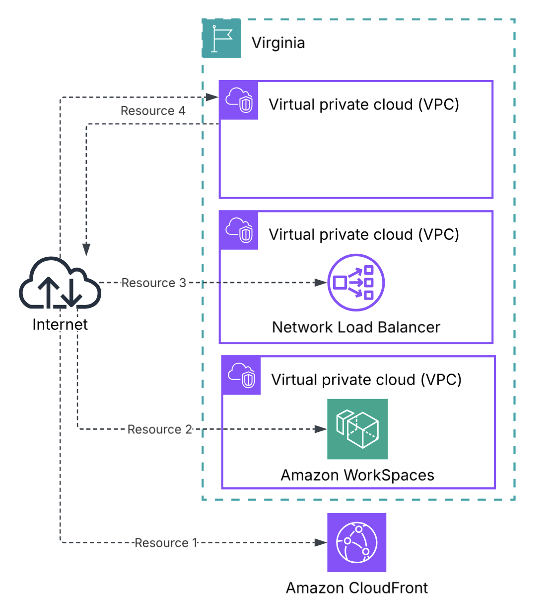
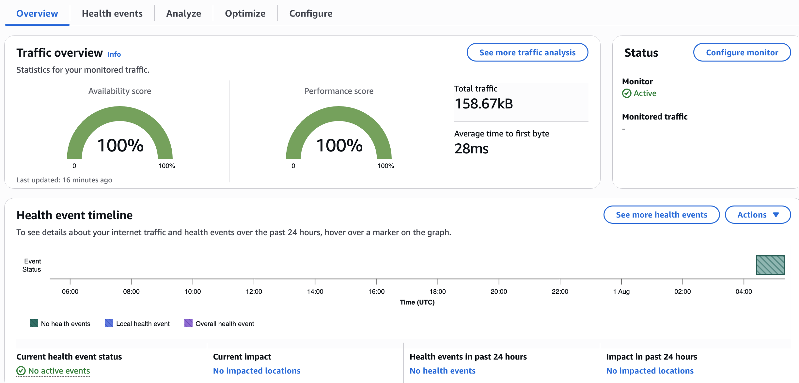
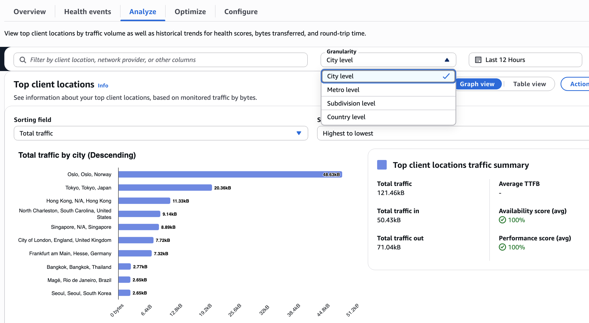

# What is Internet Monitor?

Internet Monitor is a feature of Amazon CloudWatch that provides visibility into how internet issues impact the performance and availability of your applications hosted on AWS for your end users. Internet Monitor uses the connectivity data that AWS captures from its global networking footprint: no agents, no code changes, no performance impact on your workloads.

Internet Monitor calculates a baseline of performance and availability for internet-facing traffic, then raises awareness when there are significant problems for your end users in different geographic locations. It can reduce the time it takes to diagnose internet issues from days to minutes by identifying events by client location and internet service provider (ISP).

## How It Works

1. **Create a Monitor:** Add your AWS resources (VPC, CloudFront, NLB, or WorkSpaces). Internet Monitor builds a traffic profile based on your resources.

2. **Traffic Profile Overlay:** Internet Monitor overlays your traffic profile with AWS's baseline internet performance measurements to calculate performance and availability scores specific to your users' locations. Use Traffic Insights to explore ways to improve latency (switch Regions, use CloudFront, etc.)

## Step 1: Monitor Setup

**Create a Monitor:** Define resource (VPC, CloudFront, NLB, or WorkSpaces) to monitor

**Set City-Network Limit:**
- Control costs by setting a maximum number of city-networks to monitor
- You pay only for the actual number monitored, up to your limit
- First 100 city-networks are free

## Step 2: Traffic Profile Overlay

### 1) Overview

- Performance Score (global)
- Availability Score (global)
- Active Health Events (shown on map)
- Traffic patterns by geography

### 2) Health Events

When Internet Monitor detects significant performance degradation in your traffic, it creates a health event. Each health event includes information about the impacted client locations and network providers (ISPs).

Alerting options include: Amazon EventBridge rules, to filter the health events generated by Internet Monitor.

### 3) Analyze

- Performance and availability metrics over time
- Round-Trip Time (RTT)
- Filter by geography or ISP
- Granularity levels: City level, Metro level, Subdivision level, Country level

### 4) Optimize

- Predictions showing estimated TTFB (Time to First Byte) improvements if you:
    - Option 1: Use Amazon CloudFront
    - Option 2: Route traffic through a different AWS Region
    - Option 3: Use Route 53 for DNS-based routing

## Internet Weather Map

A global view of internet health events available to ALL AWS customers — no monitor needed.

- Shows recent global internet disruptions
- Useful for seeing if widespread internet issues are affecting multiple services
- Accessed from the Internet Monitor console

## Pricing

| Dimension | Price |
|-----------|-------|
| Per monitored resource (VPC, CloudFront, NLB) | $0.01 / resource / hour |

| Dimension | Price |
|-----------|-------|
| City-networks (First 100) | Free |
| City-networks (Up to 10,000) | $0.74 / 10,000 |

CloudWatch Logs: Standard diagnostic logs pricing applies.

Tip: Set your city-network maximum limit based on your actual user footprint to control costs.

## Key Considerations

- **No Agent Required:** Uses AWS's existing connectivity data — no code changes, no performance impact.
- **Cross-Region:** A single monitor can include resources from multiple Regions.
- **Cannot Mix Resource Types:** WorkSpaces directories cannot be in the same monitor as VPCs/CloudFront/NLB.

## Conclusion

Internet Monitor fills the gap between your users and your AWS infrastructure by providing continuous internet-path observability without agents or code changes.

- **Internet Performance Monitoring:** Continuous visibility into how internet conditions affect your users' experience — without installing agents.
- **Health Event Diagnosis:** When users report issues, quickly determine if it's an internet/ISP problem, AWS network issue, or your application.
- **Latency Optimization:** Use Traffic Insights to identify which AWS Region or CloudFront edge would improve TTFB for your heaviest user locations.
- **ISP-Level Troubleshooting:** Identify which ISPs are causing performance issues for your users in specific cities.

## Resources

- [What is Internet Monitor?](https://docs.aws.amazon.com/AmazonCloudWatch/latest/monitoring/CloudWatch-InternetMonitor.what-is-cwim.html)
- [Using Internet Monitor](https://docs.aws.amazon.com/AmazonCloudWatch/latest/monitoring/CloudWatch-InternetMonitor.html)
- [Components and Terms](https://docs.aws.amazon.com/AmazonCloudWatch/latest/monitoring/CloudWatch-IM-components.html)
- [Use Cases](https://docs.aws.amazon.com/AmazonCloudWatch/latest/monitoring/CloudWatch-IM-use-cases.html)
- [Pricing](https://docs.aws.amazon.com/AmazonCloudWatch/latest/monitoring/CloudWatch-InternetMonitor.pricing.html)
- [Blog: Introducing Internet Monitor](https://aws.amazon.com/blogs/networking-and-content-delivery/introducing-amazon-cloudwatch-internet-monitor/)
