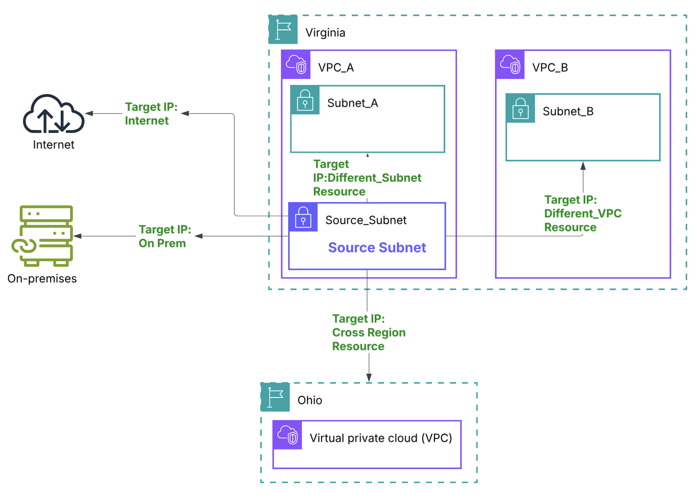
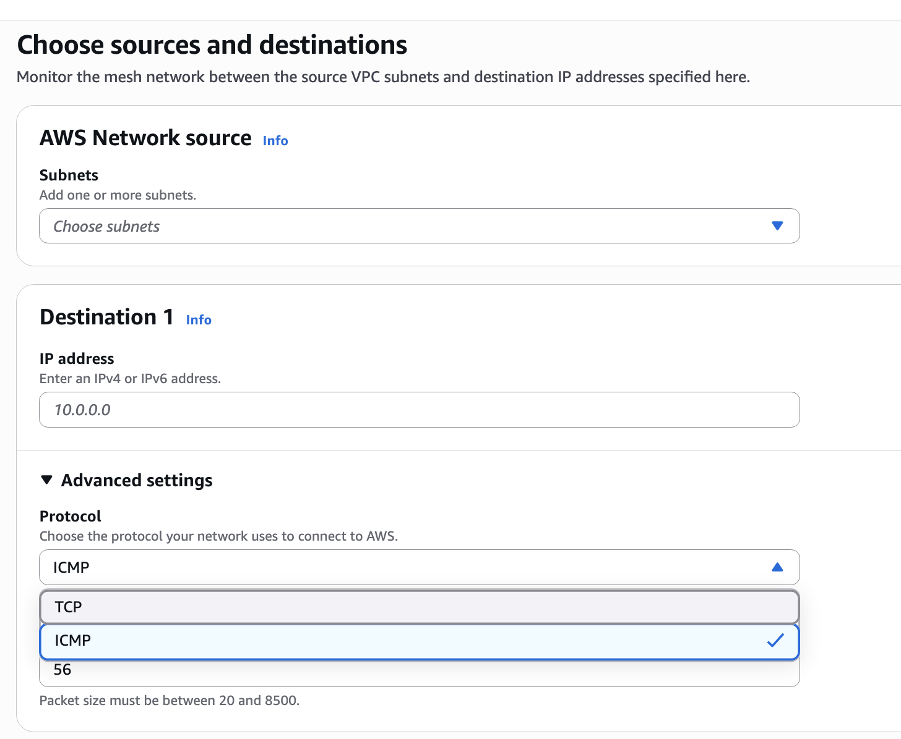
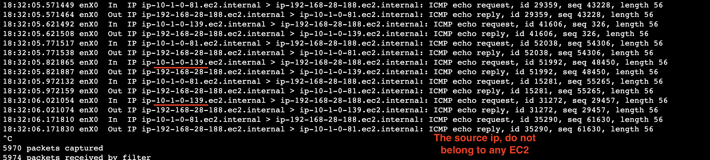

# What is Network Synthetic Monitor?

Network Synthetic Monitor is a feature of Amazon CloudWatch that provides visibility into the performance of your hybrid network connectivity with AWS. It uses active synthetic probes (ICMP or TCP) to continuously measure packet loss and round-trip time (RTT) between your AWS VPC subnets and on-premises destinations reachable via AWS Direct Connect or Site-to-Site VPN.

Network Synthetic Monitor is fully managed and agentless. AWS creates all necessary infrastructure in the background. You only need to specify a VPC subnet and an on-premises destination IP.

## How It Works

1. **Create a Monitor:** Specify source subnets in your VPC and destination IPs on-premises.

2. **Probes are deployed (Behind the scenes):** AWS creates probes that send ICMP or TCP traffic from your subnets to your on-premises destinations at regular intervals (default every 30 seconds).

3. **Metrics published:** RTT, Packet Loss, and Network Health Indicator (NHI) are published to CloudWatch.

## Step 1: Create a Monitor

**Source:** Define a Subnet

**Destination:** Define an IP Address / Protocol / Port

## Step 2: Probes are deployed (Behind the scenes)

One Random IP is selected from the subnet and it initiates Traffic to the destination

## Step 3: What You See After Setup

**Monitor Dashboard:**
- AWS Network Health status (NHI) for the Region
- Average packet loss
- Average RTT

## Pricing

| Dimension | Price |
|-----------|-------|
| Per monitored resource | $0.10 / resource / hour |
| CloudWatch Metrics | Standard CloudWatch metrics pricing applies |

## Conclusion

Network Synthetic Monitor actively probes your network paths to detect performance degradation that passive monitoring and routing protocols miss.

| Destination | Via |
|---|---|
| On-premises IP | Direct Connect |
| On-premises IP | Site-to-Site VPN |
| Resource (IP) in another VPC | VPC Peering / Transit Gateway |
| Resource (IP) in same VPC (different subnet) | Local routing |
| Resource (IP) in another Region | Inter-Region Peering / TGW |

## Resources

- [What is Network Synthetic Monitor?](https://docs.aws.amazon.com/AmazonCloudWatch/latest/monitoring/what-is-network-monitor.html)
- [How It Works](https://docs.aws.amazon.com/AmazonCloudWatch/latest/monitoring/nw-monitor-how-it-works.html)
- [Pricing](https://docs.aws.amazon.com/AmazonCloudWatch/latest/monitoring/pricing-nw.html)
- [Blog: Monitor Hybrid Connectivity](https://aws.amazon.com/blogs/networking-and-content-delivery/monitor-hybrid-connectivity-with-amazon-cloudwatch-network-monitor/)
