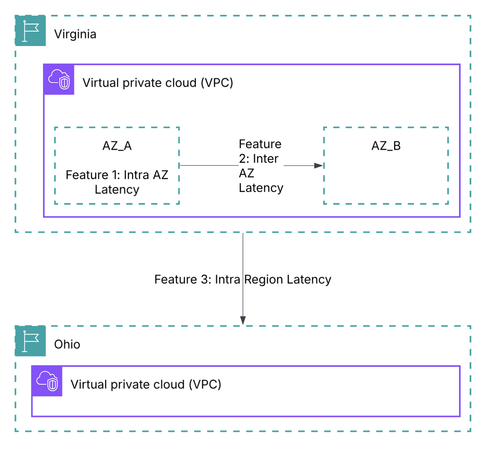

# What is Infrastructure Performance?

Infrastructure Performance is a feature of AWS Network Manager that provides near real-time and historical network latency measurements across AWS Regions and between or within Availability Zones. It uses AWS-managed probes within the AWS global network to continuously measure latency: no setup and no agents.

Infrastructure Performance shows whether network performance between AWS locations is normal or degraded. This helps you evaluate whether the AWS backbone network might be affecting your applications, plan Region expansions, or compare AZ latency for workload placement decisions.

Note: Infrastructure Performance gives an overview of normal vs degraded. It does not provide details about specific causes of degradation.

## How It Works

AWS places managed probes across all Regions and Availability Zones within its global network. These probes continuously measure latency between each other. Latency is calculated as the P50 (median) of all probe measurements every 5 minutes.

Important: This data is the same for ALL AWS accounts. It measures the AWS backbone network, not your specific VPC traffic. Probe placement is not related to your EC2 instances or services.

## What It Measures

| Metric | Description |
|--------|-------------|
| Inter-Region Latency | Round-trip latency between two AWS Regions |
| Inter-AZ Latency | Round-trip latency between two Availability Zones |
| Intra-AZ Latency | Round-trip latency within a single AZ |

## What It Does NOT Measure

Infrastructure Performance does NOT include performance metrics for paths through:

- Transit Gateways
- NAT Gateways
- VPC Endpoints
- Elastic Load Balancers
- EC2 Network Interfaces
- Any VPC networking resources

It measures the underlying AWS physical network only — not your VPC overlay.

## Pricing

| Dimension | Price |
|-----------|-------|
| Infrastructure Performance | FREE |
| CloudWatch Metrics (if subscribed) | Standard CloudWatch pricing applies |

## Conclusion

Infrastructure Performance provides free, always-on visibility into AWS backbone network latency across Regions and Availability Zones. It enables organizations to:

- **Region Expansion Planning:** Check latency between your current Region and a target Region before expanding. Example: "What's the latency between us-west-2 and eu-central-1?"
- **AZ Selection for Workload Placement:** Compare inter-AZ latency to choose optimal AZ pairs for multi-AZ deployments.
- **Baseline AWS Backbone Performance:** Understand what "normal" latency looks like between your Regions/AZs so you can detect when something changes.
- **Correlate with Application Issues:** When applications experience latency, check if the AWS backbone shows degradation to rule it in or out.
- **Multi-Region Architecture Validation:** Validate that cross-Region replication or failover architectures meet your latency requirements.

## Resources

- [What is Infrastructure Performance?](https://docs.aws.amazon.com/network-manager/latest/infrastructure-performance/what-is-nmip.html)
- [How It Works](https://docs.aws.amazon.com/network-manager/latest/infrastructure-performance/how-nmip-works.html)
