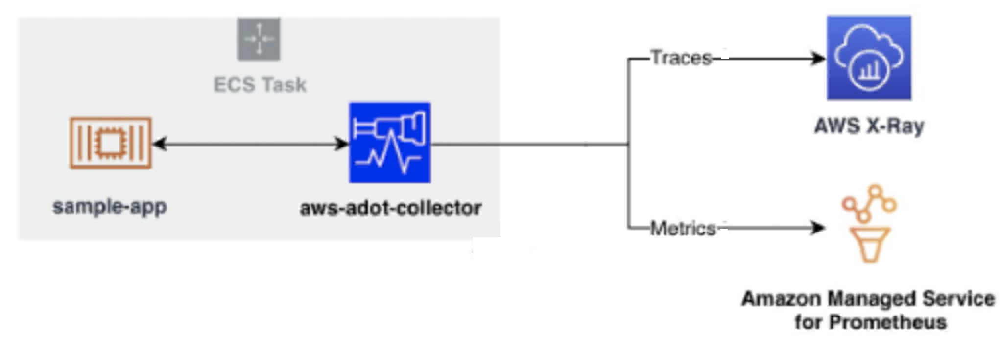

# Monitoring ECS Workloads 
<!--with ADOT, AWS X-Ray, and Amazon Managed Service for Prometheus-->

## Introduction

In the world of containerized applications, effective monitoring is crucial for maintaining reliability and performance. This document outlines an advanced monitoring solution for Amazon Elastic Container Service (ECS) workloads, leveraging AWS Distro for OpenTelemetry (ADOT), AWS X-Ray, and Amazon Managed Service for Prometheus.

## Architecture Overview

The monitoring architecture centers around an ECS task that hosts both the application and an ADOT collector. This setup enables comprehensive data collection directly from the application environment.

*Figure 1: Sending metrics from ECS to AMP and X-Ray*

## Key Components

### ECS Task
The ECS task serves as the foundational unit, encapsulating the application and monitoring components.

### Sample Application
A containerized application runs within the ECS task, representing the workload to be monitored.

### AWS Distro for OpenTelemetry (ADOT) Collector
The ADOT collector, deployed alongside the application, acts as a central aggregation point for telemetry data. It collects both metrics and traces from the application.

### AWS X-Ray
X-Ray receives trace data from the ADOT collector, providing detailed insights into request flows and service dependencies.

### Amazon Managed Service for Prometheus
This service stores and manages the metrics collected by the ADOT collector, offering a scalable solution for metric storage and querying.

## Data Flow

1. The sample application generates telemetry data during its operation.
2. The ADOT collector, running in the same ECS task, collects this data from the application.
3. Trace data is forwarded to AWS X-Ray for distributed tracing analysis.
4. Metrics are sent to Amazon Managed Service for Prometheus for storage and later analysis.

## Benefits

- **Comprehensive Monitoring**: Captures both metrics and traces, providing a holistic view of application performance.
- **Scalability**: Leverages managed services to handle large volumes of telemetry data.
- **Integration**: Seamlessly works with ECS and other AWS services.
- **Reduced Operational Overhead**: Utilizes managed services, minimizing the need for infrastructure management.

## Implementation Considerations

- Proper IAM roles and permissions must be configured for the ECS task to allow data transmission to X-Ray and Prometheus.
- Resource allocation within the ECS task should account for both the application and the ADOT collector.
- Consider implementing log collection alongside metrics and traces for a complete observability solution.

## Conclusion

This architecture provides a robust monitoring solution for ECS workloads, combining the power of OpenTelemetry with AWS managed services. It enables deep insights into application performance and behavior, facilitating quick problem resolution and informed decision-making for containerized environments.