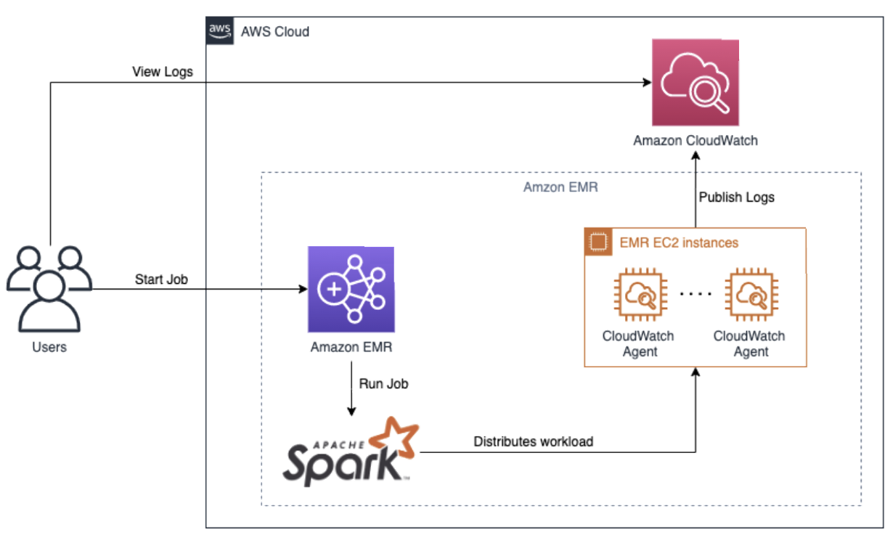

# Big Data Observability on AWS

This diagram illustrates a best practice pattern for implementing observability in a Spark big data workflow on AWS. The pattern leverages various AWS services to collect, process, and analyze logs and metrics generated by Spark jobs.

*Figure 1: Spark Big Data observability*

## Workflow

1. **Users** submit Spark jobs to an **Amazon EMR** cluster.
2. The **Amazon EMR** cluster runs the Spark job, which distributes the workload across the cluster using **Apache Spark**.
3. During the execution of the Spark job, logs and metrics are generated and collected by **Amazon CloudWatch** and **Amazon EMR**.

## Observability Components

### Amazon EMR

Amazon EMR is a managed service that simplifies running big data frameworks like Apache Spark on AWS. It provides a scalable and cost-effective platform for processing large volumes of data.

### Amazon CloudWatch

Amazon CloudWatch is a monitoring and observability service that collects and tracks metrics, logs, and events from various AWS resources and applications. In this pattern, CloudWatch is used to:

1. Collect logs and metrics from the **EMR EC2 instances** running the Spark job.
2. Publish the collected logs to **Amazon CloudWatch Logs** for centralized log management and analysis.

### EMR EC2 Instances

The Spark job runs on EMR EC2 instances, which are the compute nodes of the EMR cluster. These instances generate logs and metrics that are collected by the **CloudWatch Agent** and sent to Amazon CloudWatch.

## Best Practices

To ensure effective observability of Spark big data workloads on AWS, consider the following best practices:

1. **Centralized Log Management**: Use Amazon CloudWatch Logs to centralize the collection, storage, and analysis of logs generated by Spark jobs and EMR instances. This allows for easy troubleshooting and monitoring of the Spark workflow.

2. **Metrics Collection**: Leverage the CloudWatch Agent to collect relevant metrics from the EMR EC2 instances, such as CPU utilization, memory usage, and disk I/O. These metrics provide insights into the performance and health of the Spark job.

3. **Dashboards and Alarms**: Create CloudWatch dashboards to visualize key metrics and logs in real-time. Set up CloudWatch alarms to notify and alert when specific thresholds or anomalies are detected, enabling proactive monitoring and incident response.

4. **Log Analytics**: Utilize Amazon CloudWatch Logs Insights or integrate with other log analytics tools to perform ad-hoc queries, troubleshoot issues, and gain valuable insights from the collected logs.

5. **Performance Optimization**: Continuously monitor and analyze the performance of Spark jobs using the collected metrics and logs. Identify bottlenecks, optimize resource allocation, and tune Spark configurations to improve the efficiency and performance of the big data workload.

By implementing this observability pattern and following best practices, organizations can effectively monitor, troubleshoot, and optimize their Spark big data workloads on AWS, ensuring reliable and efficient data processing at scale.