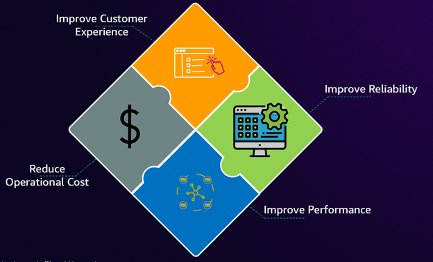
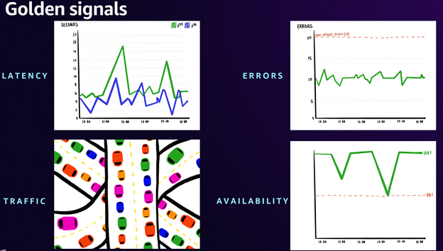

# Leaders and Executives

In today's digital-first economy, the boundary between business performance and technical operations has dissolved. IT leaders face mounting pressure on multiple fronts: digital services directly impacting revenue streams, unprecedented customer expectations for reliability, competitive advantage hinging on technical resilience, and regulatory requirements demanding greater operational transparency. This convergence requires IT leaders to demonstrate both operational excellence and tangible business value creation through effective observability strategies.

---

Given these challenges, organizations must shift from viewing observability as a technical overhead to treating it as a strategic investment with quantifiable returns. IT leaders need to demonstrate how their observability initiatives directly impact business metrics, from customer satisfaction scores to operational costs. An ROI-driven approach ensures that every dollar spent on observability tools and practices yields measurable improvements in incident response times, system reliability, and team productivity, ultimately protecting and enhancing revenue streams.

The age-old management principle rings especially true here: "If you cannot measure it, you cannot manage it." This is why industry leaders are doubling down on observability as a first-class functional requirement. As a leader, if your goal is to accelerate root-cause-analysis (RCA) and reduce mean-time-to-restore (MTTR), your observability strategy should be tightly coupled with your organization's core business goals and priorities. This ensures that the insights generated directly support improving key performance indicators (KPIs) for your organization. And, it's not about investing in the latest and greatest AI observability tool in the market, it's all about making sure that you are able to 'measure' the signals that align with your organizational goals!

## Building an Effective Observability Strategy

How do you translate observability into tangible business outcomes? The answer lies in focusing on the following critical areas: customer experience, application performance & reliability, and operational efficiency & cost optimization. To translate observability into tangible business outcomes, let's start by focusing on the most critical aspect: the customer experience.

#### Measuring customer experience

First, measuring customer experience requires moving beyond traditional system metrics. We recommend implementing Service Level Objectives (SLOs) as your primary measurement framework. SLOs provide agreed-upon targets for service availability based on critical end-user journeys rather than just system metrics. This customer-centric approach ensures your observability strategy directly aligns with what matters most - the end-user experience, which should be your North Star for all technical decisions. Now, let’s get familiarized with the terminology that represents the assurance you make to your customers and the trackable measurements that tell you how healthy your services are.

- SLI (Service Level Indicator) is a carefully defined quantitative measure of some aspect of the level of service provided.
- SLO (Service Level Objective) is a target value or range of values for a service level measured by an SLI over a period of time.
- SLA (Service Level Agreement) is an agreement with your customer that outlines the level of service you promise to deliver. An SLA also details the course of action when requirements are not met, such as additional support or pricing discounts.

With the introduction of Amazon CloudWatch [Application Signals](https://docs.aws.amazon.com/AmazonCloudWatch/latest/monitoring/CloudWatch-Application-Monitoring-Sections.html) you can now create and monitor SLOs natively in AWS. Application Signals provides a comprehensive application performance monitoring solution in CloudWatch that enables you to connect SLOs to your APM experience. You can get started with SLOs using any metric available to you in CloudWatch. This makes it easy to get started with metrics that you have available today in CloudWatch. For further learning, refer the blog [Improve application reliability with effective SLOs](https://aws.amazon.com/blogs/mt/improve-application-reliability-with-effective-slos). While customer satisfaction is paramount, it's directly tied to the performance and reliability of your applications. Let's explore how to monitor and improve these crucial aspects. 

#### Improving application performance and reliability
Application reliability forms the next pillar of effective observability, achieved through monitoring the 'golden signals' of your critical applications: Availability, Latency, Errors, and Traffic. These metrics provide a comprehensive view of your application's health and performance. When combined with SLOs, they create a powerful framework for maintaining high reliability while optimizing operational costs.

With [Amazon Route 53 health checks](https://docs.aws.amazon.com/Route53/latest/DeveloperGuide/dns-failover.html) and [CloudWatch Synthetics](https://docs.aws.amazon.com/AmazonCloudWatch/latest/monitoring/CloudWatch_Synthetics_Canaries.html), you can monitor and analyze the performance and runtime aspects of your applications and workloads. You can also monitor the availability and health of your on-premises application using AWS CloudWatch Synthetics.

With the collective strength of [Amazon CloudWatch network and internet monitoring](https://docs.aws.amazon.com/AmazonCloudWatch/latest/monitoring/CloudWatch-Network-Monitoring-Sections.html) capabilities provided by [Network Flow Monitor](https://docs.aws.amazon.com/AmazonCloudWatch/latest/monitoring/CloudWatch-NetworkFlowMonitor.html), [Internet Monitor](https://docs.aws.amazon.com/AmazonCloudWatch/latest/monitoring/CloudWatch-InternetMonitor.html) and [Network Synthetic Monitor](https://docs.aws.amazon.com/AmazonCloudWatch/latest/monitoring/what-is-network-monitor.html), you can visualize data, get insights, and operational visibility into the network and internet performance and availability of your applications hosted on AWS.

With [Amazon CloudWatch Container Insights](https://docs.aws.amazon.com/AmazonCloudWatch/latest/monitoring/ContainerInsights.html), you can collect, aggregate, and summarize metrics and logs from your containerized applications and microservices. Container Insights is available for Amazon Elastic Container Service (Amazon ECS), Amazon Elastic Kubernetes Service (Amazon EKS), and Kubernetes platforms on Amazon EC2.

With [Amazon CloudWatch Database Insights](https://docs.aws.amazon.com/AmazonCloudWatch/latest/monitoring/Database-Insights.html), you can monitor and troubleshoot Amazon Aurora MySQL, Amazon Aurora PostgreSQL, Amazon RDS for SQL Server, RDS for MySQL, RDS for PostgreSQL, RDS for Oracle, and RDS for MariaDB databases at scale.

With [Amazon CloudWatch cross-account observability](https://docs.aws.amazon.com/AmazonCloudWatch/latest/monitoring/CloudWatch-Unified-Cross-Account.html), you can monitor and troubleshoot applications that span multiple accounts within a Region. You can search, visualize, and analyze metrics, logs, traces, Application Signals services and service level objectives (SLOs), Application Insights applications, and internet monitors in any of the linked accounts without account boundaries. 

With [Amazon Managed Grafana](https://docs.aws.amazon.com/grafana/latest/userguide/what-is-Amazon-Managed-Service-Grafana.html), you can visualize and analyze your operational data at scale. By offering seamless integration with AWS data sources and enabling cross-team collaboration through unified dashboards, it allows you to consolidate observability data from multiple sources—including metrics, logs, and traces from your applications and infrastructure—into customizable visualizations that help you quickly identify and resolve operational issues.

With robust customer experience and application performance monitoring in place, we can now turn our attention to optimizing the costs associated with our strategy.

#### Optimizing Cost
Cost optimization emerges naturally from effective observability. Many organizations fall into the trap of monitoring everything - the "fear of missing out" (FOMO) syndrome - leading to complex, resource-intensive systems that generate more noise than insight. The key is identifying KPIs that directly correlate with business service success and enhanced user experience. Success lies in strategic data collection and, most importantly, engaging business stakeholders throughout the observability journey. Your observability strategy should demonstrably accelerate Root Cause Analysis (RCA), reduce Mean Time to Restore (MTTR), and ultimately lower operational costs - all while maintaining focus on these core metrics that truly impact your business.

[AWS Cost Explorer](https://aws.amazon.com/aws-cost-management/aws-cost-explorer/) has an easy-to-use interface that lets you visualize, understand, and manage your AWS costs and usage over time. Cost Explorer uses the same dataset that is used to generate the [AWS Cost and Usage Reports](https://docs.aws.amazon.com/cur/latest/userguide/what-is-cur.html) and the detailed billing reports. By creating an [Amazon CloudWatch billing alarm](https://docs.aws.amazon.com/AmazonCloudWatch/latest/monitoring/monitor_estimated_charges_with_cloudwatch.html), you can monitor your estimated AWS charges. When you enable the monitoring of estimated charges for your AWS account, the estimated charges are calculated and sent several times daily to CloudWatch as metric data. The alarm triggers when your account billing exceeds the threshold you specify.

Now that we've outlined the key components of an effective observability strategy, let's examine the tangible benefits and business impact you can expect from its implementation.

### Quantifiable Outcomes and Business Impact

A well-implemented observability strategy delivers both quantifiable financial returns and qualitative benefits across the organization. Let’s breakdown few of the outcomes you can expect:

#### Cost Savings
Strategic observability delivers financial benefits through dual channels: direct cost reduction and revenue protection. Operational improvements, measured through reduced MTTR and preventive measures, generate immediate cost savings calculated through incident costs and resolution time reductions. These savings are amplified by team efficiency gains, quantified through reduced labor hours. Even a modest improvement in customer retention can translate to substantial revenue protection when viewed through the lens of customer lifetime value.

#### Operational Efficiency
Resource optimization often yields more than 40% cost reductions in infrastructure spending. Automation of routine tasks eliminates manual effort, with savings calculated by multiplying manual hours saved by labor costs. These efficiencies compound over time, creating sustained cost benefits.

#### Cultural Transformation and Operational Excellence
The true power of observability lies in its ability to transform both culture and operations simultaneously. While automated alert correlation and contextual troubleshooting drive immediate efficiency gains, the deeper impact comes from the fundamental shift in how teams work and collaborate. Self-service capabilities empower independent problem-solving, while comprehensive visibility enables proactive risk management. This creates a virtuous cycle where enhanced customer satisfaction, improved developer experience, and strengthened security posture reinforce each other.

Understanding the quantifiable outcomes sets the stage for the future of observability in your organization. Let's conclude by looking at how this strategy can transform your operations and drive long-term success.

### The Path Forward
The journey to effective observability is not just about implementing tools or collecting data—it's about transforming how organizations operate, make decisions, and deliver value. By focusing on meaningful metrics, aligning technical capabilities with business outcomes, and empowering teams through automation and self-service capabilities, organizations can turn observability into a strategic advantage. As we move forward in an increasingly digital world, those who master this discipline will find themselves better equipped to meet customer expectations, drive innovation, and achieve sustainable growth. The future belongs to organizations that can not only collect data but transform it into actionable insights that drive business success.
