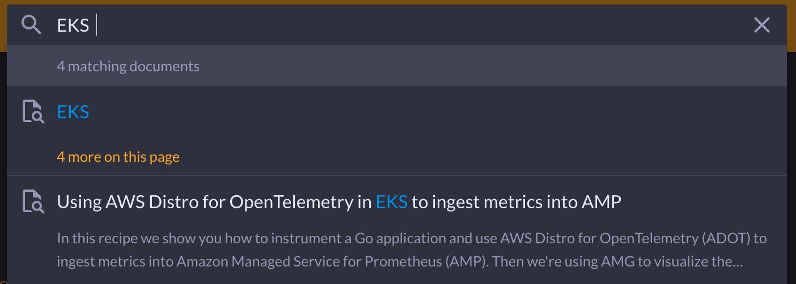

# Recipes

In here you will find curated guidance, how-to's, and links to other resources that help with the application of observability (o11y) to various use cases. This includes managed services such as [Amazon Managed Service for Prometheus][amp]
and [Amazon Managed Grafana][amg] as well as agents, for example [OpenTelemetry][otel]
and [Fluent Bit][fluentbit]. Content here is not resitricted to AWS tools alone though, and many open source projects are referenced here.

We want to address the needs of both developers and infrastructure folks equally, so many of the recipes "cast a wide net". We encourge you to explore and find the solutions that work best for what you are seeking to accomplish.

:::info
    The content here is derived from actual customer engagement by our Solutions Architects, Professional Services, and feedback from other customers. Everything you will find here has been implemented by our actual customers in their own environments.
:::

The way we think about the o11y space is as follows: we decompose it into
[six dimensions][dimensions] you can then combine to arrive at a specific solution:

| dimension | examples |
|---------------|--------------|
| Destinations  | [Prometheus][amp] &middot; [Grafana][amg] &middot; [OpenSearch][aes] &middot; [CloudWatch][cw] &middot; [Jaeger][jaeger] |
| Agents        | [ADOT][adot] &middot; [Fluent Bit][fluentbit] &middot; CW agent &middot; X-Ray agent |
| Languages     | [Java][java] &middot; Python &middot; .NET &middot; [JavaScript][nodejs] &middot; Go &middot; Rust |
| Infra & databases  |  [RDS][rds] &middot; [DynamoDB][dynamodb] &middot; [MSK][msk] |
| Compute unit | [Batch][batch] &middot; [ECS][ecs] &middot; [EKS][eks] &middot; [AEB][beans] &middot; [Lambda][lambda] &middot; [AppRunner][apprunner] |
| Compute engine | [Fargate][fargate] &middot; [EC2][ec2] &middot; [Lightsail][lightsail] |

:::note
    "Example solution requirement"
    I need a logging solution for a Python app I'm running on EKS on Fargate
    with the goal to store the logs in an S3 bucket for further consumption
:::

One stack that would fit this need is the following:

1. *Destination*: An S3 bucket for further consumption of data
1. *Agent*: FluentBit to emit log data from EKS
1. *Language*: Python
1. *Infra & DB*: N/A
1. *Compute unit*: Kubernetes (EKS)
1. *Compute engine*: EC2

Not every dimension needs to be specified and sometimes it's hard to decide where
to start. Try different paths and compare the pros and cons of certain recipes.

To simplify navigation, we're grouping the six dimension into the following
categories:

- **By Compute**: covering compute engines and units
- **By Infra & Data**: covering infrastructure and databases
- **By Language**: covering languages
- **By Destination**: covering telemetry and analytics
- **Tasks**: covering anomaly detection, alerting, troubleshooting, and more

[Learn more about dimensions …](https://aws-observability.github.io/observability-best-practices/recipes/dimensions/)

## How to use

You can either use the top navigation menu to browse to a specific index page,
starting with a rough selection. For example, `By Compute` -> `EKS` ->
`Fargate` -> `Logs`.

Alternatively, you can search the site pressing `/` or the `s` key:

:::info
   "License"
  All recipes published on this site are available via the
	[MIT-0][mit0] license, a modification to the usual MIT license
	that removes the requirement for attribution.
:::

## How to contribute

Start a [discussion][discussion] on what you plan to do and we take it from there.

## Learn more

The recipes on this site are a good practices collection. In addition, there
are a number of places where you can learn more about the status of open source
projects we use as well as about the managed services from the recipes, so
check out:

- [observability @ aws][o11yataws], a playlist of AWS folks talking about
  their projects and services.
- [AWS observability workshops](https://aws-observability.github.io/observability-best-practices/recipes/workshops/), to try out the offerings in a
  structured manner.
- The [AWS monitoring and observability][o11yhome] homepage with pointers
  to case studies and partners.

[aes]: aes.md "Amazon Elasticsearch Service"
[adot]: https://aws-otel.github.io/ "AWS Distro for OpenTelemetry"
[amg]: amg.md "Amazon Managed Grafana"
[amp]: amp.md "Amazon Managed Service for Prometheus"
[batch]: https://aws.amazon.com/batch/ "AWS Batch"
[beans]: https://aws.amazon.com/elasticbeanstalk/ "AWS Elastic Beanstalk"
[cw]: cw.md "Amazon CloudWatch"
[dimensions]: dimensions.md
[dynamodb]: dynamodb.md "Amazon DynamoDB"
[ec2]: https://aws.amazon.com/ec2/ "Amazon EC2"
[ecs]: ecs.md "Amazon Elastic Container Service"
[eks]: eks.md "Amazon Elastic Kubernetes Service"
[fargate]: https://aws.amazon.com/fargate/ "AWS Fargate"
[fluentbit]: https://fluentbit.io/ "Fluent Bit"
[jaeger]: https://www.jaegertracing.io/ "Jaeger"
[kafka]: https://kafka.apache.org/ "Apache Kafka"
[apprunner]: apprunner.md "AWS App Runner"
[lambda]: lambda.md "AWS Lambda"
[lightsail]: https://aws.amazon.com/lightsail/ "Amazon Lightsail"
[otel]: https://opentelemetry.io/ "OpenTelemetry"
[java]: java.md
[nodejs]: nodejs.md
[rds]: rds.md "Amazon Relational Database Service"
[msk]: msk.md "Amazon Managed Streaming for Apache Kafka"
[mit0]: https://github.com/aws/mit-0 "MIT-0"
[discussion]: https://github.com/aws-observability/observability-best-practices/discussions "Discussions"
[o11yataws]: https://www.youtube.com/playlist?list=PLaiiCkpc1U7Wy7XwkpfgyOhIf_06IK3U_ "Observability @ AWS YouTube playlist"
[o11yhome]: https://aws.amazon.com/products/management-and-governance/use-cases/monitoring-and-observability/ "AWS Observability home"
