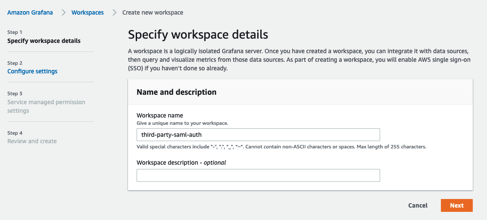
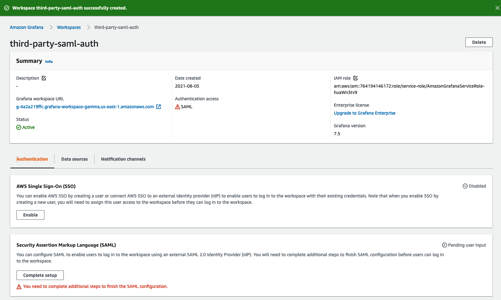

# Configure Google Workspaces authentication with Amazon Managed Grafana using SAML

In this guide, we will walk through how you can setup Google Workspaces as an
identity provider (IdP) for Amazon Managed Grafana using SAML v2.0 protocol.

In order to follow this guide you need to create a paid [Google Workspaces][google-workspaces] 
account in addition to having an [Amazon Managed Grafana workspace][amg-ws] created.

### Create Amazon Managed Grafana workspace

Log into the Amazon Managed Grafana console and click **Create workspace.** In the following screen,
provide a workspace name as shown below. Then click **Next**:

In the **Configure settings** page, select **Security Assertion Markup Language (SAML)** 
option so you can configure a SAML based Identity Provider for users to log in:

Select the data sources you want to choose and click **Next**:

Click on **Create workspace** button in the **Review and create** screen:

This will create a new Amazon Managed Grafana workspace as shown below:

### Configure Google Workspaces

Login to Google Workspaces with Super Admin permissions and go
to **Web and mobile apps** under **Apps** section. There, click on **Add App** 
and select **Add custom SAML app.** Now give the app a name as shown below. 
Click **CONTINUE.**:

On the next screen, click on **DOWNLOAD METADATA** button to download the SAML metadata file. Click **CONTINUE.**

On the next screen, you will see the ACS URL, Entity ID and Start URL fields.
You can get the values for these fields from the Amazon Managed Grafana console. 

Select **EMAIL** from the drop down in the **Name ID format** field and select **Basic Information > Primary email** in the **Name ID** field.

Click **CONTINUE.**

In the **Attribute mapping** screen, make the mapping between **Google Directory attributes** and **App attributes** as shown in the screenshot below

For users logging in through Google authentication to have **Admin** privileges
in **Amazon Managed Grafana**, set the **Department** field’s value as ***monitoring*.** You can choose any field and any value for this. Whatever you choose to use on the Google Workspaces side, make sure you make the mapping on Amazon Managed Grafana SAML settings to reflect that.

### Upload SAML metadata into Amazon Managed Grafana

Now in the Amazon Managed Grafana console, click **Upload or copy/paste** option
and select **Choose file** button to upload the SAML metadata file downloaded
from Google Workspaces, earlier. 

In the **Assertion mapping** section, type in **Department** in the
**Assertion attribute role** field and **monitoring** in the **Admin role values** field. 
This will allow users logging in with **Department** as **monitoring** to 
have **Admin** privileges in Grafana so they can perform administrator duties
such as creating dashboards and datasources.

Set values under **Additional settings - optional** section as shown in the 
screenshot below. Click on **Save SAML configuration**:

Now Amazon Managed Grafana is set up to authenticate users using Google Workspaces. 

When users login, they will be redirected to the Google login page like so:

After entering their credentials, they will be logged into Grafana as shown in the screenshot below.

As you can see, the user was able to successfully login to Grafana using Google Workspaces authentication.

[google-workspaces]: https://workspace.google.com/
[amg-ws]: https://docs.aws.amazon.com/grafana/latest/userguide/getting-started-with-AMG.html#AMG-getting-started-workspace
