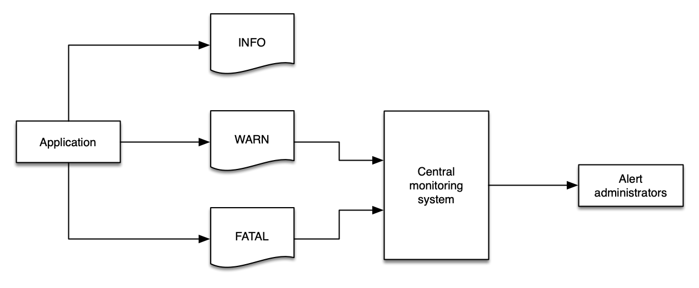

# Logs

Logs are a series of messages that are sent by an application, or an appliance, that are represented by one or more lines of details about an event, or sometimes about the health of that application. Typically, logs are delivered to a file, though sometimes they are sent to a collector that performs analysis and aggregation. There are many full-featured log aggregators, frameworks, and products that aim to make the task of generating, ingesting, and managing log data at any volume – from megabytes per day to terabytes per hour.

Logs are emitted by a single application at a time and usually pertain to the scope of that *one application* - though developers are free to have logs be as complex and nuanced as they desire. For our purposes we consider logs to be a fundamentally different signal from [traces](../signals/traces), which are composed of events from more than one application or a service, and with context about the connection between services such as response latency, service faults, request parameters etc.

Data in logs can also be aggregate over a period of time. For example, they may be statistical (e.g. number of requests served over the previous minute). They can be structured, free-form, verbose, and in any written language. 

The primary use cases for logging are describing,

* an event, including its status and duration, and other vital statistics
* errors or warnings related to that event (e.g. stack traces, timeouts)
* application launches, start-up and shutdown messages

:::note
	Logs are intended to be *immutable*, and many log management systems include mechanisms to protect against, and detect attempts, to modify log data. 
:::
Regardless of your requirements for logging, these are the best practices that we have identified. 

## Structured logging is key to success

Many systems will emit logs in a semi-structured format. For example, an Apache web server may write logs like this, with each line pertaining to a single web request:

	192.168.2.20 - - [28/Jul/2006:10:27:10 -0300] "GET /cgi-bin/try/ HTTP/1.0" 200 3395
	127.0.0.1 - - [28/Jul/2006:10:22:04 -0300] "GET / HTTP/1.0" 200 2216

Whereas a Java stack trace may be a single event that spans multiple lines and is less structured:

	Exception in thread "main" java.lang.NullPointerException
        at com.example.myproject.Book.getTitle(Book.java:16)
        at com.example.myproject.Author.getBookTitles(Author.java:25)
        at com.example.myproject.Bootstrap.main(Bootstrap.java:14)

And a Python error log event may look like this:
```
	Traceback (most recent call last):
	  File "e.py", line 7, in <module>
	    raise TypeError("Again !?!")
	TypeError: Again !?!
```
Of these three examples, only the first one is easily parsed by both humans *and* a log aggregation system. Using structured logs makes it easy to process log data quickly and effectively, giving both humans and machines the data they need to immediately find what they are looking for.

The most commonly understood log format is JSON, wherein each component to an event is represented as a key/value pair. In JSON, the python example above may be rewritten to look like this:
```
	{
		"level", "ERROR"
		"file": "e.py",
		"line": 7,
		"error": "TypeError(\"Again !?!\")"
	}
```
The use of structured logs makes your data transportable from one log system to another, simplifies development, and make operational diagnosis faster (with less errors). Also, using JSON embeds the schema of the log message along with the actual data, which enables sophisticated log analysis systems to index your messages automatically.

## Use log levels appropriately

There are two types of logs: those that have a *level* and those that are a series of events. For those that have a level, these are a critical component to a successful logging strategy. Log levels vary slightly from one framework to another, but generally they follow this structure:

| Level | Description |
| ----- | ----------- |
| `DEBUG` | Fine-grained informational events that are most useful to debug an application. These are usually of value to devlopers and are very verbose. |
| `INFO` | Informational messages that highlight the progress of the application at coarse-grained level. |
| `WARN` | Potentially harmful situations that indicate a risk to an application. These can trigger an alarm in an applicaiton. |
| `ERROR` | Error events that might still allow the application to continue running. These are likely to trigger an alarm that requires attention. |
| `FATAL` | Very severe error events that will presumably cause an application to abort. |

:::info
	Implicitly logs that have no explicit level may be considered as `INFO`, though this behaviour may vary between applications.
:::
Other common log levels are `CRITICAL` and `NONE`, depending on your needs, programming language, and framework. `ALL` and `NONE` are also common, though not found in every application stack.

Log levels are crucial for informing your monitoring and observability solution about the health of your environment, and log data should easily express this data using a logical value. 

:::tip
	Logging too much data at `WARN` will fill your monitoring system with data that is of limited value, and then you may lose important data in the sheer volume of messages.  
:::


:::info
	Using a standardized log level strategy makes automation easier, and helps developers get to the root cause of issues quickly.
:::

:::warning
	Without a standard approach to log levels, [filtering your logs](#filter-logs-close-to-the-source) is a major challenge.
:::
## Filter logs close to the source

Wherever possible, reduce the volume of logs as close to the source as possible. There are many reasons to follow this best practice:

* Ingesting logs always costs time, money, and resources.
* Filtering sensitive data (e.g. personally identifiable data) from downstream systems reduces risk exposure from data leakage.
* Downstream systems may not have the same operational concerns as the sources of data. For example, `INFO` logs from an application may be of no interest to a monitoring and alerting system that watches for `CRITCAL` or `FATAL` messages.
* Log systems, and networks, need not be placed under undue stress and traffic.

:::info
	Filter your log close to the source to keep your costs down, decrease risk of data exposure, and focus each component on the [things that matter](../guides/#monitor-what-matters).
:::

:::tip
	Depending on your architecture, you may wish to use infrastructure as code (IaC) to deploy changes to your application *and* environment in one operation. This approach allows you to deploy your log filter patterns along with applications, giving them the same rigor and treatment.
:::
## Avoid double-ingestion antipatterns

A common pattern that administrators pursue is copying all of their logging data into a single system with the goal querying all of their logs all from a single location. There are some manual workflow advantages to doing so, however this pattern introduces additional cost, complexity, points of failure, and operational overhead.


:::info
	Where possible, use a combination of [log levels](#use-log-levels-appropriately) and [log filtering](#filter-logs-close-to-the-source) to avoid a wholesale propagation of log data from your environments.
:::

:::info
	Some organizations or workloads require [log shipping](https://en.wikipedia.org/wiki/Log_shipping) in order to meet regulatory requirements, store logs in a secure location, provide non-reputability, or achieve other objectives. This is a common use case for re-ingesting log data. Note that a proper application of [log levels](#use-log-levels-appropriately) and [log filtering](#filter-logs-close-to-the-source) is still appropriate to reduce the volume of superfluous data entering these log archives.
:::
## Collect metric data from your logs

Your logs contain [metrics](../signals/metrics/) that are just waiting to be collected! Even ISV solutions or applications that you have not written yourself will emit valuable data into their logs that you can extract meaningful insights into overall workload health from. Common examples include:

* Slow query time from databases
* Uptime from web servers
* Transaction processing time
* Counts of `ERROR` or `WARNING` events over time
* Raw count of packages that are available for upgrade

:::tip
	This data is less useful when locked in a static log file. The best practice is to identify key metric data and then publish it into your metric system where it can be correlated with other signals.
:::
## Log to `stdout`

Where possible, applications shouould log to `stdout` rather than to a fixed location such as a file or socket. This enables log agents to collect and route your log events based on rules that make sense for your own observability solution. While not possible for all applications, this is the best practice for containerized workloads.

:::note
	While applications should be generic and simple in their logging practices, remaining loosely coupled from logging solutions, the transmission of log data does still require a [log collector](../tools/logs/) to send data from `stdout` to a file. The important concept is to avoid application and business logic being dependant on your logging infrastructure - in other words, you should work to separate your concerns.
:::

:::info
	Decoupling your application from your log management lets you adapt and evolve your solution without code changes, thereby minimizing the potential [blast radius](../faq/#what-is-a-blast-radius) of changes made to your environment.
:::