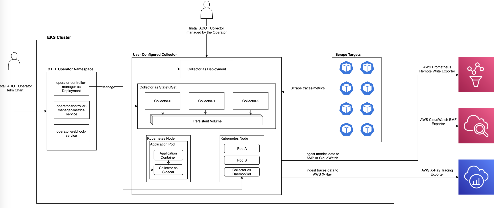
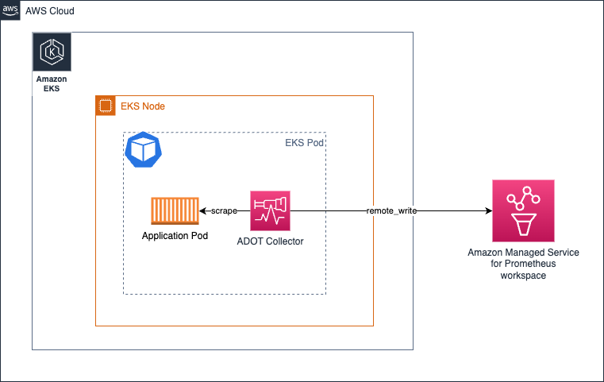
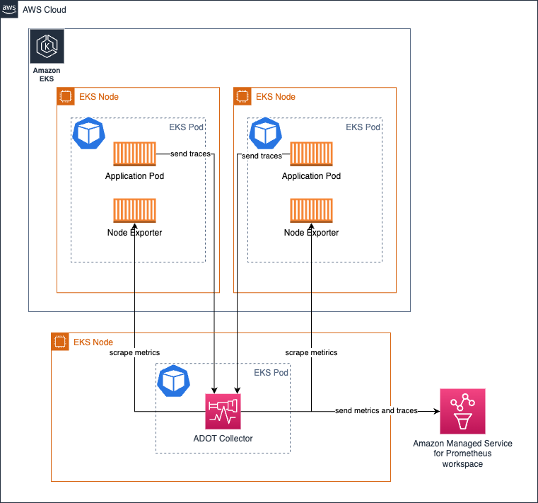
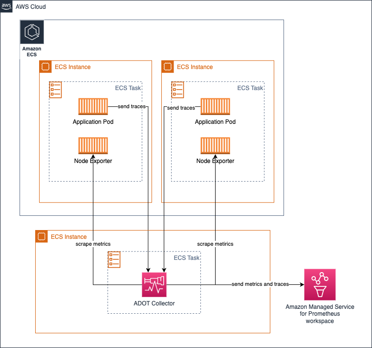
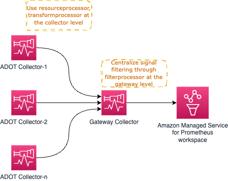
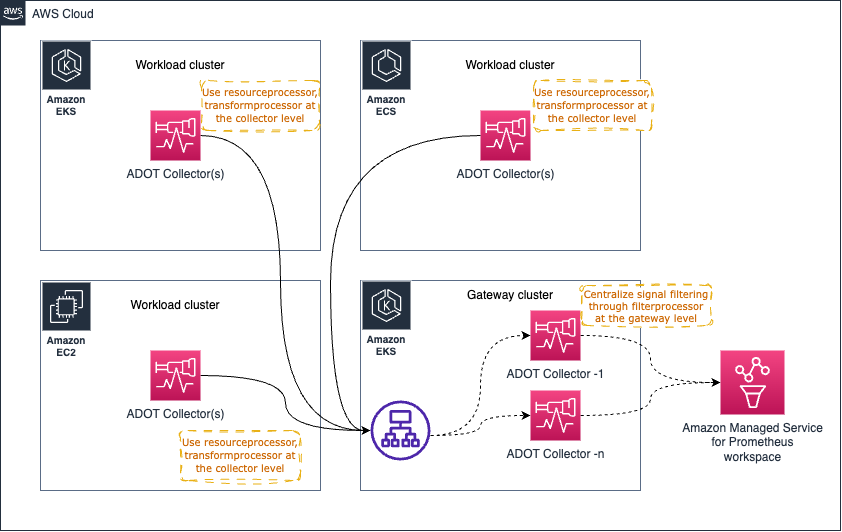

# ADOT Collector at Scale

## Overview

The [AWS Distro for OpenTelemetry (ADOT) Collector](https://aws-otel.github.io/) is a downstream distribution of the open-source [OpenTelemetry Collector](https://opentelemetry.io/docs/collector/) maintained by AWS. It collects metrics, traces, and logs from workloads running on Amazon EKS, Amazon ECS, and Amazon EC2, then exports them to backends such as Amazon CloudWatch, Amazon Managed Service for Prometheus (AMP), and AWS X-Ray.

Running the ADOT Collector in production requires deliberate choices about deployment topology, resource allocation, pipeline design, and health monitoring. This solution covers:

- **Deployment modes** — sidecar, DaemonSet, Deployment (gateway), and ECS central task
- **Scaling** — horizontal scaling strategies for stateless and stateful components
- **Resource sizing** — memory limiting, backpressure management, and limit-setting
- **Pipeline design** — distributing processing across agent and gateway tiers
- **Java Spring instrumentation** — manual OpenTelemetry tracing for Spring Integration applications

For the full ADOT Collector configuration reference, see the [ADOT Getting Started documentation](https://aws-otel.github.io/docs/getting-started/collector).

## Prerequisites

- AWS account with permissions to deploy to EKS, ECS, or EC2
- AWS CLI installed and configured
- `kubectl` configured for your EKS cluster (if using Kubernetes)
- ADOT Collector image: `public.ecr.aws/aws-observability/aws-otel-collector`
- An AMP workspace (for Prometheus metrics)
- AWS X-Ray enabled in your region (for traces)
- Java 11+ and Maven (for the Spring Integration example)

## Architecture

The ADOT Collector supports multiple deployment topologies. The most common production pattern combines per-node agents with a centralized gateway tier:


*OpenTelemetry pipeline: collectors deployed as sidecars and deployments export to AMP, CloudWatch, and X-Ray*

### Signal flow

```
┌──────────────────────────────────────────────────────────────┐
│                     EKS / ECS / EC2                           │
│                                                              │
│  ┌─────────────┐    OTLP     ┌─────────────────────────┐    │
│  │ Application │ ──────────► │  ADOT Collector (Agent)  │    │
│  │  (SDK/Auto) │             │  - receivers: otlp       │    │
│  └─────────────┘             │  - processors: batch,    │    │
│                              │    resource, memorylimiter│    │
│                              └───────────┬──────────────┘    │
└──────────────────────────────────────────┼───────────────────┘
                                           │ OTLP
                                           ▼
                              ┌─────────────────────────┐
                              │  ADOT Gateway Collector  │
                              │  - processors: filter,   │
                              │    redaction, transform  │
                              │  - exporters:            │
                              │    awsprometheusremote,   │
                              │    awsxray, awsemf       │
                              └──────────┬──────────────┘
                                         │
                        ┌────────────────┼────────────────┐
                        ▼                ▼                ▼
                 ┌───────────┐   ┌────────────┐   ┌──────────┐
                 │    AMP    │   │ CloudWatch │   │  X-Ray   │
                 └───────────┘   └────────────┘   └──────────┘
```

## Deploy

### Deployment mode: Sidecar (EKS)

Run the collector in the same Pod as your application. Best for isolated workloads with well-understood resource profiles.


*Sidecar deployment: one collector per application Pod*

The sidecar scrapes only `localhost` targets, so no service-discovery configuration is needed:

```yaml
receivers:
  otlp:
    protocols:
      grpc:
        endpoint: 0.0.0.0:4317
      http:
        endpoint: 0.0.0.0:4318
processors:
  batch/traces:
    timeout: 1s
    send_batch_size: 50
  batch/metrics:
    timeout: 60s
exporters:
  awsxray:
    region: us-west-2
  awsemf:
    region: us-west-2
service:
  pipelines:
    traces:
      receivers: [otlp]
      processors: [batch/traces]
      exporters: [awsxray]
    metrics:
      receivers: [otlp]
      processors: [batch/metrics]
      exporters: [awsemf]
```

**Pros:** Simple resource allocation, no service-discovery overhead.
**Cons:** Configuration management scales with the number of distinct workloads.

### Deployment mode: DaemonSet (EKS)

Deploy one collector per node to distribute scraping load across the cluster.


*DaemonSet deployment: one collector per node*

Use `relabel_configs` to restrict each collector to targets on its own node:

```yaml
scrape_configs:
  - job_name: kubernetes-pods
    bearer_token_file: /var/run/secrets/kubernetes.io/serviceaccount/token
    kubernetes_sd_configs:
      - role: endpoints
    relabel_configs:
      - action: keep
        regex: $K8S_NODE_NAME
        source_labels: [__meta_kubernetes_endpoint_node_name]
    scheme: https
    tls_config:
      ca_file: /var/run/secrets/kubernetes.io/serviceaccount/ca.crt
      insecure_skip_verify: true
```

**Pros:** Minimal scaling concerns, good for logs collection.
**Cons:** Disproportionate resource allocation across heterogeneous nodes.

### Deployment mode: Deployment / Gateway (EKS)

Run the collector as a Kubernetes Deployment for centralized processing and high availability.


*Deployment mode: collectors run on dedicated nodes, separate from workloads*

For high availability with Prometheus metrics, see [HA Prometheus collection](https://docs.aws.amazon.com/prometheus/latest/userguide/Send-high-availability-prom-community.html).

### Deployment mode: ECS Central Task

Use the [ECS Observer extension](https://github.com/open-telemetry/opentelemetry-collector-contrib/tree/main/extension/observer/ecsobserver) to discover and scrape Prometheus targets across ECS tasks:


*ECS central task: one collector discovers targets across services*

```yaml
extensions:
  ecs_observer:
    refresh_interval: 60s
    cluster_name: 'my-cluster'
    cluster_region: 'us-west-2'
    result_file: '/etc/ecs_sd_targets.yaml'
    services:
      - name_pattern: '^app-.*$'
    docker_labels:
      - port_label: 'ECS_PROMETHEUS_EXPORTER_PORT'
    task_definitions:
      - job_name: 'task_def_1'
        metrics_path: '/metrics'
        metrics_ports:
          - 9113
          - 9090
        arn_pattern: '.*:task-definition/nginx:[0-9]+'
```

### Deployment mode: EC2 Agent

On EC2, run the collector as a system service with a static scrape configuration:

```yaml
global:
  scrape_interval: 15s

scrape_configs:
  - job_name: 'app-metrics'
    static_configs:
      - targets: ['localhost:9090', 'localhost:8081']
```

### Resource sizing and limits

#### Memory limiter processor

Always include `memorylimiterprocessor` in your pipeline to prevent OOM kills. Leave a buffer for the collector's own telemetry and receiver/exporter operations:

```yaml
processors:
  memory_limiter:
    check_interval: 1s
    limit_mib: 9216      # Pod limit is 10Gi; leave 1Gi buffer
    spike_limit_mib: 512
```

#### Scrape limits

For Prometheus receiver workloads, set upper bounds per scrape job:

- `body_size_limit` — maximum scrape response body
- `label_limit` — discard scrapes exceeding this label count
- `sample_limit` — cap samples per scrape

See the [Prometheus configuration documentation](https://prometheus.io/docs/prometheus/latest/configuration/configuration/#relabel_config) for all available options.

### Gateway pattern: distributing processing

Distribute CPU/memory-intensive processors between agent and gateway tiers:


*Agent collectors handle resource and transform processors; the gateway handles filter and redaction*

**Agent tier:** `resourceprocessor`, `transformprocessor`, `batch`
**Gateway tier:** `filterprocessor`, `redactionprocessor`

Place an Application Load Balancer in front of multiple gateway replicas to avoid a single point of failure:


*ALB distributes OTLP traffic across gateway replicas*

:::warning
When using multiple gateway collectors with Prometheus metrics, use sticky sessions on the ALB (source IP affinity) to prevent out-of-order sample errors in AMP. Alternatively, add a unique `external_label` per gateway — but this multiplies active series.
:::

### Horizontal scaling considerations

| Component type | Examples | Scaling approach |
|---|---|---|
| Stateless | Most receivers, exporters, basic processors | Add replicas behind a load balancer |
| Stateful | Tail Sampling Processor, EMF Exporter, Cumulative-to-Delta Processor | Route related data (e.g., same trace ID) to the same replica |
| Scraper | Prometheus receiver | Split scrape jobs across replicas; never scrape the same target from two collectors |

For detailed scaling guidance, see [OpenTelemetry Collector Scaling](https://opentelemetry.io/docs/collector/scaling/).

### Instrumenting Java Spring Integration applications

Spring Integration applications use event-driven message channels rather than HTTP request/response patterns. Standard OpenTelemetry auto-instrumentation may not capture the full message flow. Use manual instrumentation with context propagation to trace messages across channels.

**Approach:** Implement a `GlobalChannelInterceptor` that:

1. In `preSend`: extracts context from upstream messages (or starts a new trace), creates a span named after the channel, injects context into the outgoing message
2. In `afterSendCompletion`: restores context, records exceptions, and ends the span

A working sample application is available at [spring-integration-samples](https://github.com/rapphil/spring-integration-samples/tree/rapphil-5.5.x-otel/applications/file-split-ftp).

Build and run the example:

```bash
mvn spring-boot:run
# Trigger the processing flow
echo 'testcontent\nline2content\nlastline' > /tmp/in/testfile.txt
```

The collector configuration for the Spring application:

```yaml
receivers:
  otlp:
    protocols:
      grpc:
        endpoint: 0.0.0.0:4317
      http:
        endpoint: 0.0.0.0:4318
processors:
  batch/traces:
    timeout: 1s
    send_batch_size: 50
  batch/metrics:
    timeout: 60s
exporters:
  awsxray:
    region: us-west-2
  awsemf:
    region: us-west-2
service:
  pipelines:
    traces:
      receivers: [otlp]
      processors: [batch/traces]
      exporters: [awsxray]
    metrics:
      receivers: [otlp]
      processors: [batch/metrics]
      exporters: [awsemf]
```

### Collector health monitoring

Enable the telemetry endpoint and health check extension:

```yaml
extensions:
  health_check:
    endpoint: 0.0.0.0:13133

service:
  extensions: [health_check]
  telemetry:
    logs:
      level: info
    metrics:
      level: detailed
      address: 0.0.0.0:8888
```

Key metrics to monitor at `http://localhost:8888/metrics`:

| Metric | What it tells you |
|---|---|
| `otelcol_exporter_enqueue_failed_spans` | Spans failing to enter the send queue — pipeline is saturated |
| `otelcol_exporter_enqueue_failed_metric_points` | Metric points failing to queue — exporter backpressure |
| `otelcol_process_runtime_total_sys_memory_bytes` | Total memory allocated by Go runtime |
| `otelcol_process_memory_rss` | Resident set size — when sys approaches rss, scale up memory |

Use the health check endpoint (`GET http://localhost:13133`) as a Kubernetes liveness probe.

## Validate

1. **Check collector health:**
   ```bash
   curl -s http://localhost:13133 | head -1
   # Expect: HTTP 200
   ```

2. **Verify metrics export to AMP:**
   ```bash
   awscurl --service aps --region us-west-2 \
     "https://aps-workspaces.us-west-2.amazonaws.com/workspaces/WS_ID/api/v1/query?query=up"
   ```

3. **Verify traces in X-Ray:**
   - Open the [AWS X-Ray console](https://console.aws.amazon.com/xray/home)
   - Navigate to **Traces** and filter by service name
   - Confirm spans appear with correct parent/child relationships

4. **Check collector internal metrics:**
   ```bash
   curl -s http://localhost:8888/metrics | grep otelcol_exporter_enqueue_failed
   # All counters should be 0
   ```

## Troubleshoot

| Symptom | Likely Cause | Fix |
|---------|-------------|-----|
| `out of order sample` errors from AMP | Multiple collectors scraping the same target, or gateway load balancer routing same series to different replicas | Use sticky sessions (source IP) on the ALB, or use `relabel_configs` with `keep` action to pin targets to one collector |
| Collector OOM-killed | `memorylimiterprocessor` not configured or limit set too close to Pod memory limit | Add `memorylimiterprocessor` with limit at 80-90% of Pod memory; leave buffer for receiver/exporter/telemetry |
| Spans missing in X-Ray | Batch processor timeout too long or `send_batch_size` too large causing drops | Reduce `batch/traces` timeout to 1s and `send_batch_size` to 50; check `otelcol_exporter_enqueue_failed_spans` |
| Prometheus scrape targets not discovered | DaemonSet collector not filtering by node name | Add `relabel_configs` with `action: keep` matching `$K8S_NODE_NAME` on `__meta_kubernetes_endpoint_node_name` |
| ECS targets not appearing | ECS Observer extension misconfigured or IAM permissions missing | Verify `ecs_observer` cluster name/region; ensure task role has `ecs:ListTasks`, `ecs:DescribeTaskDefinition`, `ecs:DescribeTasks`, `ec2:DescribeInstances` |

## Related Solutions

- [EKS Infrastructure Monitoring](../eks-infrastructure/)
- [EKS Application Signals](../eks-application-signals/)
- [ECS Monitoring](../ecs-monitoring/)
