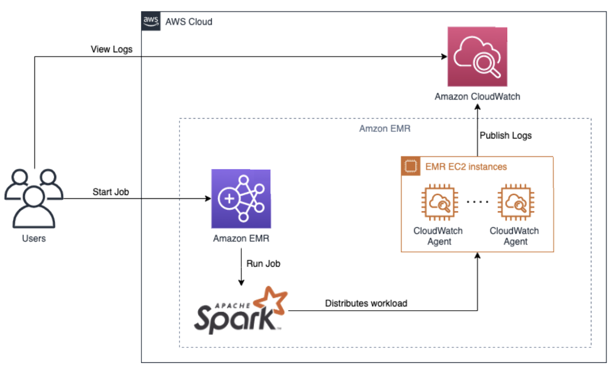

# Big Data and Spark Observability

## Overview

Apache Spark workloads on Amazon EMR generate logs and metrics across distributed cluster nodes. This entry covers collecting that telemetry into CloudWatch for centralized log management, and optionally into Amazon Managed Service for Prometheus (AMP) and Amazon Managed Grafana (AMG) for richer metric visualization and alerting.

The CloudWatch agent on EMR EC2 instances captures system and Spark metrics, while CloudWatch Logs centralizes driver and executor output for troubleshooting.

## Prerequisites

- An AWS account with EMR, CloudWatch, and (optionally) AMP/AMG permissions
- An Amazon EMR cluster (version 5.x or 6.x)
- IAM role for EC2 instances with `CloudWatchAgentServerPolicy` attached
- CloudWatch agent installed via EMR bootstrap action

## Architecture


*Spark Big Data observability on AWS: EMR nodes emit metrics and logs to CloudWatch*

```
Users → Amazon EMR (Spark) → EMR EC2 Instances
                                    │
                            CloudWatch Agent
                                    │
                    ┌───────────────┴───────────────┐
                    ▼                               ▼
          CloudWatch Metrics              CloudWatch Logs
                    │                               │
                    └──────────┬────────────────────┘
                               ▼
                    Amazon Managed Grafana (optional)
```

## Deploy

1. Create an EMR cluster with a bootstrap action that installs the CloudWatch agent:

```bash
aws emr create-cluster \
  --name "spark-observability" \
  --release-label emr-6.10.0 \
  --applications Name=Spark \
  --ec2-attributes InstanceProfile=EMR_EC2_DefaultRole \
  --bootstrap-actions Path=s3://<bucket>/install-cwagent.sh
```

2. The bootstrap script (`install-cwagent.sh`) installs and starts the agent:

```bash
#!/bin/bash
sudo yum install -y amazon-cloudwatch-agent
sudo /opt/aws/amazon-cloudwatch-agent/bin/amazon-cloudwatch-agent-ctl \
  -a fetch-config -m ec2 -s \
  -c ssm:AmazonCloudWatch-EMR-Config
```

3. Store the agent configuration in SSM Parameter Store (`AmazonCloudWatch-EMR-Config`) with metrics and log collection for Spark paths (`/var/log/spark/`, `/mnt/var/log/`).

4. Submit a Spark job to begin generating telemetry.

## Validate

1. In the CloudWatch console, navigate to **Metrics → All metrics** and confirm the EMR namespace shows CPU, memory, and disk metrics from cluster nodes.

2. Navigate to **CloudWatch → Log groups** and verify Spark driver/executor logs appear under the configured log group.

3. Use CloudWatch Logs Insights to query Spark errors:

```
fields @timestamp, @message
| filter @message like /ERROR/
| sort @timestamp desc
| limit 25
```

## Troubleshoot

| Symptom | Likely Cause | Fix |
|---------|-------------|-----|
| No metrics from EMR nodes | CloudWatch agent not installed; bootstrap action failed | Check bootstrap action logs in S3 at `s3://<log-bucket>/<cluster-id>/node/<instance-id>/bootstrap-actions/` |
| Spark logs missing | Agent config does not include Spark log paths | Update the SSM parameter to include `/var/log/spark/` and `/mnt/var/log/hadoop-yarn/` |
| High CloudWatch costs from verbose logging | DEBUG-level Spark logging generating excessive log events | Set Spark log level to WARN via `spark.driver.extraJavaOptions=-Dlog4j.logger.org.apache.spark=WARN` |

## Related Solutions

- [Databricks Monitoring](../databricks-monitoring/)
- [EKS Infrastructure Monitoring](../eks-infrastructure/)
