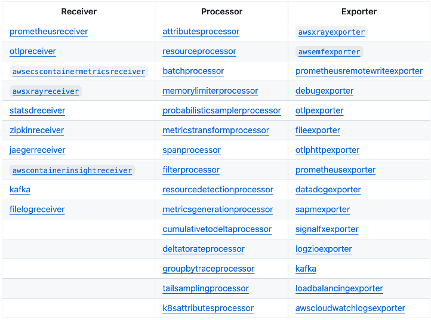

import RelatedEvents from '@site/src/components/RelatedEvents';

# CloudWatch Agent Configuration

## Overview

The Amazon CloudWatch agent is a unified telemetry collector that sends metrics, logs, and traces from EC2 instances, on-premises servers, and other virtual machines to CloudWatch. It supports Windows and Linux, runs inside and outside AWS, and can be deployed via automation tools or AWS Systems Manager.

This guide covers configuration file structure, what telemetry to collect, deployment strategies using Systems Manager, connectivity options for hybrid environments, and when to use the CloudWatch agent versus the AWS Distro for OpenTelemetry (ADOT) collector.

## When to use this

- You are deploying the CloudWatch agent to EC2 instances or on-premises servers
- You need to decide between CloudWatch agent and ADOT collector for your workload
- You want to automate agent configuration deployment using Systems Manager Parameter Store
- You are configuring the agent for hybrid (on-premises or other cloud) environments
- You need to understand connectivity options (public endpoints, VPC endpoints, Direct Connect) for agent traffic

## Guidance

### Configuration file structure

The CloudWatch agent uses a JSON configuration file organized into sections for metrics, logs, and traces collection. Key directives include:

- **`force_flush_interval`** — Controls how often the agent sends buffered data. The agent sends data at this cadence unless the buffer fills first. Adjust based on your acceptable data-loss window:
  - Standard workloads: The default is usually appropriate
  - Edge/IoT devices on low-bandwidth connections: May need 15-minute or longer intervals
  - Stateless/containerized workloads: Consider a shorter interval since sudden termination could lose buffered logs

- **`retention_in_days`** — Sets the log group retention at creation time, aligning with your data retention requirements proactively.

- **`log_group_class`** — Specifies the log group class (`STANDARD` or `INFREQUENT_ACCESS`). Defaults to `STANDARD` if omitted.

- **`filters`** — Include or exclude log events based on patterns. Use `include` for log levels you want and `exclude` for patterns to drop (e.g., credit card numbers, SSNs).

- **`multi_line_start_pattern`** — Groups multi-line log events (e.g., Java stack traces) into single events.

### What to collect

Plan your telemetry collection based on workload needs:

**Metrics** — The agent collects system-level metrics (CPU, memory, disk, network) beyond what EC2 provides by default. Configure custom metrics for application-specific data points.

**Logs** — Collect application logs, system logs, and custom log files. Each logical application should map to its own log group. For example, in a LAMP stack: Apache, MySQL, the PHP application, and the Linux OS each belong to separate log groups.

**Traces** — The agent can collect traces from OpenTelemetry or X-Ray client SDKs and forward them to AWS X-Ray.

### Deployment via Systems Manager

Treating CloudWatch agent configuration as code and deploying it through [Systems Manager Parameter Store](https://docs.aws.amazon.com/AmazonCloudWatch/latest/monitoring/install-CloudWatch-Agent-on-EC2-Instance-fleet.html) is a best practice. This approach:

- Provides centralized configuration management across your fleet
- Enables configuration versioning and rollback
- Supports deployment to both Windows and Linux hosts
- Allows fleet-wide updates without logging into individual machines

Alternatively, you can deploy configuration files through any automation tool (Ansible, Puppet, Chef, etc.). Systems Manager Parameter Store is not required but simplifies management significantly.

**Automated discovery**: For EC2, Workload Detection provides an automated way to deploy the agent with appropriate configuration based on detected workloads.

### Deployment outside AWS

The CloudWatch agent works on-premises and in other cloud environments. Two additional considerations apply:

1. **IAM credentials** — Set up IAM credentials to allow the agent to make required API calls. Even within EC2, there is no unauthenticated access to CloudWatch APIs. For EC2, use an [instance profile](https://docs.aws.amazon.com/IAM/latest/UserGuide/id_roles_use_switch-role-ec2_instance-profiles.html). For on-premises, use [ephemeral AWS access tokens](https://aws.amazon.com/premiumsupport/knowledge-center/cloudwatch-on-premises-temp-credentials/) obtained from the AWS Systems Manager agent.

2. **Network connectivity** — Ensure the agent can reach CloudWatch and CloudWatch Logs endpoints via a route that meets your security requirements.

### Connectivity options

The agent needs connectivity to CloudWatch and CloudWatch Logs endpoints. Options depend on where it runs:

**From a VPC:**
- **VPC Endpoints (recommended for private connectivity)** — Fully private and secure; agent traffic never traverses the internet.
- **NAT Gateway** — Private subnets connect via a public NAT gateway. Traffic is logically routed via the internet.
- **Internet Gateway** — Simplest option if you do not require private connectivity beyond TLS and SigV4.

**From on-premises or other clouds:**
- **Public endpoints** — Agent connects over the internet (via Direct Connect Public VIF or existing network path).
- **VPC Interface Endpoints via PrivateLink** — Extends private connectivity to on-premises using Direct Connect Private VIF or VPN. Traffic is never exposed to the internet.

Transport between your environment and CloudWatch needs to match your governance and security requirements. Using private endpoints meets the needs of even strictly regulated industries, though most customers are well served by public endpoints.

### CloudWatch agent versus ADOT collector

Choose the right collector based on your requirements:

| Criteria | CloudWatch Agent | ADOT Collector |
|----------|-----------------|----------------|
| **Primary backends** | CloudWatch, CloudWatch Logs, X-Ray | Multiple (CloudWatch, Prometheus, Jaeger, Zipkin, etc.) |
| **Configuration** | Single JSON config file; wizard available | OpenTelemetry Collector YAML configuration |
| **Deployment** | SSM Parameter Store, automation tools, manual | Helm charts, sidecar, DaemonSet, manual |
| **Vendor neutrality** | AWS-specific | Vendor-neutral; send to multiple backends simultaneously |
| **Built-in features** | Log filtering, multi-line support, StatsD/collectd, Container Insights | Pipeline processing, exporters, receivers for many protocols |
| **Best for** | AWS-native workloads wanting simplicity | Multi-cloud, multi-backend, or OpenTelemetry-native environments |

**Use CloudWatch Agent when:**
- Your observability backend is primarily CloudWatch
- You want simple, wizard-assisted configuration
- You need built-in log filtering and multi-line support
- You are deploying to EC2 or on-premises with SSM

**Use ADOT Collector when:**
- You need to send telemetry to multiple backends simultaneously
- You prefer vendor-neutral OpenTelemetry instrumentation
- You are running on EKS/ECS and want a Kubernetes-native deployment
- You need OTLP endpoints for traces and logs

For EKS workloads, the Amazon CloudWatch Observability EKS add-on installs the CloudWatch agent as a DaemonSet, handling infrastructure metrics (Container Insights), container logs (Fluent Bit), and application performance telemetry (Application Signals) in one deployment.

## Related

- [EC2 NGINX Monitoring](../ec2-nginx/) — Practical example of CloudWatch agent deployment for web server monitoring
- [Hybrid Monitoring](../hybrid-monitoring/) — Monitoring on-premises and multi-cloud workloads with CloudWatch
- [ADOT at Scale](../adot-at-scale/) — Scaling OpenTelemetry collection across large environments
- [AWS Documentation: Installing the CloudWatch Agent](https://docs.aws.amazon.com/AmazonCloudWatch/latest/monitoring/Install-CloudWatch-Agent.html)
- [AWS Documentation: CloudWatch Agent Configuration File Reference](https://docs.aws.amazon.com/AmazonCloudWatch/latest/monitoring/CloudWatch-Agent-Configuration-File-Details.html)

## Related Events

<RelatedEvents topics={["cloudwatch", "metrics"]} />
