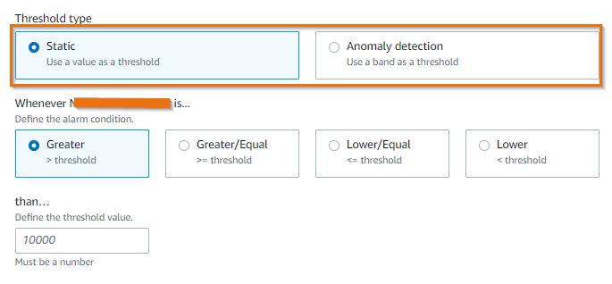
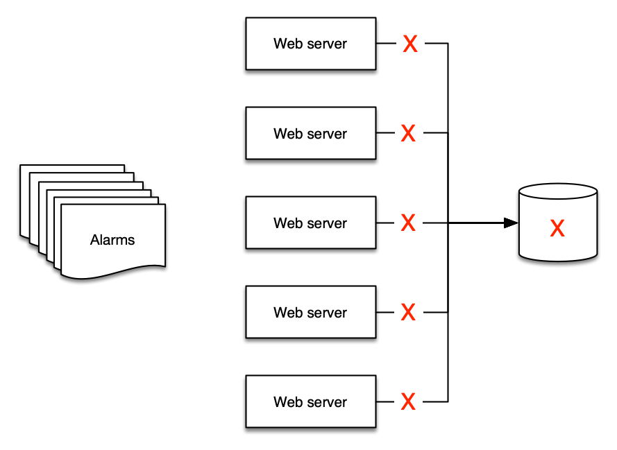
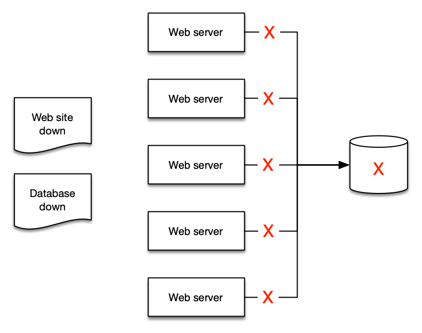

import RelatedEvents from '@site/src/components/RelatedEvents';

# Alarms and Alerting

## Related Events

<RelatedEvents topics={["cloudwatch", "metrics"]} />

## Overview

An alarm reflects the current *state* of a metric — `OK`, `ALARM`, or `INSUFFICIENT_DATA`. When a threshold is breached, the alarm can trigger notifications, auto-scaling actions, or automated remediation. The challenge is not creating alarms — it is creating the *right* alarms that lead to action without overwhelming operators.

This guide covers alarm design principles for both CloudWatch native alarms and Prometheus Alertmanager on Amazon Managed Service for Prometheus (AMP). It addresses threshold selection, composite alarms, fighting alarm fatigue, and alert routing to the right destinations.

## When to use this

- You are setting up monitoring for a new workload and need to decide which metrics deserve alarms.
- Your team suffers from alarm fatigue — too many notifications with too little signal.
- You need to choose between static thresholds and anomaly detection for a given metric.
- You want to aggregate related alarms using composite alarms to reduce noise.
- You are running Prometheus workloads on AMP and need to configure Alertmanager rules and routing.

## Guidance

### Alert on things that are actionable

Alarm fatigue occurs when teams receive so many alerts that they learn to ignore them. This is an anti-pattern, not a sign of thorough monitoring.

:::info
Create alarms for things that are actionable, and work backwards from your [business objectives](https://docs.aws.amazon.com/AmazonCloudWatch/latest/monitoring/CloudWatch_Dashboards.html). If an alarm does not require human attention or trigger an automated process, remove the notification — visualize it on a dashboard instead.
:::

For example, if slow response times endanger your SLO and high CPU utilization causes slow responses, alert on CPU *proactively* before it becomes a customer-facing issue. But do not alert on CPU utilization everywhere if it does not endanger your outcomes.

### Beware the "everything is OK" alarm

A dangerous pattern emerges when operators grow so accustomed to constant alerts that they only notice when things go *silent*. This makes self-healing architectures impossible because the alarm state requires human interpretation.

:::warning
If your team relies on the *absence* of alerts as a signal, your alarm strategy needs redesign.
:::

### Choosing threshold types

CloudWatch supports two approaches to metric alarms:

#### Static thresholds

Define a hard limit the metric should not violate. You must understand the normal operating range to set meaningful upper and lower bounds.

:::tip
Static thresholds are best for metrics where you have firm understanding — identified performance breakpoints, infrastructure limits, or SLO boundaries.
:::

#### Anomaly detection

CloudWatch analyzes past metric data and builds a model of expected values, accounting for hourly, daily, and weekly patterns. Alarms fire when metrics fall outside the expected band.

:::info
Use anomaly detection when you do not have visibility into a metric's performance over time, or when the metric has not been observed under load-testing or anomalous traffic previously.
:::



### Composite alarms to fight alarm fatigue

Consider five web servers backed by a single database. If the database goes down, you get at least six alerts — five from the web servers and one from the database. But only two alerts make sense:

1. The web site is down.
2. The database is the cause.





[Composite alarms](https://docs.aws.amazon.com/AmazonCloudWatch/latest/monitoring/Create_Composite_Alarm.html) include a rule expression that evaluates the states of other alarms. The composite alarm enters `ALARM` state only when all conditions are met. This distills multiple signals into a single actionable notification.

:::info
Distilling alerts into aggregates makes it easier for people to understand, and easier to create runbooks and automation.
:::

### Metric math based alarms

[Metric math expressions](https://docs.aws.amazon.com/AmazonCloudWatch/latest/monitoring/using-metric-math.html) let you combine multiple metrics into a more meaningful KPI and alarm on the derived value. For example, alarm on error *rate* (errors / requests) rather than raw error count, which varies with traffic volume.

### Alarms from CloudWatch Logs

You can create alarms based on log data using [metric filters](https://docs.aws.amazon.com/AmazonCloudWatch/latest/logs/MonitoringLogData.html). Metric filters turn log patterns into numerical CloudWatch metrics, which can then use static or anomaly-based alarms.

This is useful for alerting on application-level events that do not have a native metric — error messages, specific status codes, or business-logic exceptions.

### Scheduling alarm suppression

When resources are intentionally shut down outside business hours for cost optimization, alarms continue firing and create unnecessary noise. Use EventBridge Schedules and Lambda to programmatically enable and disable alarms based on tags, aligning alarm state with resource schedules.

Tag alarms with a suppression key (e.g., `suppress: true`) and configure cron schedules for enable/disable cycles. Metric collection continues uninterrupted during suppression — only notifications are paused.

### Prometheus Alertmanager on AMP

For workloads using [Amazon Managed Service for Prometheus](https://aws.amazon.com/prometheus/), alerting rules use PromQL expressions and route through the managed Alertmanager.

#### Alerting rules format

Rules are defined in YAML and follow the same format as standalone Prometheus:

```yaml
groups:
  - name: alert-test
    rules:
    - alert: HostHighCpuLoad
      expr: 100 - (avg(rate(node_cpu_seconds_total{mode="idle"}[2m])) * 100) > 60
      for: 5m
      labels:
        severity: warning
      annotations:
        summary: "Host high CPU load (instance {{ $labels.instance }})"
        description: "CPU load is > 60%\n  VALUE = {{ $value }}"
```

#### Key Alertmanager concepts

- **Grouping** — Collect similar alerts into a single notification. Configure via the `route` block. Useful when a failure affects many systems simultaneously.
- **Inhibition** — Suppress notifications for alerts that are consequences of an already-firing alert. Configure via `inhibit_rules`.
- **Silencing** — Mute alerts for a specified duration (maintenance windows, planned outages). Use the `PutAlertManagerSilences` API.

#### Routing alerts

AMP Alertmanager supports [Amazon SNS as a receiver](https://docs.aws.amazon.com/prometheus/latest/userguide/AMP-alertmanager-receiver-config.html). From SNS you can route to:

- **Email** — direct SNS subscription
- **Slack** — via email-to-channel or Lambda rewriting
- **PagerDuty** — customized template in the `template_files` block
- **Webhooks** — HTTP endpoints for SIEM or incident management tools
- **Lambda** — process alerts in JSON format for custom routing logic

#### Visualizing AMP alerts in Managed Grafana

Enable Grafana alerting in your Amazon Managed Grafana workspace configuration to visualize all alert and recording rules configured in your AMP workspace directly in the Grafana alerting page.

### Recommended baseline alerts

A starting set of alerts to improve workload reliability:

| Condition | Threshold example | Severity |
|-----------|-------------------|----------|
| Node memory usage exceeds limit | > 80% allocated | warning |
| Node CPU usage exceeds limit | > 80% allocated | warning |
| Node disk space usage high | > 90% allocated | critical |
| Container in pod exceeds CPU limit | > 80% of limit | warning |
| Container in pod exceeds memory limit | > 80% of limit | warning |
| Container excessive restarts | > 3 in 15 minutes | warning |
| Persistent Volume disk usage high | > 75% | warning |
| Deployment has zero active pods | == 0 | critical |
| HPA running at max capacity | replicas == maxReplicas | warning |

Adjust expressions and thresholds based on your workload's characteristics. These are starting points, not universal truths.

### Integrate with existing ITSM processes

Regardless of your alerting platform, alerts must integrate into your existing support toolchain:

:::info
Create trouble tickets and issues programmatically from alerts. This removes human effort, streamlines processes, and enables you to derive operational data such as DORA metrics.
:::

## Related

- [CloudWatch Dashboards](../cloudwatch-dashboards/) — dashboard design for visualizing alarm states and metrics
- [CloudWatch Metrics and EMF](../cloudwatch-metrics/) — metrics design that underpins effective alarms
- [CloudWatch Alarms documentation](https://docs.aws.amazon.com/AmazonCloudWatch/latest/monitoring/AlarmThatSendsEmail.html)
- [AMP Alert Manager documentation](https://docs.aws.amazon.com/prometheus/latest/userguide/AMP-alert-manager.html)
