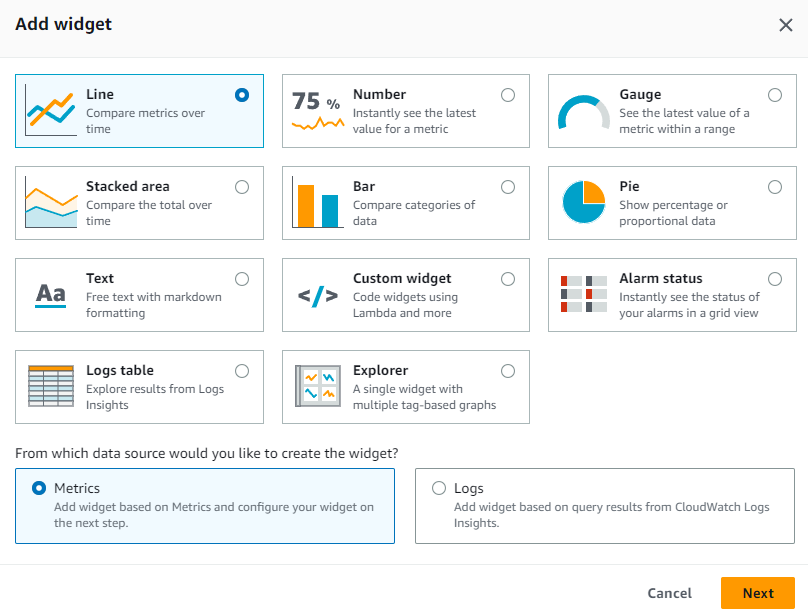
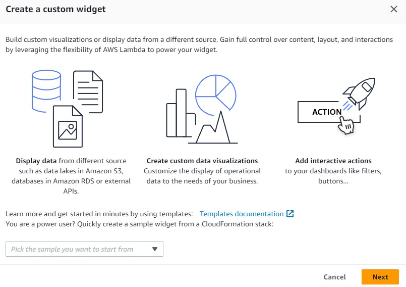
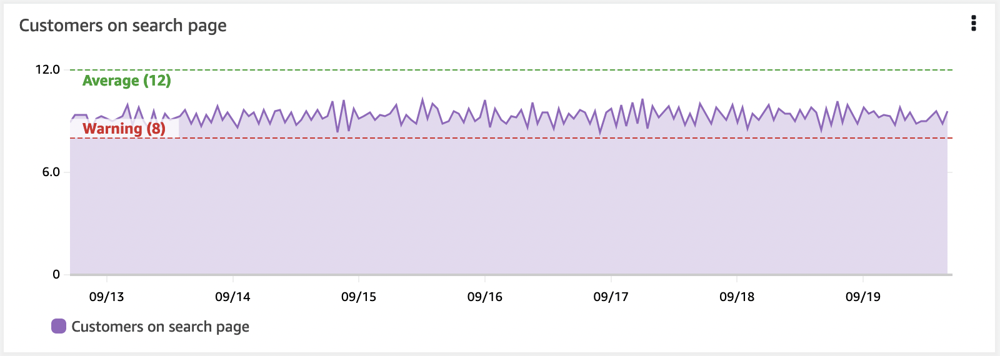
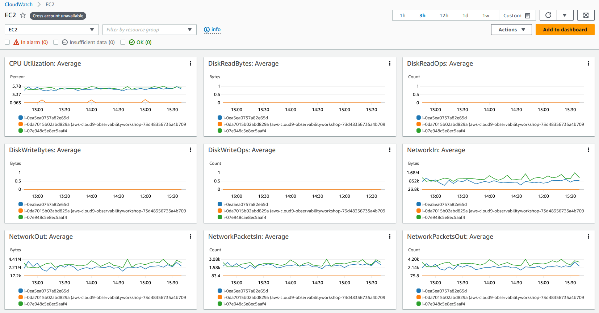
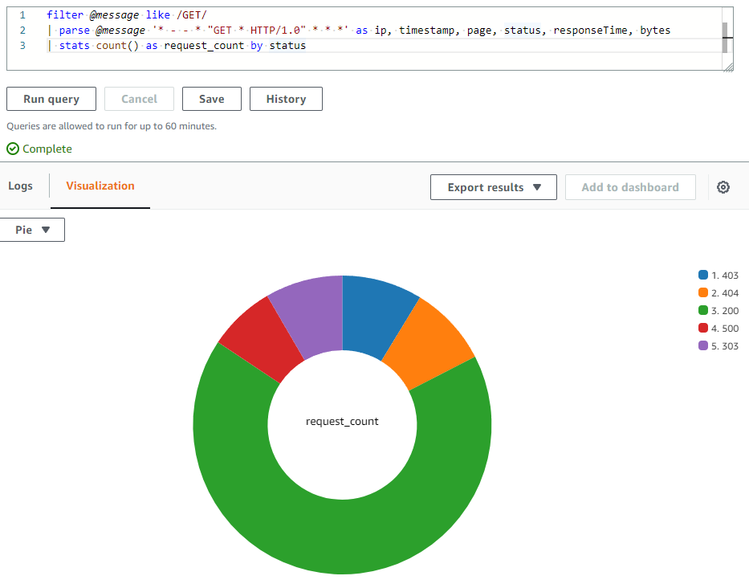

import RelatedEvents from '@site/src/components/RelatedEvents';

# CloudWatch Dashboards

## Related Events

<RelatedEvents topics={["cloudwatch", "metrics"]} />

## Overview

Amazon CloudWatch dashboards are customizable pages in the CloudWatch console that let you monitor resources in a single view, even across accounts and regions. They combine metrics and log visualizations so you can move from symptom detection to root-cause analysis without switching tools.

This guide covers dashboard design principles — what to put on a dashboard, how to lay it out, which widget types to use, and how to keep dashboards dynamic and maintainable over time. For the full API reference and step-by-step console instructions, see the [CloudWatch Dashboards documentation](https://docs.aws.amazon.com/AmazonCloudWatch/latest/monitoring/CloudWatch_Dashboards.html).

## When to use this

- You are creating a new operational or business dashboard and want design guidance before building.
- Your existing dashboards have grown cluttered and you need principles for restructuring them.
- You want to understand which widget types best represent different signal types.
- You are deciding between automatic dashboards, custom dashboards, or both.
- You need to share dashboards with teams or stakeholders who may not have AWS console access.

## Guidance

### Tell a story with your dashboard

A dashboard should answer questions, not just display data. Every dashboard needs a clear purpose and audience. Before adding widgets, answer:

- **Who will view this?** What is their background and how much context do they need?
- **What questions are they trying to answer?** Performance impact? Root cause? Business KPI status?
- **What actions will they take?** Escalate, scale, debug, or simply report?

:::info
A good dashboard tells a *story* — it helps the viewer see what is happening, understand the impact, and make data-driven decisions on what action to take and how urgently.
:::

### Think about symptoms first, then causes

When you observe symptoms you are measuring the impact on users and systems. Many underlying causes produce the same symptoms, which means symptom-based dashboards catch more issues, including unknown ones.

:::tip
Don't capture the specific JavaScript error that impacted users last week. Capture the *impact* on the workflow it disrupted, then show the top count of errors over recent history.
:::

As you understand causes better, lower-level dashboards can be more specific to help you quickly diagnose and fix known failure modes.

### Design approaches

#### KPI-driven design

Work backwards from your Key Performance Indicators:

1. **Understand your KPIs** — what they measure, over what time period, and what thresholds matter.
2. **Identify contributing workflows** — what services and components must function for the KPI to be met.
3. **Add progressively more detail** — top-level KPIs at the top, contributing metrics below, infrastructure at the bottom.

Create layers of dashboards that allow drill-down and provide the right context for the right audience.

#### Incident-driven design

Look at your recent incidents. Which were the most impactful? Which repeat?

For each incident pattern, consider:
- How did you verify the incident was as reported?
- How did you understand the impact and set priority?
- What did you look at to identify root cause?

Use this analysis to build dashboards that accelerate future diagnosis of similar failures.

### Layout principles

Place the most significant visualizations top-left, aligned with natural page navigation. Use layout to reinforce the story:

- **Top-down**: scroll deeper for more detail.
- **Left-to-right**: higher-level services on the left, dependencies moving right.
- **Use text widgets** as dividers to set section context, add links to runbooks and on-call contacts, and describe what the dashboard covers.

:::info
Having links to IT support, operations on-call, or business owners gives teams a fast path to the right people during incidents.
:::

### Widget types

CloudWatch provides several graph types. Choose based on what the data represents:

| Widget type | Best for |
|-------------|----------|
| **Line** | Trends over time (latency, request rates) |
| **Stacked area** | Showing composition (traffic by status code) |
| **Number** | Current value of a single KPI |
| **Gauge** | Value relative to a known threshold |
| **Bar / Pie** | Comparisons and proportions at a point in time |
| **Alarm status** | At-a-glance health of multiple alarms |
| **Logs table** | CloudWatch Logs Insights query results |
| **Explorer** | Tag-based dynamic metric discovery |
| **Text** | Context, links, and section headers |



#### Custom widgets

For visualizations beyond the defaults, [custom widgets](https://docs.aws.amazon.com/AmazonCloudWatch/latest/monitoring/create-and-work-with-widgets.html) are powered by Lambda functions. If you can write a Lambda and output HTML, you can build any visualization or interactive control directly in a dashboard.



### Show KPIs with thresholds

Your KPIs should have a warning or error threshold displayed as a horizontal annotation — a high-water mark on the widget. This gives operators visual forewarning before business outcomes or infrastructure are in jeopardy.



:::info
Horizontal annotations are a critical part of a well-developed dashboard.
:::

### Use top/bottom N patterns

There is no need to visualize all operational metrics at once. A large fleet of EC2 instances does not benefit from showing every instance's CPU simultaneously.

Use your dashboards to show the top 10 or 20 of any given metric, then focus on the symptoms this reveals. CloudWatch metrics supports a `SEARCH` function for this:

```
SORT(SEARCH('{AWS/EC2,InstanceId} MetricName="CPUUtilization"', 'Average', 300), SUM, DESC, 10)
```

Use this approach or [CloudWatch Metric Insights](https://docs.aws.amazon.com/AmazonCloudWatch/latest/monitoring/query_with_cloudwatch-metrics-insights.html) to surface the best or worst performing resources.

### Automatic dashboards

CloudWatch provides automatic dashboards for every AWS service. These are pre-built, resource-aware, and dynamically updated. They:

- Display all standard CloudWatch metrics for a service.
- Graph all resources used for each service metric.
- Help identify outlier resources with unusually high or low utilization.



Automatic dashboards are a good starting point. Use them alongside custom dashboards rather than as a replacement — custom dashboards tell your application's specific story.

#### Container Insights and Lambda Insights

Both provide their own automatic dashboards with aggregated metrics at the cluster, node, pod, task, and service level (Container Insights) or per-function performance data (Lambda Insights). These use [Embedded Metric Format](../cloudwatch-metrics/) internally to generate high-cardinality metrics from structured logs.

### Create dynamic content

Workloads grow and shrink. Dashboards referencing specific instance IDs will miss new instances added during scale-out events.

:::info
Add metadata (tags) to your resources and data, then build visualizations that query by tag. This ensures dashboards reflect the actual state without manual updates.
:::

[Metrics Explorer](https://docs.aws.amazon.com/AmazonCloudWatch/latest/monitoring/CloudWatch-Metrics-Explorer.html) is a tag-based tool that creates dynamic visualizations — when a matching resource is created, it appears in the explorer widget automatically.

### Visualizing logs data

CloudWatch Logs Insights queries can be visualized directly in dashboards using bar charts, line charts, and stacked area charts. Queries using the `stats` function with aggregation functions produce visualizations:

```
filter @message like /GET/
| parse @message '_ - - _ "GET _ HTTP/1.0" .*.*.*' as ip, timestamp, page, status, responseTime, bytes
| stats count() as request_count by status
```



### Cross-account and cross-region dashboards

For multi-account environments, [CloudWatch cross-account observability](https://docs.aws.amazon.com/AmazonCloudWatch/latest/monitoring/cloudwatch_crossaccount_dashboard.html) enables rich dashboards in a central monitoring account. You can search, visualize, and analyze metrics, logs, and traces without account boundaries.

[Cross-account cross-region dashboards](https://docs.aws.amazon.com/AmazonCloudWatch/latest/monitoring/cloudwatch_xaxr_dashboard.html) summarize data from multiple accounts and regions into a single high-level view with drill-down capability.

### Sharing dashboards

Dashboards can be [shared](https://docs.aws.amazon.com/AmazonCloudWatch/latest/monitoring/cloudwatch-dashboard-sharing.html) with people who do not have AWS console access:

- **Public link** — anyone with the URL can view (not recommended for sensitive data).
- **Email-protected** — specific users create passwords to access.
- **SSO-integrated** — users registered with your SSO provider can access.

:::warning
When dashboards are shared, viewers receive read-only access to alarms, contributor insights rules, all metrics, and EC2 instance names/tags in the account — even those not displayed on the dashboard. Consider whether this is appropriate.
:::

### Dashboard as code

Automate dashboard creation using Infrastructure as Code:

- **CloudFormation**: [AWS::CloudWatch::Dashboard](https://docs.aws.amazon.com/AWSCloudFormation/latest/UserGuide/aws-resource-cloudwatch-dashboard.html) resource
- **Terraform**: [aws_cloudwatch_dashboard](https://registry.terraform.io/providers/hashicorp/aws/latest/docs/resources/cloudwatch_dashboard) resource
- **AWS CLI**: `put-dashboard` command with a [dashboard body JSON structure](https://docs.aws.amazon.com/AmazonCloudWatch/latest/APIReference/CloudWatch-Dashboard-Body-Structure.html)

For dynamic environments, consider using [EventBridge and Lambda to automatically update dashboards](https://aws.amazon.com/blogs/mt/update-your-amazon-cloudwatch-dashboards-automatically-using-amazon-eventbridge-and-aws-lambda/) when resources change.

### Adding specialized views

Several CloudWatch features can be added as widgets to enrich your dashboards:

- **Contributor Insights** — identify top talkers and heaviest users impacting performance.
- **Application Insights** — automated problem detection for monitored applications.
- **ServiceLens Service Map** — end-to-end view showing traffic, latency, and errors between service endpoints.

## Related

- [Alarms and Alerting](../cloudwatch-alarms-alerting/) — alarm design and alert routing best practices
- [CloudWatch Metrics and EMF](../cloudwatch-metrics/) — metrics design, dimensions, and Embedded Metric Format
- [Frontend and SLO Monitoring](../frontend-slo-monitoring/) — RUM, Synthetics, and SLO-based monitoring
- [CloudWatch Dashboards documentation](https://docs.aws.amazon.com/AmazonCloudWatch/latest/monitoring/CloudWatch_Dashboards.html)
