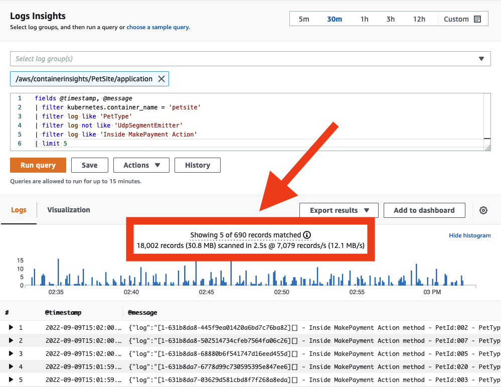
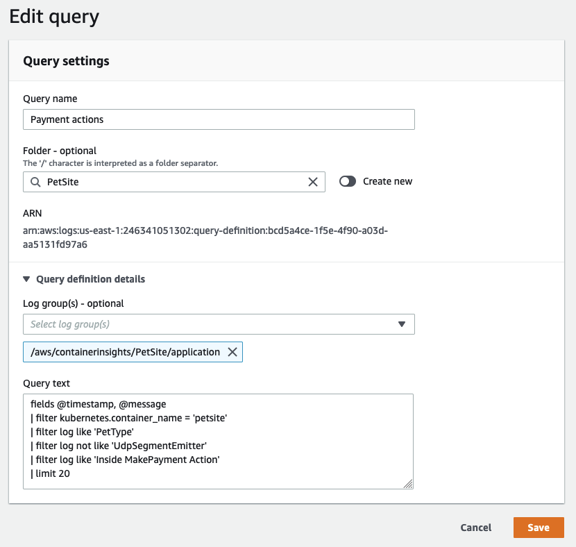
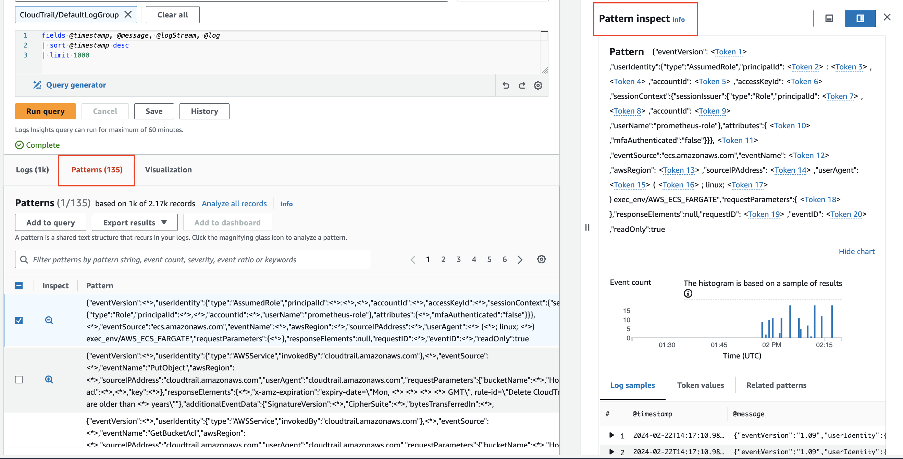
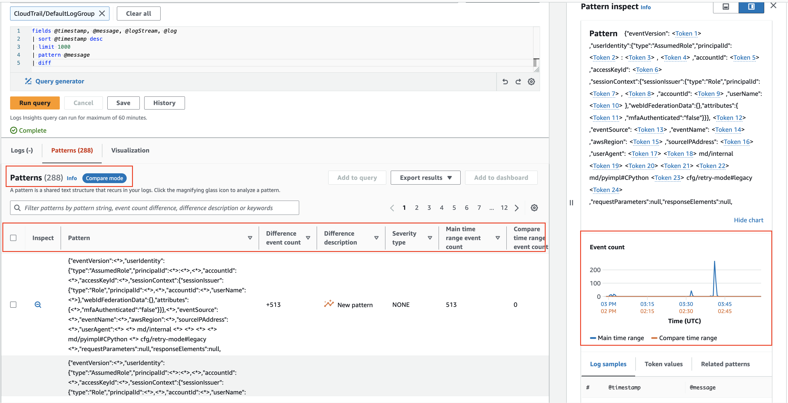
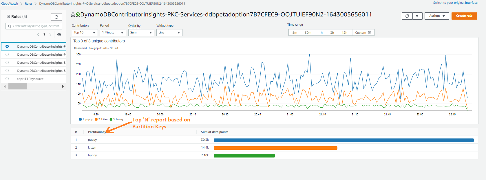
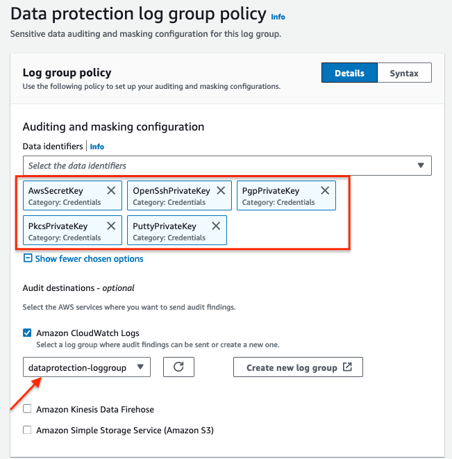
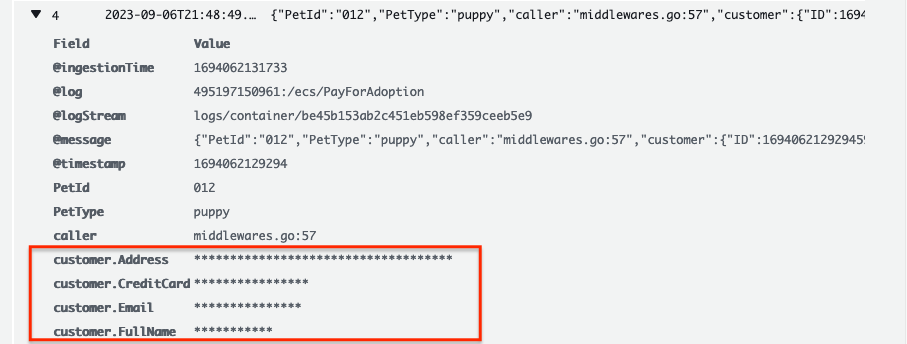

import RelatedEvents from '@site/src/components/RelatedEvents';

# CloudWatch Logs Analysis

## Overview

Effective log analysis is critical for diagnosing application issues, understanding system behavior, and meeting compliance requirements. Amazon CloudWatch Logs provides a comprehensive platform for collecting, storing, and querying log data from your AWS workloads and on-premises environments.

This guide covers best practices for structuring your logs, choosing appropriate log levels, filtering data close to the source, leveraging CloudWatch Logs Insights for powerful ad hoc queries, using Contributor Insights to identify top contributors, and applying Data Protection policies to mask sensitive information automatically.

Logs are intended to be *immutable*, and many log management systems include mechanisms to protect against and detect attempts to modify log data. This immutability principle is fundamental to compliance, auditing, and forensic analysis use cases.

It is intended for application developers, DevOps engineers, and platform teams responsible for logging strategy and operational visibility across distributed systems.

## When to use this

- You are collecting application or infrastructure logs in CloudWatch Logs and want to query them effectively
- You need to establish structured logging standards across your team or organization
- You want ready-to-use Logs Insights query examples for common AWS services (API Gateway, CloudTrail, VPC Flow Logs, SNS)
- You need to identify top contributors impacting system performance using Contributor Insights
- You must protect sensitive data (PII, PHI, financial, credentials) in log events using Data Protection policies
- You are evaluating log group class options (Standard vs. Infrequent Access) to optimize costs

## Guidance

### Structured logging

CloudWatch Logs automatically discovers and indexes JSON fields upon ingestion, enabling ad hoc queries and filtering without manual configuration. Unstructured logs are still deliverable to CloudWatch Logs but will not be automatically indexed.

The most commonly understood log format is JSON, wherein each component of an event is represented as a key/value pair. Consider an unstructured Python error:

```
Traceback (most recent call last):
  File "e.py", line 7, in <module>
    raise TypeError("Again !?!")
TypeError: Again !?!
```

Rewritten as structured JSON:

```json
{
  "level": "ERROR",
  "file": "e.py",
  "line": 7,
  "error": "TypeError(\"Again !?!\")"
}
```

The structured version is transportable between log systems, simplifies development, and makes operational diagnosis faster. JSON embeds the schema of the log message along with the actual data, enabling CloudWatch Logs to index your messages automatically.

Best practices for log formatting:

1. **Use a structured log formatter** such as [Log4j](https://logging.apache.org/log4j/2.x/), [`python-json-logger`](https://pypi.org/project/python-json-logger/), or your framework's native JSON emitter.
2. **Send a single line of logging per event** to your log destination. When sending multiple lines of JSON logging, each line is interpreted as a single event.

For legacy applications that emit multi-line logs (e.g., Java stack traces), use the CloudWatch agent's [`multi_line_start_pattern`](https://docs.aws.amazon.com/AmazonCloudWatch/latest/monitoring/CloudWatch-Agent-Configuration-File-Details.html#CloudWatch-Agent-Configuration-File-Logssection) directive to group multi-line events correctly.

Unstructured logs can still be searched or queried using a regular expression with the `parse` command in Logs Insights, though the experience is significantly less efficient than working with indexed JSON fields.

### Log levels

Use a standardized log level strategy to make automation easier and help developers reach root causes quickly:

| Level | Description |
| ----- | ----------- |
| `DEBUG` | Fine-grained informational events useful for debugging. Usually very verbose. |
| `INFO` | Informational messages highlighting application progress at a coarse-grained level. |
| `WARN` | Potentially harmful situations indicating risk. May trigger an alarm. |
| `ERROR` | Error events that might still allow the application to continue running. Likely triggers attention. |
| `FATAL` | Very severe error events that will presumably cause an application to abort. |

Logging too much data at `WARN` fills your monitoring system with limited-value data, and important signals get lost in the noise. Without a standard approach to log levels, filtering your logs becomes a major challenge.

### Log forwarding and flush intervals

When taking a cloud-first approach to observability, if you need to log into a machine to get its logs, you have an anti-pattern. Your workloads should emit logging data outside of their confines in near real time to a log analysis system. Latency between transmission and the original event represents potential loss of point-in-time information should a disaster befall your workload.

The CloudWatch agent's [`force_flush_interval`](https://docs.aws.amazon.com/AmazonCloudWatch/latest/monitoring/CloudWatch-Agent-Configuration-File-Details.html#CloudWatch-Agent-Configuration-File-Logssection) instructs the agent to send logging data at a regular cadence, unless the buffer size is reached first. As an architect, determine your acceptable loss window and adjust accordingly:

- **Standard in-AWS workloads**: Default flush interval is appropriate for most cases
- **Edge/IoT devices**: Low-bandwidth connections may need much longer intervals (e.g., 15 minutes)
- **Containerized/stateless workloads**: Consider shorter intervals since sudden termination could result in log loss

Containerized or stateless workloads (e.g., Kubernetes pods, EC2 fleet members) may be especially sensitive — they can be scaled-in at any moment, leaving no way to extract logs from terminated resources.

### Filtering close to the source

Reduce log volume as close to the source as possible:

- **Cost**: Ingesting logs always costs time, money, and resources.
- **Security**: Filtering sensitive data (e.g., PII) from downstream systems reduces risk exposure.
- **Relevance**: Downstream systems may not share the same operational concerns. `INFO` logs may be irrelevant to a monitoring system watching for `CRITICAL` or `FATAL` messages.
- **Performance**: Log systems and networks need not be placed under undue stress.

Use the CloudWatch agent's [`filters`](https://docs.aws.amazon.com/AmazonCloudWatch/latest/monitoring/CloudWatch-Agent-Configuration-File-Details.html#CloudWatch-Agent-Configuration-File-Logssection) feature to `include` log levels you want and `exclude` patterns that are not desirable. For example, dropping all records containing a Social Security number:

```json
"filters": [
  {
    "type": "exclude",
    "expression": "\\b(?!000|666|9\\d{2})([0-8]\\d{2}|7([0-6]\\d))([-]?|\\s{1})(?!00)\\d\\d\\2(?!0000)\\d{4}\\b"
  }
]
```

### Logging to stdout

Where possible, applications should log to `stdout` rather than to a fixed location such as a file or socket. This enables log agents to collect and route your log events based on rules that make sense for your observability solution. Container orchestration systems such as Kubernetes or Amazon ECS manage the delivery of `stdout` to a log file automatically, allowing collection by an agent.

The important concept is to separate application concerns from logging infrastructure. Your application should not be dependent on where logs end up — the CloudWatch agent reads the file in real time and forwards data to a log group on your behalf.

Decoupling your application from your log management lets you adapt and evolve your solution without code changes, minimizing the potential blast radius of changes made to your environment.

### Avoid double-ingestion antipatterns

A common pattern administrators pursue is copying all logging data into a single system with the goal of querying all logs from one location. While this has manual workflow advantages, it introduces additional cost, complexity, points of failure, and operational overhead.

Where possible, use a combination of log levels and log filtering to avoid wholesale propagation of log data from your environments. Some organizations require [log shipping](https://en.wikipedia.org/wiki/Log_shipping) to meet regulatory requirements, store logs securely, provide non-repudiation, or achieve other objectives. Even in these cases, applying proper log levels and filtering reduces the volume of superfluous data entering log archives.

### Extract metrics from your logs

Your logs contain metrics waiting to be collected. Even ISV solutions or applications you have not written emit valuable data that you can extract meaningful insights from. Common examples include:

- Slow query times from databases
- Uptime from web servers
- Transaction processing times
- Counts of `ERROR` or `WARNING` events over time
- Raw count of packages available for upgrade

This data is less useful locked in a static log file. The best practice is to identify key metric data and publish it into your metric system (CloudWatch Metrics) where it can be correlated with other signals. Use [CloudWatch Metric Filters](https://docs.aws.amazon.com/AmazonCloudWatch/latest/logs/MonitoringPolicyExamples.html) to automatically extract metric values from log events as they are ingested.

### Log groups and retention

Within CloudWatch Logs, each collection of logs that logically applies to an application should be delivered to a single [log group](https://docs.aws.amazon.com/AmazonCloudWatch/latest/logs/CloudWatchLogsConcepts.html). Within that log group, have commonality among the source systems that create the log streams.

For example, in a LAMP stack: Apache, MySQL, the PHP application, and the Linux OS would each belong to separate log groups. This grouping allows you to apply the same retention period, encryption key, metric filters, subscription filters, and Contributor Insights rules per group.

The default retention period for a log group is *indefinite*. Set the retention period at creation time — either in-tandem with log group creation using infrastructure as code (CloudFormation, CDK) or using the `retention_in_days` setting in the CloudWatch agent configuration.

Log group data is always encrypted at rest. Optionally, use [AWS KMS](https://docs.aws.amazon.com/AmazonCloudWatch/latest/logs/encrypt-log-data-kms.html) for customer-managed key encryption at the log group level.

### Log group class selection

CloudWatch Logs offers two [classes](https://docs.aws.amazon.com/AmazonCloudWatch/latest/logs/CloudWatch_Logs_Log_Classes.html):

- **Standard** — Full-featured, for logs requiring real-time monitoring or frequent access. Supports all CloudWatch Logs capabilities including real-time metric filters, subscription filters, and Live Tail.
- **Infrequent Access** — Lower ingestion price per GB; ideal for ad-hoc querying and after-the-fact forensic analysis on infrequently accessed logs. Offers a subset of CloudWatch Logs capabilities including managed ingestion, storage, cross-account log analytics, and encryption.

Use the `log_group_class` directive in the CloudWatch agent configuration to specify which class to use. The [log-ia-checker](https://github.com/aws-observability/log-ia-checker) CLI tool can audit existing log groups in a given region and recommend which ones could transition to Infrequent Access.

#### When to choose Infrequent Access

- Log groups used primarily for compliance or archival purposes
- Logs that are queried only during incident investigation
- Development or staging environment logs that do not need real-time monitoring
- High-volume logs where cost reduction outweighs the need for real-time features

#### When to keep Standard

- Logs that feed metric filters or subscription filters
- Log groups used for real-time alerting
- Operational logs queried frequently throughout the day
- Logs that need Live Tail for debugging

### Log stream patterns

There is no limitation on the number of log streams in a log group. You can search through the entire complement of logs for your application in a single CloudWatch Logs Insights query. Common patterns include:

- A separate log stream for each pod in a Kubernetes service
- A separate log stream for every EC2 instance in your fleet
- A separate log stream per container task in ECS

This ensures that data from individual compute resources is isolated while still being queryable together at the log group level.

### Managing Logs Insights query costs

CloudWatch Logs Insights charges per gigabyte of data scanned. Strategies for keeping costs under control:

- **Narrow the time range**: If you're looking for entries from yesterday only, exclude today's logs.
- **Target specific log groups**: Searching multiple log groups in a single query increases data scanned. Reduce scope once you identify the right groups.
- **Monitor data scanned per query**: The CloudWatch console shows how much data each query scans.



Save queries that are often repeated into CloudWatch Logs so they can be pre-populated for your users, reducing rework for others who need to analyze log data. Queries can be shared via the [AWS Management Console](https://docs.aws.amazon.com/AmazonCloudWatch/latest/logs/CWL_Insights-Saving-Queries.html), [CloudFormation](https://docs.aws.amazon.com/AWSCloudFormation/latest/UserGuide/aws-resource-logs-querydefinition.html), or [AWS CDK](https://docs.aws.amazon.com/cdk/api/v2/docs/aws-cdk-lib.aws_logs.CfnQueryDefinition.html).



### Pattern analysis

CloudWatch Logs Insights uses machine learning algorithms to find patterns when you query your logs. A pattern is a shared text structure that recurs among your log fields. Patterns compress large log sets into a few recurring structures, making large-scale analysis manageable.



### Compare (diff) with previous time ranges

Comparison queries reveal log event changes over time, aiding in error detection and trend identification. Queries are analyzed against two time periods: the selected period and an equal-length comparison period immediately preceding it.



### Logs Insights example queries

The following example queries demonstrate common patterns for services not covered by the built-in Logs Insights examples.

#### API Gateway

**Last 20 messages containing an HTTP method type:**

```
filter @message like /$METHOD/ 
| fields @timestamp, @message
| sort @timestamp desc
| limit 20
```

Substitute `$METHOD` for the method you are querying (e.g., `POST`, `PUT`).

**Top 20 talkers sorted by IP:**

```
fields @timestamp, @message
| stats count() by ip
| sort ip asc
| limit 20
```

**Top talkers by IP filtered to a specific method:**

```
fields @timestamp, @message
| filter @message like /PUT/
| stats count() by ip
| sort ip asc
| limit 20
```

#### CloudTrail Logs

**API throttling errors grouped by error category:**

```
stats count(errorCode) as eventCount by eventSource, eventName, awsRegion, userAgent, errorCode
| filter errorCode = 'ThrottlingException' 
| sort eventCount desc
```

**Root account activity in line graph:**

```
fields @timestamp, @message, userIdentity.type 
| filter userIdentity.type='Root' 
| stats count() as RootActivity by bin(5m)
```

#### VPC Flow Logs

**Filtering for a specific source IP with REJECT action:**

```
fields @timestamp, @message, @logStream, @log  | filter srcAddr like '$SOURCEIP' and action = 'REJECT'
| sort @timestamp desc
| limit 20
```

Substitute `$SOURCEIP` for the IP address of interest (e.g., `10.0.0.5`).

**Grouping network traffic by Availability Zone:**

```
stats sum(bytes / 1048576) as Traffic_MB by azId as AZ_ID 
| sort Traffic_MB desc
```

**Grouping network traffic by flow direction:**

```
stats sum(bytes / 1048576) as Traffic_MB by flowDirection as Flow_Direction 
| sort by Bytes_MB desc
```

**Top 10 data transfers by source and destination IP:**

```
stats sum(bytes / 1048576) as Data_Transferred_MB by srcAddr as Source_IP, dstAddr as Destination_IP 
| sort Data_Transferred_MB desc 
| limit 10
```

#### Amazon SNS Logs

**Count of SMS message failures by reason:**

```
filter status = "FAILURE"
| stats count(*) by delivery.providerResponse as FailureReason
| sort delivery.providerResponse desc
```

**SMS failures due to invalid phone number:**

```
fields notification.messageId as MessageId, delivery.destination as PhoneNumber
| filter status = "FAILURE" and delivery.providerResponse = "Invalid phone number"
| limit 100
```

**Message failure statistics by SMS type:**

```
fields delivery.smsType
| filter status = "FAILURE"
| stats count(notification.messageId), avg(delivery.dwellTimeMs), sum(delivery.priceInUSD) by delivery.smsType
```

**SNS failure notification statistics:**

```
fields @MessageID 
| filter status = "FAILURE"
| stats count(delivery.deliveryId) as FailedDeliveryCount, avg(delivery.dwellTimeMs) as AvgDwellTime, max(delivery.dwellTimeMs) as MaxDwellTime by notification.messageId as MessageID
| limit 100
```

### Contributor Insights

Amazon CloudWatch Contributor Insights analyzes log data to identify top contributors influencing your metrics — real-time rankings of entities impacting system behavior and performance.

**Built-in rules** are available for common services: VPC Flow Logs, Application Load Balancer, API Gateway, and Lambda.

**Custom rules** let you define:
1. Log group(s) to analyze
2. Contributor fields (JSON keys)
3. Metrics and aggregations
4. Time windows and sampling rates

Example custom rule for analyzing API Gateway request patterns:

```json
{
  "AggregateOn": "Count",
  "Contribution": {
    "Filters": [],
    "Keys": [
      "$.pettype"
    ]
  },
  "LogFormat": "JSON",
  "Schema": {
    "Name": "CloudWatchLogRule",
    "Version": 1
  },
  "LogGroupARNs": [
    "arn:aws:logs:[region]:[account]:log-group:[API Gateway Log Group Name]"
  ]
}
```



Best practices for Contributor Insights:

- **Start with built-in rules** before creating custom ones
- **Use descriptive rule names** for easy identification
- **Limit active rules** and set optimal sampling rates to manage costs
- **Delete unused rules** and review sampling rates periodically
- **Integrate with CloudWatch Dashboards** for visualization and with **CloudWatch Alarms** for alerting on contributor patterns

Common issues and solutions:

| Issue | Solution |
|-------|----------|
| Rules not matching expected logs | Verify log format matches rule configuration; check field names and JSON structure |
| Gaps in contributor data | Check sampling rate configuration; verify log delivery; review time window settings |
| Slow rule processing | Reduce number of active rules; adjust sampling rates; review contribution thresholds |

```bash
# Create a Contributor Insights rule
aws cloudwatch put-insight-rule --rule-name MyRule --rule-definition file://rule.json

# Delete a rule
aws cloudwatch delete-insight-rule --rule-name MyRule
```

### Data Protection policies

[Data Protection policies](https://docs.aws.amazon.com/AmazonCloudWatch/latest/logs/cloudwatch-logs-data-protection-policies.html) in CloudWatch Logs scan log data in transit for sensitive data and mask it upon detection. This helps organizations comply with HIPAA, GDPR, PCI-DSS, and FedRAMP requirements.

Using managed data identifiers, CloudWatch Logs can detect and mask:

- **Credentials** — Private keys, AWS secret access keys
- **Device identifiers** — IP addresses, MAC addresses
- **Financial information** — Bank account numbers, credit card numbers
- **Protected Health Information (PHI)** — Health insurance card numbers, personal health numbers
- **Personally Identifiable Information (PII)** — Driver's licenses, social security numbers, taxpayer IDs

Sensitive data is detected and masked at ingestion time. Log events ingested before a data protection policy is set are not retroactively masked.

To verify masking is working, query the protected log group in Logs Insights:

```
fields @timestamp, @message
| sort @timestamp desc
| limit 20
```

Masked fields appear as asterisks in query results.





Key points:

- By default, masked data requires the `logs:Unmask` IAM permission to view unmasked.
- Use [IAM](https://docs.aws.amazon.com/AmazonCloudWatch/latest/monitoring/auth-and-access-control-cw.html) to restrict access to sensitive data in CloudWatch.
- Best practice is to avoid logging sensitive data in code in the first place; use data protection as a safety net.
- Log group data is always encrypted at rest. Optionally use [AWS KMS](https://docs.aws.amazon.com/AmazonCloudWatch/latest/logs/encrypt-log-data-kms.html) for additional control.
- Data classification best practices start with clearly defined data classification tiers and requirements that meet your organizational, legal, and compliance standards.
- Use tags on AWS resources based on the data classification framework to implement compliance in accordance with your organization's data governance policies.
- Regular monitoring and auditing of your cloud environment are equally important. For applications generating large volumes of data, avoid logging an excessive amount — see [AWS Prescriptive Guidance: Logging Best Practices](https://docs.aws.amazon.com/prescriptive-guidance/latest/logging-monitoring-for-application-owners/logging-best-practices.html).

For detailed lists of supported data identifiers, see:
- [Financial data types](https://docs.aws.amazon.com/AmazonCloudWatch/latest/logs/protect-sensitive-log-data-types-financial.html)
- [PHI data types](https://docs.aws.amazon.com/AmazonCloudWatch/latest/logs/protect-sensitive-log-data-types-health.html)
- [PII data types](https://docs.aws.amazon.com/AmazonCloudWatch/latest/logs/protect-sensitive-log-data-types-pii.html)

## Related

- [CloudWatch Logs Security](../cloudwatch-logs-security/) — Security-focused logging guidance including cross-account and encryption
- [CloudWatch Metrics](../cloudwatch-metrics/) — Extract metric data from your logs using metric filters
- [Security Lake with CloudWatch](../security-lake-cloudwatch/) — Centralized security log analytics
- [AWS Documentation: CloudWatch Logs Insights Query Syntax](https://docs.aws.amazon.com/AmazonCloudWatch/latest/logs/CWL_QuerySyntax.html)
- [AWS Documentation: Contributor Insights Rule Syntax](https://docs.aws.amazon.com/AmazonCloudWatch/latest/monitoring/ContributorInsights-RuleSyntax.html)
- [AWS Documentation: Data Protection Policies](https://docs.aws.amazon.com/AmazonCloudWatch/latest/logs/cloudwatch-logs-data-protection-policies.html)

## Related Events

<RelatedEvents topics={["logs", "cloudwatch"]} />
