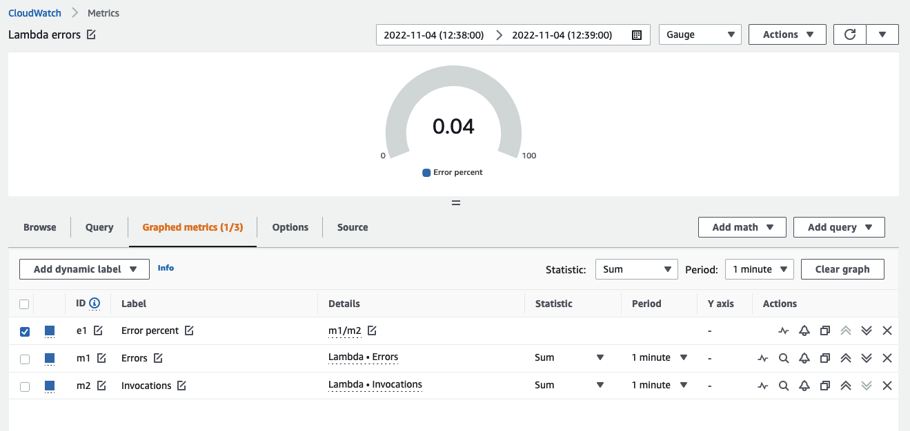
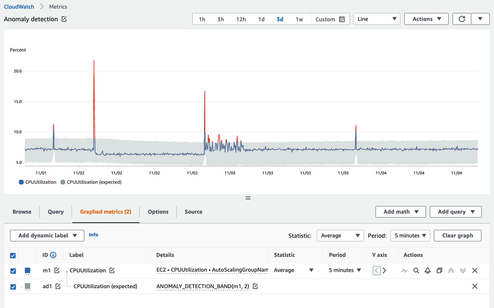
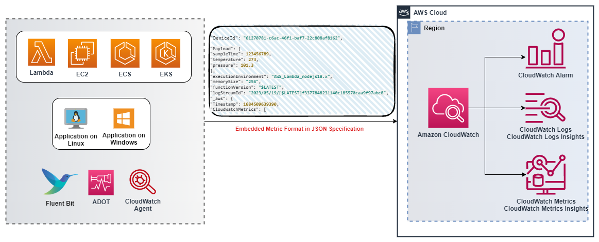
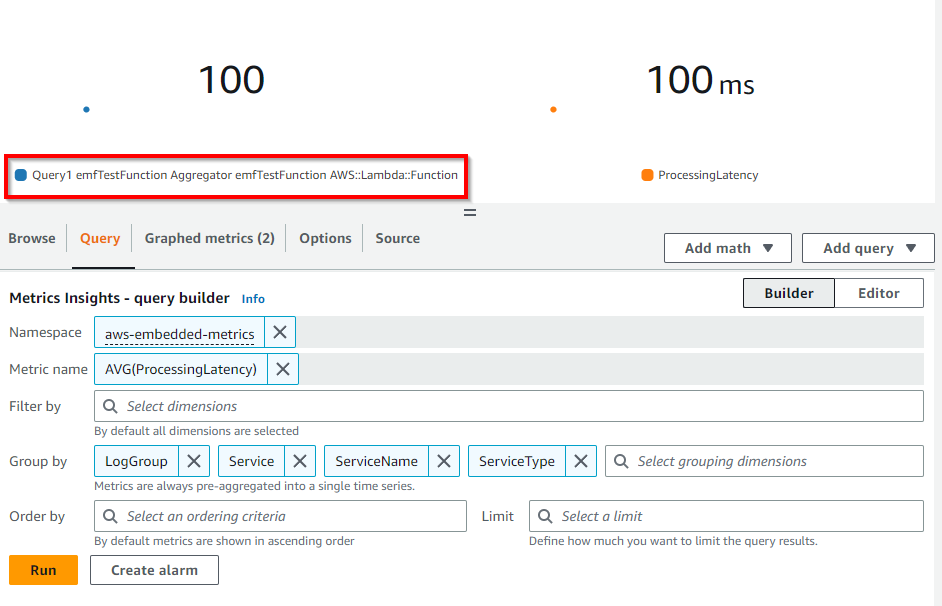

import RelatedEvents from '@site/src/components/RelatedEvents';

# CloudWatch Metrics and EMF

## Related Events

<RelatedEvents topics={["cloudwatch", "metrics"]} />

## Overview

Metrics are numerical time-series data that track system performance, resource utilization, and business outcomes. CloudWatch collects, stores, and visualizes metrics from AWS services (vended metrics) and your applications (custom metrics). Understanding how to design your metric strategy — choosing dimensions wisely, managing cardinality, and selecting the right emission method — is foundational to effective observability.

This guide covers metric design principles, the role of dimensions and cardinality, high-resolution metrics, and CloudWatch Embedded Metric Format (EMF) as a cost-effective approach for emitting custom metrics from structured logs.

## When to use this

- You are designing a custom metrics strategy and need to understand dimensions and cardinality trade-offs.
- You want to emit custom metrics without the cost or complexity of direct `PutMetricData` API calls.
- You need high-resolution (1-second) metrics for latency-sensitive workloads.
- You are evaluating whether to use vended metrics, custom metrics, or EMF for a particular signal.
- You want to combine metrics and detailed log data into a single instrumentation path.

## Guidance

### Know your KPIs and measure them

The most important thing with metrics is to measure the *right* things. Start by naming your high-level business goals, then work backwards to the operational metrics that impact them.

:::warning
There is no singular, complete source for your business KPIs. You must understand your application well enough to know your output goals.
:::

For example, an e-commerce application might track orders per hour. Working backwards: for orders to happen, users must search products, add to cart, enter delivery details, and complete payment. Each workflow has measurable latency, throughput, and error rates that contribute to the top-level KPI.

:::info
Having identified your KPIs, work backwards to see what metrics in your workload impact them. Store business metrics and operational metrics together so you can correlate them.
:::

### Vended metrics versus custom metrics

**Vended metrics** are emitted automatically by AWS services at no additional charge — EC2 CPU utilization, RDS connections, S3 request counts, and [many more](https://docs.aws.amazon.com/AmazonCloudWatch/latest/monitoring/aws-services-cloudwatch-metrics.html). These cover infrastructure health but rarely capture application-level or business-level signals.

**Custom metrics** fill the gap. You emit them via:

- `PutMetricData` API (or an SDK wrapper)
- CloudWatch Agent (for system metrics like memory and disk)
- Embedded Metric Format (structured logs that extract metrics automatically)

Choose custom metrics when vended metrics do not cover your KPIs or application-specific performance indicators.

### Dimensions and cardinality

A [dimension](https://docs.aws.amazon.com/AmazonCloudWatch/latest/monitoring/cloudwatch_concepts.html#Dimension) is a name-value pair that identifies a metric uniquely. For example, `InstanceId` is a dimension for EC2 CPU metrics. Each unique combination of metric name + dimensions creates a separate time series.

**Cardinality** is the total number of unique time series. High cardinality arises when dimensions have many possible values (user IDs, request IDs, unbounded tags). CloudWatch supports up to 30 dimensions per metric, but each unique combination incurs storage and query cost.

Design dimensions deliberately:

| Do | Don't |
|----|-------|
| Use bounded values (region, service name, status code) | Use unbounded values (user ID, request ID, timestamp) |
| Aggregate where possible (service-level, not request-level) | Create a dimension per customer in a multi-tenant system |
| Plan dimensions around your query patterns | Add dimensions "just in case" |

:::info
If you need high-cardinality context for debugging, put it in log fields alongside EMF metrics. Query the detail via CloudWatch Logs Insights — do not make every attribute a dimension.
:::

### High-resolution metrics

Standard CloudWatch metrics have 60-second resolution. [High-resolution metrics](https://docs.aws.amazon.com/AmazonCloudWatch/latest/monitoring/publishingMetrics.html#high-resolution-metrics) support 1-second granularity, useful for:

- Latency-sensitive applications where 60-second averages mask spikes.
- Auto-scaling decisions that need faster signal.
- Short-lived operations (Lambda cold starts, queue drain times).

High-resolution metrics cost more. Use them selectively for metrics where sub-minute visibility changes your operational decisions.

### Querying metrics with metric math

[Metric math](https://docs.aws.amazon.com/AmazonCloudWatch/latest/monitoring/using-metric-math.html) lets you combine multiple metrics using expressions. Common patterns:

- **Error rate**: `Errors / Requests * 100`
- **Conditional alarms**: `IF(latency > threshold, 1, 0)` to create boolean signals for alarms
- **Top-N search**: `SORT(SEARCH('{AWS/EC2,InstanceId} MetricName="CPUUtilization"', 'Average', 300), MAX, DESC, 10)`



:::info
Use metric math to derive values from separate data sources and trigger alarms on computed KPIs rather than raw infrastructure metrics.
:::

### Anomaly detection

CloudWatch [anomaly detection](https://docs.aws.amazon.com/AmazonCloudWatch/latest/monitoring/CloudWatch_Anomaly_Detection.html) learns what *normal* looks like over a two-week training period, accounting for hourly, daily, and weekly patterns.



Key considerations:

- The model only trains forward from creation — it does not analyze historical data retroactively.
- It knows what *normal* is, not what *good* is. A consistently unhealthy metric will have an unhealthy baseline.
- Exclude known abnormal periods (nights, weekends, maintenance windows) from training.

:::info
Use anomaly detection for metrics where manually defining thresholds is impractical — especially in microservices architectures with hundreds of metrics.
:::

### Embedded Metric Format (EMF)

[Embedded Metric Format](https://docs.aws.amazon.com/AmazonCloudWatch/latest/monitoring/CloudWatch_Embedded_Metric_Format.html) lets you embed metric definitions inside structured JSON log entries. CloudWatch Logs automatically extracts the metrics — no `PutMetricData` calls, no separate instrumentation path.



#### When to use EMF

- You need custom metrics from Lambda functions, containers, or other ephemeral compute where maintaining a metrics agent is impractical.
- You want high-cardinality context (device IDs, request IDs, account IDs) queryable in logs alongside extracted metrics.
- You are already emitting structured logs and want metrics without additional API calls or billing from `PutMetricData`.
- You need to correlate a metric anomaly with the specific log events that contributed to it.

#### How EMF works

Emit a JSON log entry with an `_aws` block specifying the namespace, dimensions, and metric definitions:

```json
{
  "_aws": {
    "Timestamp": 1574109732004,
    "CloudWatchMetrics": [
      {
        "Namespace": "MyApplication",
        "Dimensions": [["Service", "Environment"]],
        "Metrics": [
          { "Name": "ProcessingLatency", "Unit": "Milliseconds" }
        ]
      }
    ]
  },
  "Service": "OrderProcessor",
  "Environment": "Production",
  "RequestId": "abc-123",
  "ProcessingLatency": 47
}
```

CloudWatch extracts `ProcessingLatency` as a metric with dimensions `Service` and `Environment`. The full log entry — including `RequestId` and any other fields — remains queryable in CloudWatch Logs Insights.

#### Generating EMF logs

- **Client libraries** — available for [Node.js](https://github.com/awslabs/aws-embedded-metrics-node), [Python](https://github.com/awslabs/aws-embedded-metrics-python), [Java](https://github.com/awslabs/aws-embedded-metrics-java), and [C#](https://github.com/awslabs/aws-embedded-metrics-dotnet).
- **ADOT Collector** — the [AWS EMF Exporter](https://aws-otel.github.io/docs/getting-started/cloudwatch-metrics#cloudwatch-emf-exporter-awsemf) converts OpenTelemetry metrics to EMF format.
- **Manual JSON** — construct logs conforming to the [EMF specification](https://docs.aws.amazon.com/AmazonCloudWatch/latest/monitoring/CloudWatch_Embedded_Metric_Format_Specification.html) and send via CloudWatch Agent, Fluent Bit, or `PutLogEvents` API.

#### High-resolution EMF

EMF supports an optional `StorageResolution` parameter (value `1` or `60`) to extract high-resolution metrics at 1-second granularity from structured logs.

#### Viewing and alarming on EMF metrics

Extracted metrics appear in the CloudWatch Metrics console under the namespace you specified. You can create alarms on them identically to any other metric. Since EMF metric generation depends on log publishing flow, ensure logs are published promptly so datapoints are created within alarm evaluation periods.



### Batching PutMetricData calls

If you use `PutMetricData` directly (not EMF), batch your data:

- The API supports up to 150 values per metric in a single request using the `Values` and `Counts` method.
- Batching reduces both cost (fewer API calls) and the risk of throttling.

:::info
When using `PutMetricData`, always batch datapoints into single PUT operations. For large volumes of metrics, consider EMF instead — it does not use or charge for `PutMetricData`.
:::

## Related

- [CloudWatch Dashboards](../cloudwatch-dashboards/) — visualizing metrics effectively
- [Alarms and Alerting](../cloudwatch-alarms-alerting/) — creating alarms on metrics and derived values
- [Rust Custom Metrics](../rust-custom-metrics/) — emitting custom metrics from Rust applications
- [CloudWatch Metrics documentation](https://docs.aws.amazon.com/AmazonCloudWatch/latest/monitoring/working_with_metrics.html)
- [EMF Specification](https://docs.aws.amazon.com/AmazonCloudWatch/latest/monitoring/CloudWatch_Embedded_Metric_Format_Specification.html)
