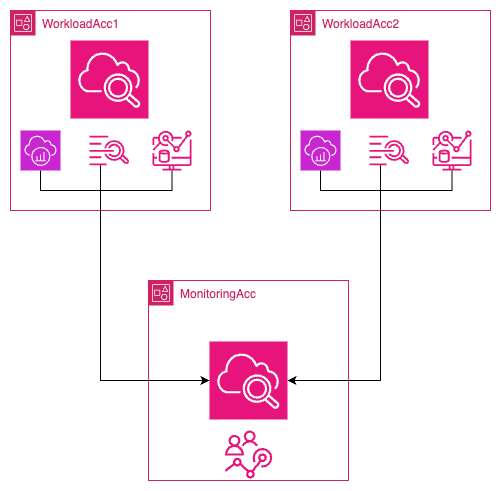
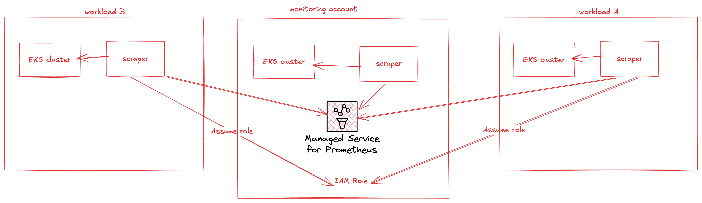
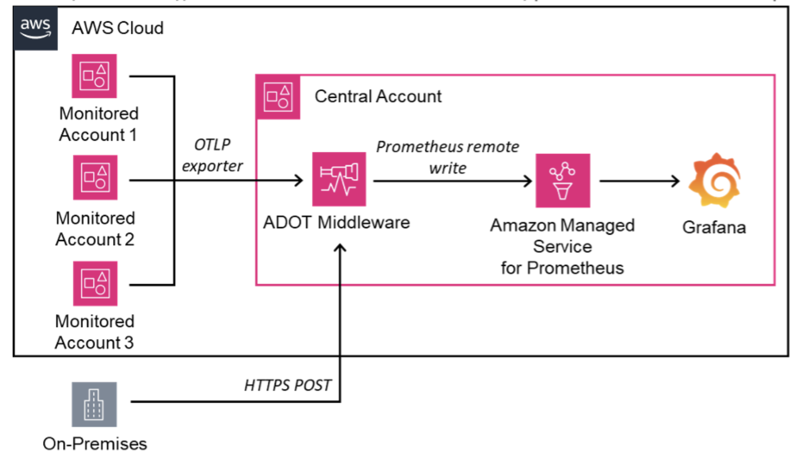

import RelatedEvents from '@site/src/components/RelatedEvents';

# Cross-Account Observability

## Related Events

<RelatedEvents topics={["cloudwatch", "metrics"]} />

## Overview

Organizations running workloads across multiple AWS accounts need a unified view of metrics, logs, and traces without duplicating data or managing complex cross-account IAM plumbing manually. This solution covers two complementary paths:

1. **CloudWatch cross-account observability** — a native AWS feature using monitoring/source account topology to share CloudWatch Metrics, Logs, and X-Ray Traces with zero data transfer cost.
2. **AMP cross-account scraping** — using Amazon Managed Service for Prometheus managed collectors to scrape EKS clusters in source accounts and write metrics to a central AMP workspace in a target account.

Both approaches can coexist: CloudWatch handles native AWS service metrics and logs while AMP handles Prometheus-compatible workload metrics from Kubernetes environments.

## Prerequisites

- At least two AWS accounts (one monitoring/target, one or more source accounts)
- IAM permissions to create OAM sinks and links ([required permissions](https://docs.aws.amazon.com/AmazonCloudWatch/latest/monitoring/CloudWatch-Unified-Cross-Account-Setup.html#CloudWatch-Unified-Cross-Account-Setup-permissions))
- For AMP path: EKS clusters in source accounts with VPC subnets accessible by managed scraper ENIs
- For AMP path: an AMP workspace in the target account
- Optional: AWS Organizations for automated deployment via CloudFormation StackSets

## Architecture

### CloudWatch cross-account observability



The monitoring account creates a **sink** that source accounts link to. Source accounts share metrics, logs, and traces — data remains stored in the source account and is read by the monitoring account with no duplication (except traces, which are copied to the monitoring account at no additional cost to the source).

### Open-source path: AMP cross-account scraping



Managed collectors in each source account scrape Prometheus metrics from EKS clusters and assume a cross-account role to remote-write into the central AMP workspace. Data never traverses the public internet (uses VPC endpoints).

### Centralized ADOT collection pattern



An alternative for non-EKS workloads: source accounts export metrics via OTLP to a centralized ADOT collector, which writes to AMP. On-premises systems connect over HTTPS.

## Deploy

### Path 1: CloudWatch cross-account observability

#### Configure the monitoring account

1. In the CloudWatch console of the monitoring account, go to **Settings → Monitoring account configuration → Configure**.

2. Select the telemetry types to share (Metrics, Logs, Traces). For ServiceLens/X-Ray, all three are required.

3. Enter source account IDs (or select AWS Organization). Click **Configure**.

4. Copy the **Monitoring account sink ARN** from the Configuration details section.

#### Link source accounts

5. In each source account's CloudWatch console, go to **Settings → Source account configuration → Configure**.

6. Select the data types to share, paste the monitoring account sink ARN, and confirm.

7. Verify the link shows a green "linked" status.

#### Alternative: AWS Organizations deployment

For large-scale rollout, deploy a CloudFormation StackSet across all member accounts:

```json
{
  "Version": "2012-10-17",
  "Statement": [
    {
      "Effect": "Allow",
      "Principal": "*",
      "Action": ["oam:CreateLink", "oam:UpdateLink"],
      "Resource": "*",
      "Condition": {
        "ForAllValues:StringEquals": {
          "oam:ResourceTypes": [
            "AWS::Logs::LogGroup",
            "AWS::CloudWatch::Metric",
            "AWS::XRay::Trace"
          ]
        },
        "ForAnyValue:StringEquals": {
          "aws:PrincipalOrgID": "${OrganizationId}"
        }
      }
    }
  ]
}
```

### Path 2: AMP cross-account scraping

#### Create roles

1. In the **source account**, create a role (`Source`) with a trust policy allowing `scraper.aps.amazonaws.com` and an assume-role permission for the target account role:

```json
{
  "Version": "2012-10-17",
  "Statement": [
    {
      "Effect": "Allow",
      "Principal": { "Service": "scraper.aps.amazonaws.com" },
      "Action": "sts:AssumeRole",
      "Condition": {
        "ArnEquals": { "aws:SourceArn": "$SCRAPER_ARN" },
        "StringEquals": { "AWS:SourceAccount": "$SOURCE_ACCOUNT_ID" }
      }
    }
  ]
}
```

2. In the **target account**, create a role (`Target`) with `AmazonPrometheusRemoteWriteAccess` and a trust policy allowing the source role:

```json
{
  "Effect": "Allow",
  "Principal": { "AWS": "arn:aws:iam::$SOURCE_ACCOUNT_ID:role/Source" },
  "Action": "sts:AssumeRole",
  "Condition": {
    "StringEquals": { "sts:ExternalId": "$SCRAPER_ARN" }
  }
}
```

#### Create the scraper

3. Create the managed scraper in the source account:

```bash
aws amp create-scraper \
  --source eksConfiguration="{clusterArn='arn:aws:eks:$REGION:$SOURCE_ACCOUNT_ID:cluster/$CLUSTER',subnetIds=[$SUBNETS]}" \
  --scrape-configuration configurationBlob=<base64-scrape-config> \
  --destination ampConfiguration="{workspaceArn='arn:aws:aps:$REGION:$TARGET_ACCOUNT_ID:workspace/$WORKSPACE_ID'}" \
  --role-configuration '{"sourceRoleArn":"arn:aws:iam::$SOURCE_ACCOUNT_ID:role/Source","targetRoleArn":"arn:aws:iam::$TARGET_ACCOUNT_ID:role/Target"}'
```

4. Wait for scraper to reach `ACTIVE` status (~20 minutes):

```bash
aws amp list-scrapers --query "scrapers[?status.statusCode=='ACTIVE']"
```

5. Update the trust policies from steps 1-2 with the actual scraper ARN.

## Validate

### CloudWatch path

1. In the monitoring account CloudWatch console, go to **Settings → Manage monitoring account** and confirm source accounts appear as "linked".
2. Navigate to **All Metrics** — use the `:aws.AccountId=` filter to confirm metrics from source accounts are visible.
3. In **Logs Insights**, select log groups from source accounts and run a query to confirm cross-account log access.
4. Under **X-Ray traces → Trace map**, verify nodes from source accounts appear with account labels.

### AMP path

1. Run an instant query against the target AMP workspace to confirm metrics are flowing:

```bash
awscurl --service aps --region $REGION \
  "${AMP_ENDPOINT}api/v1/query?query=up"
```

2. In Amazon Managed Grafana, add the target AMP workspace as a Prometheus data source and query for cluster-specific metrics from source accounts.

## Troubleshoot

| Symptom | Likely Cause | Fix |
|---------|-------------|-----|
| Source account shows "not linked" status | Sink policy does not include the source account ID or organization ID | Update the monitoring account sink policy to allow the source account |
| Metrics from source not visible in monitoring account | Namespace filtering configured; the specific namespace is excluded | Edit the monitoring account configuration to include all namespaces or add the missing one |
| AMP scraper stuck in CREATING state | Security groups on EKS subnets block scraper ENI egress to VPC endpoint | Allow outbound HTTPS (port 443) from scraper security groups to the APS VPC endpoint |
| Cross-account alarms fail to create | Alarm uses SEARCH expression (not supported) or references a cross-Region metric | Use a single-timeseries Metrics Insights SQL query; ensure alarm and metric are in the same Region |
| AMP query returns empty from target workspace | Trust policy not updated with actual scraper ARN after creation | Update both source and target role trust policies with the scraper ARN from `aws amp list-scrapers` |

## Related Solutions

- [EKS Infrastructure](../eks-infrastructure/)
- [CloudWatch Logs Security](../cloudwatch-logs-security/)
