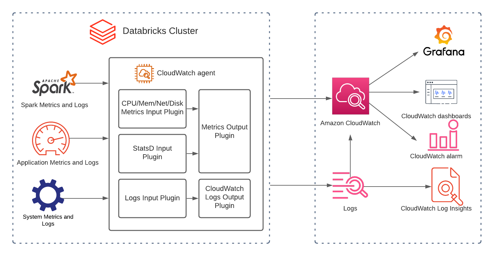

# Databricks Monitoring

## Overview

Databricks is a platform for managing data analytics and AI/ML workloads. When running [Databricks on AWS](https://aws.amazon.com/solutions/partners/databricks/), operations teams benefit from an integrated monitoring solution that tracks cluster performance, workload errors, and resource utilization using AWS-native observability services.

This entry covers integrating Databricks clusters with Amazon CloudWatch for centralized logging and metrics collection. Databricks init scripts install collectors at cluster boot time, enabling structured logging and custom metric emission without manual intervention on each node.

For a detailed walkthrough, see [How to Monitor Databricks with Amazon CloudWatch](https://aws.amazon.com/blogs/mt/how-to-monitor-databricks-with-amazon-cloudwatch/).

## Prerequisites

- An AWS account with CloudWatch permissions
- A Databricks workspace deployed on AWS
- IAM instance profile with `cloudwatch:PutMetricData` and `logs:PutLogEvents` permissions
- Databricks cluster with init scripts enabled
- Spark metrics namespace configured in cluster Spark configuration (replace `testApp` with your cluster reference)

## Architecture


*Databricks clusters emit metrics and logs to CloudWatch via init-script-installed collectors*

The architecture uses Databricks init scripts to install the CloudWatch agent on each cluster node at boot. Spark exposes native Prometheus-format metrics from drivers and workers. The CloudWatch agent collects these along with system-level metrics (CPU, memory, disk, network) and forwards them to CloudWatch Metrics and CloudWatch Logs.


*Spark configuration for metrics namespace*

## Deploy

1. Create an IAM instance profile with the following permissions:

```json
{
  "Effect": "Allow",
  "Action": [
    "cloudwatch:PutMetricData",
    "logs:CreateLogGroup",
    "logs:CreateLogStream",
    "logs:PutLogEvents"
  ],
  "Resource": "*"
}
```

2. Attach the instance profile to your Databricks cluster configuration.

3. Configure the metrics namespace in your Databricks cluster Spark configuration:

```
spark.metrics.namespace <your-cluster-name>
```

4. Create a cluster-scoped init script that installs and configures the CloudWatch agent:

```bash
#!/bin/bash
# Install CloudWatch agent
sudo yum install -y amazon-cloudwatch-agent

# Write agent config
cat <<EOF > /opt/aws/amazon-cloudwatch-agent/etc/amazon-cloudwatch-agent.json
{
  "logs": {
    "logs_collected": {
      "files": {
        "collect_list": [
          {
            "file_path": "/databricks/driver/logs/stdout",
            "log_group_name": "/databricks/driver/stdout",
            "log_stream_name": "{instance_id}"
          },
          {
            "file_path": "/databricks/driver/logs/stderr",
            "log_group_name": "/databricks/driver/stderr",
            "log_stream_name": "{instance_id}"
          }
        ]
      }
    }
  },
  "metrics": {
    "namespace": "Databricks",
    "metrics_collected": {
      "cpu": { "measurement": ["usage_active"] },
      "mem": { "measurement": ["used_percent"] },
      "disk": { "measurement": ["used_percent"] }
    }
  }
}
EOF

# Start agent
sudo /opt/aws/amazon-cloudwatch-agent/bin/amazon-cloudwatch-agent-ctl \
  -a fetch-config -m ec2 -s \
  -c file:/opt/aws/amazon-cloudwatch-agent/etc/amazon-cloudwatch-agent.json
```

5. Upload the init script to DBFS or a cloud storage location and reference it in the cluster configuration.

6. Restart the cluster to apply the init script.

## Validate

1. After the cluster starts, verify the CloudWatch agent is running on a node:

```bash
sudo /opt/aws/amazon-cloudwatch-agent/bin/amazon-cloudwatch-agent-ctl -a status
```

2. In the CloudWatch console, navigate to **Metrics → All metrics → Databricks** and confirm your cluster's metrics appear.

3. Navigate to **CloudWatch → Log groups** and verify `/databricks/driver/stdout` and `/databricks/driver/stderr` log groups contain recent entries.

4. Run a sample Spark job and use **CloudWatch Logs Insights** to query the driver logs:

```
fields @timestamp, @message
| filter @logStream like /i-/
| sort @timestamp desc
| limit 20
```

## Troubleshoot

| Symptom | Likely Cause | Fix |
|---------|-------------|-----|
| No metrics in CloudWatch after cluster start | Init script failed to execute or IAM instance profile missing | Check init script logs in DBFS at `/databricks/init_scripts/<cluster-id>/` and verify instance profile attachment |
| Log groups not created | CloudWatch agent not running or missing `logs:CreateLogGroup` permission | SSH to a node and check agent status; verify IAM policy includes Logs permissions |
| Metrics appear under wrong namespace | Spark metrics namespace not configured | Add `spark.metrics.namespace` to the cluster Spark configuration and restart |
| Init script timeout on large clusters | Script downloading large packages over slow connection | Pre-bake the CloudWatch agent into a custom AMI or use a workspace-level init script for caching |

## Related Solutions

- [Big Data and Spark Observability](../big-data-observability/)
- [RDS and Aurora Monitoring](../rds-aurora-monitoring/)
