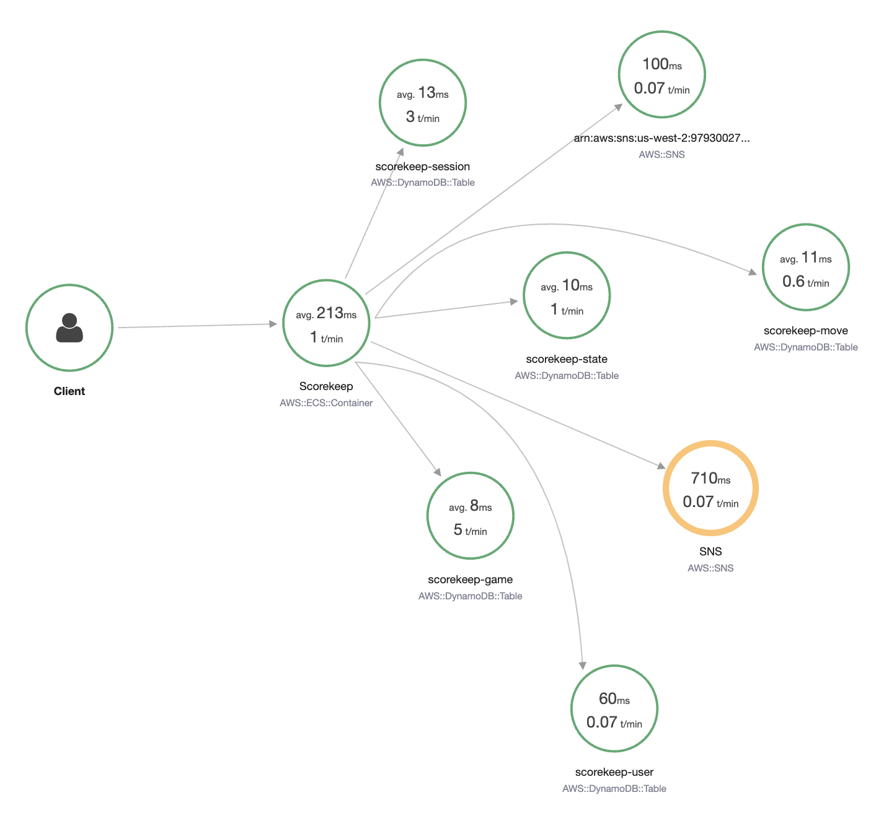

import RelatedEvents from '@site/src/components/RelatedEvents';

# Distributed Tracing

## Overview

Distributed tracing provides end-to-end visibility into requests as they traverse multiple services in a microservices architecture. Unlike logs or metrics, traces capture the causal relationships between services — response latency, service faults, request parameters, and metadata across the entire request path.

AWS provides two primary toolsets for trace collection: [AWS X-Ray](https://docs.aws.amazon.com/xray/latest/devguide/aws-xray.html) (with its SDKs and daemon) and the [AWS Distro for OpenTelemetry (ADOT)](https://aws-otel.github.io/). This guide covers what traces give you, how to configure sampling effectively, daemon deployment best practices, enriching traces with annotations, and how to choose between X-Ray SDKs and ADOT for your workload.

## When to use this

- You are building or operating microservices and need visibility into cross-service request flow
- You need to diagnose latency or failures that span multiple service boundaries
- You want to understand the performance profile of end-to-end transactions
- You are deciding between X-Ray SDKs and OpenTelemetry (ADOT) for instrumentation
- You need to configure sampling rules to balance observability with cost

## Guidance

### What traces give you

Traces represent the entire journey of a request as it moves through different components. Each trace is broken into *spans* (or *segments* in X-Ray terminology) that record each step in the request path, including timing, status codes, and metadata.

A typical instrumentation approach assigns a unique trace identifier for each request entering the system and carries that ID as it passes through different components, adding metadata along the way.

Common use cases for traces include:

- **Performance profiling** — Identifying which service or operation contributes most to latency
- **Debugging production issues** — Pinpointing where in a chain of services a failure occurs
- **Root cause analysis** — Understanding cascading failures across service boundaries
- **SLA compliance** — Measuring end-to-end transaction times against your targets

Every connection from one service to another should be instrumented to emit traces to a central collector. This approach helps you see into otherwise opaque aspects of your workload. Instrumenting your application can be largely automated when using an auto-instrumentation agent or library.

### Sampling strategy

Sampling rules determine which requests get traced. The goal is to collect enough data to diagnose issues and understand performance, without creating unmanageable volume or cost.

**X-Ray default behavior**: The X-Ray SDK records the first request each second, and five percent of any additional requests.

Key sampling considerations:

- **Set sample rates per criteria** — You can set rates separately by service name, service type, HTTP method, URL path, resource ARN, or host. For example, sampling 1% of landing page traffic but 10% of payment page requests.
- **Always set a reservoir size** — The reservoir determines the maximum requests per second captured. This protects against malicious attacks, unwanted charges, and configuration errors.
- **Avoid 100% sample rates** — Traces are not intended for forensic audits. Using UDP-based emitters means occasional trace loss is expected. A 100% rate can set false expectations about completeness.
- **Add traces gradually** — Start with critical paths and expand coverage as you learn your workload's data volume.

Configure sampling rules in the AWS Console, through a local configuration file, or both. Use the X-Ray console, API, or CloudFormation whenever possible — this allows you to change sampling behavior at runtime without redeployment.

### X-Ray daemon configuration

The X-Ray daemon offloads the effort of sending telemetry to the X-Ray data plane. It should not consume excessive resources on the host where the source application runs.

Best practices:

- **Run the daemon separately** — The best practice is to run the X-Ray daemon on another instance or container, enforcing separation of concerns and keeping your source system unencumbered.
- **Use sidecar patterns** — In container orchestration (e.g., Kubernetes), operate the daemon as a sidecar container alongside your application pod.
- **Constrain resources if co-located** — If you must run the daemon on the same instance, set `TotalBufferSizeMB` to prevent X-Ray from consuming more system memory than you can afford.
- **Configure endpoints for hybrid environments** — For on-premises or other cloud environments using Direct Connect or VPN, adjust the `Endpoint` to reflect a [VPC endpoint](https://docs.aws.amazon.com/vpc/latest/privatelink/concepts.html).

The daemon has safe defaults and can operate in EC2, ECS, EKS, or Fargate environments without further configuration in most cases.

### Annotations and metadata

Annotations are indexed key-value pairs attached to traces that enable powerful filtering and grouping. They are not added automatically by auto-instrumentation — you must add them to your code.

Why annotations matter:

- **Group traces logically** — Label traces with a customer ID, order ID, or tenant to narrow searches instantly
- **Generate X-Ray Insights** — Create metrics based on annotations
- **Build alarms** — Set up anomaly detection and automated remediation based on annotated trace data
- **Enable quick filtering** — Find all traces for a specific entity across your entire workload

Use annotations to understand the flow of data in your environment and create alarms based on the performance and results of your annotated traces.

Be frugal with metadata — traces are not logs. Trace data is not intended for forensics and auditing, even with a high sample rate.

### Choosing a tracing agent

AWS supports two toolsets for trace collection, and they are not mutually exclusive:

| Criteria | AWS Distro for OpenTelemetry (ADOT) | X-Ray SDK |
|----------|--------------------------------------|-----------|
| **Vendor flexibility** | Send traces to multiple backends (X-Ray, Zipkin, Jaeger, etc.) without re-instrumenting code | Tightly integrated single-vendor solution |
| **Configuration change scope** | Only collector config changes when switching backends; application code is untouched | Configuration and code are coupled to X-Ray |
| **Library instrumentations** | Large community-maintained library for each language | AWS-maintained instrumentations |
| **Centralized sampling rules** | Supported via X-Ray backend | Native support including console-based configuration across multiple hosts (Node.js, Python, Ruby, .NET) |
| **Industry standard** | OpenTelemetry (OTEL) is the current industry standard for observability signalling | Pre-dates OTEL; mature and stable |

**Recommend ADOT when you need:**

- The ability to send traces to multiple tracing backends without re-instrumenting your code
- Support for a large number of community-maintained library instrumentations
- A vendor-neutral approach that reduces technical debt if you change solutions in the future

**Recommend X-Ray SDK when you need:**

- A tightly integrated single-vendor solution with minimal configuration
- Integration with X-Ray centralized sampling rules, including the ability to configure sampling rules from the X-Ray console and automatically use them across multiple hosts

Both approaches deliver end-to-end tracing into X-Ray. The choice depends on whether you value vendor flexibility (ADOT) or tight integration simplicity (X-Ray SDK). You can mix them in the same environment — different services can use different agents as needed.

### Instrument all integration points

When all functionality is in one place, tracing flow through source code is straightforward. In a microservices architecture with loosely coupled, distributed components, logging into numerous systems to examine logs from each interconnected request is impractical.

Instrument every connection from one service to another. Only by recording response times and status codes of your interactions can you see the contributing factors to overall request patterns and workload health.

## Related

- [EKS Application Signals](../eks-application-signals/) — Automated application performance monitoring for EKS workloads
- [ADOT at Scale](../adot-at-scale/) — Scaling OpenTelemetry collection across large environments
- [.NET Application Monitoring](../dotnet-application-monitoring/) — End-to-end observability for .NET applications
- [AWS Documentation: X-Ray Developer Guide](https://docs.aws.amazon.com/xray/latest/devguide/aws-xray.html)
- [AWS Documentation: AWS Distro for OpenTelemetry](https://aws-otel.github.io/)

## Related Events

<RelatedEvents topics={["apm"]} />
