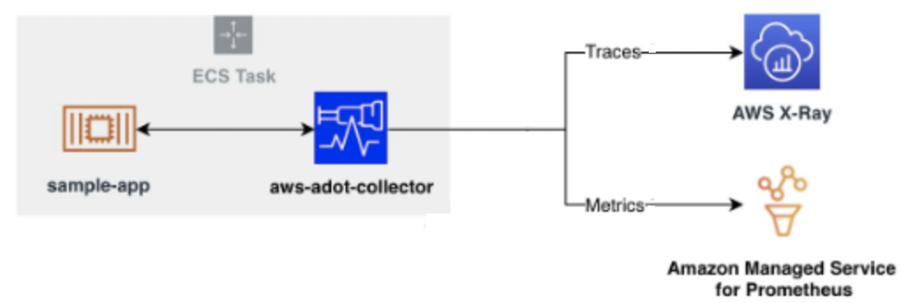
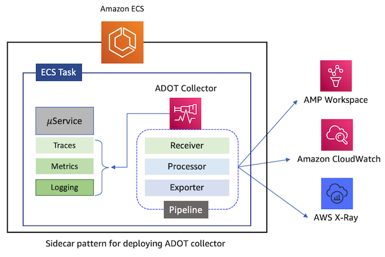
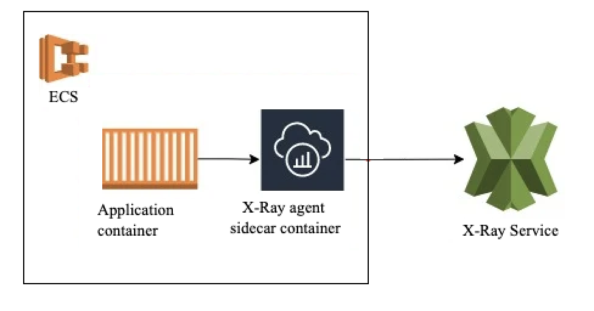

# ECS Monitoring

## Overview

Monitor Amazon ECS workloads using CloudWatch Container Insights for system metrics and ADOT (AWS Distro for OpenTelemetry) for application-level metrics and distributed traces. This solution supports both ECS on EC2 and ECS on Fargate.

Container Insights provides out-of-the-box cluster, service, and task-level metrics (CPU, memory, network, disk) with automatic dashboards — no sidecar required. For deeper observability, deploy the ADOT Collector as a sidecar to collect task-level resource metrics, Prometheus application metrics, and X-Ray traces, routing them to Amazon Managed Service for Prometheus (AMP) and Amazon Managed Grafana (AMG).

This entry covers two paths: the **fast path** (Container Insights, 5 minutes) and the **advanced path** (ADOT → AMP/AMG/X-Ray). Full reference: [Container Insights for ECS](https://docs.aws.amazon.com/AmazonECS/latest/developerguide/cloudwatch-container-insights.html).

## Prerequisites

- Amazon ECS cluster (EC2 or Fargate launch type)
- AWS CLI v2 configured with appropriate permissions
- IAM task execution role with `CloudWatchAgentServerPolicy` (for Container Insights)
- (For ADOT path) IAM task role with `AWSXRayDaemonWriteAccess` and `AmazonPrometheusRemoteWriteAccess`
- (For ADOT path) An AMP workspace and AMG workspace
- ECS agent v1.39.0+ (EC2) or Fargate platform v1.4.0+

## Architecture

```
┌──────────────────────────────────────────────────────────────┐
│                        ECS Cluster                           │
│                                                              │
│  ┌────────────────────────────────────────────┐              │
│  │            ECS Task                        │              │
│  │  ┌──────────────┐  ┌───────────────────┐  │              │
│  │  │ Application  │  │ ADOT Collector    │  │              │
│  │  │ Container    │──│ (sidecar)         │  │              │
│  │  │ (X-Ray SDK / │  │                   │  │              │
│  │  │  Prometheus) │  └─────┬─────┬───────┘  │              │
│  │  └──────────────┘        │     │           │              │
│  └──────────────────────────┼─────┼───────────┘              │
│                             │     │                          │
│  ECS Agent ─── Container Insights metrics ──┐                │
│                             │     │         │                │
└─────────────────────────────┼─────┼─────────┼────────────────┘
                              │     │         │
                 ┌────────────┘     │         └──────────┐
                 ▼                  ▼                     ▼
      ┌────────────────┐  ┌─────────────────┐  ┌─────────────────┐
      │  AWS X-Ray     │  │  Amazon Managed │  │  CloudWatch     │
      │  Traces &      │  │  Prometheus     │  │  Metrics & Logs │
      │  Service Map   │  │  (AMP)          │  │  Dashboards     │
      └────────────────┘  └────────┬────────┘  └─────────────────┘
                                   │
                                   ▼
                          ┌─────────────────┐
                          │ Amazon Managed  │
                          │ Grafana (AMG)   │
                          └─────────────────┘
```





## Deploy

### Fast Path: Container Insights (5 minutes)

#### Option A: Enable at the account level

```bash
aws ecs put-account-setting --name "containerInsights" --value "enabled"
```

#### Option B: Enable for a specific cluster

```bash
aws ecs update-cluster-settings \
  --cluster $CLUSTER_NAME \
  --settings name=containerInsights,value=enabled
```

That's it — the ECS agent handles collection automatically. Metrics appear in CloudWatch under the namespace `ECS/ContainerInsights`.

### Advanced Path: ADOT Collector for AMP and X-Ray

#### Step 1: Create the ADOT sidecar task definition

Add the ADOT collector container to your existing task definition:

```json
{
  "name": "aws-otel-collector",
  "image": "public.ecr.aws/aws-observability/aws-otel-collector:latest",
  "cpu": 512,
  "memory": 1024,
  "command": [
    "--config=/etc/ecs/container-insights/otel-task-metrics-config.yaml"
  ],
  "portMappings": [
    { "containerPort": 2000, "protocol": "udp" },
    { "containerPort": 4317, "protocol": "tcp" }
  ],
  "essential": true
}
```

For custom pipelines (e.g., Prometheus scraping + remote write to AMP), store your config in SSM Parameter Store and reference it via the `AOT_CONFIG_CONTENT` environment variable.

#### Step 2: Configure IAM roles

Attach these policies to the ECS task role:

- `AWSXRayDaemonWriteAccess` (for tracing)
- `AmazonPrometheusRemoteWriteAccess` (for AMP)
- `CloudWatchAgentServerPolicy` (for EMF metrics)

#### Step 3: Deploy the task

```bash
aws ecs register-task-definition --cli-input-json file://task-def.json
aws ecs update-service --cluster $CLUSTER_NAME --service $SERVICE_NAME \
  --task-definition $TASK_DEF_NAME
```

#### Step 4: Configure Prometheus scraping (optional)

For application metrics exposed at `/metrics`, use the CloudWatch agent with ECS service discovery. Define target patterns via `task_definition_list` in the agent config:

```json
{
  "ecs_service_discovery": {
    "sd_frequency": "1m",
    "sd_result_file": "/tmp/cwagent_ecs_auto_sd.yaml",
    "task_definition_list": [
      {
        "sd_job_name": "my-app",
        "sd_metrics_ports": "9090",
        "sd_task_definition_arn_pattern": ".*:task-definition/MyApp:[0-9]+",
        "sd_metrics_path": "/metrics"
      }
    ]
  }
}
```

## Validate

1. **Container Insights (fast path):**
   Navigate to CloudWatch → Container Insights → Performance monitoring. Select your ECS cluster and verify cluster/service/task metrics.

   

2. **Verify ADOT collector health:**
   ```bash
   aws ecs describe-tasks --cluster $CLUSTER_NAME --tasks $TASK_ARN \
     --query 'tasks[0].containers[?name==`aws-otel-collector`].lastStatus'
   ```

3. **Check X-Ray traces:**
   Open CloudWatch → X-Ray traces → Service map. Confirm your ECS services appear with request flow.

   

4. **Query AMP metrics:**
   ```bash
   awscurl --service aps --region $REGION \
     "https://aps-workspaces.$REGION.amazonaws.com/workspaces/$WS_ID/api/v1/query?query=up"
   ```

## Troubleshoot

| Symptom | Likely Cause | Fix |
|---------|-------------|-----|
| No Container Insights metrics | Container Insights not enabled on cluster | Run `aws ecs update-cluster-settings --cluster $CLUSTER --settings name=containerInsights,value=enabled` |
| ADOT sidecar exits immediately | Missing IAM permissions or invalid config | Check CloudWatch Logs for the collector container; verify task role policies |
| Partial metrics (missing network/disk) | ECS agent too old | Upgrade to ECS agent v1.39.0+ (EC2) or Fargate platform v1.4.0+ |
| Prometheus metrics not appearing | Service discovery misconfigured | Verify `sd_task_definition_arn_pattern` regex matches your task definition ARN |
| X-Ray traces missing | Application not instrumented | Add the X-Ray SDK to your application or configure the OTLP receiver on port 4317 |

## Related Solutions

- [EKS Monitoring with CloudWatch Container Insights](../eks-container-insights/) — Similar approach for EKS workloads
- [Lambda Monitoring](../lambda-monitoring/) — Monitor serverless functions invoked by ECS services
