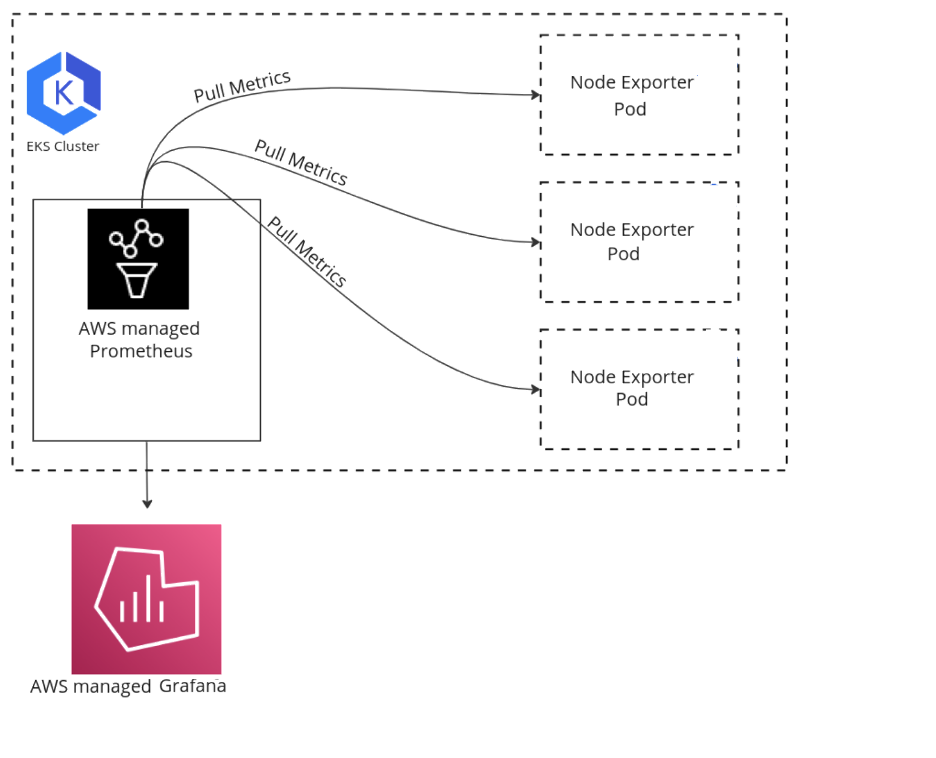
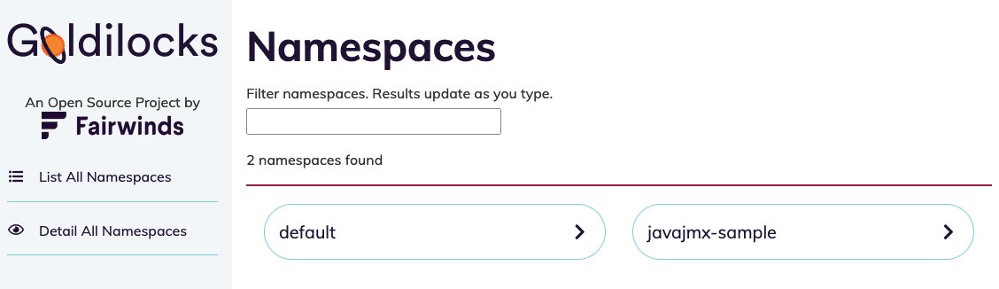
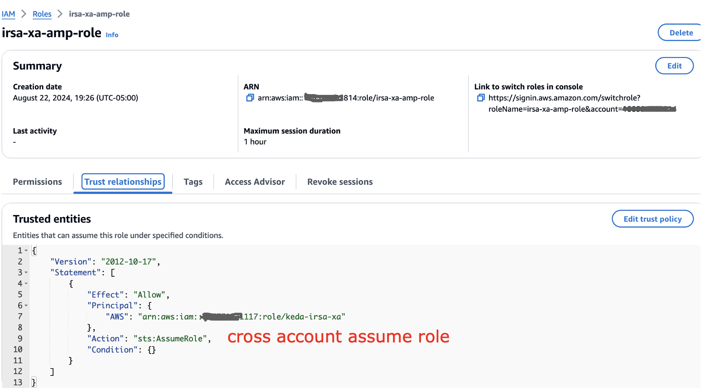
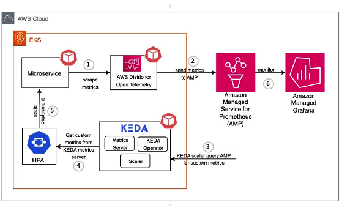

# EKS Infrastructure Monitoring

## Overview

Monitor the health and performance of your Amazon EKS cluster infrastructure including nodes, pods, and control plane components using Amazon Managed Service for Prometheus (AMP), Amazon Managed Grafana (AMG), and CloudWatch.

This solution deploys a complete monitoring stack via Terraform, providing:
- Node-level metrics (CPU, memory, disk, network)
- Pod and container metrics via cAdvisor
- Kubernetes control plane metrics
- Pre-built Grafana dashboards
- CloudWatch Container Insights integration

## Prerequisites

- Amazon EKS cluster (v1.25+)
- Terraform >= 1.3.0
- AWS CLI configured with appropriate permissions
- `kubectl` configured for your cluster
- An AMP workspace (or let Terraform create one)
- An AMG workspace with AMP data source configured

## Architecture

```
┌─────────────────────────────────────────────────────────┐
│                    EKS Cluster                           │
│  ┌──────────────┐  ┌──────────────┐  ┌──────────────┐  │
│  │ ADOT Collector│  │ Node Exporter │  │kube-state    │  │
│  │ (DaemonSet)  │  │ (DaemonSet)  │  │metrics       │  │
│  └──────┬───────┘  └──────┬───────┘  └──────┬───────┘  │
│         │                  │                  │          │
│         └──────────────────┼──────────────────┘          │
│                            │                             │
└────────────────────────────┼─────────────────────────────┘
                             │ Remote Write
                             ▼
                  ┌────────────────────┐
                  │  Amazon Managed    │
                  │  Prometheus (AMP)  │
                  └─────────┬──────────┘
                            │
                            ▼
                  ┌────────────────────┐
                  │  Amazon Managed    │
                  │  Grafana (AMG)     │
                  └────────────────────┘
```



## Deploy

### Step 1: Clone the accelerator

```bash
git clone https://github.com/aws-observability/terraform-aws-observability-accelerator.git
cd terraform-aws-observability-accelerator/examples/eks-infra
```

### Step 2: Configure variables

```hcl
# terraform.tfvars
aws_region     = "us-west-2"
eks_cluster_id = "my-cluster"

# Optional: use existing AMP workspace
managed_prometheus_workspace_id = "ws-xxxxxxxx-xxxx-xxxx-xxxx-xxxxxxxxxxxx"
```

### Step 3: Deploy

```bash
terraform init
terraform plan
terraform apply
```

## Validate

1. **Check ADOT Collector pods are running:**
   ```bash
   kubectl get pods -n opentelemetry-operator-system
   ```

2. **Verify metrics in AMP:**
   ```bash
   awscurl --service aps --region us-west-2 \
     "https://aps-workspaces.us-west-2.amazonaws.com/workspaces/{workspace_id}/api/v1/query?query=up"
   ```

3. **Check Grafana dashboards:** Navigate to your AMG workspace and verify the pre-built EKS dashboards show data.

   

   

   

## Troubleshoot

| Symptom | Likely Cause | Fix |
|---------|-------------|-----|
| No metrics in AMP | IRSA not configured | Verify service account annotation matches IAM role ARN |
| ADOT pods in CrashLoopBackOff | Config error | Check `kubectl logs` for the collector pod |
| Partial metrics | Scrape targets down | Check `kubectl get servicemonitor -A` |
| Grafana shows "No Data" | Data source misconfigured | Verify AMP endpoint URL in Grafana data source settings |

## Related Solutions

- [EKS Application Signals](../eks-application-signals/) — Add application-level tracing and metrics
- [Lambda Monitoring](../lambda-monitoring/) — Monitor serverless workloads invoked by EKS services
