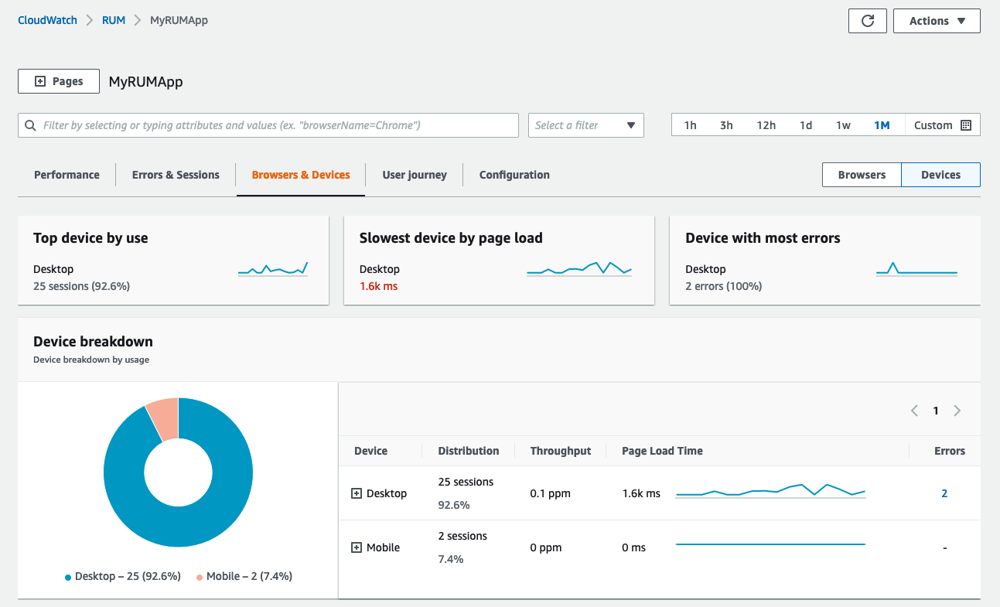
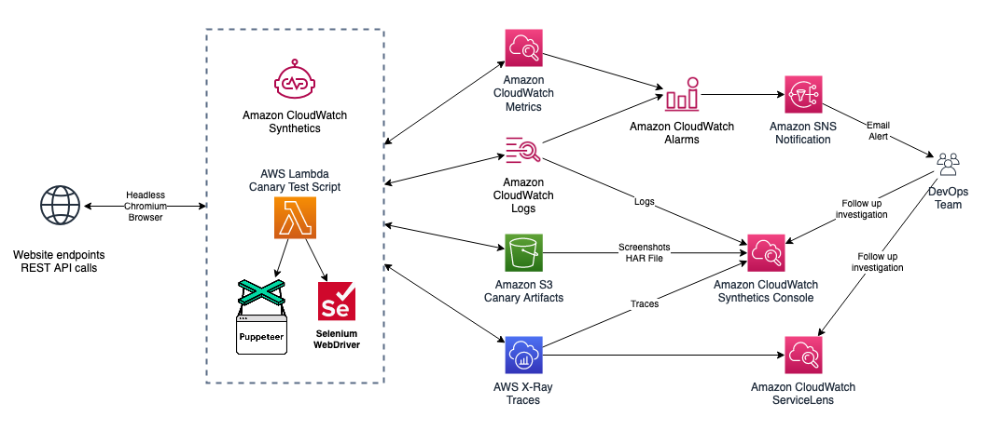
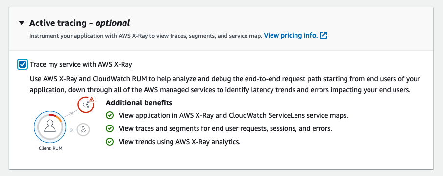
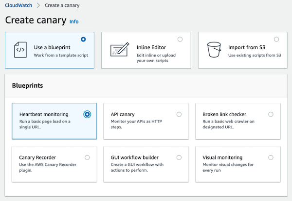
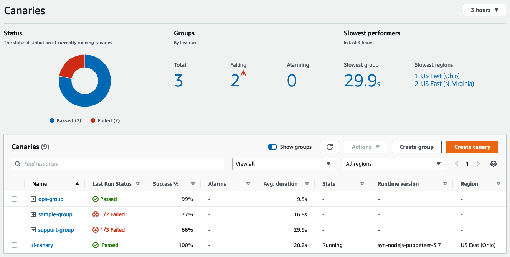
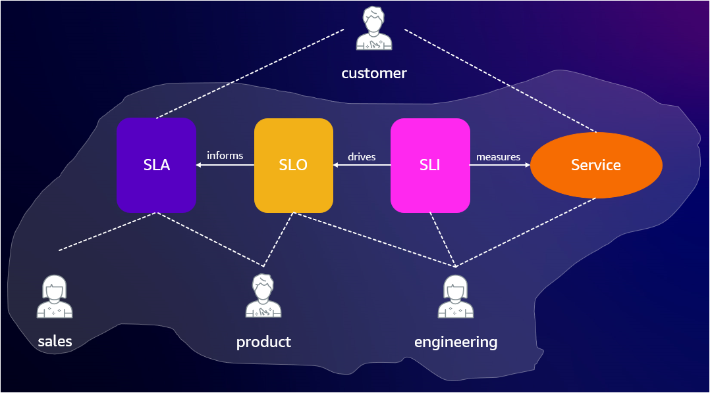
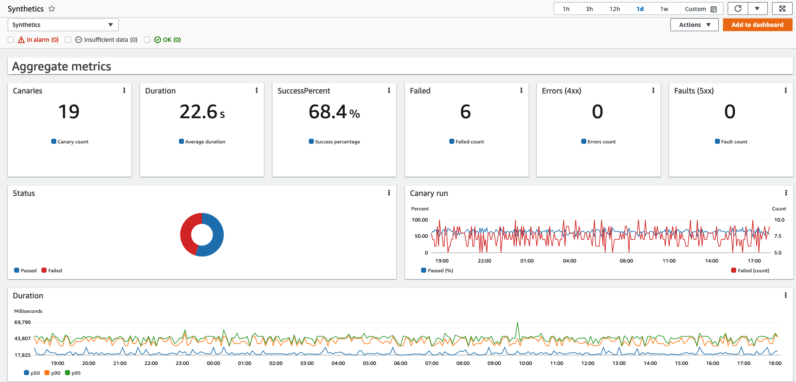

import RelatedEvents from '@site/src/components/RelatedEvents';

# Frontend and SLO Monitoring

## Related Events

<RelatedEvents topics={["apm", "cloudwatch"]} />

## Overview

Frontend and SLO monitoring combines three complementary capabilities: **CloudWatch RUM** for real user monitoring, **CloudWatch Synthetics** for proactive synthetic testing, and **Application Signals SLOs** for measuring service reliability against business targets.

Together these provide visibility into actual user experience, early detection of issues before users are impacted, and objective tracking of availability and latency against agreed-upon service level objectives.

## Prerequisites

- An AWS account with CloudWatch enabled
- A web application (public or private) for RUM and Synthetics monitoring
- An Amazon Cognito identity pool (or allow RUM to create one)
- Application instrumented with CloudWatch Application Signals for SLOs (supported on EKS, ECS, EC2)
- IAM permissions for CloudWatch, X-Ray, Synthetics, and Cognito

## Architecture

CloudWatch RUM collects client-side telemetry from real user browsers and forwards it to CloudWatch. Synthetics canaries run on a schedule from AWS-managed infrastructure to test endpoints proactively. Application Signals collects latency and availability metrics which serve as SLIs for your SLOs.

When active tracing is enabled in RUM, trace headers are added to HTTP requests, connecting frontend experience to backend traces in X-Ray.

## Deploy

### CloudWatch RUM

1. Open the CloudWatch console and navigate to **Application monitoring > RUM**.

2. Create an application monitor. Choose an authorization method — letting RUM create a new Cognito identity pool requires the least effort.

3. Copy the generated JavaScript code snippet and insert it in the `<head>` element of your application, before any other `<script>` tags.

   :::warning
   The web client must be as early in the `<head>` element as possible for RUM to capture full performance data.
   :::

4. Enable active tracing by setting `addXRayTraceIdHeader: true` in the snippet configuration to get end-to-end trace correlation with X-Ray.

   

5. Configure extended metrics with dimensions (BrowserName, CountryCode, DeviceType, PageId) for fine-grained views in CloudWatch Metrics.

### CloudWatch Synthetics

1. Open the CloudWatch console and navigate to **Application monitoring > Synthetics Canaries**.

2. Create a canary using a [blueprint](https://docs.aws.amazon.com/AmazonCloudWatch/latest/monitoring/CloudWatch_Synthetics_Canaries_Blueprints.html) (Heartbeat, API, Broken Link Checker, GUI Workflow, or Visual).

   

3. Configure the schedule (e.g., every 5 minutes) and VPC settings if monitoring private endpoints.

4. Store secrets such as login credentials in AWS Secrets Manager and retrieve them at runtime from canary scripts.

5. Organize canaries into [groups](https://docs.aws.amazon.com/AmazonCloudWatch/latest/monitoring/CloudWatch_Synthetics_Groups.html) for aggregated metrics and easier failure isolation.

   

### Application Signals SLOs

1. Enable [Application Signals](https://docs.aws.amazon.com/AmazonCloudWatch/latest/monitoring/CloudWatch-Application-Monitoring-Sections.html) on your workload (EKS, ECS, or EC2).

2. Navigate to **Application Signals > Service Level Objectives** in the CloudWatch console.

3. Create an SLO by selecting a service and operation discovered by Application Signals. Choose latency or availability as the SLI metric.

4. Set the target (e.g., 99.9% availability over a rolling 30-day window). Application Signals tracks the error budget and alerts when the budget is at risk.

## Validate

1. **RUM**: Open the RUM dashboard. Confirm that page load events, performance data, and user sessions appear. Verify trace IDs link to X-Ray if active tracing is enabled.

2. **Synthetics**: Check canary run results in the Synthetics console. Verify the success rate and view screenshots for GUI workflow canaries.

   

3. **SLOs**: Open the SLO dashboard. Confirm the error budget is tracking and the SLI metric is populating with data from your service operations.

## Troubleshoot

| Symptom | Likely Cause | Fix |
|---------|-------------|-----|
| No RUM data appearing | Code snippet not inserted early enough in `<head>` or Cognito pool misconfigured | Verify snippet placement; check Cognito identity pool permissions |
| Canary fails with network timeout | VPC configuration missing or security group blocks egress | Attach canary to correct VPC/subnets; allow HTTPS egress in security group |
| SLO shows no data | Application Signals agent not running or service not instrumented | Verify the ADOT or CloudWatch agent is deployed; check Application Signals service map |
| RUM blocked by ad blockers | Web client loaded from CloudWatch domain | Self-host the RUM web client on your own CDN or origin domain |
| Canary passes but RUM shows errors | Canary testing different path or region than real users | Add canaries covering the same user journeys; check geographic routing |

## Related Solutions

- [EKS Application Signals](../eks-application-signals/)
- [.NET Application Monitoring](../dotnet-application-monitoring/)
