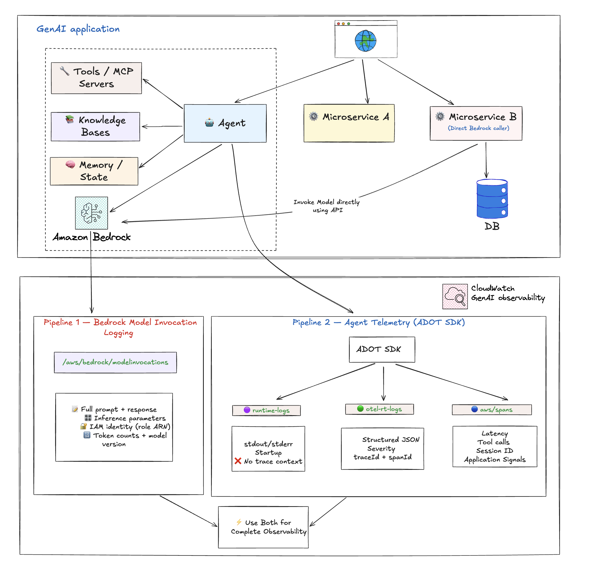
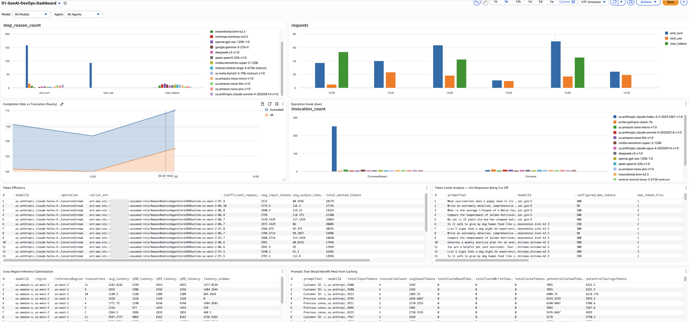
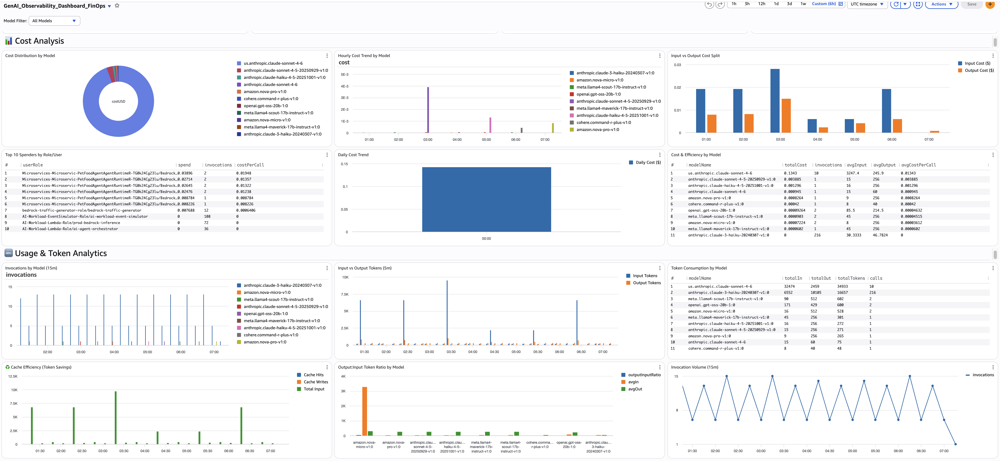

import RelatedEvents from '@site/src/components/RelatedEvents';

# GenAI Workload Observability

## Related Events

<RelatedEvents topics={["genai", "ai-ml"]} />


## Overview

Generative AI workloads on AWS (Amazon Bedrock, SageMaker, self-hosted models) present unique observability challenges: non-deterministic responses, token-based pricing, variable latency, and multi-service agent orchestration that chains API calls across Bedrock, S3, Lambda, and KMS within seconds. Without proper monitoring, teams face cost overruns from untracked token usage, silent agent failures, and compliance gaps.

This solution enables two complementary telemetry pipelines. **Pipeline 1 (Bedrock Model Invocation Logging)** captures the raw request/response content, inference parameters, token counts, and caller IAM identity for every Bedrock call — essential for cost attribution, compliance auditing, and prompt debugging. **Pipeline 2 (Agent Telemetry via ADOT)** provides OpenTelemetry-based distributed traces across agent orchestration flows, tool executions, and model calls — essential for latency analysis, error drill-down, and Application Signals dashboards.

Together these pipelines power DevOps dashboards (completion rate, component latency, agent error rates), FinOps dashboards (cost by model/team/role, caching opportunities), and full end-to-end request tracing. For AgentCore-hosted agents, telemetry flows automatically; for non-AgentCore deployments (EKS, ECS, self-hosted), attach the ADOT auto-instrumentation agent.

## Prerequisites

- An AWS account with Amazon Bedrock model access enabled
- IAM permissions: `bedrock:*`, `logs:*`, `cloudwatch:*`, `iam:PassRole`
- CloudWatch Transaction Search enabled ([docs](https://docs.aws.amazon.com/AmazonCloudWatch/latest/monitoring/Enable-TransactionSearch.html))
- For agent telemetry on non-AgentCore: ADOT auto-instrumentation agent available for your compute (EKS, ECS, or EC2)
- For dashboards: Amazon Managed Grafana workspace (optional, for FinOps/DevOps persona dashboards)
- AWS CLI v2 installed and configured

## Architecture



```
┌──────────────────────────────────────────────────────────────────────┐
│                          AWS Account                                  │
│                                                                      │
│  ┌────────────────┐     ┌────────────────┐     ┌─────────────────┐  │
│  │  Application   │     │  AI Agent      │     │  Direct Bedrock │  │
│  │  (EKS/ECS/EC2)│     │  (AgentCore)   │     │  API Calls      │  │
│  │  + ADOT Agent  │     │  (ADOT built-in│     │                 │  │
│  └───────┬────────┘     └───────┬────────┘     └───────┬─────────┘  │
│          │                      │                       │            │
│          │  OTel Traces         │  OTel Traces          │            │
│          ▼                      ▼                       │            │
│  ┌──────────────────────────────────────┐               │            │
│  │          CloudWatch (aws/spans)       │               │            │
│  │  - Agent orchestration traces         │               │            │
│  │  - Tool execution spans               │               │            │
│  │  - Model call latency/tokens          │               │            │
│  └──────────────────┬───────────────────┘               │            │
│                     │                                    │            │
│                     │              ┌─────────────────────▼──────────┐ │
│                     │              │  Bedrock Model Invocation Logs │ │
│                     │              │  - Full request/response body  │ │
│                     │              │  - Inference params            │ │
│                     │              │  - IAM caller identity         │ │
│                     │              │  - Token counts                │ │
│                     │              └─────────────────────┬──────────┘ │
│                     │                                    │            │
│                     └────────────────┬───────────────────┘            │
│                                      ▼                                │
│                          ┌───────────────────────┐                   │
│                          │      CloudWatch       │                   │
│                          │  - Application Signals│                   │
│                          │  - Logs Insights      │                   │
│                          │  - Dashboards         │                   │
│                          └───────────┬───────────┘                   │
│                                      │                                │
└──────────────────────────────────────┼────────────────────────────────┘
                                       ▼
                           ┌───────────────────────┐
                           │  Amazon Managed       │
                           │  Grafana (AMG)        │
                           │  - DevOps Dashboard   │
                           │  - FinOps Dashboard   │
                           └───────────────────────┘
```

## Deploy

### Step 1: Enable CloudWatch Transaction Search

Open the CloudWatch console → Settings → Traces → enable Transaction Search. This unlocks Application Signals and distributed trace features for GenAI.

### Step 2: Enable Bedrock Model Invocation Logging

```bash
# Create log group for invocation logs
aws logs create-log-group --log-group-name bedrock-model-invocation-logging

# Enable via the Bedrock console:
# Bedrock → Settings → Model invocation logging → Enable
# Select: Text, Image (as needed)
# Destination: CloudWatch Logs → bedrock-model-invocation-logging
```

For CLI enablement, see [Set up a CloudWatch Logs destination](https://docs.aws.amazon.com/bedrock/latest/userguide/model-invocation-logging.html#setup-cloudwatch-logs-destination).

### Step 3: Enable Agent Telemetry

**AgentCore-hosted agents:** No action needed — ADOT SDK is built into the runtime and telemetry flows automatically.

**Non-AgentCore agents (EKS/ECS/self-hosted):** Attach the ADOT auto-instrumentation agent. See [Configure third-party observability](https://docs.aws.amazon.com/bedrock-agentcore/latest/devguide/observability-configure.html#observability-configure-3p) and the [step-by-step tutorial](https://aws.github.io/bedrock-agentcore-starter-toolkit/user-guide/observability/quickstart.html#enabling-observability-for-non-agentcore-hosted-agents).

### Step 4: Configure data protection (recommended)

```bash
# Apply PII redaction to model invocation logs
# CloudWatch console → Logs → Log groups → bedrock-model-invocation-logging
# → Create data protection policy → select relevant data identifiers
```

See [Protecting sensitive log data with masking](https://docs.aws.amazon.com/AmazonCloudWatch/latest/logs/cloudwatch-logs-data-protection-policies.html).

### Step 5: Create custom dashboards

Use CloudWatch Logs Insights queries against `bedrock-model-invocation-logging` and `aws/spans` log groups. Key queries:

**Token usage by model (FinOps):**
```sql
fields @timestamp, modelId,
  coalesce(output.outputBodyJson.usage.inputTokens, input.inputTokenCount) as inputTokens,
  coalesce(output.outputBodyJson.usage.outputTokens, output.outputTokenCount) as outputTokens
| filter schemaType = "ModelInvocationLog"
| stats sum(inputTokens) as totalInput, sum(outputTokens) as totalOutput by modelId
| sort totalInput desc
```

**Agent error rate (DevOps):**
```sql
fields traceId, status.code as statusCode
| filter ispresent(attributes.session.id)
| stats count_distinct(traceId) as total_traces,
        sum(statusCode = "ERROR") as error_spans
  by bin(@timestamp, 1h)
| sort @timestamp desc
```

A complete set of 17 persona-based dashboard queries (DevOps and FinOps) is
scheduled to fold into this section; see `_catalog/DISPOSITIONS.md`.

## Validate





1. **Model Invocation Logging:** Invoke a Bedrock model, then query:
   ```bash
   aws logs filter-log-events \
     --log-group-name bedrock-model-invocation-logging \
     --filter-pattern '{ $.schemaType = "ModelInvocationLog" }' \
     --limit 3
   ```

2. **Agent Telemetry (traces):** After running an agent session, check spans:
   ```bash
   aws logs filter-log-events \
     --log-group-name aws/spans \
     --filter-pattern '{ $.name = "chat *" }' \
     --limit 3
   ```

3. **Application Signals:** Open CloudWatch → Application Signals → Services. Your agent service should appear with auto-generated latency and error-rate metrics.

4. **Pre-built Bedrock dashboards:** Open CloudWatch → Dashboards → look for the automatic Bedrock dashboard showing invocation count, latency, and token counts.

## Troubleshoot

| Symptom | Likely Cause | Fix |
|---------|-------------|-----|
| No logs in `bedrock-model-invocation-logging` | Model invocation logging not enabled or IAM role missing `logs:PutLogEvents` | Re-check Bedrock → Settings → Model invocation logging; verify the service role has `logs:CreateLogStream` and `logs:PutLogEvents` on the target log group |
| Traces in `aws/spans` missing for non-AgentCore agent | ADOT auto-instrumentation agent not attached | Follow the [non-AgentCore quickstart](https://aws.github.io/bedrock-agentcore-starter-toolkit/user-guide/observability/quickstart.html#enabling-observability-for-non-agentcore-hosted-agents) to attach the agent; verify the ADOT collector pod/sidecar is running |
| Application Signals not showing service | Transaction Search not enabled | Enable Transaction Search in CloudWatch Settings → Traces; allow 5–10 min for data to populate |
| Cost queries return $0 | Token fields not found (model-specific JSON paths) | Use `coalesce()` across multiple field paths (`usage.inputTokens`, `usage.input_tokens`, `usage.prompt_tokens`); check the raw log to identify the correct field name for your model |
| Agent traces show errors but model metrics are healthy | Tool-layer failure (KB retrieval, guardrail, Lambda) | Drill into `aws/spans` with `filter status.code = "ERROR"` and group by `name` to identify which tool/component is failing |

## Related Solutions

- [Coding Agents Observability](../coding-agents-observability/) — OTel-based telemetry for Claude Code, Codex, and Copilot developer fleets
