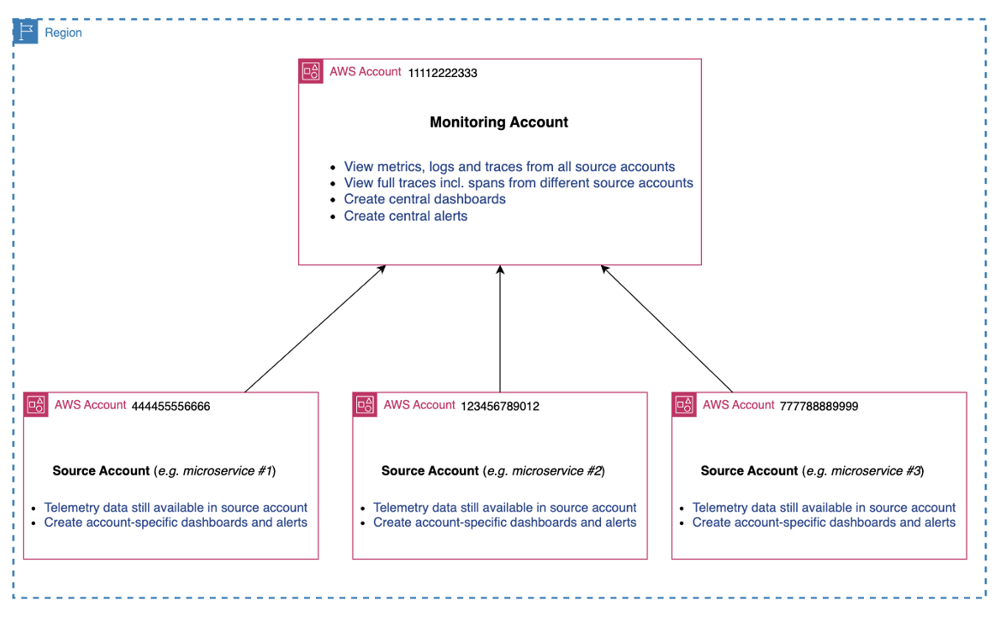
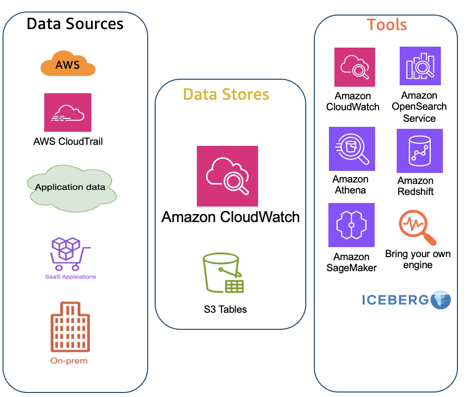
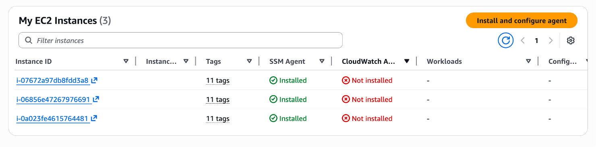

import RelatedEvents from '@site/src/components/RelatedEvents';

# Getting Started with Observability

## Related Events

<RelatedEvents topics={["cloudwatch"]} />

## Overview

This guide provides an ordered onboarding path for teams starting from scratch with AWS CloudWatch observability. It walks through four phases: setting up monitoring and source accounts, configuring a unified data store, deploying agents and collectors, and building dashboards and alerts.

Each phase builds on the previous one. The source guides are concise (under 500 words each), so this entry provides the high-level path and links to detailed configuration instructions where needed.

## When to use this

- You are setting up observability for the first time across one or more AWS accounts
- You need a structured sequence to follow rather than ad-hoc configuration
- You want centralized visibility across multiple accounts and regions
- You are evaluating whether to use CloudWatch cross-account observability or the Unified Data Store (or both)

## Guidance

### Phase 1 — Setup Monitoring and Source Accounts

Nominate a monitoring account from which you will view telemetry data centrally. Then define which source accounts will share data with it using [CloudWatch cross-account observability](https://docs.aws.amazon.com/AmazonCloudWatch/latest/monitoring/CloudWatch-Unified-Cross-Account.html).

Key decisions in this phase:

- **Single vs. multiple monitoring accounts** — Each monitoring account supports up to 100,000 source accounts. Use multiple monitoring accounts only when operational boundaries require it (e.g., separate production and non-production visibility).
- **Telemetry scope** — Choose which signals to share: logs, metrics, traces, and Application Signals. You can also apply metric and log filters for granularity.
- **Per-region configuration** — Cross-account observability is configured per region. Plan your region strategy early.

:::info
With cross-account observability, logs and metrics are NOT copied from source accounts — you view them centrally. Trace data is copied to the monitoring account (first copy at no additional cost).
:::

**Summary:** Nominate monitoring account → configure source accounts → fine-tune telemetry filters → verify cross-account queries work.

### Phase 2 — Setup Unified Data Store

The CloudWatch Unified Data Store centralizes (copies) logs to a single account and region for querying and analysis. Use it alongside or instead of cross-account observability depending on your compliance and analytics requirements.

Configuration steps:

1. **Root account** — Turn on trusted access and identify a delegate account for the centralized datastore.
2. **Centralized account** — Create centralization rules specifying source accounts, source regions, log group filters, and optionally a backup region.

Key benefits: eliminates data silos, reduces ETL pipelines, enables analysis with Athena, QuickSight, SageMaker, and OpenSearch without data duplication.

For detailed configuration, see [CloudWatch Unified Data Store documentation](https://docs.aws.amazon.com/AmazonCloudWatch/latest/logs/CloudWatchLogs-Unified-Logs.html).

### Phase 3 — Configure Agents and Collectors

With your account structure in place, deploy agents to send telemetry from your workloads to CloudWatch.

| Compute Platform | Recommended Approach | Alternative |
|---|---|---|
| **Amazon EKS** | CloudWatch Observability EKS add-on (DaemonSet) — installs Container Insights, Fluent Bit, Application Signals | OTEL Collector with AWS exporters |
| **Amazon ECS** | Enable Container Insights + awslogs driver + Application Signals | OTEL Collector as sidecar |
| **Amazon EC2** | CloudWatch agent via Workload Detection, Systems Manager, or manual install | OTEL Collector with OTLP exporters |

For all platforms, you can choose between AWS-native instrumentation (CloudWatch agent) or vendor-neutral instrumentation (OpenTelemetry). Both deliver metrics, logs, and traces to CloudWatch.

For in-depth agent configuration guidance, see the [CloudWatch Agent Configuration](../cloudwatch-agent-configuration/) catalog entry.

### Phase 4 — Dashboards and Alerts

Once telemetry is flowing, build visibility and detection:

- **Curated dashboards** — CloudWatch provides automated dashboards for many services (Lambda, EC2, API Gateway). If using Application Signals, check the application maps under APM.
- **Custom dashboards** — Design business-specific dashboards following the [Building Dashboards for Operational Visibility](https://aws.amazon.com/builders-library/building-dashboards-for-operational-visibility/) guidance.
- **CloudWatch Alarms** — Create alarms in the monitoring account for centralized visibility. Use [Alarm Recommendations](https://docs.aws.amazon.com/AmazonCloudWatch/latest/monitoring/Best_Practice_Recommended_Alarms_AWS_Services.html) for AWS-suggested configurations.
- **Service Level Objectives** — Define SLOs with associated alarms to track key performance indicators.

## Related

- [CloudWatch Agent Configuration](../cloudwatch-agent-configuration/) — Detailed agent setup and tuning
- [CloudWatch Dashboards](../cloudwatch-dashboards/) — Dashboard design patterns and best practices
- [Cross-Account Observability](../cross-account-observability/) — Deep dive on multi-account architecture
- [Amazon CloudWatch Getting Started documentation](https://docs.aws.amazon.com/AmazonCloudWatch/latest/monitoring/GettingStarted.html)
