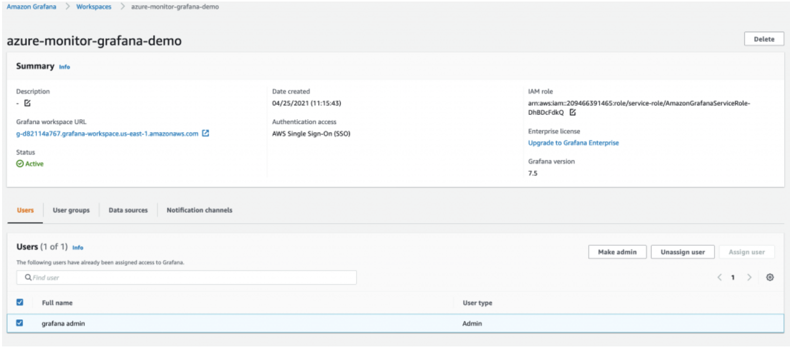
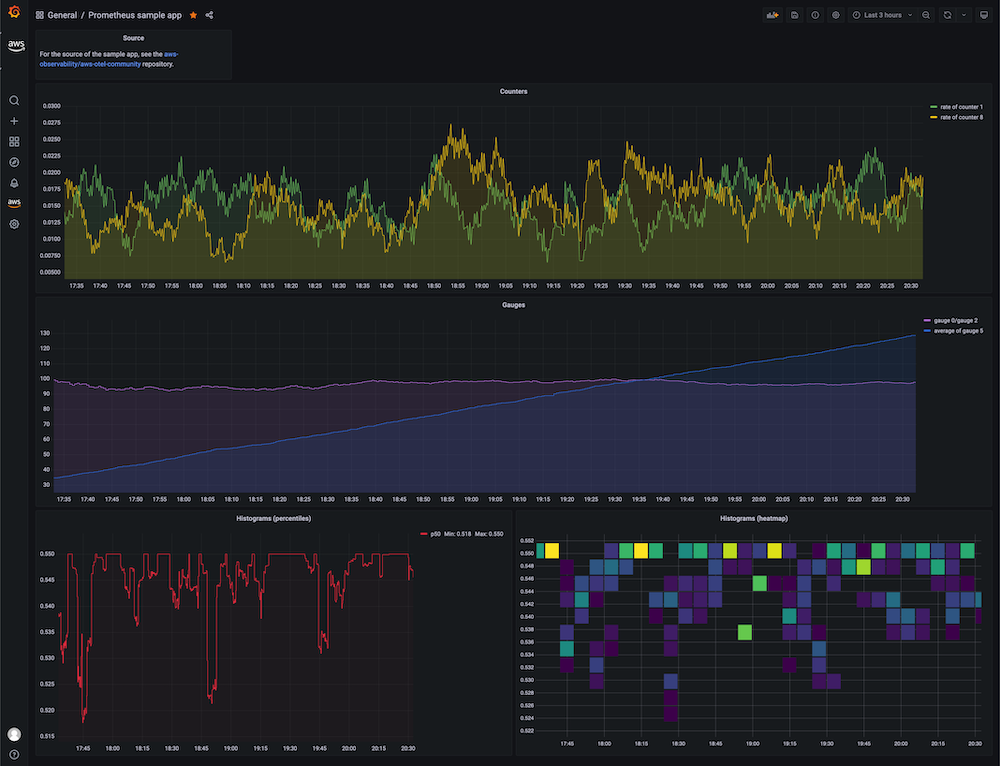

# Hybrid and Multicloud Monitoring

## Overview

Monitoring workloads that span AWS and on-premises (or other cloud) environments requires a unified collection and visualization strategy. The CloudWatch agent runs on non-AWS hosts, forwarding metrics and logs to CloudWatch. For environments already using Prometheus, Amazon Managed Service for Prometheus (AMP) accepts remote-write from any network-reachable exporter. Amazon Managed Grafana (AMG) ties both backends together in a single dashboard, regardless of where the workload runs.

This entry covers the pattern of installing the CloudWatch agent on non-AWS hosts, configuring AMP remote write for Prometheus-scraped metrics, and using AMG as the unifying visualization layer. For the full installation reference, see [Installing the CloudWatch agent on on-premises servers](https://docs.aws.amazon.com/AmazonCloudWatch/latest/monitoring/Install-CloudWatch-Agent-on-Premise.html).

## Prerequisites

- An AWS account with IAM permissions for CloudWatch, AMP, and AMG
- On-premises or non-AWS hosts with network connectivity to AWS endpoints (HTTPS 443)
- IAM user with programmatic access (access key) for on-premises agent authentication
- CloudWatch agent [downloaded](https://docs.aws.amazon.com/AmazonCloudWatch/latest/monitoring/download-cloudwatch-agent-commandline.html) for the target OS
- (Optional) An existing Prometheus server for AMP remote-write
- (Optional) Amazon Managed Grafana workspace with SSO configured

## Architecture

The signal flow for hybrid monitoring uses CloudWatch agent on each host, sending metrics and logs to CloudWatch. Prometheus exporters remote-write to AMP. AMG queries both backends.


*AMG workspace connecting to multiple data sources across environments*

```
┌─────────────────────┐       ┌──────────────────────┐
│  On-premises hosts  │       │   AWS workloads      │
│  (CW Agent)         │       │   (CW Agent / ADOT)  │
└────────┬────────────┘       └──────────┬───────────┘
         │ HTTPS                          │
         ▼                                ▼
┌─────────────────────────────────────────────────────┐
│              Amazon CloudWatch                       │
│         (Metrics + Logs)                            │
└────────────────────────┬────────────────────────────┘
                         │
         ┌───────────────┼───────────────┐
         ▼                               ▼
┌─────────────────┐             ┌─────────────────┐
│  Prometheus     │ remote-write│  Amazon Managed │
│  (on-prem)      │────────────▶│  Prometheus     │
└─────────────────┘             └────────┬────────┘
                                         │
                                         ▼
                              ┌─────────────────────┐
                              │  Amazon Managed     │
                              │  Grafana (AMG)      │
                              └─────────────────────┘
```

## Deploy

### Install CloudWatch agent on non-AWS hosts

1. Download the CloudWatch agent package for your OS:

```bash
# Amazon Linux / RHEL
sudo yum install amazon-cloudwatch-agent

# Debian / Ubuntu
wget https://s3.amazonaws.com/amazoncloudwatch-agent/ubuntu/amd64/latest/amazon-cloudwatch-agent.deb
sudo dpkg -i amazon-cloudwatch-agent.deb
```

2. Create an IAM user with `CloudWatchAgentServerPolicy` and generate access keys.

3. Configure AWS credentials on the host:

```bash
sudo aws configure --profile AmazonCloudWatchAgent
# Enter the access key, secret key, and region
```

4. Run the agent configuration wizard or supply a config file:

```bash
sudo /opt/aws/amazon-cloudwatch-agent/bin/amazon-cloudwatch-agent-config-wizard
```

5. Start the agent:

```bash
sudo /opt/aws/amazon-cloudwatch-agent/bin/amazon-cloudwatch-agent-ctl \
  -a fetch-config \
  -m onPremise \
  -s \
  -c file:/opt/aws/amazon-cloudwatch-agent/etc/amazon-cloudwatch-agent.json
```

### Configure AMP remote write (optional)

6. In your Prometheus server configuration, add the remote-write endpoint:

```yaml
remote_write:
  - url: https://aps-workspaces.<region>.amazonaws.com/workspaces/<workspace-id>/api/v1/remote_write
    sigv4:
      region: <region>
    queue_config:
      max_samples_per_send: 1000
      max_shards: 200
      capacity: 2500
```

7. Ensure the host or instance profile has `aps:RemoteWrite` permission.

### Configure AMG data sources

8. In your AMG workspace, add **Amazon CloudWatch** and **Amazon Managed Service for Prometheus** as data sources.

9. Create or import dashboards that query both sources to provide a unified view.

## Validate

1. On the on-premises host, verify the agent is running:

```bash
sudo /opt/aws/amazon-cloudwatch-agent/bin/amazon-cloudwatch-agent-ctl -a status
```

2. In the CloudWatch console, navigate to **Metrics → All metrics** and confirm the custom namespace from your on-premises host appears.

3. For AMP, use `awscurl` to query the workspace:

```bash
awscurl --service aps --region <region> \
  "https://aps-workspaces.<region>.amazonaws.com/workspaces/<workspace-id>/api/v1/query?query=up"
```

4. In AMG, open a dashboard and confirm panels populate with data from both CloudWatch and AMP sources.


*AMG dashboard showing metrics from AMP data source*

## Troubleshoot

| Symptom | Likely Cause | Fix |
|---------|-------------|-----|
| Agent status shows `stopped` on on-premises host | Invalid credentials or expired access keys | Regenerate IAM access keys and reconfigure with `aws configure --profile AmazonCloudWatchAgent` |
| Metrics namespace not appearing in CloudWatch | Agent config missing `metrics_collected` section or wrong region | Review `/opt/aws/amazon-cloudwatch-agent/etc/amazon-cloudwatch-agent.json` and verify the region matches your console view |
| AMP remote write returns 403 | Missing `aps:RemoteWrite` IAM permission or incorrect SigV4 signing | Attach `AmazonPrometheusRemoteWriteAccess` policy to the IAM entity used for signing |
| AMG dashboard panels show "No data" | Data source not configured or IAM role missing read permissions | Verify the AMG workspace IAM role has `aps:QueryMetrics` and `cloudwatch:GetMetricData` permissions |

## Related Solutions

- [EC2 NGINX Monitoring](../ec2-nginx/)
- [Managed Grafana Setup](../managed-grafana-setup/)
