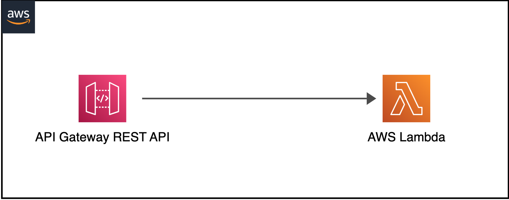
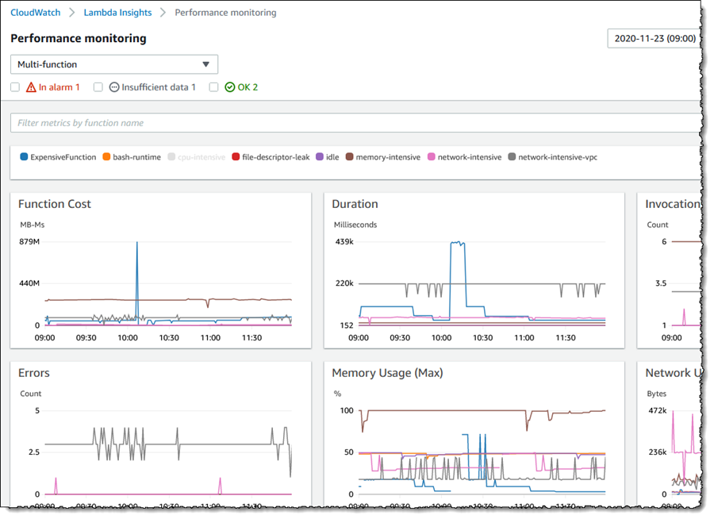
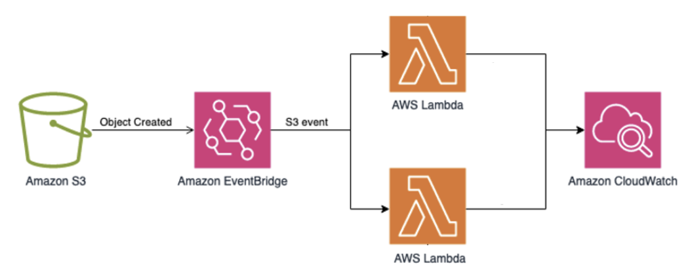

# Lambda Monitoring

## Overview

Monitor AWS Lambda functions using CloudWatch native integration, X-Ray distributed tracing, and Lambda Insights for enhanced performance visibility. This solution requires zero external agents — it leverages built-in AWS capabilities.

Key observability features:
- Invocation metrics (duration, errors, throttles, concurrency)
- X-Ray traces for downstream call visibility
- Lambda Insights for memory, CPU, and network metrics
- Structured logging with embedded metric format (EMF)
- Cost-per-invocation tracking

## Prerequisites

- AWS Lambda function(s) deployed
- IAM execution role with `AWSXRayDaemonWriteAccess` (for tracing)
- Lambda Insights layer ARN for your region
- CloudWatch Logs enabled (default)

## Architecture



```
┌───────────────────────────────────────────────────┐
│                Lambda Function                     │
│                                                   │
│  ┌────────────────┐  ┌──────────────────────────┐│
│  │ Function Code  │  │ Lambda Insights Extension ││
│  │ + X-Ray SDK    │  │ (Lambda Layer)            ││
│  └───────┬────────┘  └────────────┬─────────────┘│
└──────────┼─────────────────────────┼──────────────┘
           │                         │
     ┌─────▼─────┐            ┌─────▼──────┐
     │  X-Ray    │            │ CloudWatch │
     │  Traces   │            │ Metrics +  │
     │           │            │ Logs       │
     └───────────┘            └────────────┘
```

## Deploy

### Step 1: Enable X-Ray tracing

```bash
aws lambda update-function-configuration \
  --function-name my-function \
  --tracing-config Mode=Active
```

### Step 2: Add Lambda Insights layer

```bash
aws lambda update-function-configuration \
  --function-name my-function \
  --layers "arn:aws:lambda:us-west-2:580247275435:layer:LambdaInsightsExtension:52"
```

### Step 3: Add IAM permissions

```json
{
  "Version": "2012-10-17",
  "Statement": [
    {
      "Effect": "Allow",
      "Action": [
        "xray:PutTraceSegments",
        "xray:PutTelemetryRecords"
      ],
      "Resource": "*"
    }
  ]
}
```

### Step 4: Add structured logging (optional but recommended)

In your function code, emit metrics via Embedded Metric Format:

```python
from aws_lambda_powertools import Logger, Metrics, Tracer

logger = Logger()
metrics = Metrics(namespace="MyApp")
tracer = Tracer()

@logger.inject_lambda_context
@metrics.log_metrics
@tracer.capture_lambda_handler
def handler(event, context):
    metrics.add_metric(name="OrderProcessed", unit="Count", value=1)
    # your logic here
```

## Validate






1. **Invoke your function:**
   ```bash
   aws lambda invoke --function-name my-function output.json
   ```

2. **Check CloudWatch metrics:** Navigate to CloudWatch > Metrics > AWS/Lambda.

3. **Check X-Ray traces:** Navigate to CloudWatch > X-Ray traces > Trace map.

4. **Check Lambda Insights:** Navigate to CloudWatch > Insights > Lambda Insights.

## Troubleshoot

| Symptom | Likely Cause | Fix |
|---------|-------------|-----|
| No traces in X-Ray | Tracing not set to Active | Check function config |
| Lambda Insights no data | Layer not attached | Verify layer ARN matches region |
| High duration reported | Cold starts | Enable provisioned concurrency or SnapStart |
| Missing custom metrics | EMF format error | Validate JSON structure in logs |

## Related Solutions

- [EKS Application Signals](../eks-application-signals/) — Trace requests from Lambda to EKS
- [Kafka on EC2](../kafka-ec2/) — Monitor Kafka consumers triggered by Lambda
